# Copilot Studio AI Builder: from extraction to generation
> 260203 Microsoft Agenthon Low-code Day

---

## 🧪 01. Adding the Application Intake Agent

### 1.1. Orchestrator Agent Setup
#### Details
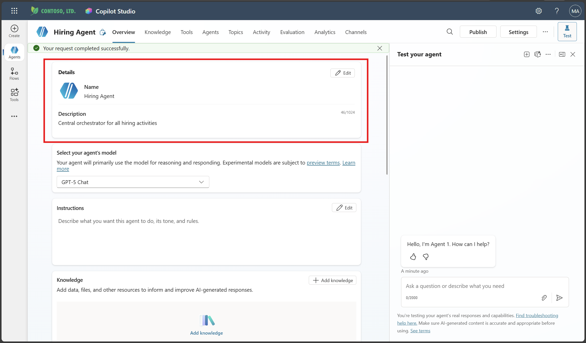
- Name
    ```text
    Hiring Agent
    ```
- Description
    ```text
    Central orchestrator for all hiring activities
    ```
#### Settings
- Review the page and ensure the following settings are applied:

    | Setting | Value |
    | ------- | ----- |
    | Use generative AI orchestration for your agent's responses | **Yes** |
    | Deep Reasoning | **Off** |
    | Let other agents connect to and use this one | **On** |
    | Continue using retired models | **Off** |
    | Content Moderation | **Moderate** |
    | Collect user reactions to agent messages | **On** |
    | Use general knowledge | **Off** |
    | Use information from the Web | **Off** |
    | File uploads | **On** |
    | Code Interpreter | **Off** |

### 1.2. Add the Application Intake child agent
#### 🤝Application Intake Agent responsibilities

- **Parse resume content** from PDFs provided via interactive chat (In a future mission you'll learn how to process resumes autonomously).
- **Extract structured data** (name, skills, experience, education)
- **Match candidates to open roles** based on qualifications and cover letter
- **Store candidate information** in Dataverse for later processing
- **Deduplicate applications** to avoid creating the same candidate twice, match to existing records using the email address extracted from the resume.

#### ⭐ Why this should be a child agent

The Application Intake Agent fits perfectly as a child agent because:

- It's specialized for document processing and data extraction
- It doesn't need separate publishing  
- It's part of our overall hiring solution managed by the same team
- It focuses on a specific trigger (new resume received) and is invoked from the Hiring Agent.

#### Hiring Agent > Add and Agent > New child agent

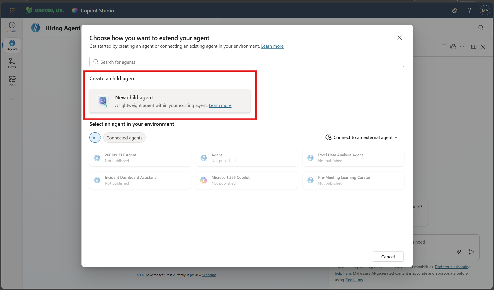

#### Details

- Name
    ```text
    Application Intake Agent
    ```
- When will this be used?: The agent chooses - Based on description
- Description
    ```text
    Processes incoming resumes and stores candidates in the system
    ```

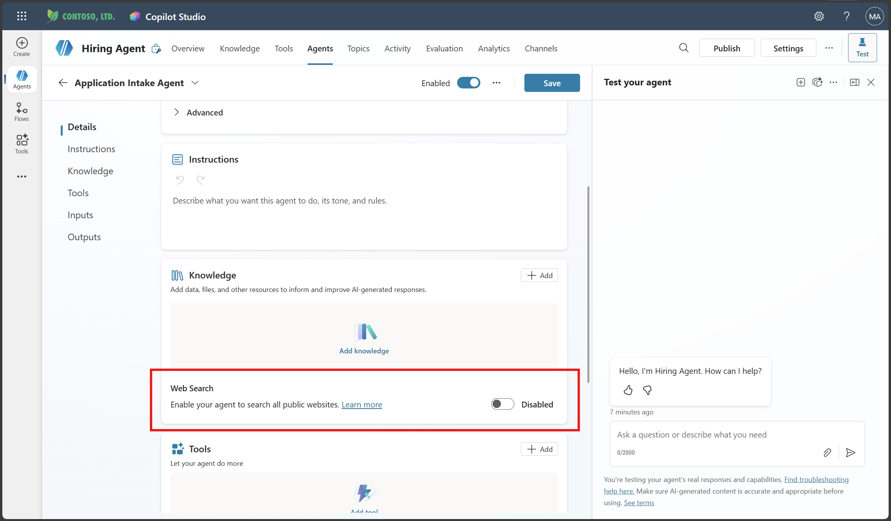
- Ensure that the toggle Web Search is set to Disabled. This is because we only want to use information provided by the parent agent.

### 1.3. Configure Resume Upload agent flow

#### Application Intake Agent > Tools > Add New Tool > Agent Flow
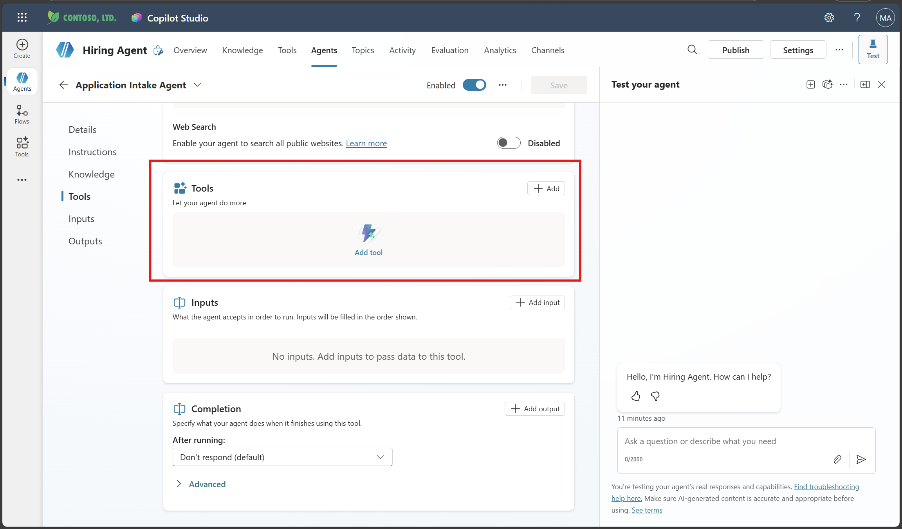


#### When an agent calls the flow node > Add an input

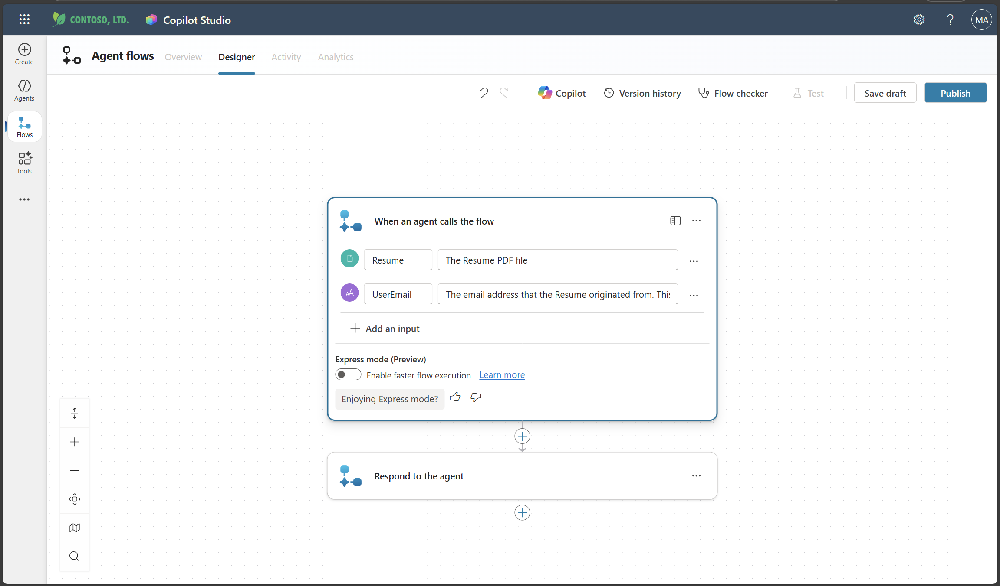
- Add inputs for each of the following Parameters listed in the table below. Select the appropriate input type as shown in the table and be sure to add both the name and the description. It's important to include the description because it will help the agent know what to fill in the input.

    | Type | Name            | Description                                                                                                                                                   |
    | ---- | --------------- | ------------------------------------------------------------------------------------------------------------------------------------------------------------- |
    | File | ```Resume```    | ```The Resume PDF file```                                                                                                                                     |
    | Text | ```UserEmail``` | ```The email address that the Resume originated from. This will be the user uploading the resume in chat, or the from email address if received by email.```  |

#### Add an action > OneDrive for Business - Create File
> Prerequisites: ```testfiles``` folder should be created in OneDrive
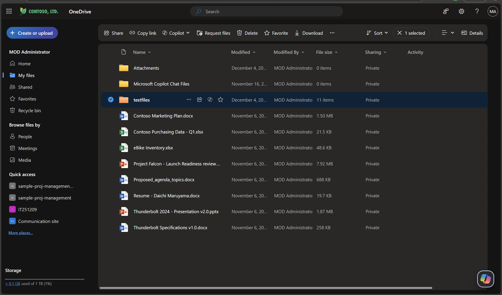

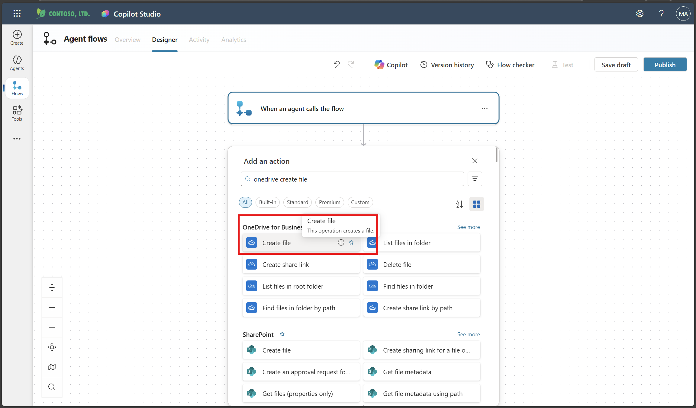

- rename node: ```Create Resume```
- Set the following **properties**:

    | Property         | How to Set                        | Details                                            |
    | ---------------- | --------------------------------- | -------------------------------------------------- |
    | **Folder Path ** | Navigate with folder icon   | ```path to your testfolder```         |
    | **File Name** | Dynamic data (thunderbolt icon)   | When an agent calls the flow → Resume name         |
    | **File Content**      | Dynamic data (thunderbolt icon)   | When an agent calls the flow → Resume contentBytes |

#### Respond to the agent node > Add an output

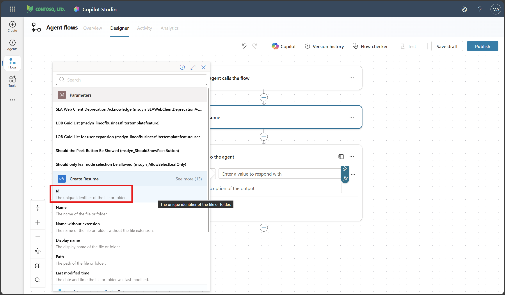
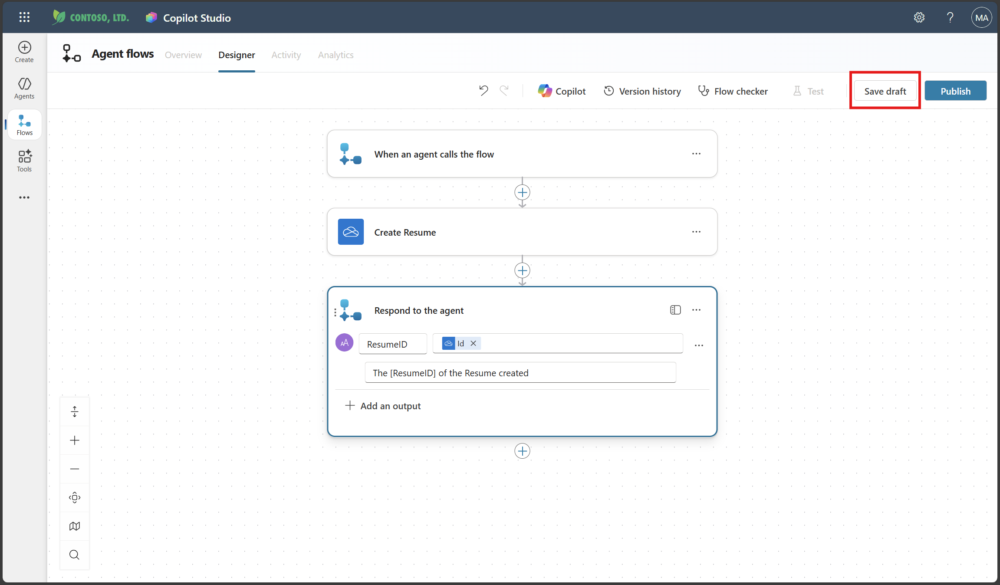
- Create an output with the properties defined in the table below, then click Safe draft:

     | Property        | How to Set                        | Details                                    |
     | --------------- | --------------------------------- | ------------------------------------------ |
     | **Type**        | Select                            | `Text`                                     |
     | **Name**        | Enter                             | `ResumeID`                             |
     | **Value**       | Dynamic data (thunderbolt icon)   | Create Resume → See More → Resume Number   |
     | **Description** | Enter                             | `The [ResumeID] of the Resume created` |

#### Overview tab > Edit on the Details panel


- Fill in the name and description as shown below and select Save.
    - Flow name: ```Resume Upload```
    - Description: ```Uploads a Resume when instructed```
- Designer tab > Publish

### 1.4. Connect the flow to your agent
#### Hiring Agent > Agents tab > Application Intake Agent > Tools > Add tool
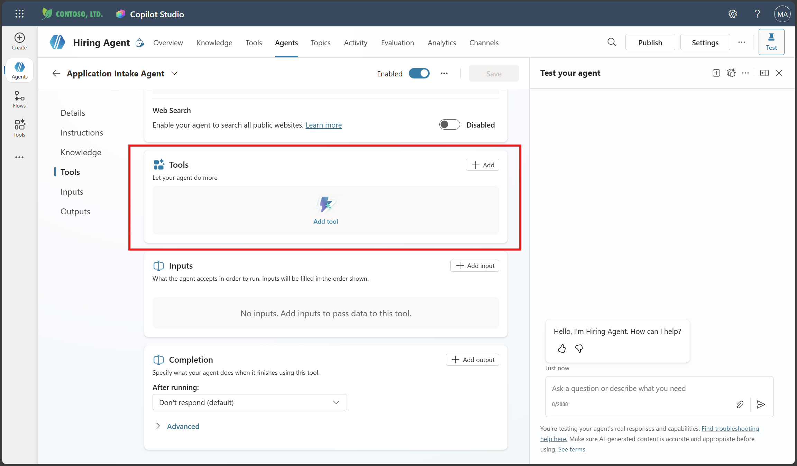
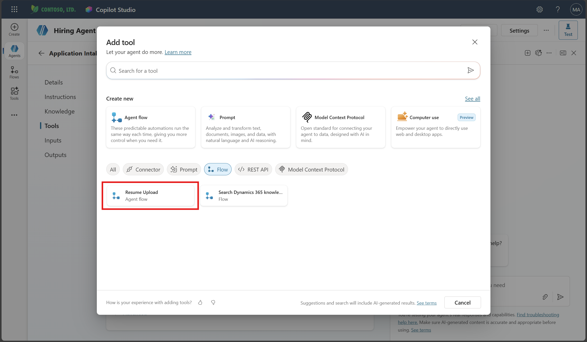
- Flow > Resume upload > Add and configure

#### Details

- Set the following parameters for the description and when the tool should be used:

    | Parameter                                           | Value                                                                                                                                        |
    | --------------------------------------------------- | -------------------------------------------------------------------------------------------------------------------------------------------- |
    | **Description**                                     | `Uploads a Resume when instructed. STRICT RULE: Only call this tool when referenced in the form "Resume Upload" and there are Attachments`   |
    | **Additional details → When this tool may be used** | `only when referenced by topics or agents`                                                                                                   |

    > This description tells the agent when it should call this tool. Notice the use of "strict rule" in the description. This gives a way to provide additional guardrails on when the tool should be used, in this case, only if there are attachments and the context of the conversation is a resume upload. Choosing when this tool can be used is important as well. Since we are building a multi-agent system and we have a child agent, we want to be sure this tool is ONLY called in the child agent, not the main agent. Setting tha value to "only when referenced by topics or agents" ensure this.

#### Inputs
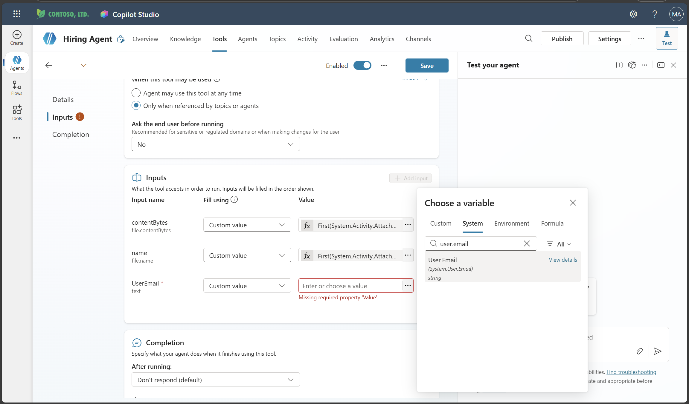
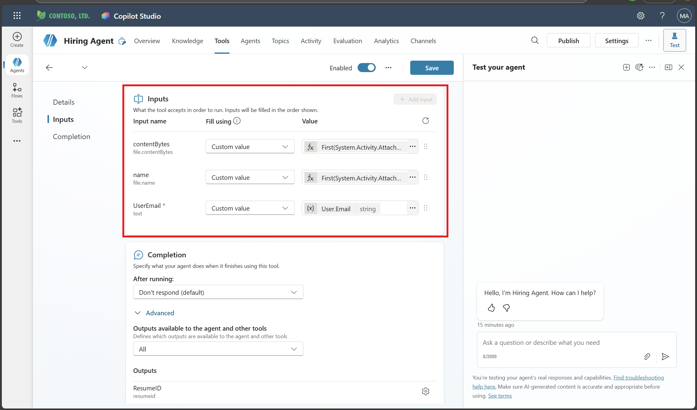
- Scroll down to the inputs section > Add Input to add the following inputs:

    | Parameter              | Value          |
    | ---------------------- | -------------- |
    | **Inputs → Add Input** | `contentBytes` |
    | **Inputs → Add Input** | `name`         |
- Custom Value > Formula
    - contentBytes: ```First(System.Activity.Attachments).Content```
    - Name: ```First(System.Activity.Attachments).Name```
- Custom Value > System
    - UserEmail: ```User.Email``` (System.User.Email)

### 1.5. Define agent instructions
#### Application Intake Agent > Instructions

```text
You are tasked with managing incoming Resumes, Candidate information, and creating Job Applications.  
Only use tools if the step exactly matches the defined process. Otherwise, indicate you cannot help.  

Process for Resume Upload via Chat  
1. Upload Resume  
  - Trigger only if /System.Activity.Attachments contains exactly one new resume.  
  - If more than one file, instruct the user to upload one at a time and stop.  
  - Call /Resume Upload once. Never upload more than once for the same message.  

2. Post-Upload  
  - Always output the [ResumeID] in all messages
```
- System.Activity.Attachments (Variable)
- Resume Upload(Tool)

#### Test

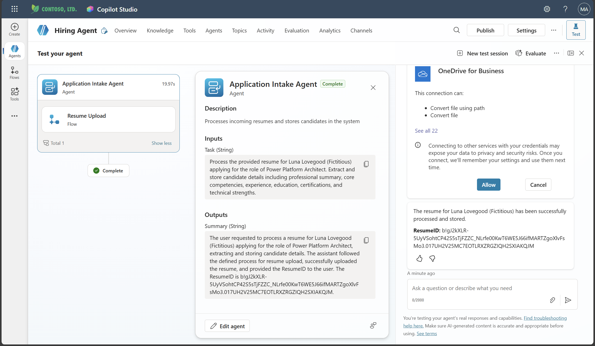

---

## 🧪 02. Building a Resume Extraction System

### 2.1. Create a multimodal prompt
#### Tools > New tool > Prompt
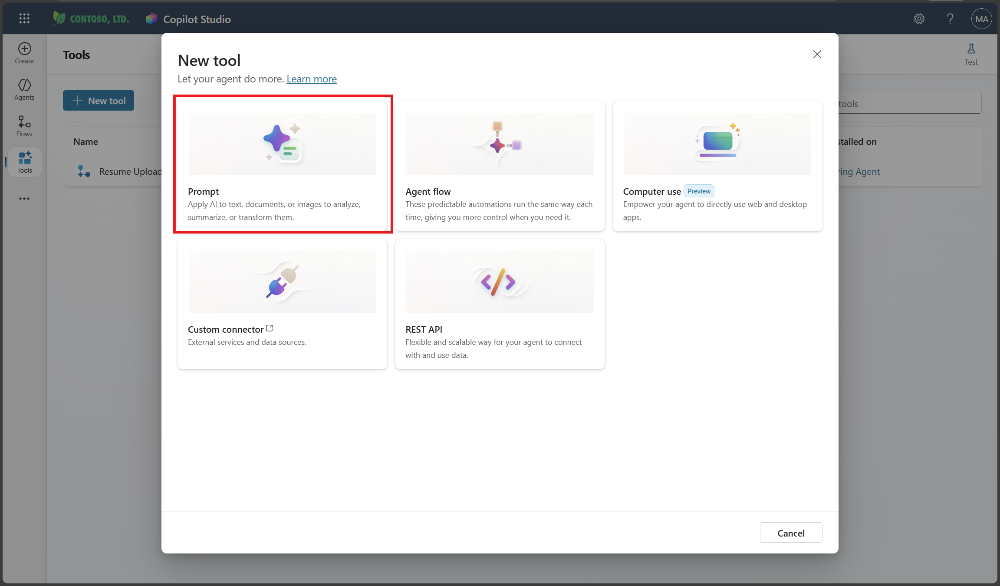
#### AI Prompt setup: JSON output
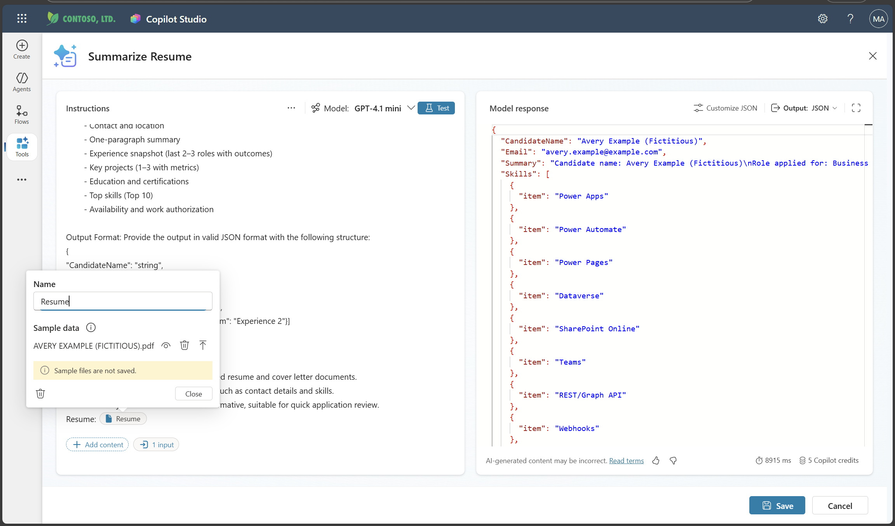
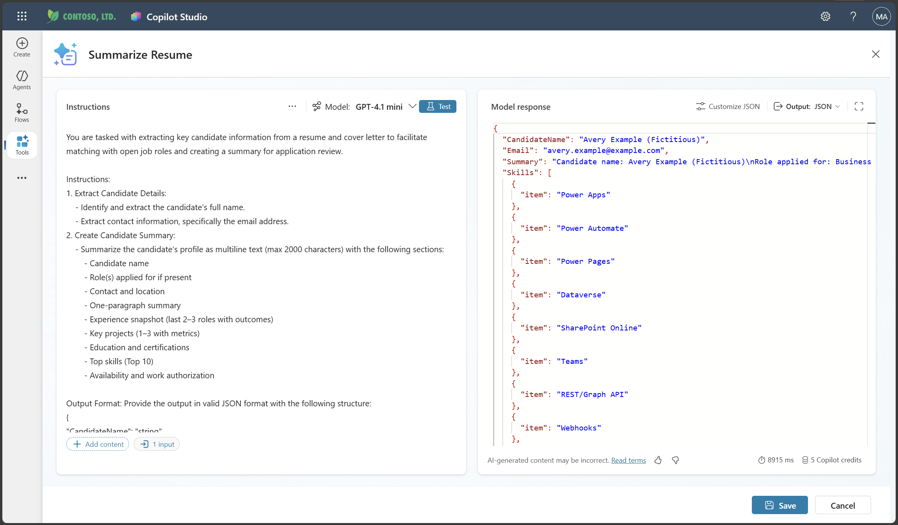
- Rename: ```Summarize Resume```
- Instructions:
```text
You are tasked with extracting key candidate information from a resume and cover letter to facilitate matching with open job roles and creating a summary for application review.


Instructions:
1. Extract Candidate Details:
    - Identify and extract the candidate’s full name.
    - Extract contact information, specifically the email address.
2. Create Candidate Summary:
    - Summarize the candidate’s profile as multiline text (max 2000 characters) with the following sections:
        - Candidate name
        - Role(s) applied for if present
        - Contact and location
        - One-paragraph summary
        - Experience snapshot (last 2–3 roles with outcomes)
        - Key projects (1–3 with metrics)
        - Education and certifications
        - Top skills (Top 10)
        - Availability and work authorization


Output Format: Provide the output in valid JSON format with the following structure:

{
"CandidateName": "string",
"Email": "string",
"Summary": "string max 2000 characters",
"Skills": [{"item": "Skill 1"}, {"item": "Skill 2"}],
"Experience": [{"item": "Experience 1"}, {"item": "Experience 2"}]
}


Guidelines:
- Extract information only from the provided resume and cover letter documents.
- Ensure accuracy in identifying all details such as contact details and skills.
- The summary should be concise but informative, suitable for quick application review.

Resume: /document
```

- In the **Configure for use in Agent** dialog, select **Cancel**.

    > Why we're not adding this as a tool yet: 
    > You'll use this prompt in an Agent Flow rather than directly as a tool, which gives you more control over the data processing workflow.

### 2.2. Add prompt to an Agent Flow
#### Application Intake Agent > Tools panel > Add New tool > Agent flow
#### When an agent calls the flow
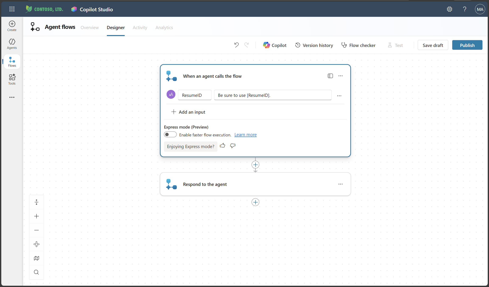
- Select the When an agent calls the flow node, use **+ Add an input** to add the following parameter:

    | Type | Name | Description |
    |------|------|-------------|
    | Text | ResumeID | Be sure to use [ResumeID].|

#### Add an action: OneDrive for Business - Get file content
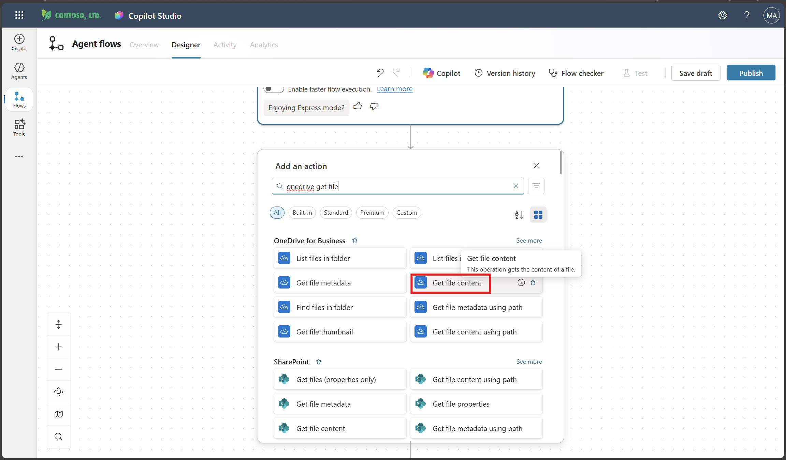
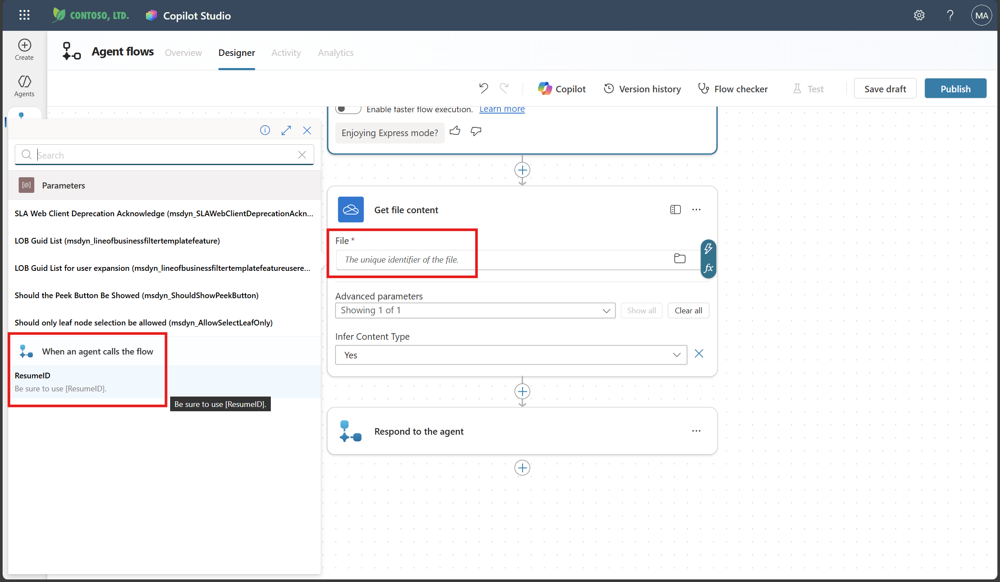

- Rename: ```Get resume file content```
- Set following property:
    | Property         | How to Set                        | Details                                            |
    | ---------------- | --------------------------------- | -------------------------------------------------- |
    | **File** | Dynamic data (thunderbolt icon)   | When an agent calls the flow → ResumeID        |

#### Add an action: AI Builder - Run a prompt

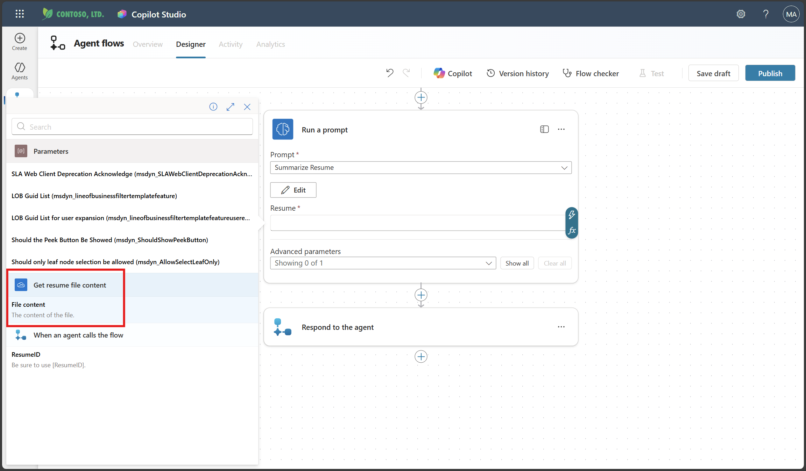
- Rename: ```Run a prompt: Summarize Resume```
- Set following property:

    | Property | How to Set | Value |
    |----------|------------|-------|
    | **Prompt** | Select | Summarize Resume |
    | **Resume** | Dynamic data (thunderbolt icon) | Get resume file content → File content |

#### Respond to the agent
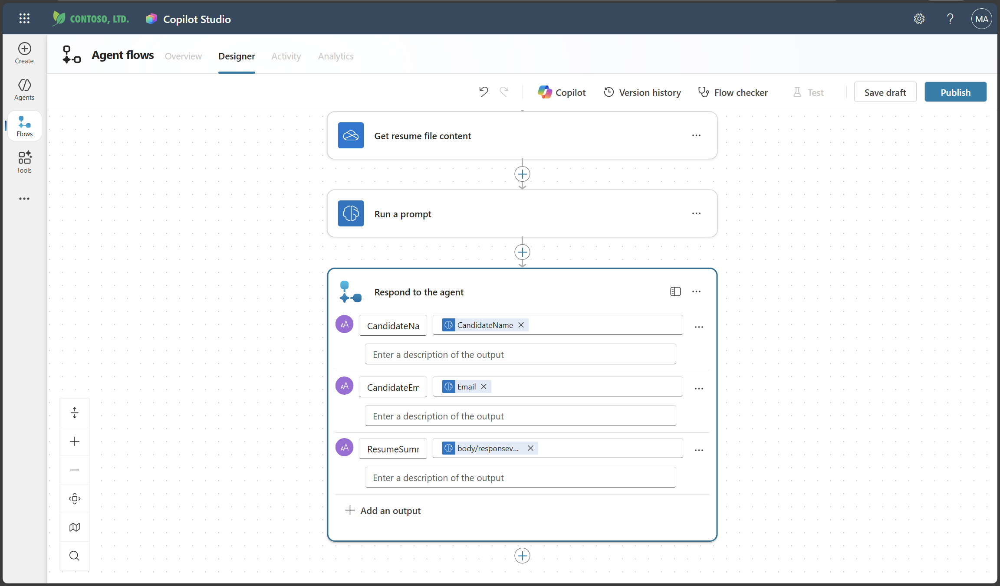
- use **+ Add an output** to configure > Save draft:

    | Type | Name              | How to Set                      | Value                                                        | Description                                            |
    | ---- | ----------------- | ------------------------------- | ------------------------------------------------------------ | ------------------------------------------------------ |
    | Text | `CandidateName`   | Dynamic data (thunderbolt icon) | Summarize Resume → See more → CandidateName                  | The [CandidateName] given on the Resume                |
    | Text | `CandidateEmail`  | Dynamic data (thunderbolt icon) | Summarize Resume → See more → Email                          | The [CandidateEmail] given on the Resume               |
    | Text | `ResumeSummary`   | Dynamic data (thunderbolt icon) | Summarize Resume → See more → body/responsev2/predictionOutput/structuredOutput | The resume summary and details in JSON form            |

#### Overview > Edit
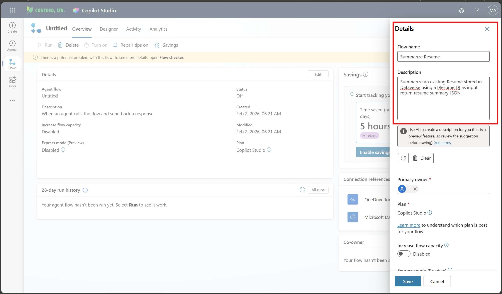
- **Details** panel

    - **Flow name**:`Summarize Resume`
    - **Description**:
    ```text
    Summarize an existing Resume stored in OneDrive using a [ResumeID] as input, return resume summary JSON
    ```


- Designer tab > Publish

### 2.3. Connect the flow to your agent
#### Application Intake Agent > Tools panel > Add a tool > Flow > Summarize Resume (Agent Flow)


- Configure the tool settings as follows:

    | Setting | Value |
    |---------|-------|
    | **Description** | Summarize an existing Resume stored in OneDrive using a [ResumeID] as input, return resume summary JSON |
    | **When this tool may be used** | Only when referenced by topics or agents |

#### Application Intake Agent > Instructions
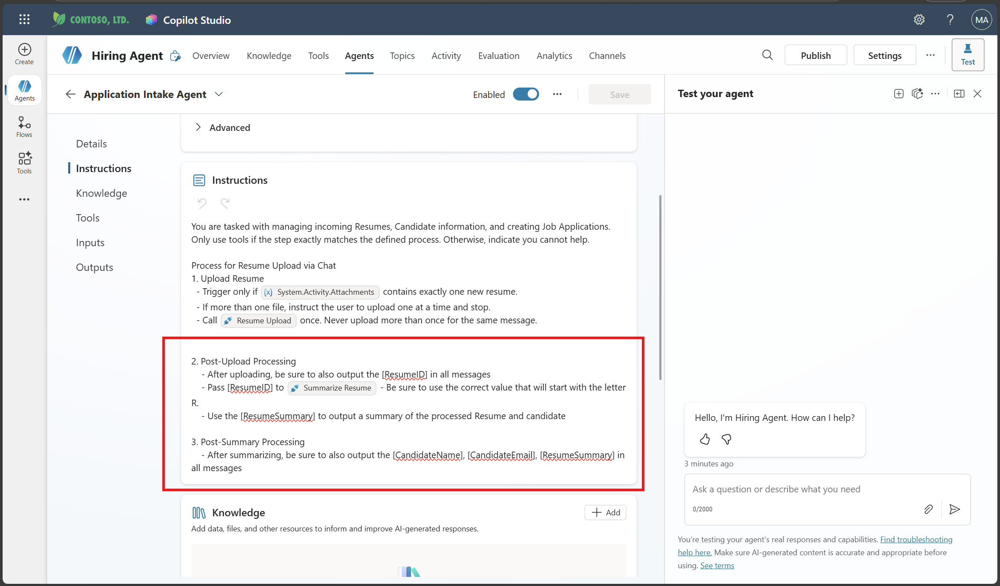
- Update the following instructions:
```text
2. Post-Upload Processing  
    - After uploading, be sure to also output the [ResumeID] in all messages
    - Pass [ResumeID] to /Summarize Resume  - Be sure to use the correct value that will start with the letter R.
    - Use the [ResumeSummary] to output a summary of the processed Resume and candidate

3. Post-Summary Processing
    - After summarizing, be sure to also output the [CandidateName], [CandidateEmail], [ResumeSummary] in all messages
```

#### Test


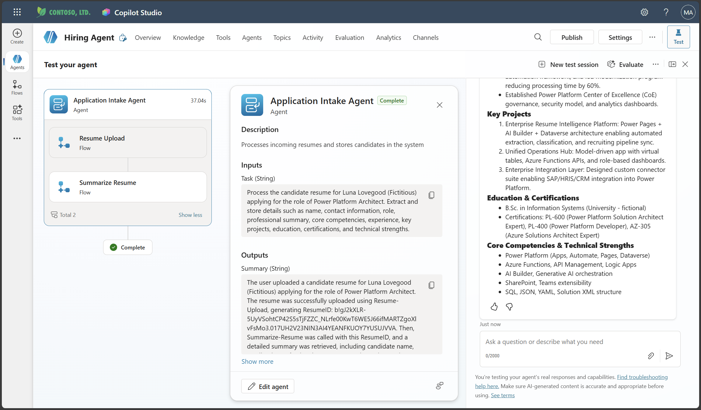
---

## 🧪 03. Generating an Interview Prep. Document
### 3.1. Create the prompt
#### Tools > New tool > Prompt


- Rename: ```Interview Question Document Prep```
- Instructions:
```text
You are tasked with evaluating a candidate’s resume against a specific job listing description and generating a targeted set of interview questions to support structured candidate screening.

### Instructions

1. **Extract Candidate Details:**
    - Identify and extract the candidate’s full name.
    - Extract contact information, specifically the email address.
    - Identify the candidate’s current or most recent job title.
    - Extract location if present.
    - Estimate total years of experience only if supported by resume dates.

2. **Analyze the Job Listing Description:**
    - Review the job description to identify:
    - Must-have requirements
    - Nice-to-have requirements
    - Key responsibilities
    - Required tools and technologies
    - Treat must-have requirements as the highest priority for evaluation.

3. **Evaluate Candidate's Resume Against Job Requirements:**
    - Compare the resume content against each must-have requirement.
    - For each requirement, determine:
        - Evidence level: Strong, Moderate, Weak, or Missing
        - A confidence score from 0–100
        - Supporting evidence using short phrases grounded in the resume text only
    - Do not infer or invent experience.

4. **Assess Overall Candidate Fit:**
    - Identify:
        - Top strengths (up to 5)
        - Key gaps (up to 5)
        - Risks or concerns only when supported by missing or unclear evidence
        - Provide a concise one-paragraph summary suitable for recruiter review.

5. **Generate Interview Questions (Exactly 10):**
    - Generate exactly 10 interview questions based on the job requirements and resume evaluation.
    - Distribute the questions as follows:
        - 5 Core Requirement Questions focused on the most critical must-have requirements.
        - 3 Gap or Clarification Questions targeting weak, missing, or ambiguous areas.
        - 2 Scenario-Based Questions derived directly from key job responsibilities.
    - Avoid generic or culture-only questions unless explicitly required by the job description.

**Interview Question Requirements:**
    - Each question must include:
        - The interview question
        - The job requirement it maps to
     - Questions must be specific, non-duplicative, and grounded in the provided inputs.
     - Produce questions in numbered format (1, 2, 3)

### Input Data

Resume Details: /ResumeSummary
Job Details: /JobDetails
Evaluation Criteria: /EvalCriteria
```

<details>
<summary>Example Contents of ResumeSummary</summary>

```
### **Candidate Details**
- **Name:** Luna Lovegood (Fictitious)
- **Email:** luna.lovegood@example.com
- **Role Applied For:** Power Platform Architect

### **Professional Summary**
Power Platform Architect with 10+ years of experience designing enterprise-grade, scalable, secure, and governed Power Platform solutions. Specializes in solution architecture, CoE governance, fusion team enablement, ALM strategies, enterprise connectors, and model-driven/Power Pages architecture across Finance, HR, Operations, and Field Service domains.

### **Experience**
- Power Platform Architect at Fictional Enterprise Y (Global) since Jan 2022: Architected enterprise intake platform supporting 20k+ monthly submissions, designed scalable automation framework, and led modernization program reducing processing time by 60%.
- Established Power Platform Center of Excellence (CoE) governance, security model, and analytics dashboards.

### **Key Projects**
1. Enterprise Resume Intelligence Platform: Power Pages + AI Builder + Dataverse architecture enabling automated extraction, classification, and recruiting pipeline sync.
2. Unified Operations Hub: Model-driven app with virtual tables, Azure Functions APIs, and role-based dashboards.
3. Enterprise Integration Layer: Designed custom connector suite enabling SAP/HRIS/CRM integration into Power Platform.

### **Education & Certifications**
- B.Sc. in Information Systems (University - fictional)
- Certifications: PL-600 (Power Platform Solution Architect Expert), PL-400 (Power Platform Developer), AZ-305 (Azure Solutions Architect Expert)

### **Core Competencies & Technical Strengths**
- Power Platform (Apps, Automate, Pages, Dataverse)
- Azure Functions, API Management, Logic Apps
- AI Builder, Generative AI orchestration
- SharePoint, Teams extensibility
- SQL, JSON, YAML, Solution XML structure
```
</details>

- Because we want to have this prompt generate a document, we need to change the model the prompt is using to one that supports multi-modal inputs and outputs. To do this, select the **model dropdown** and change it to **GPT-4.1**


#### Word document as the output
- Use provided template: ```Interview_Questions_Template.docx```

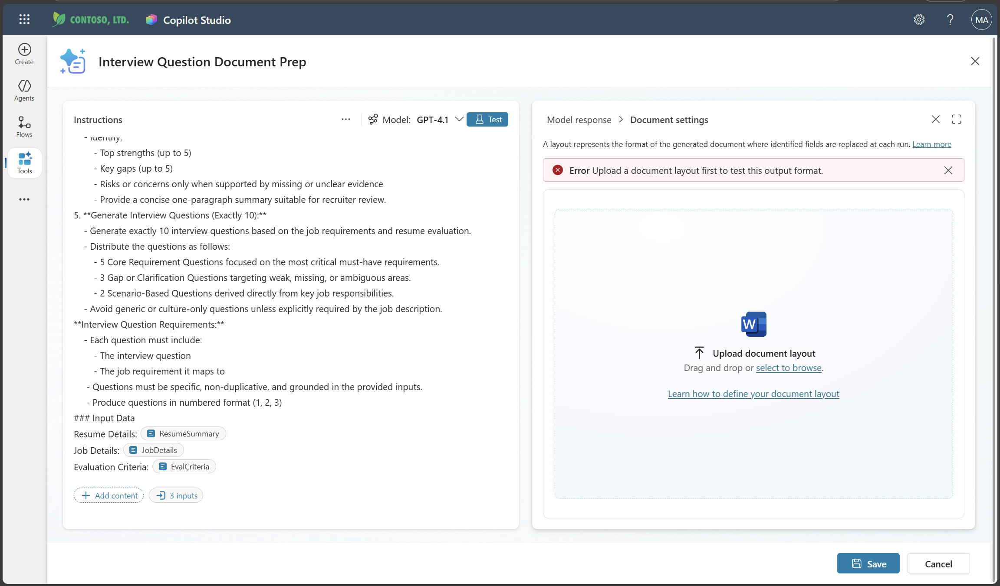
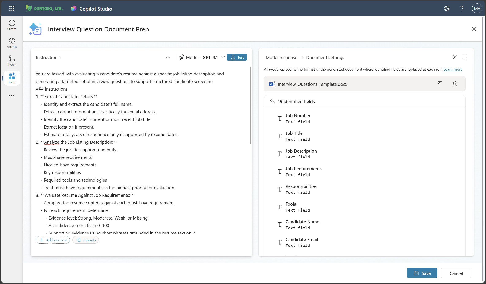
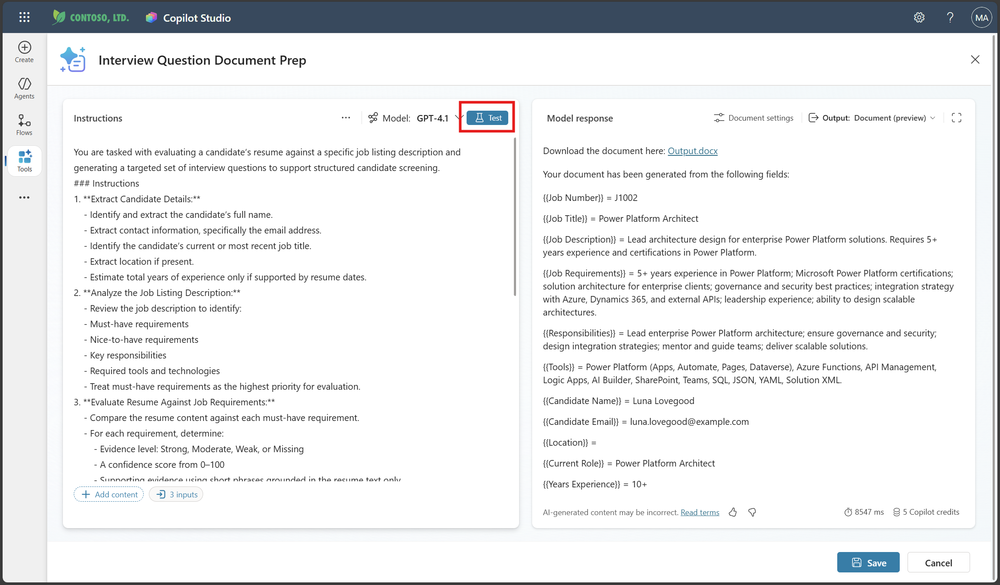


### 3.2. Create an agent flow to call the prompt
#### Application Intake Agent > Tools panel > Add New tool > Agent flow
#### When an agent calls the flow
- Select the When an agent calls the flow node, use **+ Add an input** to add the following parameter:

    | Type | Name | Description |
    |------|------|-------------|
    | Text | ResumeSummary | Be sure to use [ResumeSummary] from Application Intake Agent (child agent of Hiring Agent).|

#### Add an action: OneDrive for Business - Get file content

- Rename: ```Get file content: JobRoles```, ```Get file content: EvalCriteria```
- Set following property:
    | Property         | How to Set                        | Details                                            |
    | ---------------- | --------------------------------- | -------------------------------------------------- |
    | **File** | File icon   | locate to ```Active Job Roles.txt``` and ```Evaluation Criteria.txt``` files        |

#### Add an action: AI Builder - Run a prompt
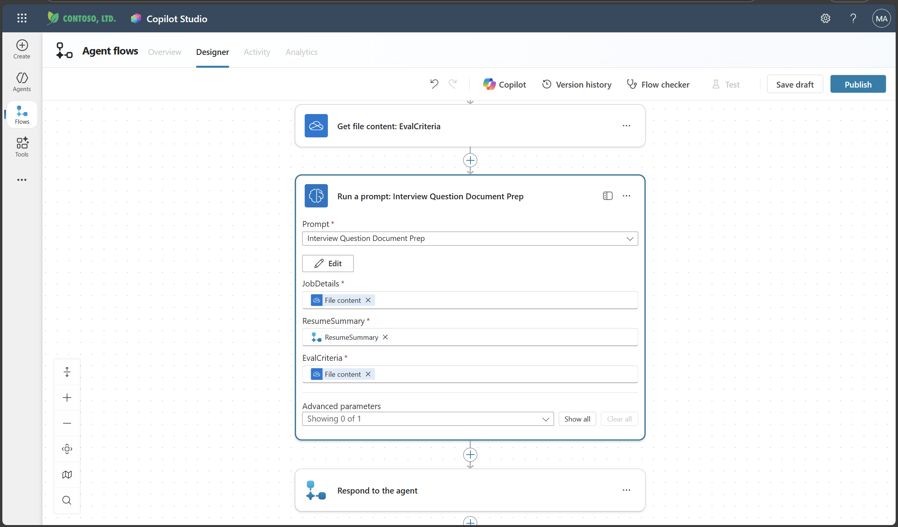
- Rename: ```Run a prompt: Interview Question Document Prep```
- Set following property:

    | Property | How to Set | Value |
    |----------|------------|-------|
    | **Prompt** | Select | Interview Question Document Prep |
    | **Job Details** | Dynamic data (thunderbolt icon) | Get file content: JobRoles → File content |
    | **Evaluation Criteria** | Dynamic data (thunderbolt icon) | Get file content: EvalCriteria → File content |
    | **Resume** | Dynamic data (thunderbolt icon) | When an agent calls the flow → Resume Summary |

#### Respond to the agent
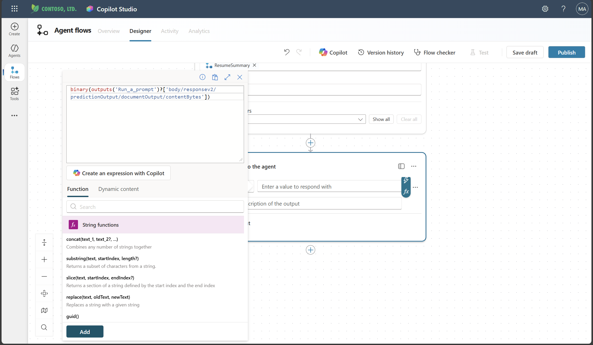

- use **+ Add an output** to configure > Save draft:
    - Type: File
    - Name: ```InterviewFile```
    - Insert Expression:
        ```text
        binary(outputs('Run_a_prompt')?['body/responsev2/predictionOutput/documentOutput/contentBytes'])
        ```
    - This formula is necessary to properly extract the file from the output so we can return it to our agent.

#### Overview > Edit > Details

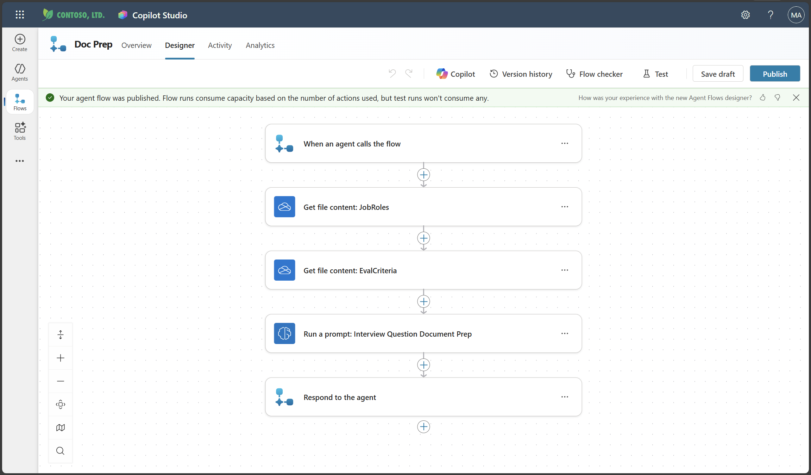
- Flow name: ```Doc Prep```
- Description: ```Creates an interview prep document and returns to the agent```
- Designer tab > Publish

### 3.3. Create the topic
#### Hiring Agent > Topic > Add a topic


- Name: ```Generate Interview Doc```

#### Topic Trigger
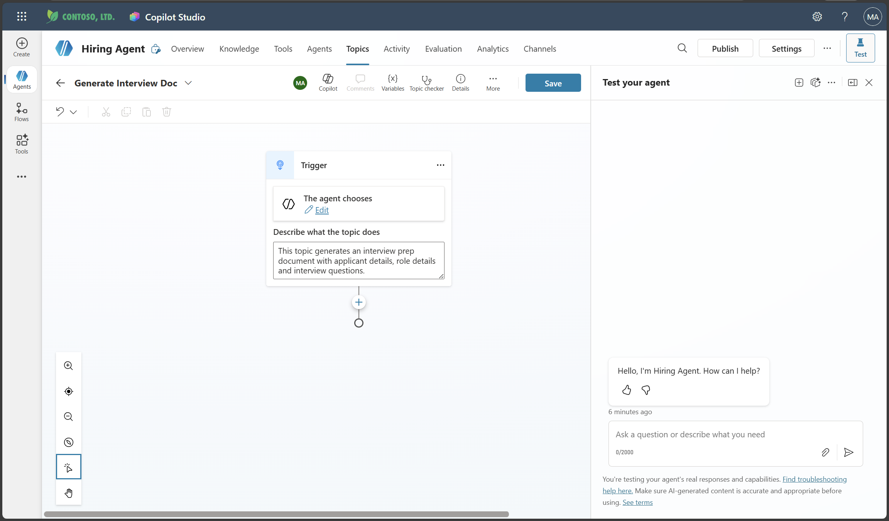
- Describe what the topic does:
    ```text
    This topic generates an interview prep document with applicant details, role details and interview questions.
    ```

#### Topic Details > Input variables > Create a new variable
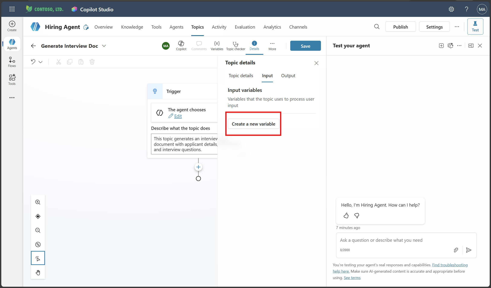

- Variable name == Display name: ```VarResumeSummary```
- Description
    ```text
    Fill with the Resume Summary referenced in the chat.
    ```

#### Add a Tool > Doc Prep flow


#### Add node > Send a message
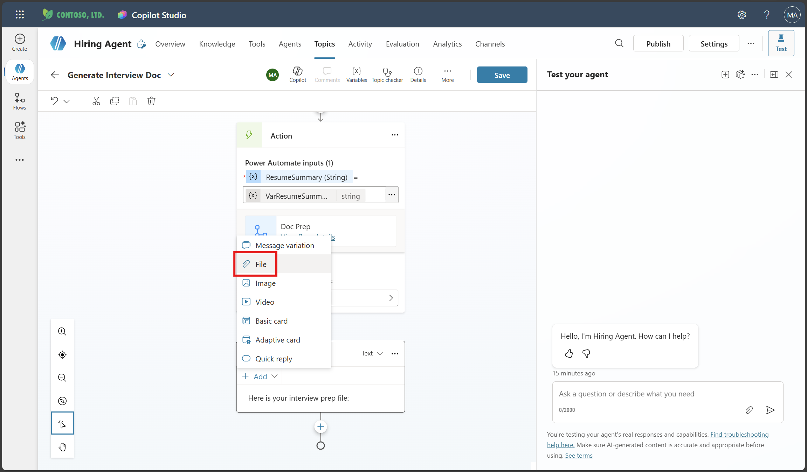

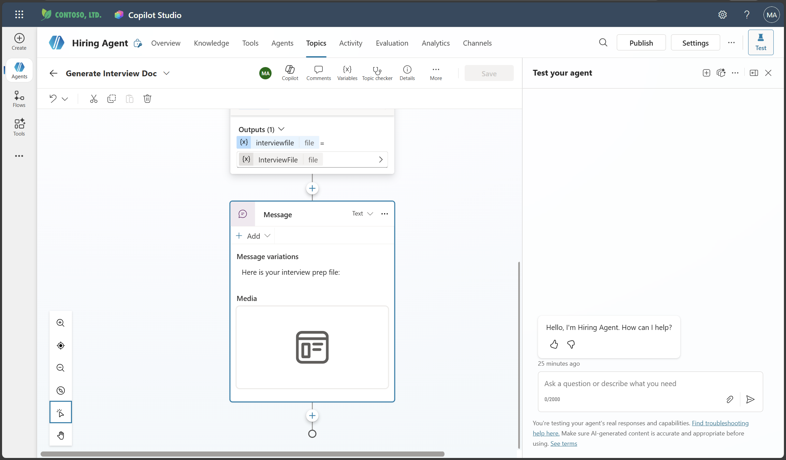
- add a message node to return the file to the user
- textbox: ```Here is your interview prep file: ```
- File Properties
    - **Content**: Custom > ```InterviewFile```
    - **Name**: formula > ```Text(Now(), "yyyy-MM-dd")&"InterviewPrep.docx"```

### 3.4. Hiring Agent

#### Instructions

```text
You are the central orchestrator for the hiring process.
You coordinate activities end‑to‑end, ensure smooth task delegation, and produce clear summaries for the user. Always take action by calling the appropriate child agents or tools whenever needed — do not stop at explaining a tool call.

- When the user asks to process or understand a resume file, invoke the /Application Intake Agent . This is typically the first step in the hiring workflow.
- When the user asks to prepare for an interview, generate structured content, or produce interview materials, use the /Generate Interview Doc tool.
```

#### Test
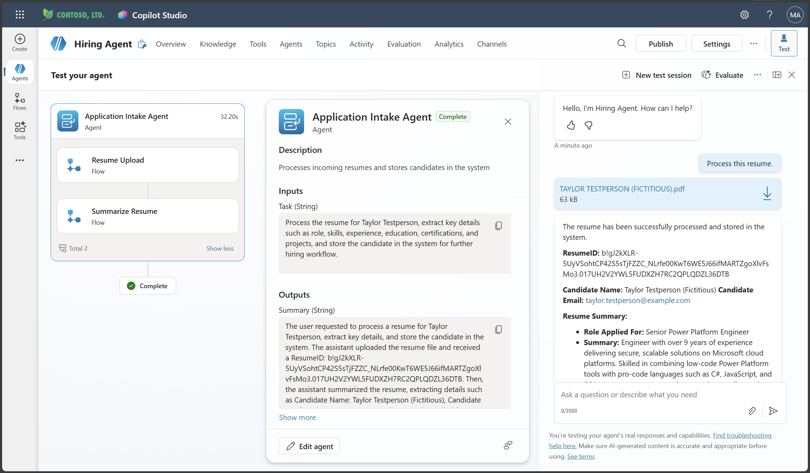

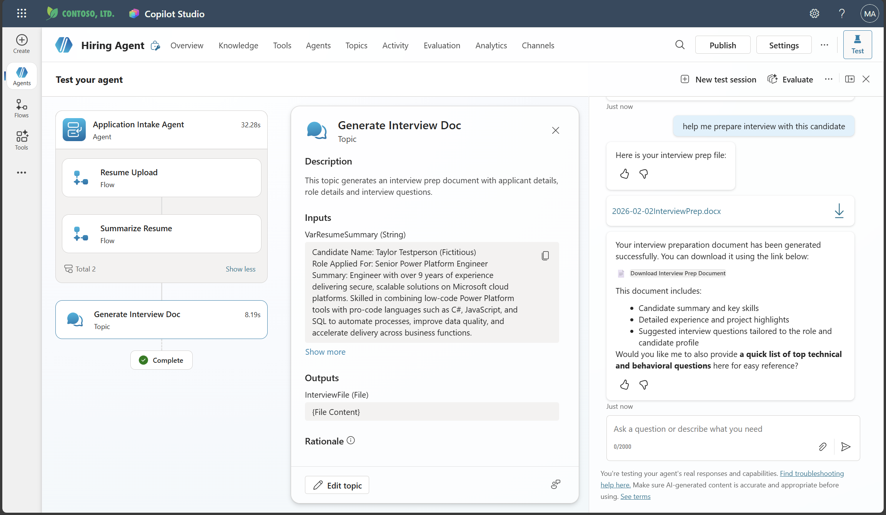


---

### Reference
- [MS Learn: Explore AI capabilities in Copilot Studio](https://learn.microsoft.com/en-us/microsoft-copilot-studio/guidance/ai-capabilities)
- [Agent Academy: Make Your Agent Multi-agent Ready with Connected Agents](https://microsoft.github.io/agent-academy/operative/03-multi-agent/)
- [Agent Academy: Extracting Resume Contents with Multimodal Prompts](https://microsoft.github.io/agent-academy/operative/07-multimodal-prompts/)
- [Agent Academy: Generate a Candidate Interview Questions Document](https://microsoft.github.io/agent-academy/operative/09-document-generation/)