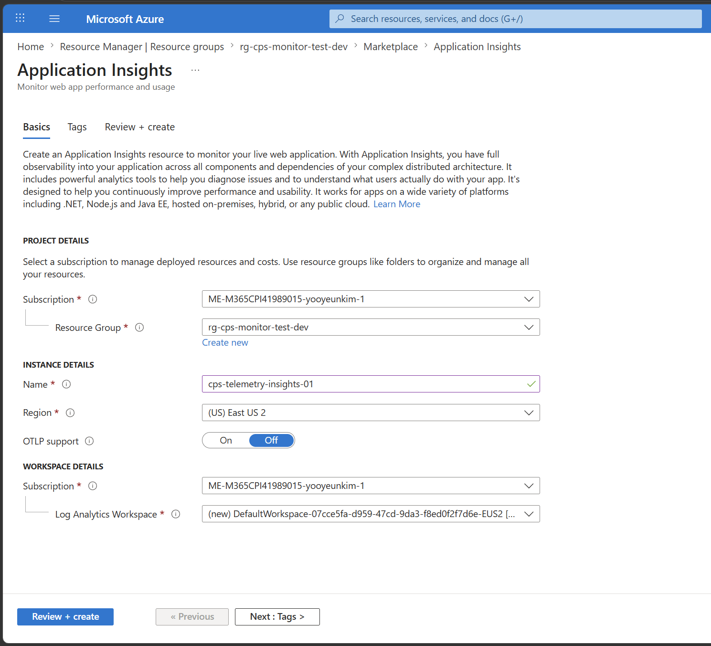
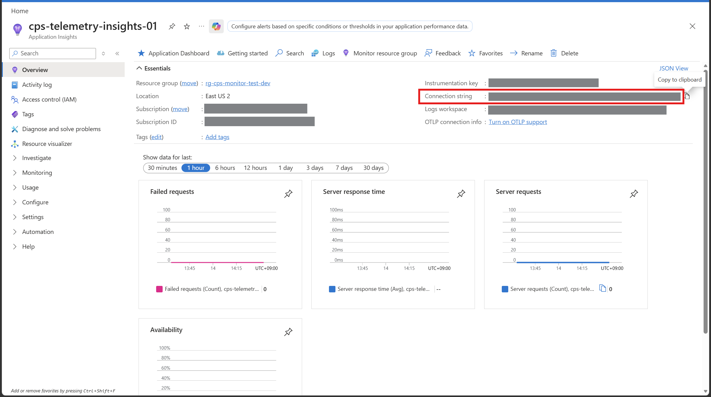
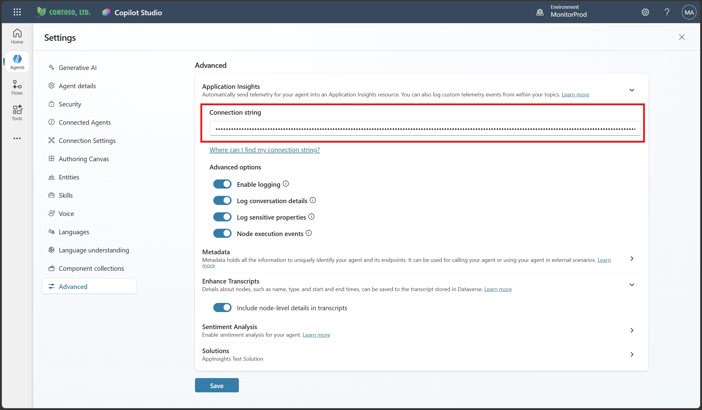
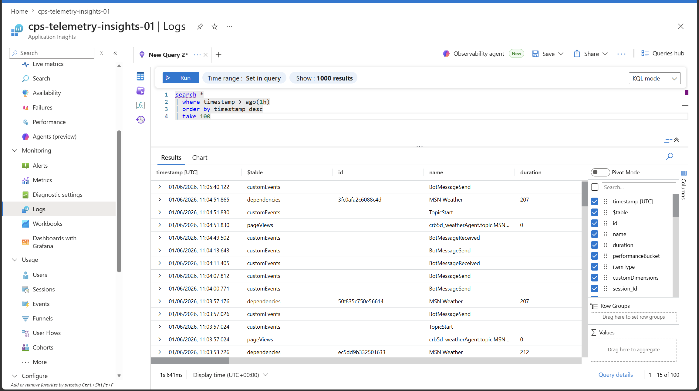
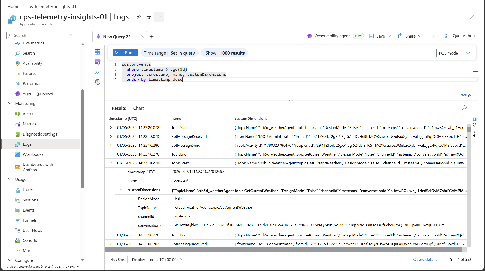

# Monitoring Copilot Studio Agent Events with Azure Application Insights

> Ref.  
[MS Learn: Capture telemetry with Application Insights](https://learn.microsoft.com/en-us/microsoft-copilot-studio/advanced-bot-framework-composer-capture-telemetry) 
[MS Learn: Enable Application Insights support in Copilot Studio](https://learn.microsoft.com/en-us/microsoft-copilot-studio/guidance/kit-enable-application-insights)

---
## Implementation Guide

### Azure Application Insights

- create resource
  - 

- copy connection string
  - [MS Learn: Connection strings in Application Insights](https://learn.microsoft.com/en-us/azure/azure-monitor/app/connection-strings?tabs=net#find-your-connection-string) 
    - e.g., `InstrumentationKey=<MY-KEY>;IngestionEndpoint=<MY-ENDPOINT-1>;LiveEndpoint=<MY-ENDPOINT-2>;ApplicationId=<MY-ID>`
  - 

### Copilot Studio

- Settings → Advanced: paste connection string from Application Insights
  - Enable logging
  - Log conversation details: Include user ID, user name, and message text (for message activities). When OpenTelemetry tracing is enabled, this setting also controls tool input arguments and tool output results captured in spans.
  - Log sensitive properties: Log properties of things marked as sensitive. Leave this turned off if you want to redact sensitive data.
  - Node execution events: Log an event each time a node within a topic is executed.
- 

### Application Insights: Logs

- Default Logs
  - e.g., `timestamp`, `$table`, `id`, `name`, `duration`, `performanceBucket`, `itemType`, `customDimensions`, `session_Id`, `user_Id`, `application_Version`, `client_Type`, `client_IP`, `cloud_RoleName`, `cloud_RoleInstance`, `appID`, `appName`, `iKey`, `sdkVersion`, `itemID`, `itemCount`, `_ResourceId`, `target`, `type`, `success`, `resultcode` 
  - 

  - 