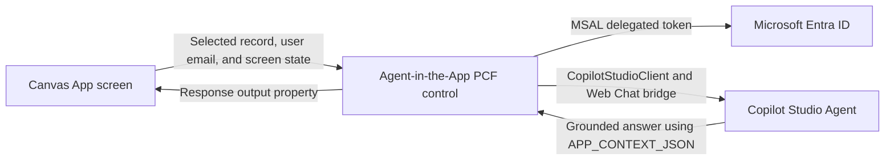

# Agent-in-the-App

A code-first technical demo repo for embedding a **Copilot Studio Agent inside Power Apps** using a **Power Apps Component Framework (PCF) control**.

The demo goal is not just "chat inside an app." The goal is to prove that the agent can use **the current Power Apps context**—for example, selected customer, case, order, opportunity, SLA risk, or screen state.

## Why Canvas App + PCF?

This repo chooses Canvas App + PCF for the first end-to-end test because:

- Microsoft’s public sample for this path embeds Copilot Studio agents into Canvas Apps with PCF.
- PCF works as a reusable code component rather than a one-off iframe.
- The app can pass selected screen/record context as a property.
- The control can expose the latest agent response back to Power Apps as an output property.
- It avoids relying on the preview `Xrm.Copilot` model-driven app API for the first demo.

## Architecture

## Architecture



## Repo structure

```text
Agent-in-the-App/
├─ README.md
├─ .gitignore
├─ package.json
├─ package-lock.json
├─ eslint.config.mjs
├─ docs/
│  ├─ azure-app-registration.md
│  ├─ canvas-app-setup.md
│  ├─ copilot-studio-agent-setup.md
│  └─ model-driven-option.md
├─ scripts/
│  ├─ build-and-pack.ps1
│  └─ mock-cases.powerfx
├─ tests/
│  └─ contextPayload.test.ts
├─ AgentInTheAppControlClean/
│  ├─ .gitignore
│  ├─ AgentInTheAppControlClean.pcfproj
│  ├─ ControlManifest.Input.xml
│  ├─ eslint.config.mjs
│  ├─ index.ts
│  ├─ package.json
│  ├─ package-lock.json
│  ├─ pcfconfig.json
│  ├─ tsconfig.json
│  ├─ ChatControl/
│  │  ├─ AgentInTheApp.tsx
│  │  └─ contextPayload.ts
│  └─ css/
│     └─ AgentInTheApp.css
└─ SolutionAppAgentClean/
   ├─ .gitignore
   ├─ SolutionAppAgentClean.cdsproj
   └─ src/
      └─ Other/
         ├─ Customizations.xml
         ├─ Relationships.xml
         └─ Solution.xml
```

## Prerequisites

- Power Platform environment with PCF components enabled for Canvas Apps
- Published Copilot Studio agent configured with **Authenticate with Microsoft**
- Microsoft Entra app registration with delegated `Copilot Studio.Copilots.Invoke` permission
- Power Platform CLI: `pac`
- Node.js LTS
- .NET SDK
- .NET Framework 4.6.2 Developer Pack / Targeting Pack
- NuGet source configured for `https://api.nuget.org/v3/index.json`

> The PCF code itself is TypeScript/React.  
> The .NET Framework 4.6.2 Developer Pack is required only because the Dataverse solution packaging project targets `net462`.

## Configuration values to collect

From Copilot Studio:

- Environment ID
- Agent schema name / identifier, for example `cr123_agentintheapp`

From Microsoft Entra:

- Application / client ID
- Directory / tenant ID

## Build the PCF control

From the PCF control folder:

```powershell
cd .\AgentInTheAppControl
npm install
npm run build
```

Expected result:

```text
[build] Succeeded
```

<details>
  <summary>If you have succeeded until this step:</summary>

  ### completed

  ```text
  PCF control folder setup
  → npm install
  → TypeScript/React/PCF build success
  ```

  ### not yet

  ```text
  Power Platform solution packaging
  → importing PCF into Power Apps
  → adding the PCF control to a Canvas App
  → configuring Entra app registration
  → connecting to actual Copilot Studio agent
  → passing selected app context into the agent
  → validating real conversation response
  ```

</details>
<br>

## Package as a Power Platform solution

From the repo root:

```powershell
mkdir SolutionAppAgent
cd SolutionAppAgent

pac solution init --publisher-name SageKim --publisher-prefix sage
pac solution add-reference --path ..\AgentInTheAppControl

dotnet restore
dotnet build
```

Expected result:

```text
Unmanaged Pack complete.
Build succeeded.
```

To find the generated solution ZIP:

```powershell
Get-ChildItem .\bin -Recurse -Filter *.zip
```

The generated ZIP is the file to import into Power Platform:

```text
Power Apps Maker Portal
→ Solutions
→ Import solution
→ Upload generated .zip
```

## Canvas App test process

1. Import the built PCF solution into the target environment.
2. Create a Canvas App with a gallery of mock support cases.
3. Add the PCF control to the right side of the screen.
4. Bind `appContextJson` to a `JSON(...)` formula from `galCases.Selected`.
5. Set `autoSendContext = true`.
6. Run the app.
7. Select a case.
8. Ask the embedded agent: `Summarize the currently selected case and recommend the next best action.`
9. Change the selected case.
10. Ask: `What changed compared with the previous case?`

## PCF properties

| Property | Direction | Purpose |
|---|---:|---|
| `agentTitle` | input | Title shown above chat |
| `appClientId` | input | Entra application client ID |
| `tenantId` | input | Entra tenant ID |
| `environmentId` | input | Power Platform environment ID |
| `agentIdentifier` | input | Copilot Studio agent schema name |
| `username` | input | Usually `User().Email` |
| `appContextJson` | input | Selected app context JSON from Power Apps |
| `autoSendContext` | input | Sends context to agent when the context changes |
| `contextInstruction` | input | Optional context-specific system instruction |
| `styleOptions` | input | Web Chat style options JSON |
| `disableFileUpload` | input | Hides upload button |
| `response` | output | Latest agent response text |
| `conversationId` | output | Current conversation ID |
| `status` | output | Connection/runtime status |

## Important implementation note

This demo sends context as a structured bootstrap message wrapped in `[APP_CONTEXT_BOOTSTRAP]`. In a polished production version, you can replace this with a custom event/topic-trigger pattern if your target Copilot Studio + PCF sample version supports event activities end to end.

The bootstrap pattern is useful for demos because it is visible, debuggable, and easy to prove: the agent’s response should reference fields from `APP_CONTEXT_JSON`.

## Security guardrails

- Send only the fields needed for the task.
- Do not send full Dataverse record payloads by default.
- Redact obvious secret-like fields before sending context.
- Treat agent output as a recommendation, not an automatic writeback.
- Use explicit user confirmation before any Dataverse update or Power Automate trigger.

## Troubleshooting notes from the build process

<details>
  <summary>If <code>npm run build</code> fails with “Could not find config file” during ESLint:</summary>

  Add an ESLint config file to the PCF project folder.

  For ESLint 9, use `eslint.config.mjs` or `eslint.config.js`.

  Example:

  ```js
  import tseslint from '@typescript-eslint/eslint-plugin';
  import tsParser from '@typescript-eslint/parser';

  export default [
    {
      ignores: [
        'node_modules/**',
        'out/**',
        'dist/**',
        'build/**',
        'coverage/**',
        'generated/**'
      ]
    },
    {
      files: ['**/*.ts', '**/*.tsx'],
      languageOptions: {
        parser: tsParser,
        parserOptions: {
          ecmaVersion: 'latest',
          sourceType: 'module',
          ecmaFeatures: { jsx: true }
        }
      },
      plugins: {
        '@typescript-eslint': tseslint
      },
      rules: {
        ...tseslint.configs.recommended.rules,
        '@typescript-eslint/no-explicit-any': 'off',
        '@typescript-eslint/no-unused-vars': [
          'warn',
          {
            argsIgnorePattern: '^_',
            varsIgnorePattern: '^_'
          }
        ]
      }
    }
  ];
  ```

</details>

<details>
  <summary>If TypeScript cannot find <code>ComponentFramework</code>:</summary>

  Make sure the PCF type dependency exists:

  ```powershell
  npm install --save-dev @types/powerapps-component-framework
  ```

  And make sure `tsconfig.json` includes:

  ```json
  {
    "compilerOptions": {
      "types": ["powerapps-component-framework", "node", "react", "react-dom"]
    }
  }
  ```

</details>

<details>
  <summary>If <code>npm run build</code> works from repo root but solution packaging cannot find <code>node_modules/pcf-scripts/package.json</code>:</summary>

  The PCF control must be self-contained.

  Run npm commands from inside the PCF folder:

  ```powershell
  cd .\AgentInTheAppControl
  npm install
  npm run build
  ```

  The folder should contain:

  ```text
  AgentInTheAppControl/
  ├─ package.json
  ├─ package-lock.json
  ├─ tsconfig.json
  ├─ ControlManifest.Input.xml
  ├─ index.ts
  └─ node_modules/
  ```

</details>

<details>
  <summary>If <code>dotnet build</code> fails with missing .NET Framework 4.6.2 reference assemblies:</summary>

  Install the **.NET Framework 4.6.2 Developer Pack / Targeting Pack**.

  After installing, close and reopen PowerShell, then run:

  ```powershell
  cd .\SolutionAppAgent
  dotnet restore
  dotnet build
  ```

</details>

<details>
  <summary>If solution packaging fails with <code>ControlManifest.xml not found for control in ...\out\controls\css</code>:</summary>

  This happens when the solution packager treats the CSS resource folder as if it were another PCF control.

  For the first working package, remove the CSS resource line from `ControlManifest.Input.xml`.

  Remove or comment out:

  ```xml
  <css path="css/AgentInTheApp.css" order="1" />
  ```

  Keep only:

  ```xml
  <resources>
    <code path="index.ts" order="1" />
  </resources>
  ```

  Then rebuild:

  ```powershell
  cd .\AgentInTheAppControl
  npm run build

  cd ..\SolutionAppAgent
  dotnet restore
  dotnet build
  ```

  After the solution packaging succeeds, styling can be reintroduced later using inline React styles or a safer CSS packaging approach.

</details>

<details>
  <summary>If you have succeeded until solution packaging:</summary>

  ### completed

  ```text
  PCF control build
  → solution project creation
  → PCF reference added
  → unmanaged solution ZIP generated
  ```

  ### next

  ```text
  Import solution ZIP into Power Platform
  → create Canvas App
  → add PCF control
  → bind appContextJson
  → connect Copilot Studio agent
  → validate app-context-aware response
  ```

</details>

## Limits of this repo

- This is a technical validation repo, not a production-ready accelerator.
- Before using it in front of customers, run `npm install`, `npm run build`, and fix any version-specific type changes from the latest PCF or M365 Agents SDK packages.
- The first working package removes the external CSS manifest resource to avoid solution packaging issues where the `css` folder is scanned as a separate control.
- The current bundle is large because it uses Web Chat / Copilot Studio client-related dependencies. A production-ready version should consider a smaller custom chat UI if full Web Chat features are not required.
- npm audit may report vulnerabilities from transitive dependencies such as Web Chat, Adaptive Cards, Fluent UI, or PCF tooling. Do not run `npm audit fix --force` blindly because it can introduce breaking changes.
- Before using in front of customers, run:
  ```powershell
  npm install
  npm run build
  npm audit --omit=dev
  dotnet restore
  dotnet build