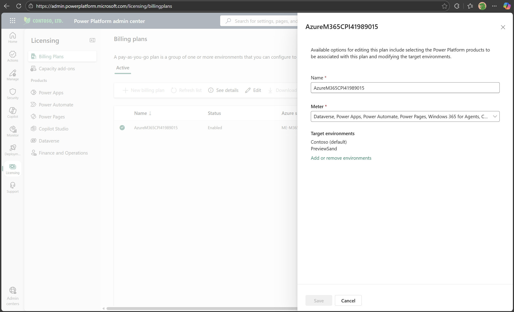
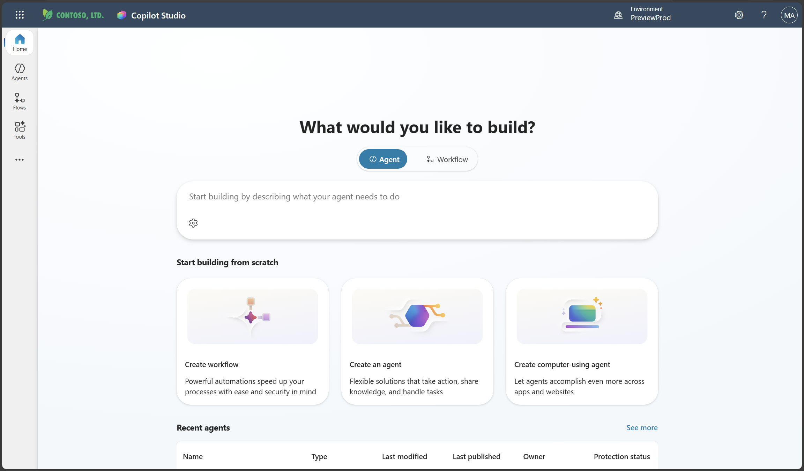
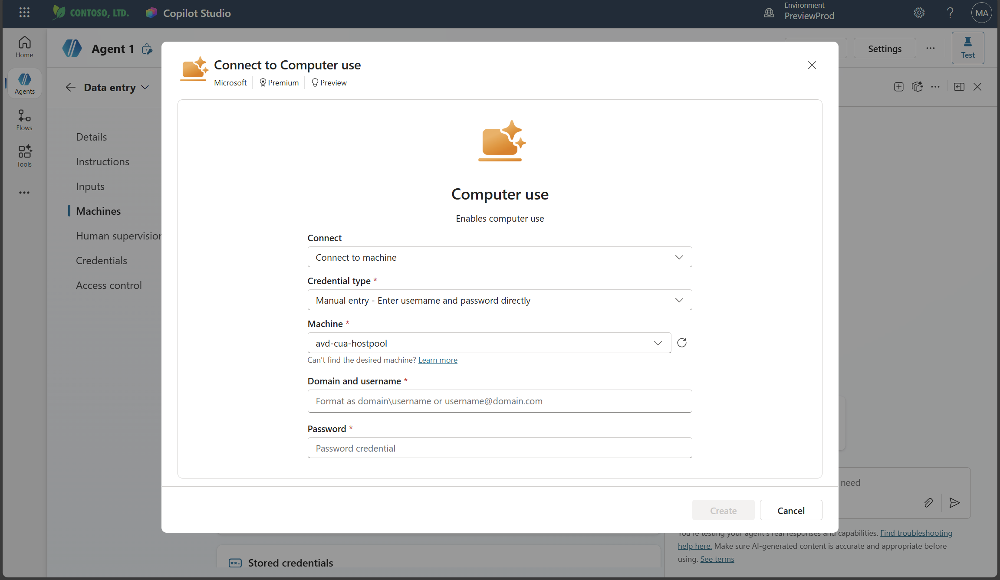

# Cloud PC Pool Setup
> [MS Learn: Use Cloud PC pool for computer use runs](https://learn.microsoft.com/en-us/microsoft-copilot-studio/use-cloud-pc-pool#create-a-cloud-pc-pool)

## Licensing Requirements
> [MS Learn: Power Platform PAYG setup](https://learn.microsoft.com/en-us/power-platform/admin/pay-as-you-go-set-up)
1. Licensing > Pay-as-you-go plans > Billing Plans: New billing plan

2. Power Platform environment: Pay-As-You-Go with Azure


## Prerequisites
```powershell
# Azure CLI: check your tenant and subscription
az login
```

### Enable Microsoft Entra authentication for RDP and hide consent prompt dialog
> [MS Learn: Enable Microsoft Entra authentication for RDP and hide consent prompt dialog](https://learn.microsoft.com/en-gb/microsoft-copilot-studio/use-cloud-pc-pool#enable-microsoft-entra-authentication-for-rdp-and-hide-consent-prompt-dialog)

#### 1. [MS Learn: Enable Microsoft Entra authentication for RDP](https://learn.microsoft.com/en-us/azure/virtual-desktop/configure-single-sign-on#enable-microsoft-entra-authentication-for-rdp)

```powershell
# 1-1. Microsoft Graph에 로그인
Import-Module Microsoft.Graph.Authentication
Import-Module Microsoft.Graph.Applications
# Microsoft Graph Command Line Tools
Connect-MgGraph -Scopes "Application.Read.All","Application-RemoteDesktopConfig.ReadWrite.All"

# 1-2. 대상 AppID(=Microsoft Remote Desktop Application)의 Service Principal ID 조회
$RDPAppId = "a4a365df-50f1-4397-bc59-1a1564b8bb9c"
$RDPspId = (Get-MgServicePrincipal -Filter "AppId eq '$RDPAppId'").Id

# 1-3. RemoteDesktopSecurityConfiguration 생성 및 활성화
If ((Get-MgServicePrincipalRemoteDesktopSecurityConfiguration -ServicePrincipalId $RDPspId) -ne $true) {
    Update-MgServicePrincipalRemoteDesktopSecurityConfiguration `
        -ServicePrincipalId $RDPspId `
        -IsRemoteDesktopProtocolEnabled
}

# 1-4. 정상적으로 적용되었는지 확인
Get-MgServicePrincipalRemoteDesktopSecurityConfiguration -ServicePrincipalId $RDPspId
```
```powershell
# expected output
# Id IsRemoteDesktopProtocolEnabled
# -- ------------------------------
# id True
```

#### 2. [MS Learn: Hide the Consent Prompt Dialog (Silent SSO)](https://learn.microsoft.com/en-us/azure/virtual-desktop/configure-single-sign-on#hide-the-consent-prompt-dialog)

##### 2-1. 세션 호스트를 포함하는 Dynamic Group 생성: Microsoft Entra admin center
> [MS Learn: Create or update a dynamic membership group in Microsoft Entra ID](https://learn.microsoft.com/en-us/entra/identity/users/groups-create-rule)


- group object id, display name 기록

```powershell
# 2-2. PowerShell에서 TargetDeviceGroup 객체 생성
$tdg = New-Object -TypeName Microsoft.Graph.PowerShell.Models.MicrosoftGraphTargetDeviceGroup
$tdg.Id = "<group object id>"
$tdg.DisplayName = "<group display name>"

# 2-3. 해당 TargetDeviceGroup을 SSO Service Principal에 적용
New-MgServicePrincipalRemoteDesktopSecurityConfigurationTargetDeviceGroup -ServicePrincipalId $RDPspId -BodyParameter $tdg
```
```powershell
# expected output
# Id                                   DisplayName
# --                                   -----------
# <your group object id>               <your group display name>
```

#### 3. [MS Learn: Windows 365 Cloud PC and Azure Virtual Desktop service principal](https://learn.microsoft.com/en-gb/microsoft-copilot-studio/use-cloud-pc-pool#windows-365-cloud-pc-and-azure-virtual-desktop-service-principal)

##### 3-1. Check if the Windows 365 service principal exists:
- Sign in to the Azure portal.
- Go to Microsoft Entra > Enterprise applications > All applications.
- Remove the filter Application type == Enterprise Applications.
- Enter the Windows 365 application ID 0af06dc6-e4b5-4f28-818e-e78e62d137a5 in the filter Application ID starts with.
- If the service principal exists in your Microsoft Entra, you don't need to perform any extra steps. If the application isn't listed, create the service principal.

##### 3-2. Create service principals
```powershell
# Windows 365 service principal
az ad sp create --id 0af06dc6-e4b5-4f28-818e-e78e62d137a5

# Azure Virtual Desktop
az ad sp create --id 9cdead84-a844-4324-93f2-b2e6bb768d07

# Azure Virtual Desktop Client
az ad sp create --id a85cf173-4192-42f8-81fa-777a763e6e2c

# Azure Virtual Desktop ARM Provider
az ad sp create --id 50e95039-b200-4007-bc97-8d5790743a63
```

## Create a Cloud PC pool
### If you're new to Copilot Studio, review the following guidance to get started:

#### 1. Get access to Copilot Studio
#### 2. Create and deploy an agent
#### 3. Add computer use to your agent

### To create a Cloud PC pool for computer use in Copilot Studio:
> [MS Learn: Cloud PC Pool Video Guide](https://learn.microsoft.com/en-gb/microsoft-copilot-studio/use-cloud-pc-pool#cloud-pc-pools)
#### 1. Go to the Machines section in your computer use tool.
#### 2. Select the machine drop-down. Under the Cloud PC pool section, select Add new.

#### 3. Enter the Name and Description of your Cloud PC pool.
#### 4. Configure if you want to enable run-only access for all users in this environment.

#### 5. Select Create.
- Provisioning of Cloud PC pool can take up to 30 minutes to complete. You can select the Refresh button in the Machines section to check on the status of your Cloud PC pool provisioning.
#### 6. Connection

- user with appropriate authority for connection