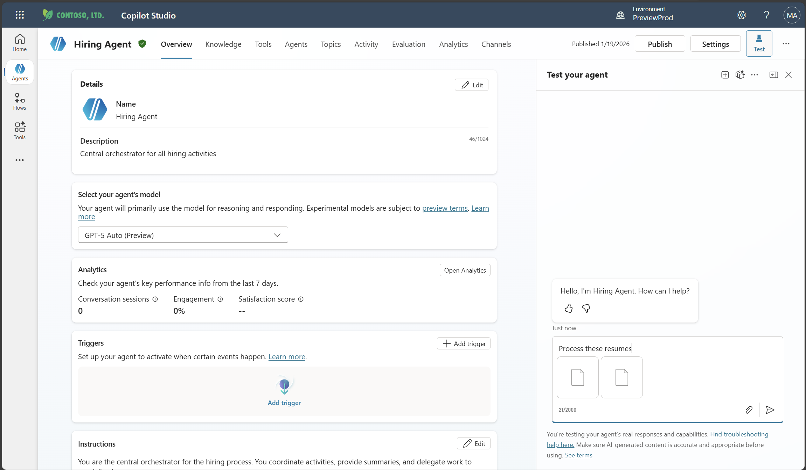
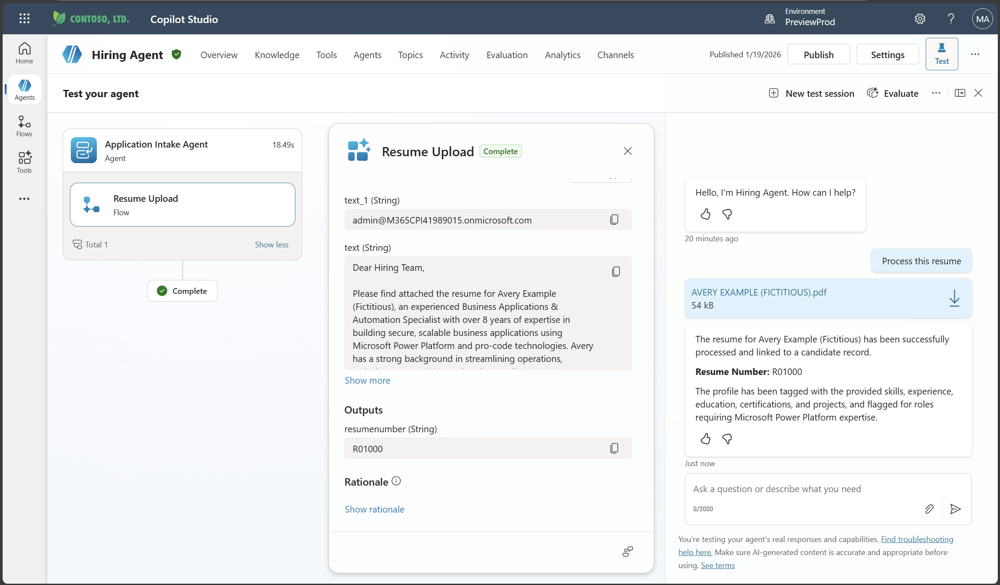
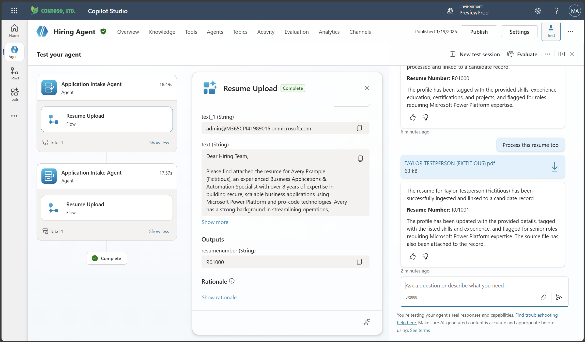
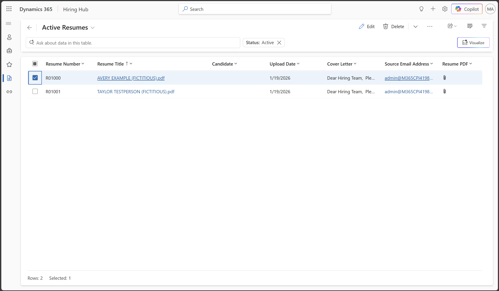
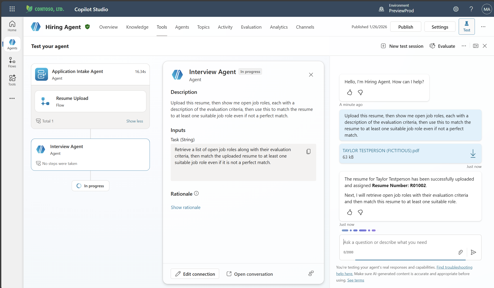

# 🚨 03: Multi-Agent Systems

## 🤖 Child Agents vs Connected Agents  
**Microsoft Copilot Studio — Multi-Agent Architecture (Table-Based README)**

Copilot Studio provides two primary patterns for building multi-agent systems:
**Child Agents** and **Connected Agents**.  
This README reorganizes the core differences into a clear, table-centered reference.

---

## 📊 1. High-Level Comparison

| Category | Child Agents | Connected Agents |
|---------|--------------|------------------|
| **Concept** | Lightweight sub-agents inside a parent agent | Fully independent agents that collaborate with others |
| **Analogy** | Specialized teams inside one department | Separate departments working together |
| **Location** | Lives *within* the parent agent | Exists as a standalone agent |
| **Independence** | Not independent (inherits parent workspace) | Fully independent configuration, logic, lifecycle |
| **Reusability** | Not reusable outside parent | Reusable across multiple solutions/agents |
| **Publishing** | No separate publishing required | Must be published before use |
| **ALM Lifecycle** | Shares parent agent’s ALM | Independent ALM per agent |
| **Ownership Model** | Single team ownership | Multiple teams owning separate agents |
| **Best Use Case** | Internal modularization | Cross-team reusable agent architecture |

---

## 📂 2. Technical Architecture Details

### 2.1 Configuration & Structure

| Aspect | Child Agents | Connected Agents |
|--------|--------------|------------------|
| **Configuration Page** | Single configuration page inside parent agent | Has its own standalone configuration page |
| **Tools Storage** | Stored on parent agent; availability toggled per child | Stored independently inside the agent |
| **Knowledge Sources** | Inherited from parent; selectively enabled | Held independently inside the agent |
| **Topics** | Shared with parent agent | Has its own isolated topic set |
| **Instruction Behavior** | Instructions may reference parent topics/tools | Instructions reference only the connected agent’s own resources |

---

### 2.2 Publishing & Testing

| Stage | Child Agents | Connected Agents |
|--------|--------------|------------------|
| **Publishing Required?** | No — publishing parent agent is enough | Yes — must publish before being used |
| **Testing Workflow** | Parent & child can be tested instantly in the same workspace | Changes require publishing before upstream agent can test |
| **Deployment Channels** | Inherited from parent | Has its own channels & authentication |

---

## 🎯 3. When to Use Each Approach

### 3.1 Child Agents — Recommended When

| Situation | Why Child Agents Fit |
|-----------|----------------------|
| A single team owns the entire solution | No need for independent lifecycle management |
| You want simple logical separation | Child agents provide modular organization |
| No separate deployment or authentication is needed | Uses parent’s configuration |
| Agents do not need to be reused elsewhere | Keeps architecture lightweight |

### Example Use Case (Child)
| Child Agent | Description |
|-------------|-------------|
| Password Reset Sub-Agent | Guides users step-by-step through password reset |
| Hardware Troubleshooting Sub-Agent | Handles laptop/PC diagnostics |
| Software Installation Sub-Agent | Provides installation instructions |

---

### 3.2 Connected Agents — Recommended When

| Situation | Why Connected Agents Fit |
|-----------|--------------------------|
| Different teams maintain different agents | Each agent has its own owner and lifecycle |
| Agents need separate authentication | Independent configuration per agent |
| You need reusable capabilities across solutions | A connected agent can be plugged into multiple parent agents |
| You want clean boundaries for ALM | Each agent can be versioned, deployed, and governed separately |

### Example Use Case (Connected)
| Connected Agent | Owning Team | Purpose |
|------------------|-------------|---------|
| Billing Agent | Finance Team | Billing & payment inquiries |
| Technical Support Agent | Product Engineering | Diagnostic and tech support |
| Returns/Logistics Agent | Operations | Managing returns and shipping workflows |

---

## 🧠 4. Key Technical Notes

### 4.1 Child Agents — Technical Notes

| Property | Details |
|----------|---------|
| Topic Access | Child agents can reference and use parent topics |
| Tool Access | Tools live on the parent agent; enabled per child |
| Knowledge Access | Same as tools — controlled by “Available to” mapping |
| Deployment | No separate publication needed |

---

### 4.2 Connected Agents — Technical Notes

| Property | Details |
|----------|---------|
| Topic Isolation | Each connected agent has its own independent topics |
| Testing Requirements | Must publish before used by caller |
| Version Control | Each connected agent can be updated independently |
| Reusability | Can be connected by multiple parent agents |

---

## 🔀 5. Mixed Strategy (Hybrid Architecture)

| Component | Recommended Pattern | Reason |
|-----------|---------------------|--------|
| Internal procedural modules | **Child agents** | Lightweight, simple to manage |
| Cross-department systems (e.g., billing, HR) | **Connected agents** | Each domain team maintains their own agent |
| Shared enterprise capability (reusable chatbot) | **Connected agent** | Can be consumed by many main agents |

**Example Hybrid Setup**
- Main Customer Service Agent  
  → Has internal child agents for FAQ or simple tasks  
  → Connects to Billing Agent (Finance team)  
  → Connects to Technical Support Agent (Engineering team)

---

## 📚 Summary (One Table to Rule Them All)

| Dimension | Child Agents | Connected Agents |
|-----------|--------------|------------------|
| Ownership Model | Single Team | Multiple Teams |
| Independence | Low | High |
| Reusability | No | Yes |
| Publishing Requirement | Not needed | Required |
| ALM Lifecycle | Parent-shared | Independent |
| Topic Model | Shared with parent | Fully isolated |
| Where Tools Live | Parent | Inside agent |
| Best For | Internal modular structure | Enterprise-scale multi-agent architecture |
| Example | Sub-agents inside IT Helpdesk | Billing / Returns / Product Support |

# 🧪 Lab 3.1: Child Agent - Adding Application Intake Agent

# 🧪Lab 3.2: Connected Agent - Adding Interview Prep agent

