# 🚨 07: Extracting Resume Contents with Multimodal Prompts
> [Agent Academy Course Site](https://microsoft.github.io/agent-academy/operative/07-multimodal-prompts/)

## Copilot Studio AI Capabilities: AI Prompts

### 🤖 Copilot Studio AI Capabilities: AI Prompts

#### 📌 Why this matters

AI Prompt는 Copilot Studio에서 모델에게 특정 목적의 작업을 정확하게 시키는 핵심 구성 요소
Hiring Agent 시나리오에서는 첨부된 Resume 파일을 이해하고 JSON 형태로 구조화하는 핵심 기능을 수행해.

#### Additional Information

*   Copilot Studio의 Prompt는 Orchestrator와 별도로 동작하며, 특정 입력(/document, /text 등)을 바탕으로 LLM을 호출해 결과를 리턴함.
*   대부분의 문서 → 구조화 정보 추출 시나리오는 Temperature 0으로 설정해야 안정적인 필드 추출이 가능함.
*   Prompt는 에이전트에게 직접 도구처럼 노출할 수도 있고, Agent Flow 내부에서 전처리 → LLM 호출 → 후처리 형태로 조합해서 더 정교한 파이프라인을 구성할 수도 있음.

### AI Prompts vs Orchestrator

| 요소                   | 역할                                | 언제 사용?                     |
| -------------------- | --------------------------------- | -------------------------- |
| AI Prompt (Tool) | LLM을 직접 호출해 특정 작업 수행 (분석/요약/추출 등) | 문서 요약, JSON 추출, 지식 기반 생성 등 |
| Orchestrator     | 전체 에이전트의 대화 흐름을 관리하고 Tool을 선택해 호출 | “언제 Prompt를 호출해야 할지 결정”    |

- Prompt = 작업을 수행하는 AI  
- Orchestrator = 어떤 Tool을 호출할지 결정하는 AI

### 🧠 Understanding Multimodal Prompts

#### 📌 Why this matters

Resume 분석은 대부분 PDF 형식 문서를 기반으로 이루어지므로,  
LLM이 문서를 직접 이해하고 텍스트+이미지 형태의 input을 처리하는 능력이 매우 중요함.

#### Additional Information

*   Multimodal Prompt는 텍스트(input) + \*\*파일(input)\*\*을 함께 받아서 처리함.
*   Resume PDF는 내부적으로 base64 인코딩되어 전달되고, 모델이 이를 Vision 기반 문서 이해 기능을 통해 분석.

### ⚙️ Model selection in AI Builder

#### 📌 Why this matters

잘못된 모델 선택은 정보 추출 정확도 저하 → 잘못된 Dataverse 데이터 저장 → Agent 후속 처리 실패 로 이어짐.

#### Additional Information

*   Temperature는 "출력 일관성"을 좌우하는 핵심 파라미터.
*   Resume처럼 정확한 데이터 추출이 필요한 경우 → Temperature 0이 최적.
*   “Role 설명 생성”, “Cover letter 요약”처럼 창의적 요약이 필요한 경우는 0.3\~0.5 사용 고려.
*   모델은 LLM Routing을 통해 시스템이 적절한 엔진으로 요청을 보낼 수도 있지만,
    Prompt Tool에서는 직접 선택하는 것이 더 안정적임.

> https://learn.microsoft.com/en-gb/microsoft-copilot-studio/prompt-model-settings
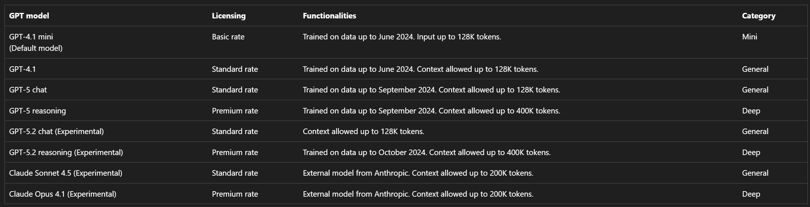
#### Temperature settings
Temperature controls how creative or predictable your AI responses are:
- Temperature 0: Most predictable, consistent results (document analysis: best for data extraction)
- Temperature 0.5: Balanced creativity and consistency
- Temperature 1: Maximum creativity (best for content generation)

## 🧪 Hands-on: Building a resume extraction system
### Create a multimodal prompt
#### 📌 Why this matters

이 단계에서 생성하는 Prompt는 Resume 분석 전체 파이프라인의 중심부야.  
이 Prompt가 잘 설계되어야 후속 작업(Dataverse 기록, Candidate 생성)도 정확함.

#### 🧠 Technical Deep Dive

*   `/document` 입력은 binary → 모델 인코딩 → Vision/Document 분석 파이프라인을 통함.
*   `/text`는 단순 자연어 텍스트 입력 → LLM direct 처리.
*   Prompt 내부에서 JSON 출력 스키마 정의는 Agent Flow에서 후처리하는 데 반드시 필요.

#### ⚠️ 실무에서 자주 발생하는 문제

*   JSON 스키마 누락 → Flow에서 “Generated Json child object is null” 오류 발생.
*   파일 입력을 “File or image content”가 아닌 string으로 넣으면 실패.
*   PDF가 스캔본이면 텍스트 추출 정확도 저하 → Tesseract OCR 기반 보정 필요할 수 있음.

1. Copilot Studio > Tools > New Tool > Prompt
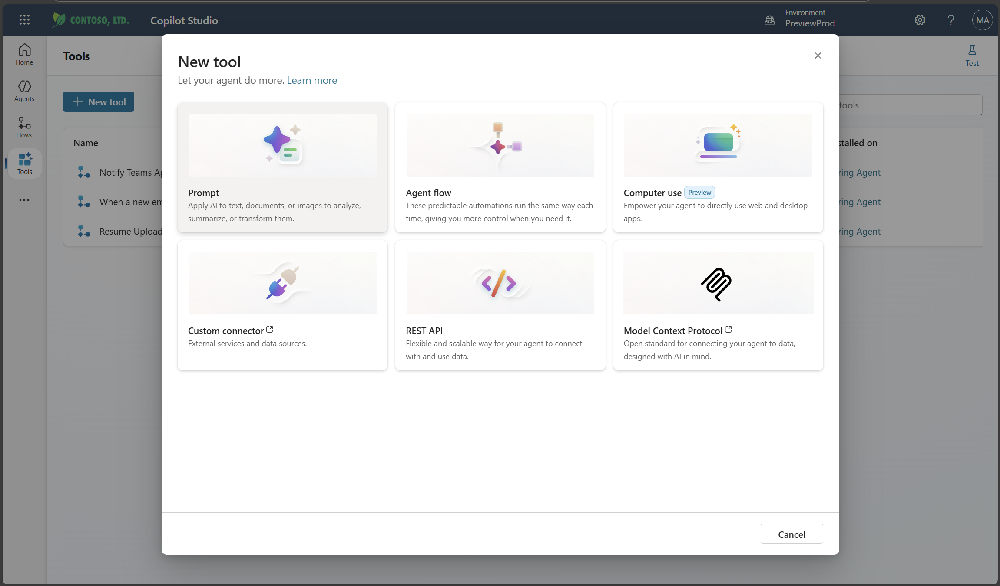
2. Settings
- Name: Summarize Resume
- Instructions:
    ```text
    You are tasked with extracting key candidate information from a resume and cover letter to facilitate matching with open job roles and creating a summary for application review.

    Instructions:
    1. Extract Candidate Details:
        - Identify and extract the candidate’s full name.
        - Extract contact information, specifically the email address.
    2. Create Candidate Summary:
        - Summarize the candidate’s profile as multiline text (max 2000 characters) with the following sections:
            - Candidate name
            - Role(s) applied for if present
            - Contact and location
            - One-paragraph summary
            - Experience snapshot (last 2–3 roles with outcomes)
            - Key projects (1–3 with metrics)
            - Education and certifications
            - Top skills (Top 10)
            - Availability and work authorization

    Guidelines:
    - Extract information only from the provided resume and cover letter documents.
    - Ensure accuracy in identifying all details such as contact details and skills.
    - The summary should be concise but informative, suitable for quick application review.

    Resume: /document
    CoverLetter: /text
    ```
- configure input parameters
    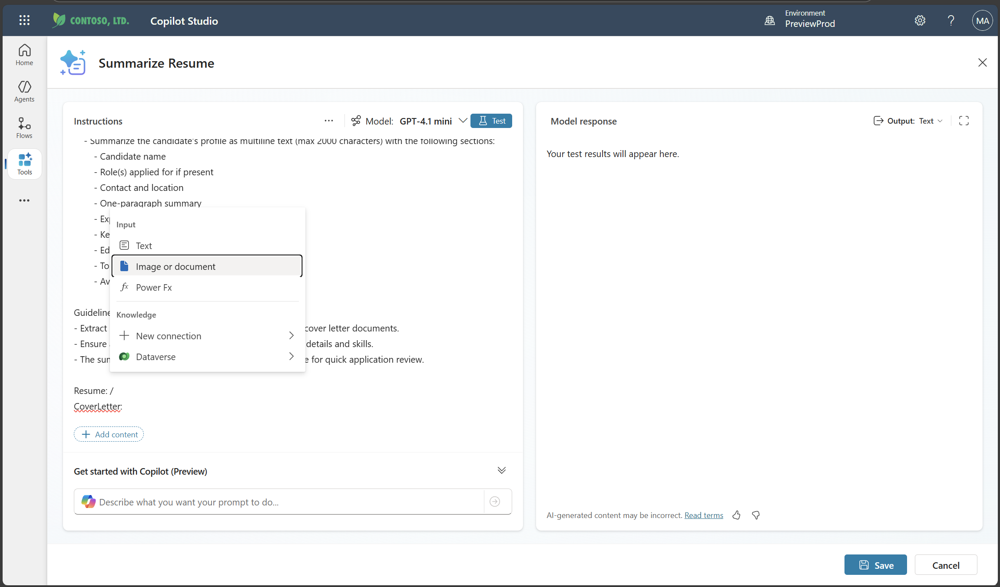
    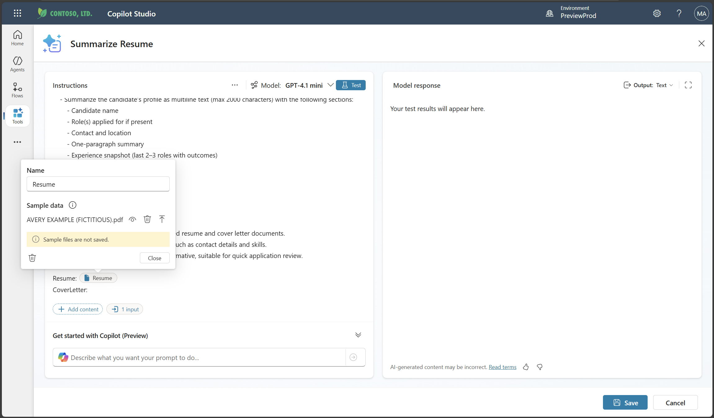
    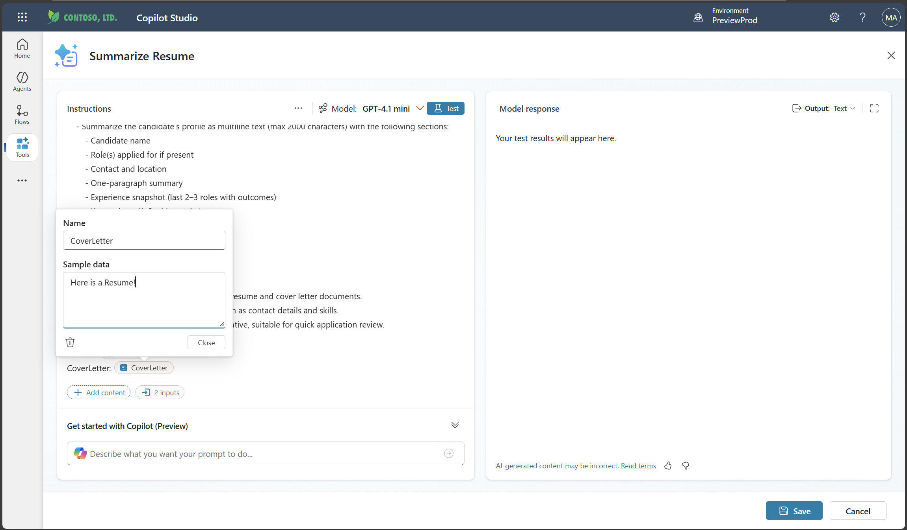
3. Select Test to see the initial text output from your prompt.
    

### Configure JSON output
> [When to use JSON?](https://microsoft.github.io/agent-academy/operative/07-multimodal-prompts/#%F0%9F%93%8A-output-formats-text-vs-json)

#### 📌 Why this matters

Agent Flow는 LLM 결과를 그대로 문자열로 처리하지 못함.  
Dataverse 업데이트, Candidate 존재 확인, branching에 JSON 객체 처리가 반드시 필요함.

#### 🧠 Technical Deep Dive

*   Prompt는 JSON을 “string으로 반환”하지만, Copilot Studio가 structuredOutput으로 자동 파싱.
*   “See more → body/responsev2/predictionOutput/structuredOutput” 형태로 접근하는 이유:
    *   Copilot Studio가 예측 출력 구조를 predictionOutput 노드에 표준화해서 저장하기 때문.


1. add JSON format specification on prompt instructions
    ```text
    Output Format:
    Provide the output in valid JSON format with the following structure:
    {
    "CandidateName": "string",
    "Email": "string",
    "Summary": "string max 2000 characters",
    "Skills": [{"item": "Skill 1"}, {"item": "Skill 2"}],
    "Experience": [{"item": "Experience 1"}, {"item": "Experience 2"}]
    }
    ```
2. test > verify output is formatted as JSON
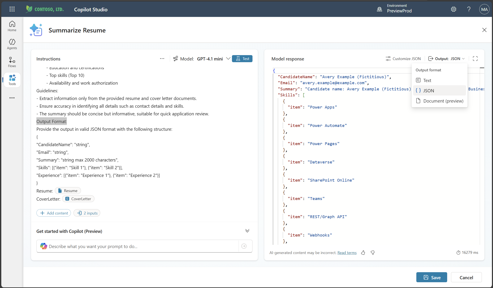
3. Select Save to create the prompt.
- Configuration for "Add to an Agent": select Cancel
    - why? We'll use this prompt in an Agent Flow rather than directly as a tool: more control over the data processing workflow

### Add prompt to an Agent Flow

#### 📌 Why this matters

Prompt를 Agent Flow로 감싸면:

*   Dataverse에서 Resume PDF 조회
*   파일 다운로드
*   LLM 호출
*   JSON-based 후처리

이 모든 로직을 거대한 함수처럼 묶어 재사용할 수 있음.

#### 🧠 Technical Deep Dive

*   Flow 입력(\[ResumeNumber]) → Dataverse Filter Query로 record 조회
*   이때 Filter Query 구문은 OData 형식이며 eq 'value' 로 검색해야 함
*   파일 다운로드는 Dataverse의 File Column API를 호출해 원본 binary stream을 가져오는 과정

1. Hiring Agent > (child) Application Intake Agent
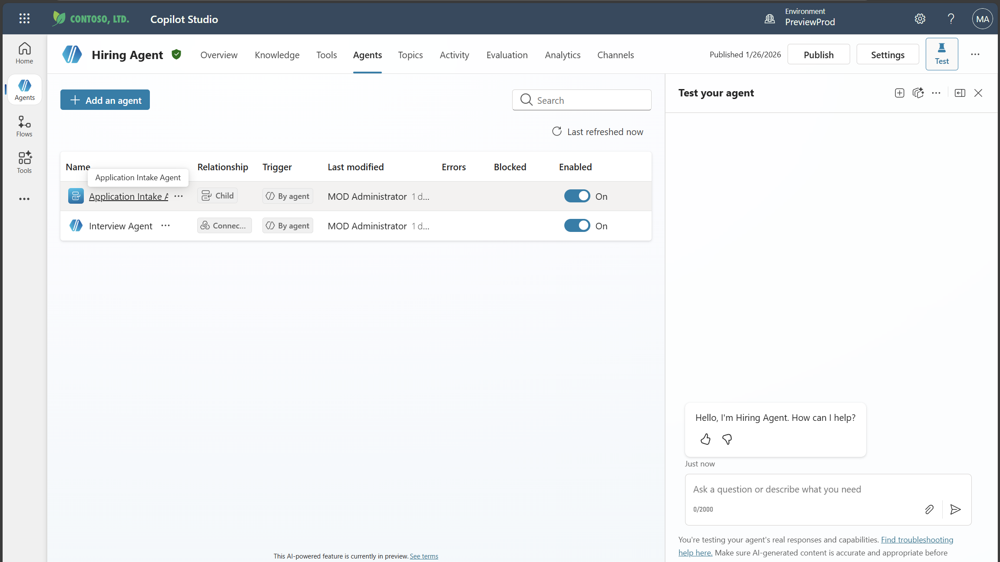
2. Tools > Add a Tool > Agent Flow
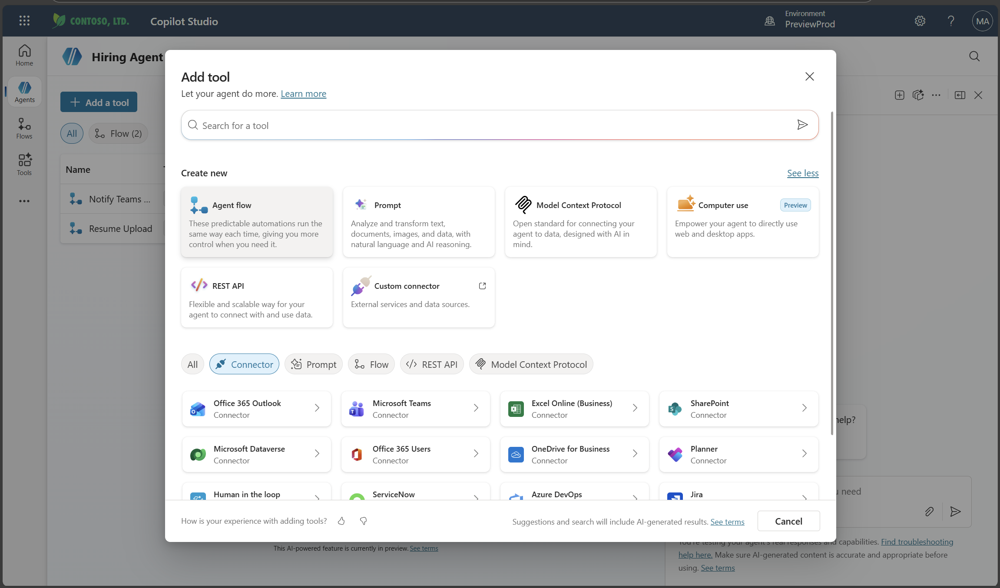
3. When an agent calls the flow node > Add an input
- type: Text
- name: ResumeNumber
- description: 	Be sure to use [ResumeNumber]. This must always start with the letter R
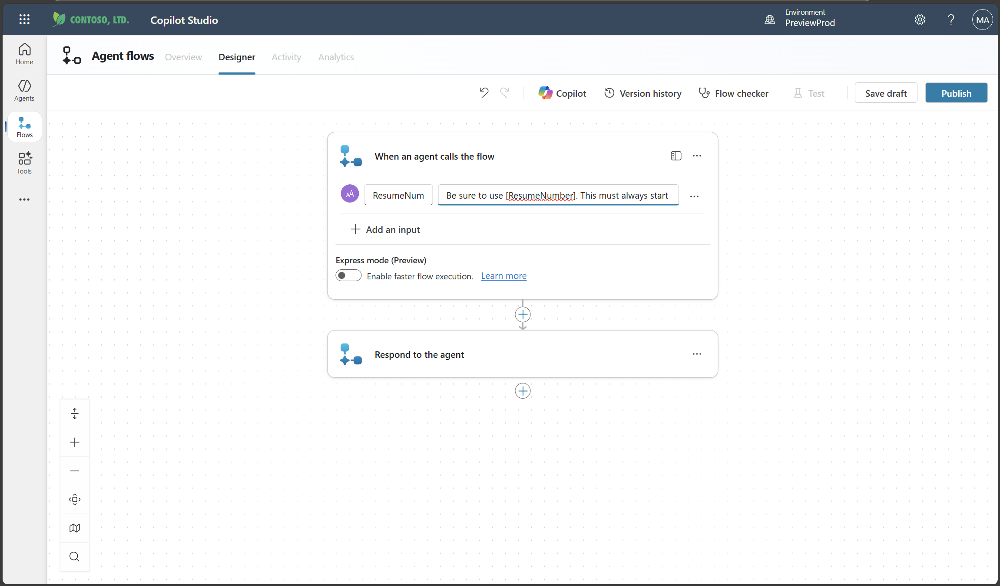
4. Add an Action > Microsoft Dataverse: List rows
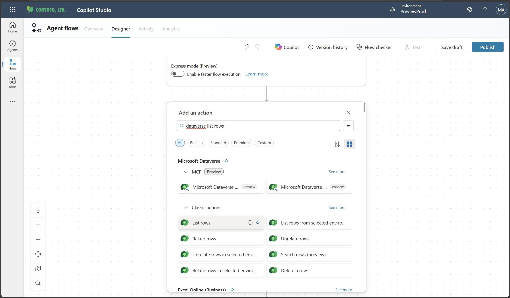
5. list rows action
- rename: Get Resume Record
- Table name: Resumes
- Filter rows: ppa_resumenumber eq 'ResumeNumber'
    - Dynamic data (thunderbolt icon): Replace ResumeNumber with When an agent calls the flow → ResumeNumber
- Row count: 1
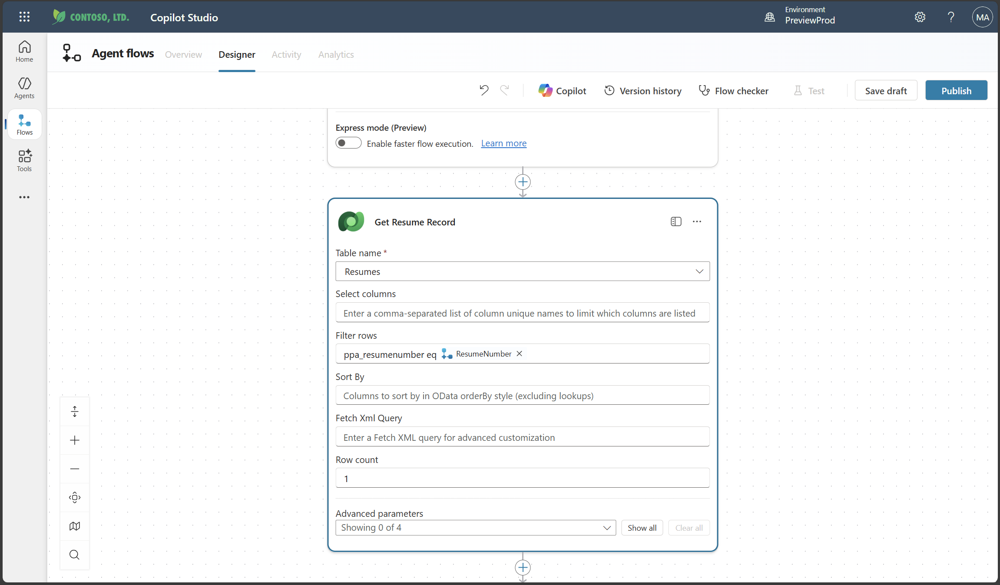
6. Add an Action > Microsoft Dataverse: Download a file or an image
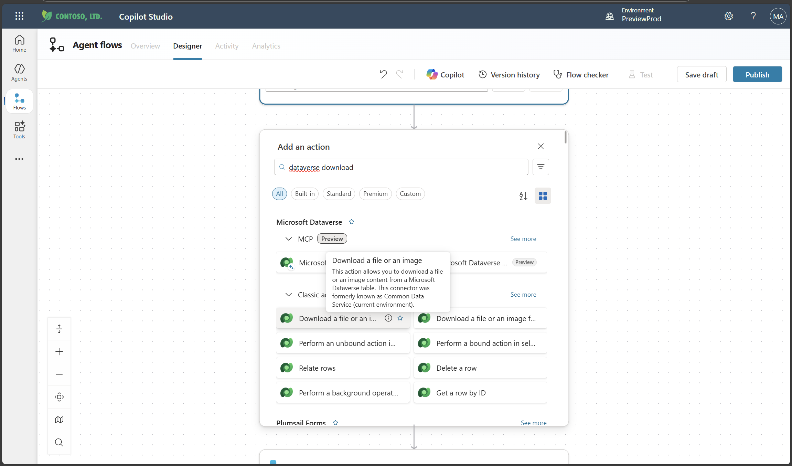
- rename: Download Resume
- Table name: Resumes
- Row ID: first(body('Get_Resume_Record')?['value'])?['ppa_resumeid']
    - Expression (fx icon)
- Column name: Resume PDF
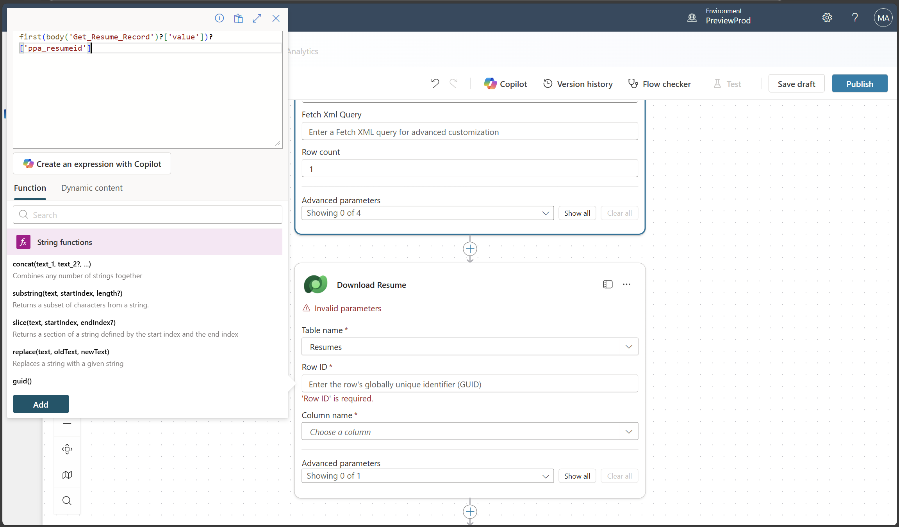
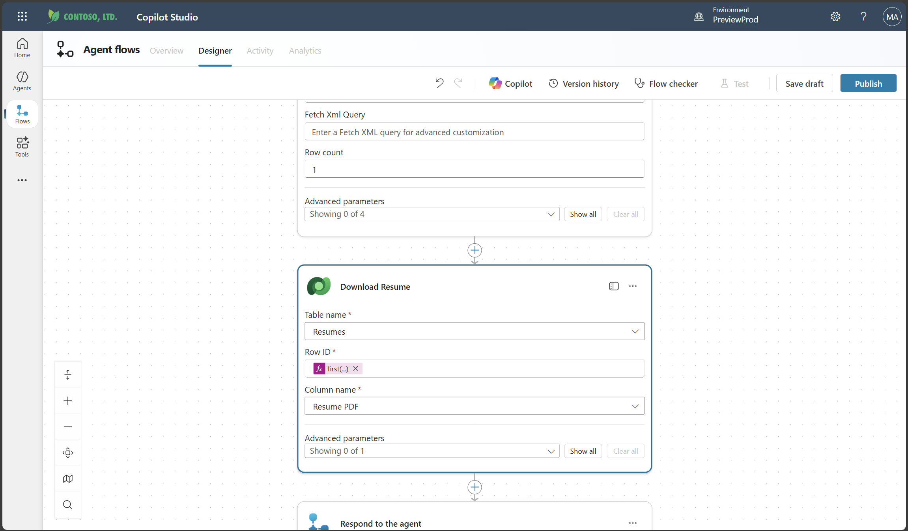

7. Add an Action > AI Capabilities > Run a prompt
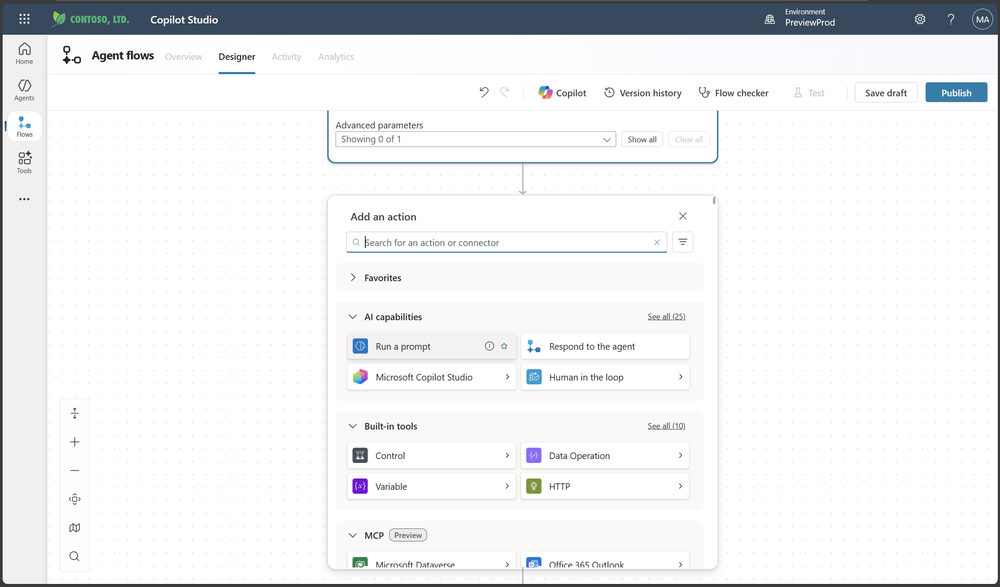
- rename: Summarize Resume
- Prompt: Summarize Resume
- CoverLetter: first(body('Get_Resume_Record')?['value'])?['ppa_coverletter']
    - Expression (fx icon)
- Resume: Download Resume → File or image content
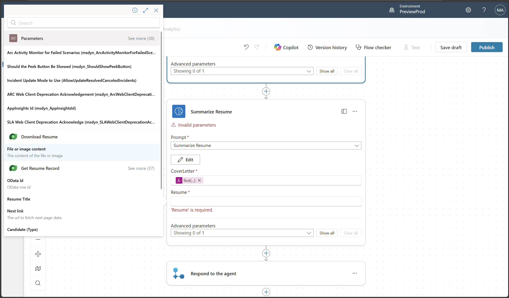
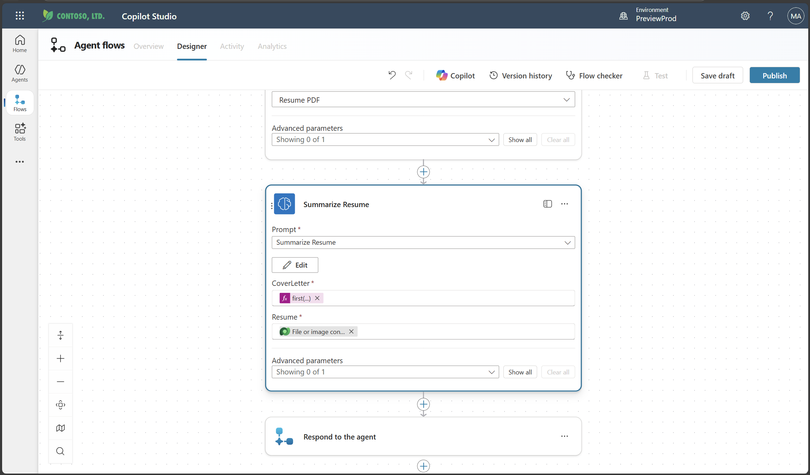

### Create candidate record
> take the information that the Prompt gave you and create a new candidate record if it doesn't already exist

#### 📌 Why this matters

Resume를 처리한 뒤 Candidate DB에 반영해야  
이후 Agent가 "지원자 상태 조회/연락/매칭" 같은 후속 기능을 수행할 수 있음.

#### 🧠 Technical Deep Dive

*   Candidate Email은 “unique 자연스러운 primary key" 역할을 함 → 중복 생성 방지
*   length(body/value) 로 existing 여부 확인하는 패턴은 Dataverse record 존재 여부 판별 표준 패턴
*   Add row vs update row를 정확히 구분해야 데이터 충돌이 없음

1. Add an Action > Microsoft Dataverse: List rows
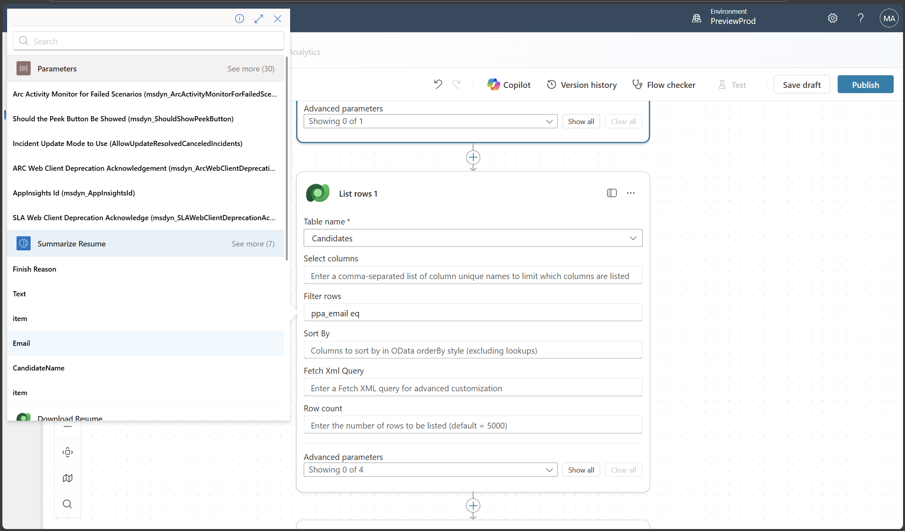
- rename: Get Existing Candidate
- Table name: Candidates
- Filter rows: ppa_email eq 'Email'
    - Dynamic data (thunderbolt icon): Replace Email with Summarize Resume → Email
- Row count: 1
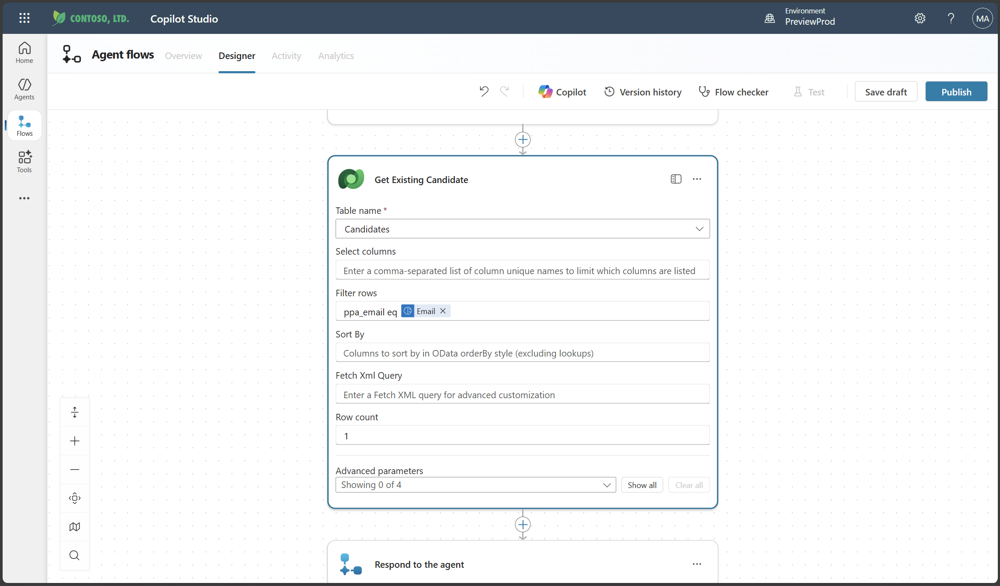
2. Add an Action > Control: Condition
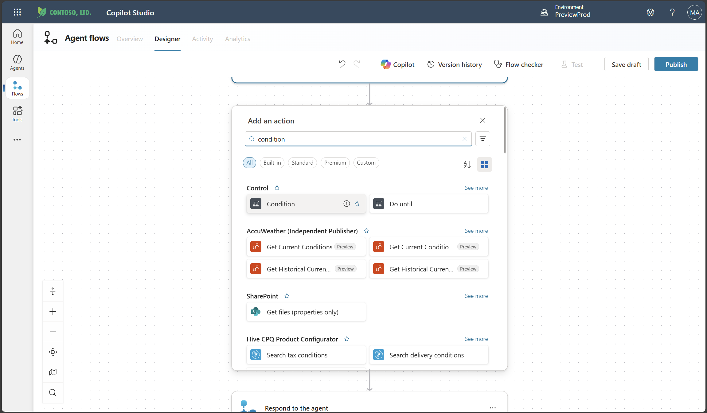
- condition: length(outputs('Get_Existing_Candidate')?['body/value'])
    - expression (fx icon)
- operator: is equal to
- val: 0
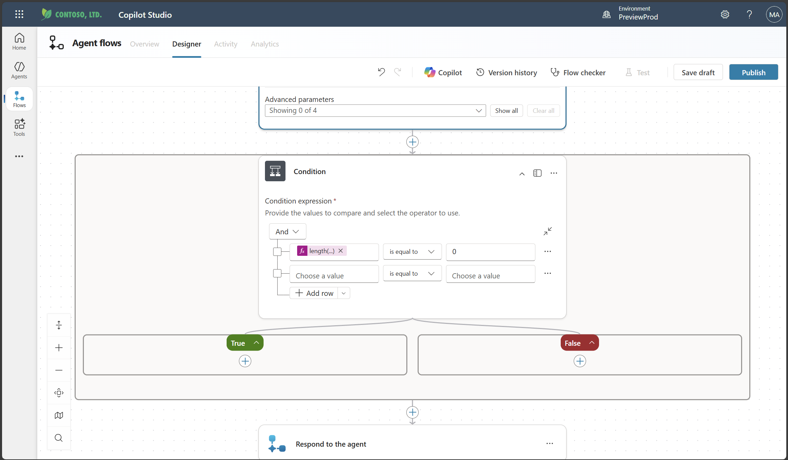
3. True branch: Insert Action > Microsoft Dataverse: Add a new row
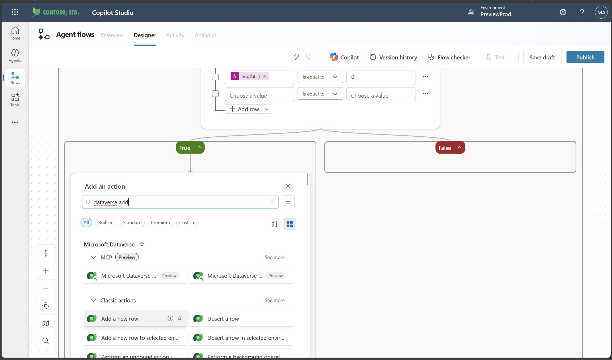
- rename: Add a New Candidate
- Table name: Candidates
- Candidate Name: Summarize Resume → CandidateName
    - Dynamic data (thunderbolt icon)
- Email: Summarize Resume → Email
    - Dynamic data (thunderbolt icon)
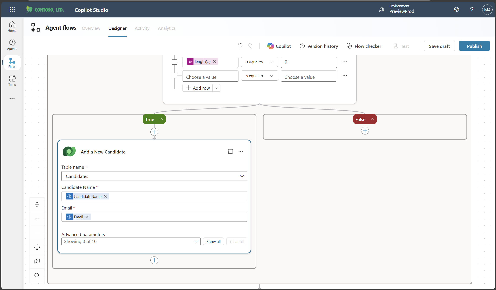

### Update resume and configure flow outputs

#### 📌 Why this matters

*   Resume와 Candidate는 관계(Relationship)를 가짐  
    → Resume 레코드 업데이트 시 Candidate ID를 연결하여 Hiring Hub에서 end‑to‑end 데이터 추적 가능.

#### 🧠 Technical Deep Dive

*   Candidate lookup 업데이트 시 concat('ppa\_candidates/', GUID) 형태를 사용하는 이유:
    *   Dataverse는 lookup 업데이트에서 `"table/recordId"` 경로 형태를 요구함.
*   Prompt의 JSON 결과는 ResumeSummary에 그대로 저장 → 향후 Agent 응답에 재사용됨.

1. Insert Action > Microsoft Dataverse: Update a row
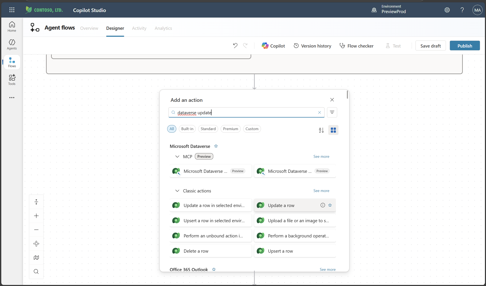
- rename: Update Resume
- Table name: Resumes
- Row ID: first(body('Get_Resume_Record')?['value'])?['ppa_resumeid']
    - Expression (fx icon)
- Summary: Summarize Resume → Text
    - Dynamic data (thunderbolt icon)
- Candidate (Candidates): concat('ppa_candidates/',if(equals(length(outputs('Get_Existing_Candidate')?['body/value']), 1), first(outputs('Get_Existing_Candidate')?['body/value'])?['ppa_candidateid'], outputs('Add_a_New_Candidate')?['body/ppa_candidateid']))
    - Expression (fx icon)
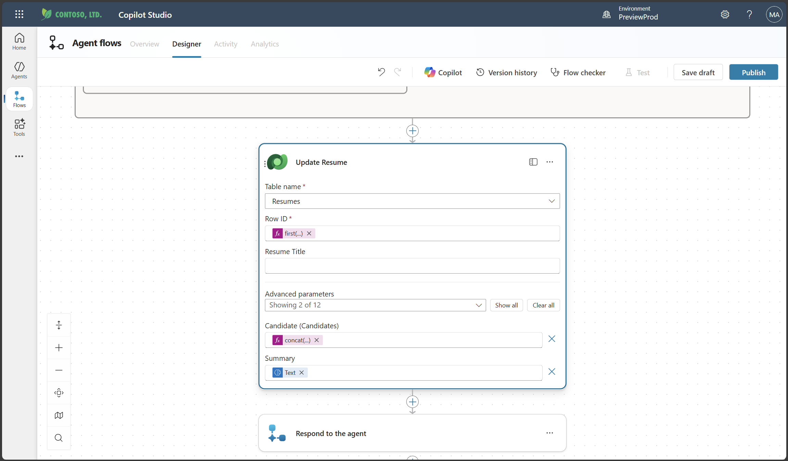
2. Respond to the agent node: add an output
- CandidateName: Summarize Resume → See more → CandidateName
    - Dynamic data (thunderbolt icon)
    - description: The [CandidateName] given on the Resume
- CandidateEmail: Summarize Resume → See more → Email
    - Dynamic data (thunderbolt icon)
    - description: The [CandidateEmail] given on the Resume
- CandidateNumber: if(equals(length(outputs('Get_Existing_Candidate')?['body/value']), 1), first(outputs('Get_Existing_Candidate')?['body/value'])['ppa_candidatenumber'], outputs('Add_a_New_Candidate')?['body/ppa_candidatenumber'])
    - Expression (fx icon)
    - description: The [CandidateNumber] of the new or existing candidate
- ResumeSummary: Summarize Resume → See more → body/responsev2/predictionOutput/structuredOutput
    - Dynamic data (thunderbolt icon)
    - description: The resume summary and details in JSON form
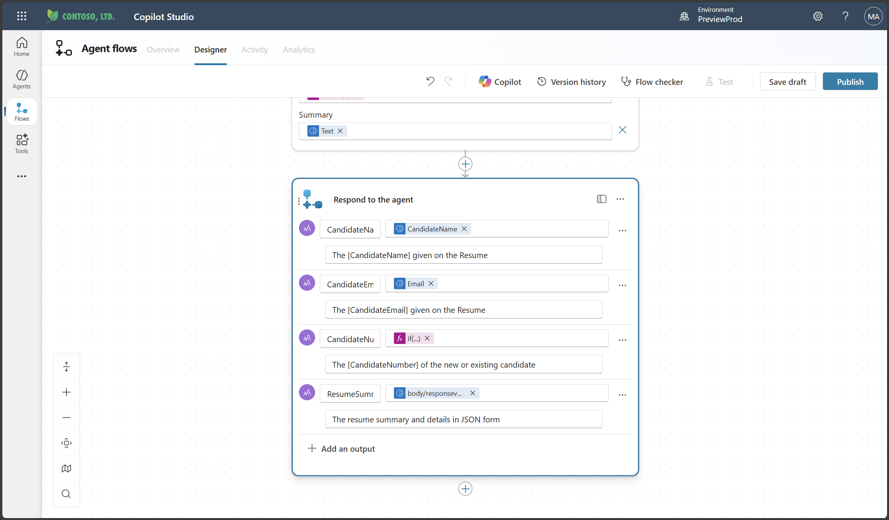
3. save draft

4. Overview tab > Edit: Details panel > Save
- Flow name: Summarize Resume
- Description: Summarize an existing Resume stored in Dataverse using a [ResumeNumber] as input, return the [CandidateNumber], and resume summary JSON
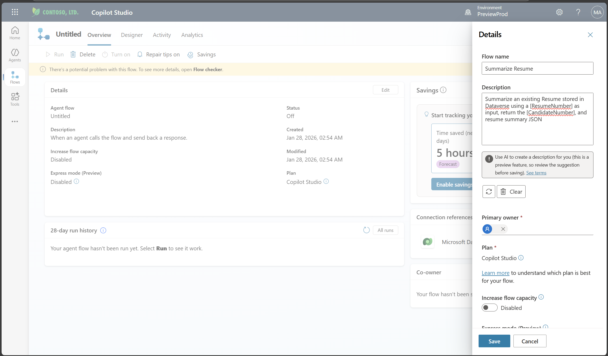
5. Designer tab > Publish
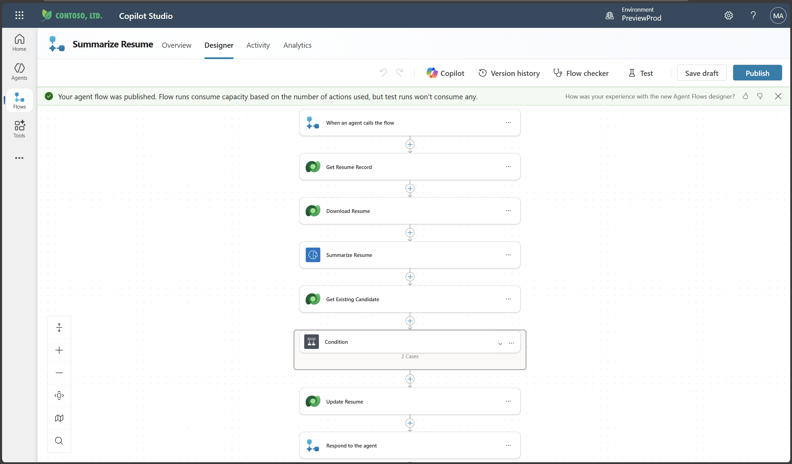

### Connect the flow to your agent

#### 📌 Why this matters

이 단계에서 Flow는 실제 Agent 도구로 등록되고, Orchestrator는 ResumeNumber가 필요할 때 자동으로 호출함.

#### 🧠 Technical Deep Dive

*   “Only when referenced by topics or agents”는  
    → Orchestrator가 불필요하게 Tool을 탐색 호출하지 않도록 제한하는 설정.
*   Child Agent(Application Intake)는 Parent Agent(Hiring Agent)의 Tool을 상속받음.

1. Open your Hiring Agent inside Copilot Studio
2. Select the Agents tab, and open the Application Intake Agent
3. Select the Tools panel, and Select + Add a tool > Flow > Summarize Resume (Agent Flow) > Add and Configure
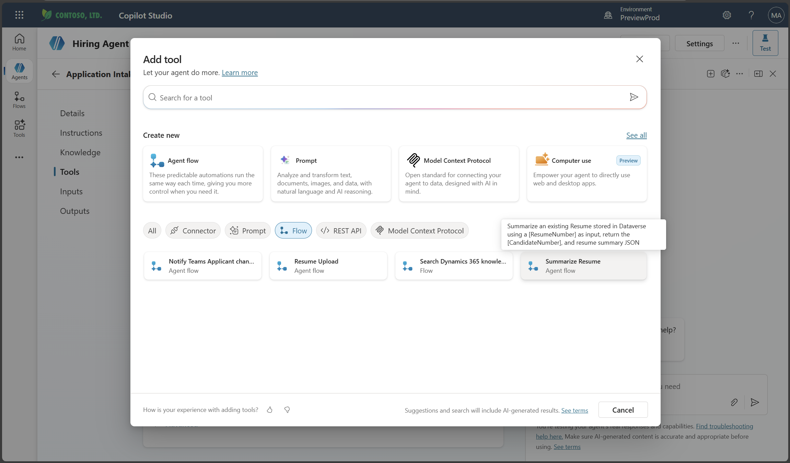
4. Configure tool settings > Save
- Description: Summarize an existing Resume stored in Dataverse using a [ResumeNumber] as input, return the [CandidateNumber], and resume summary JSON
- When this tool may be used: Only when referenced by topics or agents
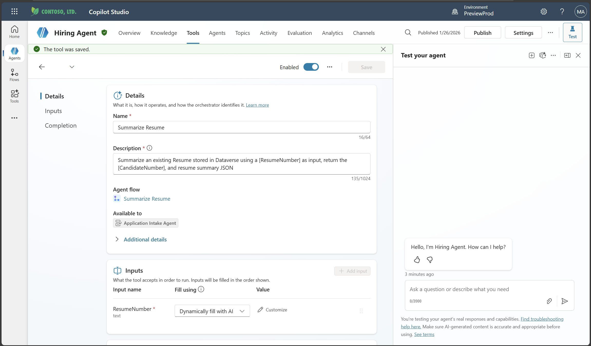
- If you select Tools inside the Hiring Agent, you will now see Resume Upload & Summarize Resume tools are both usable by the Application Intake Agent.
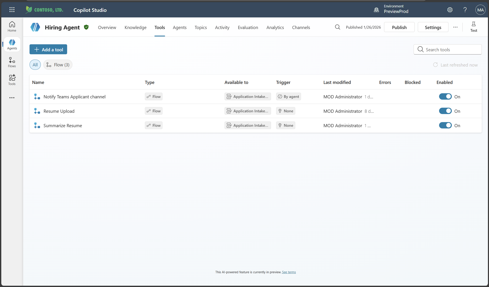
5. Application Intake Child agent > Instructions > remove the two paragraphs that begin with:
- 2. Post-Upload
- Process for Resume Upload via Email
6. Append the following instructions on to the remaining instructions > save
```text
2. Post-Upload Processing  
    - After uploading, be sure to also output the [ResumeNumber] in all messages
    - Pass [ResumeNumber] to /Summarize Resume  - Be sure to use the correct value that will start with the letter R.
    - Be sure to also output the [CandidateNumber] in all messages
    - Use the [ResumeSummary] to output a summary of the processed Resume and candidate
```
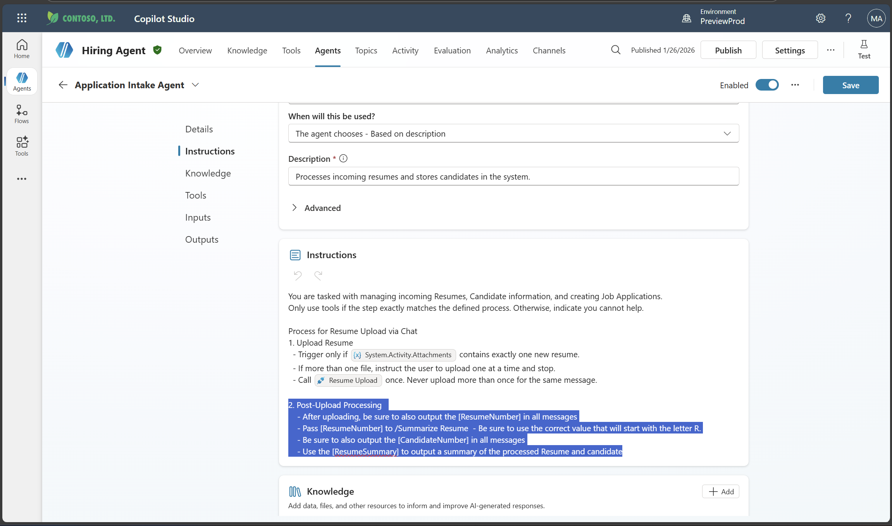
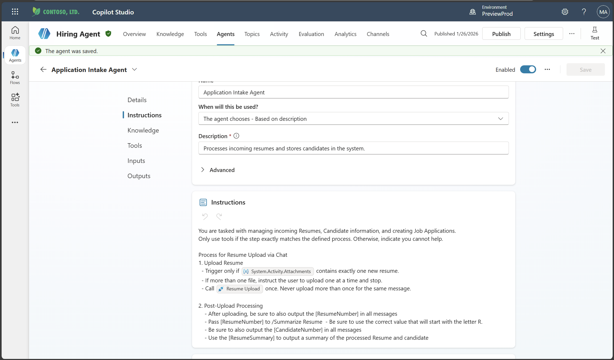

### Test Agent

#### 📌 Why this matters

실서비스에서 가장 잘 터지는 부분이 Resume 업로드 → Flow 실패 → JSON null 오류 → Candidate record 누락.

#### 🧠 Technical Deep Dive

*   Activity map은 세부 단계를 보여주는 trace 시스템  
    → LLM 호출 시 input/output 비교 가능
*   Dataverse 기록 검증을 통해 end-to-end 파이프라인이 정상인지 확인

1. send sample resume pdf with prompt "Here is a candidate Resume"
2. Verify the results:
- check that you receive a Resume Number (format: R#####)
- Verify you get a Candidate Number and summary
- Use the activity map to see both the Resume upload tool and Summarize Resume tool in action, and the outputs of the Summary Prompt are received by the agent
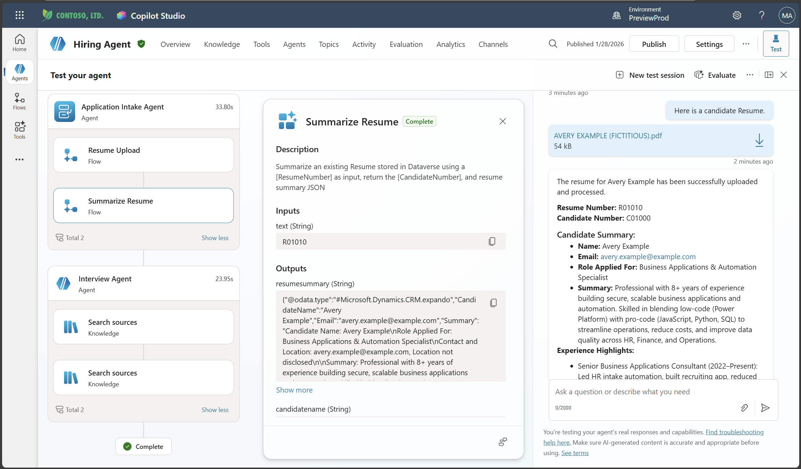
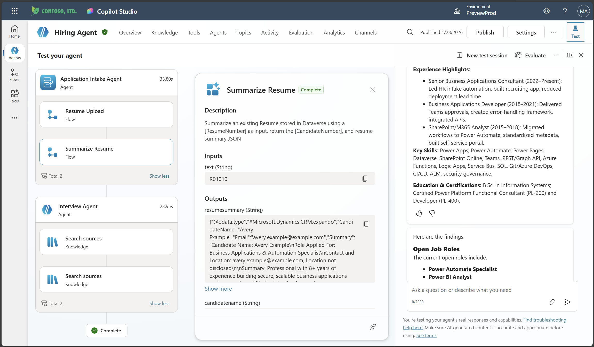
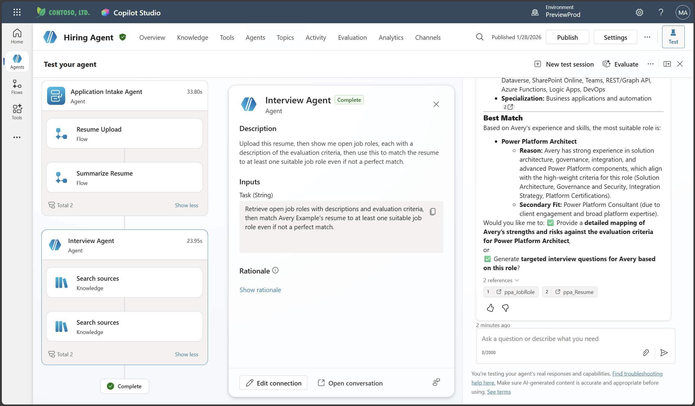
3. Check data persistence
- Navigate to Power Apps
- Open Apps → Hiring Hub → Play
- Go to Resumes to verify the resume was uploaded and processed. It should have both summary information and an associated candidate record.
- Check Candidates to see the extracted candidate information
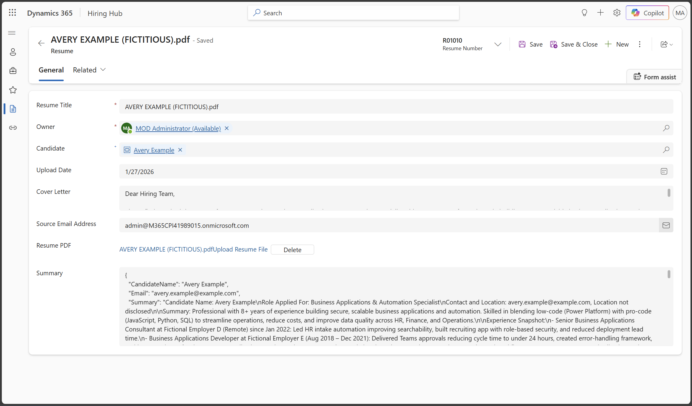