# 🚨 08: Enhanced prompts with Dataverse grounding
> [Agent Academy Course Site](https://microsoft.github.io/agent-academy/operative/08-dataverse-grounding/)

- Dataverse Grounding: 프롬프트에 라이브 데이터 주입
    - 프롬프트 실행 시 Dataverse 테이블/열/연관 테이블을 선택해 필요 데이터만 컨텍스트로 자동 주입. 변경되는 평가 기준/역할 정의를 프롬프트 수정 없이 반영.
    - 왜 중요한가: 규정/상품/역할이 자주 바뀌는 환경에서 일관성·정확성을 유지하고 운영 비용을 낮춘다.

### 📊 Dataverse Grounding (개념 소개용)

#### 📌 Why this matters

Dataverse Grounding은 프롬프트 실행 시 라이브 데이터를 자동으로 주입하는 기능.  
현업에서는 Job Role 기준, 정책 변경, 역할/스킬 정의가 수시로 바뀌기 때문에:

*   Prompt를 계속 수정할 필요가 없음
*   데이터 변경이 바로 반영되어 운영 비용 절감
*   잘못된 프롬프트 컨텍스트로 인한 오류 감소
*   Prompt가 “사실 기반 grounding 정보”를 즉시 활용함

이러한 장점 때문에 대규모 운영 환경에서 LLM 안정성과 일관성을 보장하는 핵심 기능.

#### 🧠 Technical Deep Dive

*   Dataverse Grounding 사용 시 프롬프트는 “/data” 입력을 자동으로 받음.
*   Agent는 Tools→Prompt 실행 시 Dataverse 테이블 column, relationship을 선택하여 해당 데이터를 prompt context에 자동 삽입.
*   Grounding은 RAG(Retrieval-Augmented Generation) 패턴 중 하나지만,  
    인덱싱이나 검색을 거치지 않고 Dataverse의 구조화 데이터를 직접 전달한다는 점이 다름.
*   Prompt에서 “규칙, 평가 기준, 역할 정의”를 하드코딩하지 않기 때문에 복잡한 Prompt 업데이트 없이 운영 가능.

👉 단, 이번 Hands-on에서는 Dataverse Grounding을 사용하지 않음!  
대신 Job Application Agent Flow를 직접 구성하는 작업만 진행.

## 🧪 Hands-on: Job Application Agent Flow

### Add Job Application Agent Flow
> https://microsoft.github.io/agent-academy/operative/08-dataverse-grounding/#_8-4-add-job-application-agent-flow

#### 📌 Why this matters

이 Flow는 Hiring 프로세스의 핵심 단계인 “Job Application 생성”을 Agent가 자동으로 수행하도록 만드는 기능이야.  
ResumeNumber + JobRoleNumber를 입력받아 Job Applications 테이블에 레코드를 생성함.

*   Resume → Candidate
*   Candidate + JobRole → Job Application  
관계를 Dataverse에 자동으로 연결하는 핵심 로직.

#### 🧠 Technical Deep Dive

*   ResumeNumber(R#####) & JobRoleNumber(J#####)는 “비즈니스 키(Business Key)” 역할.
*   List Rows(OData) 필터로 정확한 레코드를 조회해야 Application 생성이 가능.
*   Flow 내부의 Add row에서 `concat('table/', GUID)` 패턴은 Dataverse lookup 기본 규칙.
*   utcNow()는 Dataverse의 datetime 형식으로 자동 변환됨.

#### 📌 Why this matters

Job Application 생성 전 반드시 두 정보를 확인해야 한다:

1.  Resume → Candidate Id 추출
2.  Job Role → Job Role Id 추출

이 두 값이 없으면 Job Application record를 생성할 수 없음.

#### 🧠 Technical Deep Dive

*   List Rows는 항상 배열을 반환하므로 `first(body()?['value'])` 패턴으로 단일 레코드 접근
*   Filter Query는 정확히 OData 형식이어야 함
        ppa_resumenumber eq 'R12345'
*   Row count = 1 을 지정하면 성능 최적화 + 의도 명확해짐

#### 📌 Why this matters

이 단계에서 실제 Job Application 레코드가 생성됨.  
생성된 ApplicationNumber(A#####)는 이후의 모든 Applicant tracking에 필요함.

#### 🧠 Technical Deep Dive

*   Lookup 필드는 GUID 값만으로 업데이트 불가 → “table/GUID” 형태 필요
*   Candidates lookup을 채우기 위해 Resume에서 `_ppa_candidate_value` 가져옴
*   모든 항목을 Flow에서 조합함으로써 Prompt Grounding 없이도 end-to-end Job Application 프로세스가 가능함

#### 📌 Why this matters

Agent에게 ApplicationNumber를 반환해줘야  
사용자가 어떤 Job Application이 생성되었는지 알 수 있고,  
다음 대화 흐름에서도 참조 가능함.

#### 🧠 Technical Deep Dive

*   Flow Output은 Agent에서 “structured tool output”으로 활용됨
*   Agent는 이 값을 사용해 후속 응답, 요약, 확인 요청을 자동 생성함
*   Value 접근 경로:
        Add Application → See More → Application Number

1. Hiring Agent > Agents tab > Application Intake Agent child agent > Tools panel > Add > New tool → Agent Flow
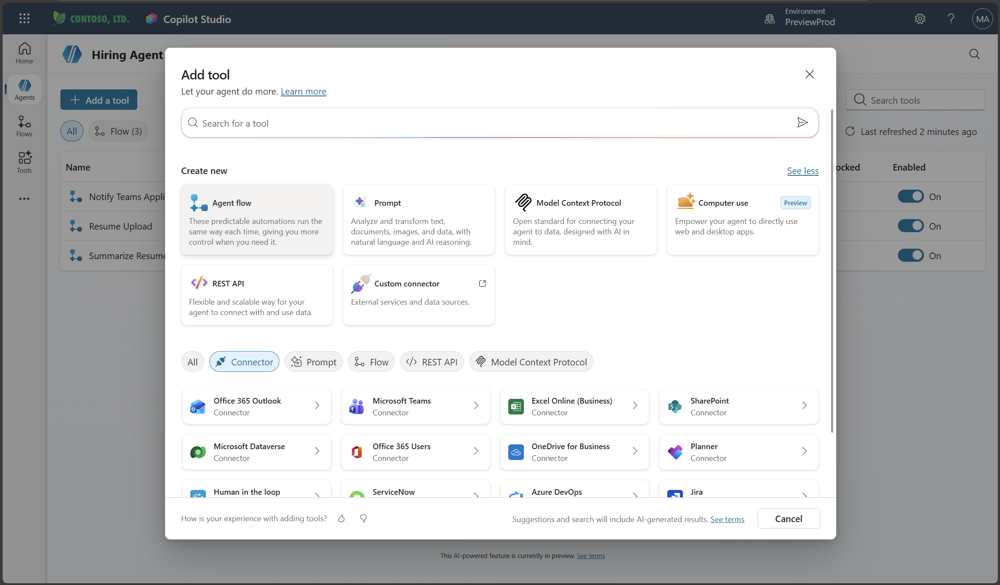
2. Select the When an agent calls the flow node, use + Add an input to add the following parameter:
- ResumeNumber
    - Be sure to only use the [ResumeNumber] - it MUST start with the letter R
- JobRoleNumber
    - Be sure to only use the [JobRoleNumber] - it MUST start with the letter J
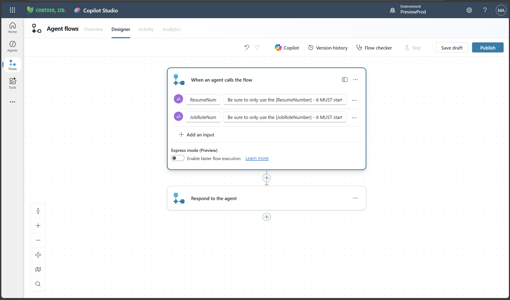
3. Dataverse: List Rows
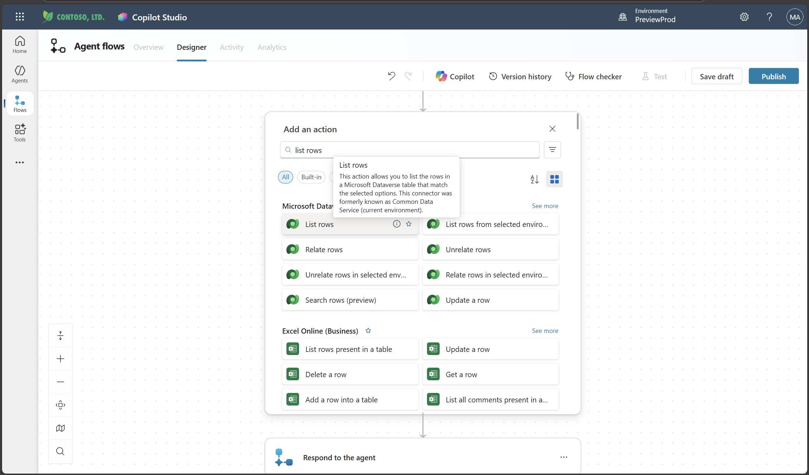
- rename: Get Resume
- Table name: Resumes
- Filter rows: ppa_resumenumber eq 'ResumeNumber'
    - Dynamic data (thunderbolt icon): When an agent calls the flow → ResumeNumber
- Row count: 1
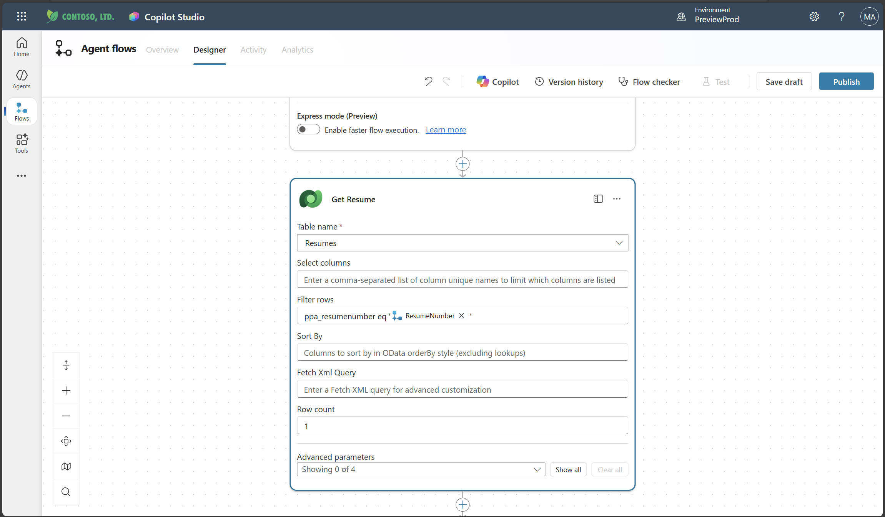
3. Dataverse: List Rows
- rename: Get Job Role
- Table name: Job Roles
- Filter rows: ppa_jobrolenumber eq 'JobRoleNumber'
    - Dynamic data (thunderbolt icon): When an agent calls the flow → JobRoleNumber
- Row count: 1
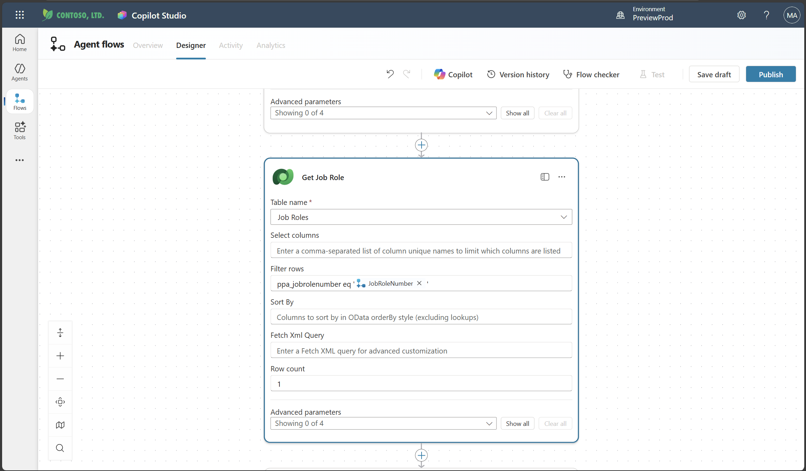
4. Dataverse: Add a new row
- rename: Add Application
- Table name: Job Applications
- Candidate (Candidates): concat('ppa_candidates/',first(outputs('Get_Resume')?['body/value'])?['_ppa_candidate_value'])
    - Expression (fx icon)
- Job Role (Job Roles): concat('ppa_jobroles/',first(outputs('Get_Job_Role')?['body/value'])?['ppa_jobroleid'])
    - Expression (fx icon)
- Resume (Resumes): concat('ppa_resumes/', first(outputs('Get_Resume')?['body/value'])?['ppa_resumeid'])
    - Expression (fx icon)
- Application Date (use Show all): utcNow()
    - Expression (fx icon)
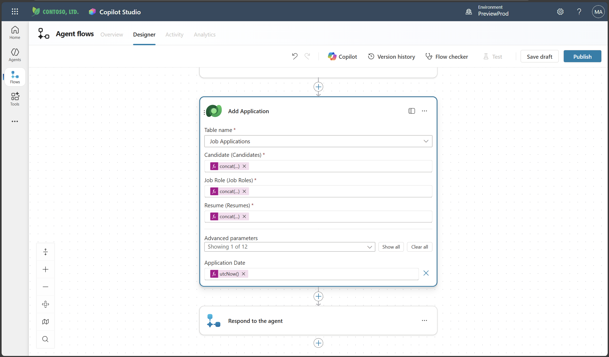
5. Respond to the agent node: add an output > Save Draft
- Name: ApplicationNumber
- Value: Add Application → See More → Application Number
    - Dynamic data (thunderbolt icon)
- Description: The [ApplicationNumber] of the Job Application created
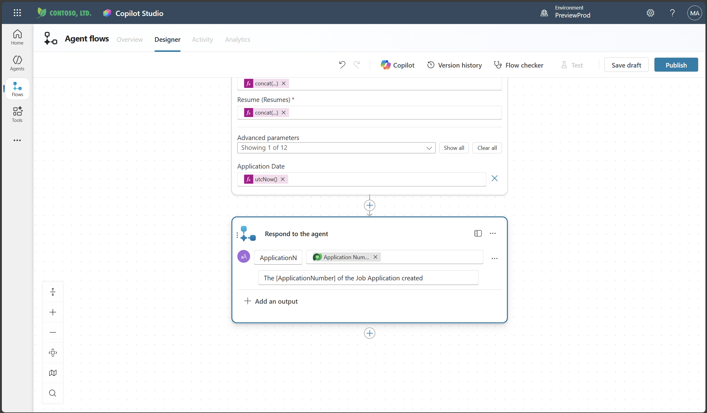
6. Overview Tab: edit > Publish
- Flow name: Create Job Application
- Description: Creates a new job application when given [ResumeNumber] and [JobRoleNumber]
Save
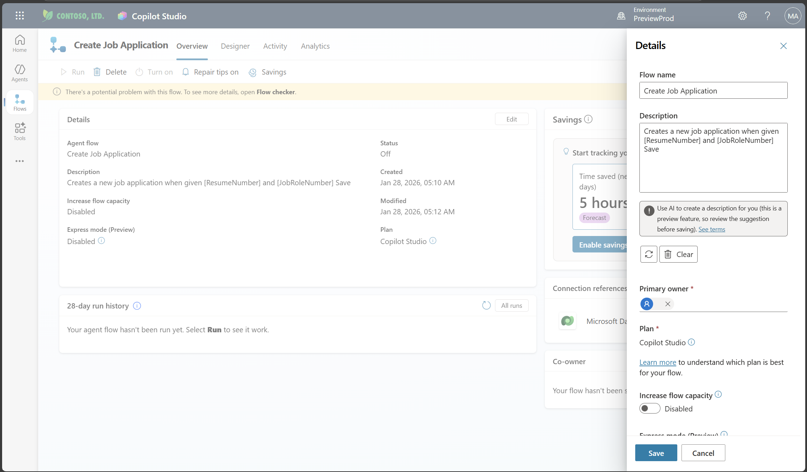
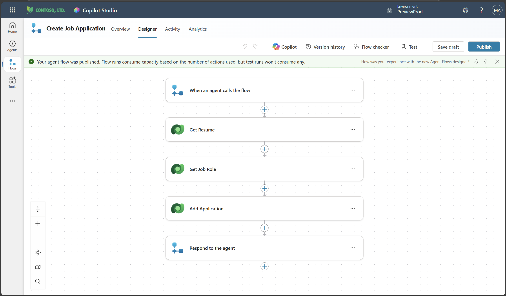

### Add Create Job Application to agent

#### 📌 Why this matters

Flow를 Agent에 연결해야  
사용자의 자연어 요청을 Orchestrator가 이해하고 Flow를 자동 호출할 수 있음.

#### 🧠 Technical Deep Dive

*   “Only when referenced by topics or agents” 설정은  
    Orchestrator가 임의로 Flow를 호출하지 않도록 제한
*   Child Agent는 Parent Agent의 도구를 상속받음 (중복 등록 필요 없음)

1. Hiring Agent > Agents tab > Application Intake Agent > Tools panel > Add
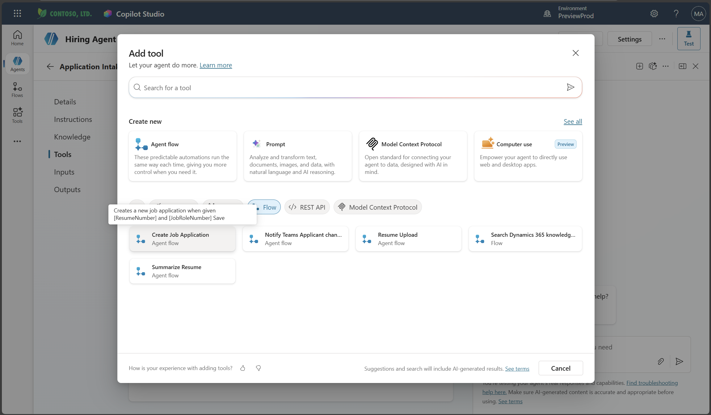
2. Create Job Application flow > Add and configure
- Description: Creates a new job application when given [ResumeNumber] and [JobRoleNumber]
- Additional details → When this tool may be used: Only when referenced by topics or agents
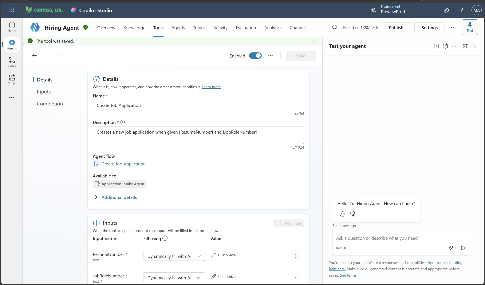

### Define agent instructions
#### 📌 Why this matters

Agent는 ResumeSummary 기반으로 SuggestedJobRoles를 분석하고,  
사용자의 선택(JobRoleNumber) 입력을 받아 Job Application을 생성함.

그러려면 Agent에게:

*   어떤 형식으로 JobRoleNumber를 제공해야 하는지
*   어떻게 Loop over 해야 하는지
*   어떤 규칙을 절대 지켜야 하는지

명확히 알려주어야 함.

#### 🧠 Technical Deep Dive

Strict Rules는 Orchestrator의 hallucination을 최소화하는 핵심 요소임:

*   identifier 포맷 규칙 강제 → 잘못된 ApplicationNumber 생성 방지
*   값 추론 금지 → 데이터 무결성(Data Integrity) 보호
*   항상 현재 context에서 값 추출 → stateful conversation 유지

1. Application Intake Agent > Instructions panel: add clear guidance for child agent > Save
```text
3. Post Resume Upload
   - Respond with a formatted bullet list of [SuggestedJobRoles] the candidate could apply for.  
   - Use the format: [JobRoleNumber] - [RoleDescription]
   - Ask the user to confirm which Job Roles to create applications for the candidate.
   - When the user has confirmed a set of [JobRoleNumber]s, move to the next step.

4. Post Upload - Application Creation
    - After the user confirms which [SuggestedJobRoles] for a specific [ResumeNumber]:
    E.g. "Apply [ResumeNumber] for the Job Roles [JobRoleNumber], [JobRoleNumber], [JobRoleNumber]
    E.g. "apply to all suggested job roles" - this implies use all the [JobRoleNumbers] 
     - Loop over each [JobRoleNumber] and send with [ResumeNumber] to /Create Job Application   
     - Summarize the Job Applications Created

Strict Rules (that must never be broken)
You must always follow these rules and never break them:
1. The only valid identifiers are:
  - ResumeNumber (ppa_resumenumber)→ format R#####
  - CandidateNumber (ppa_candidatenumber)→ format C#####
  - ApplicationNumber (ppa_applicationnumber)→ format A#####
  - JobRoleNumber (ppa_jobrolenumber)→ format J#####
2. Never guess or invent these values.
3. Always extract identifiers from the current context (conversation, data, or system output).
```
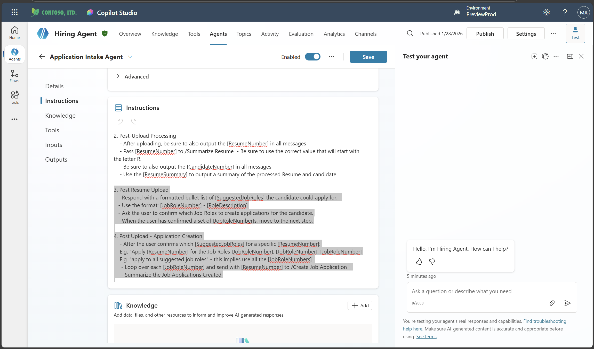
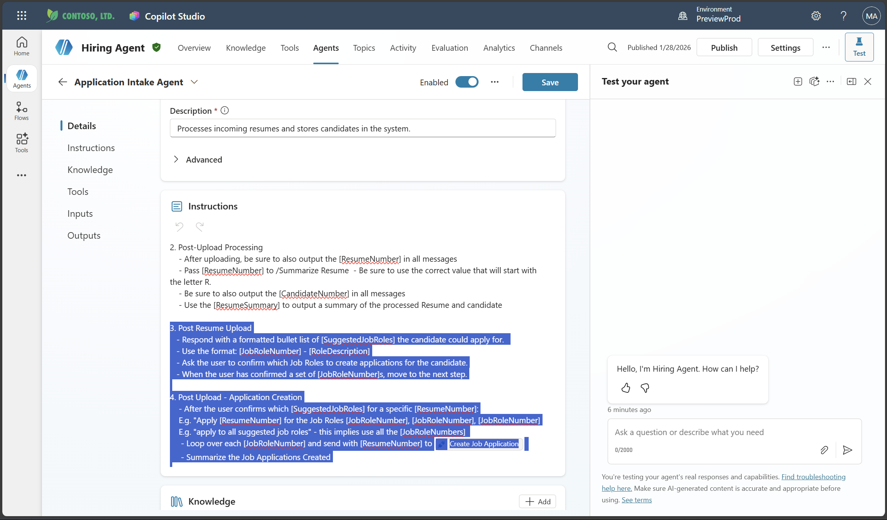

### Test your agent
#### 📌 Why this matters

Job Application 처리 파이프라인에서 가장 흔한 오류는:

❌ JobRoleNumber 매핑 실패  
❌ Candidate-Resume 관계 누락  
❌ Flow 호출 실패  
❌ Dataverse lookup path 오류

테스트를 통해 end-to-end 시나리오가 제대로 동작하는지 검증해야 함.

#### 🧠 Technical Deep Dive

*   SuggestedJobRoles는 부모 Agent(Hiring Agent)의 logic 기반으로 생성됨
*   Child Agent(Application Intake)는 사용자 선택을 받아 Flow 호출
*   Activity map으로 전체 체인을 시각적으로 확인 가능

1. Test prompt: This is a new resume for the Power Platform Developer Role. + sample resume file
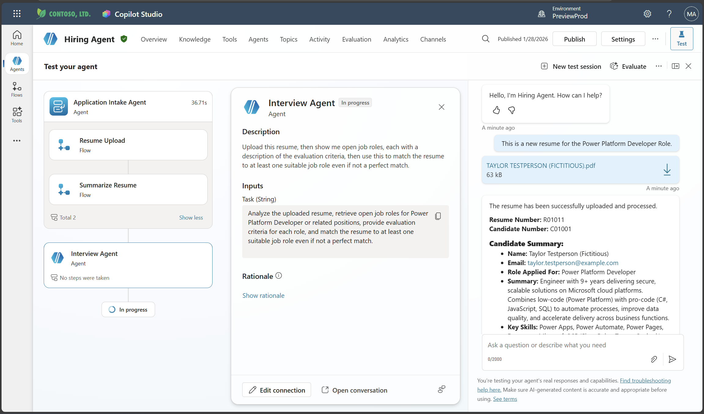
2. Notice how the agent provides a list of Suggested Job Roles - each with a Job Role number.
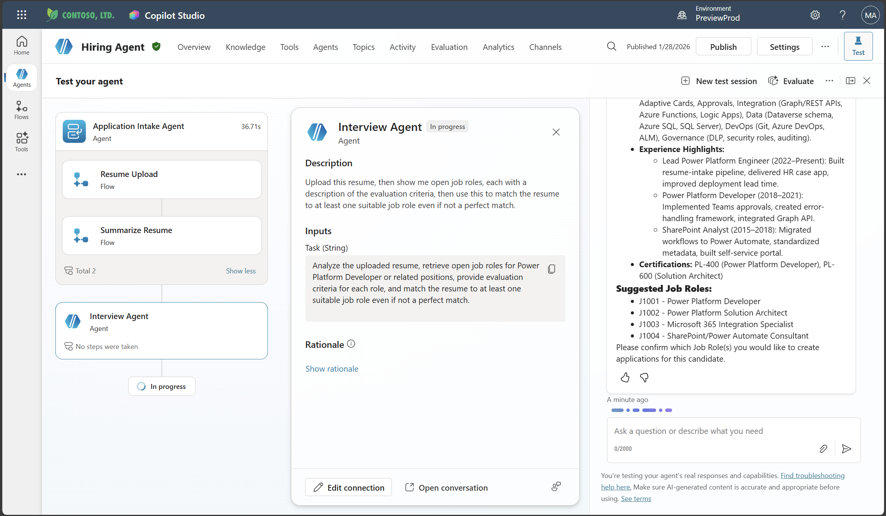
3. Apply for job role(s)
    ```text
    "Apply for all of those job roles"
    "Apply for the J10009 Power Platform Developer role"
    "Apply for the Developer and Architect roles"
    ```
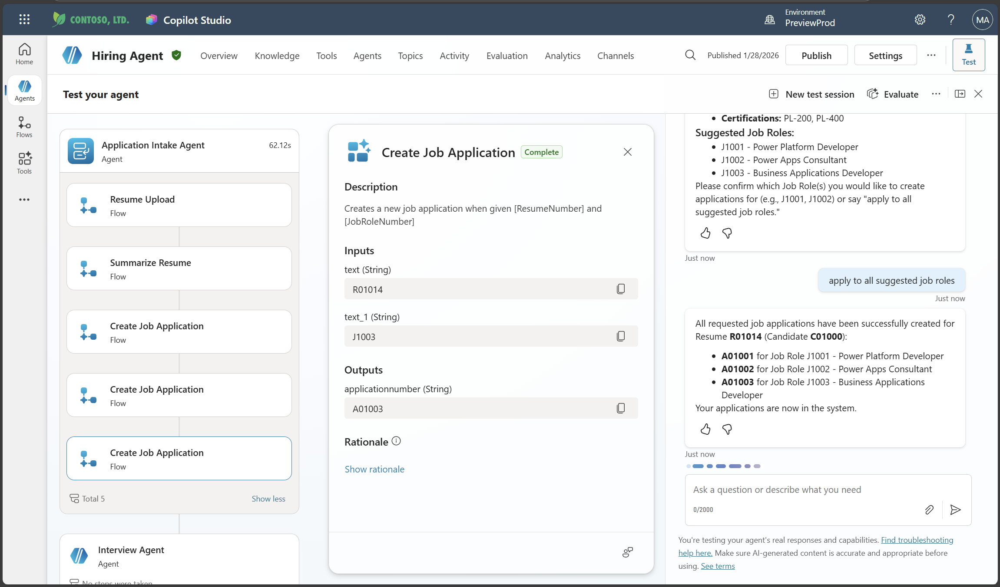
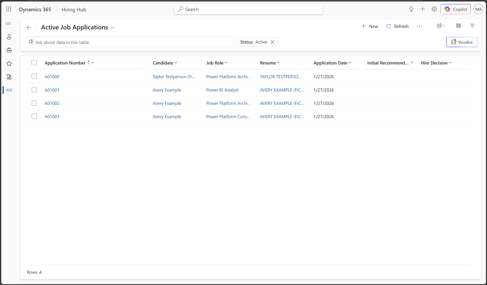