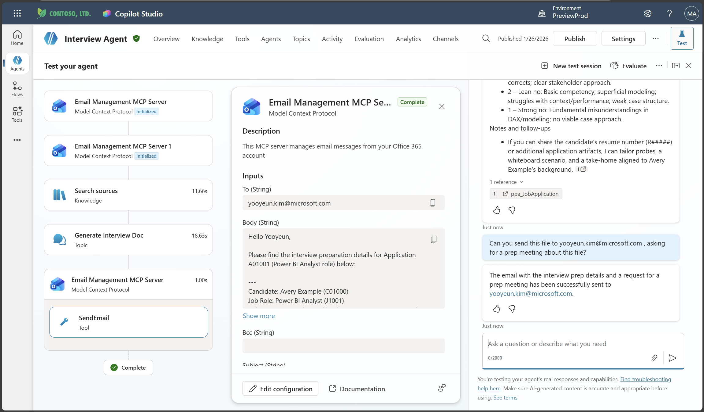
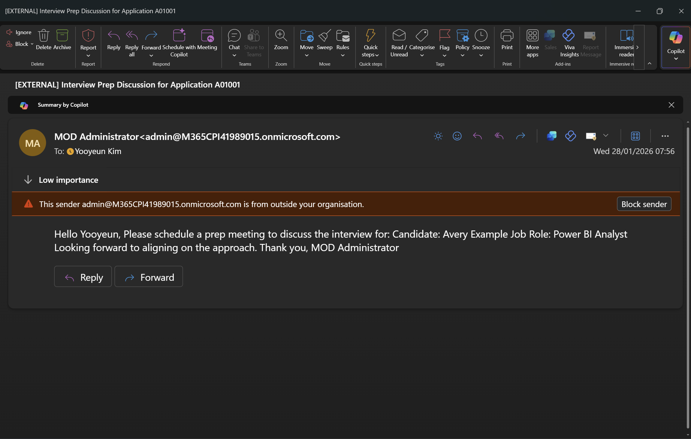

# 🧪 10: Add MCP Servers to the Interview Agent

This hands‑on lab walks you through attaching **two MCP Servers** to your **Interview Preparation Agent**:

*   **Email Management MCP Server**
*   **Meeting Management MCP Server**

This lab shows how to enhance the Interview Agent so that **any request to send emails or book meetings is handled entirely via MCP tools**.

## ✅ 1. Prerequisites

1.  An existing **Interview Preparation Agent** created in previous labs.
2.  The agent already configured with prompt instructions and the interview preparation workflow.
3.  MCP Servers running (local or container):
    *   `email-management-mcp`
    *   `meeting-management-mcp`
4.  Copilot Studio environment where MCP Server connections can be added.

## ✅ 2. Update Agent Instructions

Open your **Interview Preparation Agent** → **Instructions** and add the following line:

    If asked to send email or book a meeting related to the interview prep file, please use MCP server tools.

Make sure this is placed **after existing task and output instructions**, so the agent can consistently prioritize MCP tool usage.

## ✅ 3. Add MCP Server Connections

1.  In the agent designer, go to **Tools** → **Add a new MCP Server**.
2.  Select **Email Management MCP Server**.
3.  Provide:
    *   **Server name**
    *   **Endpoint URL**
    *   **Authentication method** (if any)
4.  Save.

Repeat the same process for:

*   **Meeting Management MCP Server**

After setup, verify that both MCP servers appear under **Agent Tools**.

## ✅ 4. Review Tool Capabilities

### 📧 Email Management MCP Server

Common operations (depending on your server implementation):

*   `sendEmail`
*   `listEmails`
*   `getEmailDetails`

### 📅 Meeting Management MCP Server

Typical operations:

*   `createMeeting`
*   `updateMeeting`
*   `getMeeting`

> You will demonstrate how the Interview Agent calls these automatically through natural language prompts.

***

## ✅ 5. Enable MCP Tool Invocation

1.  Go to **Agent → Behavior → Function Calling / Tool Calling**.
2.  Ensure **Automatic tool invocation** is ON.
3.  Verify the Interview Agent can use:
    *   Core agent flow tools
    *   Email MCP
    *   Meeting MCP

This ensures the agent selects MCP tools whenever the user asks to send an email or book a meeting.

***

## ✅ 6. Test the Agent: Email Scenario

Use prompts like:

**Prompt Example 1**

    Please send an email to the hiring manager with a brief summary of interview preparation file.  

**Expected Behavior**

*   Agent decides: “email requested → use Email Management MCP Server”
*   Agent calls: `sendEmail`
*   Shows JSON preview of payload
*   Executes the email action

## ✅ 7. Test the Agent: Meeting Scheduling Scenario

**Prompt Example 2**

    Book a 30-minute interview prep review meeting for tomorrow afternoon.

**Expected Behavior**

*   Agent decides: “meeting scheduling → use Meeting Management MCP Server”
*   Calls: `createMeeting`
*   Returns confirmation details (date/time, attendees, etc.)

***

## ✅ 8. Full Interaction Demonstration Example

Below is an example interaction you can show live:

**User**

    Can you send the interview preparation summary to my manager and schedule a follow‑up meeting this week?

**Agent Behavior**

1.  Summarizes the interview preparation file using its workflow
2.  Executes two actions:
    *   Calls **Email MCP** → send summary
    *   Calls **Meeting MCP** → schedule meeting
3.  Returns combined response with both tool outputs

This demonstrates **multi‑tool orchestration** in a single natural‑language request.

***

## ✅ 9. Troubleshooting Tips

| Issue                 | Cause                  | Fix                                                              |
| --------------------- | ---------------------- | ---------------------------------------------------------------- |
| MCP Server not called | Instruction too weak   | Ensure instruction line is inside the main system prompt section |
| Tool call fails       | Endpoint misconfigured | Re-check MCP server URL & auth                                   |
| No action taken       | Auto-tool mode off     | Turn on **Automatic tool invocation**                            |

## ✅ 10. (Optional) Enhance the Agent Output

You can add post‑processing steps such as:

*   Formatting meeting descriptions using generative text