# Build a Simple Agent that Calls a Workflow

A short, simple add‑on to the workflows lab. You'll build a tiny conversational **agent** and let it call one of your workflows as a **tool**, with a **skill** that tells the agent when and how to use it. The goal is just to *see how a workflow is used inside an agent* — nothing fancy.

> **The one idea to take away.** In the presentation we saw two directions:
> - **Workflow → Agent** — a workflow hands a step to an agent (an *agent node*). *You did this in Exercise 1.*
> - **Agent → Workflow** — an agent calls a workflow as a **tool**. ← **This is what you'll build here.**
>
> A workflow becomes callable by an agent when its trigger is **"When an agent calls the flow."** A **skill** (reusable markdown instructions) then teaches the agent *when* to call it and *what* to do with the result.

---

## What you'll build

You'll **reuse the inline agent from Exercise 1** so the workflow finds the free calendar slot itself, and expose it to a chat agent.

```
        You (chat)
           ⇅
   ┌───────────────────────────────┐
   │  Agent:  "Focus Buddy"        │
   │  • Instructions (who it is)   │
   │  • Skill:  book-focus-time  ──┼──►  tells it WHEN & HOW to call the workflow
   │  • Tool:   Book Focus Time  ──┼──►  the workflow, exposed as a tool
   └───────────────────────────────┘
                                    │
                                    ▼
     Workflow: "Book Focus Time"   (trigger = When an agent calls the flow)
        input:   taskDescription, preferredWindow, durationMinutes
        inline Agent  ── tool: Work IQ Calendar  (finds a free slot + creates the event)
        return:  confirmation  ──►  back to the calling agent, which tells you
```

**The teaching point — two agents cooperating.** The **outer** agent (Focus Buddy) handles the conversation and decides to delegate. The **inline** agent *inside the workflow* does the calendar reasoning — reads free/busy, picks a slot in working hours, and books it. That single tool call from Focus Buddy to the workflow *is* "how a workflow is used in an agent." Skills keep the "how/when to call it" tidy and reusable, out of the main prompt.

---

## Prerequisites

- You've built **Exercise 1 — Focus Time Assistant Flow** (its inline agent + **Work IQ Calendar** tool are what you'll reuse).
- The **new experience** is on, and your Outlook / Work IQ Calendar connection works.
- The skill file for this module: **`book-focus-time-skill.md`** (provided alongside this guide).

> **ℹ️ Why not call `Focus Time Assistant Flow` directly?** It's **email‑triggered** — it starts on its own when mail arrives, so an agent can't call it. To be callable from a chat agent, a workflow needs the **"When an agent calls the flow"** trigger. In Part A you'll **convert that flow in place** (or build an equivalent from scratch) into the agent‑callable version — reusing the inline agent that already knows how to book calendar time.

---

## Part A — Reuse your Exercise 1 flow, made agent‑callable: **Book Focus Time**

You'll take the inline agent you already built in Exercise 1 and re‑point it so an **agent** can call it (instead of an email). The inline agent keeps its **Work IQ Calendar** tool, so it still finds the free slot itself.

**1. Open the Exercise 1 flow and modify it in place.**
The new experience has **no "duplicate / Save as copy"** for workflows, so you convert this flow directly. On the **Workflows** page, open **`Focus Time Assistant Flow`**, then rename it to **`Book Focus Time`** by selecting the title at the top of the designer.

> **⚠️ Heads‑up — this replaces the email trigger.** Changing the trigger in the next step **retires the email automation** you built in Exercise 1. That's expected — you're reusing that flow on purpose.
>
> **Want to keep the Exercise 1 email flow too?** Don't modify it. Instead **build a new workflow from scratch** (**Workflows → + New workflow**, name it `Book Focus Time`) and rebuild the inline agent exactly as in **Exercise 1, Steps 3–5** (agent node → instructions → **Work IQ Calendar** tool). Then follow Steps 2–6 below on the new flow. (There's no copy feature, so "from scratch" is the only way to have both.)

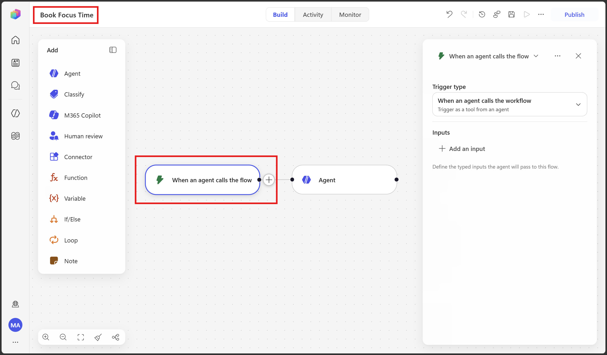

**2. Change the trigger to "When an agent calls the flow," and add inputs.**
Select the **trigger** node and change **Trigger type** to **When an agent calls the flow**. Then add the inputs the agent will pass:

| Input | Type | Required | Notes |
|---|---|---|---|
| `taskDescription` | Text | Yes | What the focus time is for. |
| `preferredWindow` | Text | No | e.g., "tomorrow afternoon", "this week". Leave empty to let the inline agent choose. |
| `durationMinutes` | Number | No | Defaults to 60 if not provided. |

> **💡 Concept — inputs are the new "payload."** The email trigger used to hand the workflow the message's **Subject/Body**; now the **calling agent** hands it these inputs instead.

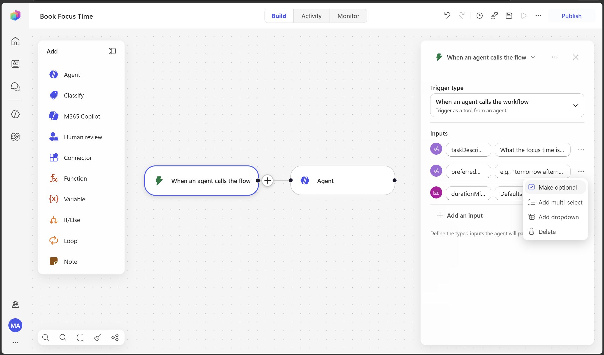

**3. Re‑point the inline agent's instructions to the new inputs.**  *(the must‑do step)*
Open the inline **Agent** node. Its Exercise 1 instructions referenced the email's **/Subject** and **/Body** — those tokens belonged to the old email trigger and **no longer exist**, so replace them with the new inputs. Rewrite the instructions along these lines (type text, then insert each token with **/**):

```
Read this focus-time request and plan time for it. 

Book focus time for this task: 

If a preferred timing is given, honor it: 

Aim for about {triggerBody()?['number']} minutes (use 60 if empty). Find an open slot on my calendar within the next two business days, only within working hours of 9:00 AM to 6:00 PM, Monday to Friday. Create a calendar event to block that time, with a clear title and a short body summarizing the task and lists 2–3 things I should prepare. Then give a one-line confirmation stating the exact day and time you booked and breifly why.
```

> **⚠️ Broken tokens after a trigger change.** If you skip this, the inline agent still points at the old email fields and the run fails or ignores the input. Re‑inserting the tokens **from the new trigger** is what fixes it.

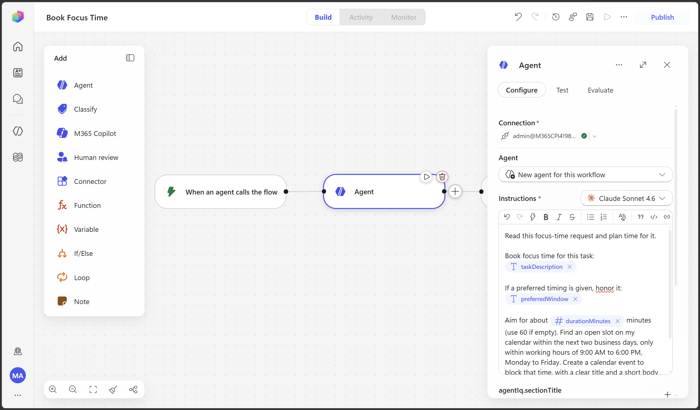

**4. Keep the Work IQ Calendar tool; trim the email‑only bits.**
The inline agent should keep its **Work IQ Calendar** tool so it can read free/busy and create the event — that's what lets it find the slot itself. You can **remove the "Send an email" confirmation** step from Exercise 1 (the calling agent relays the confirmation in chat) — or keep it if you also want an email. Leave **Web search** on or off as you like.

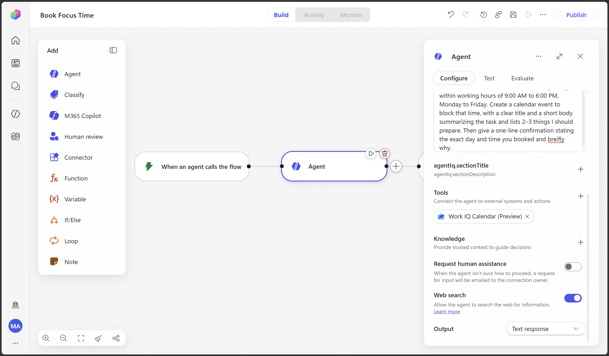

**5. Return the confirmation to the calling agent.**
At the end of the workflow, add a **Return value (Respond to the agent)** step with one output:
- Name: `confirmation` · Type: Text
- Value: map it to the inline **Agent node's response/output** (its one‑line confirmation of the booked slot).

> **💡 Concept — the return value is the workflow's answer to the agent.** Whatever slot the inline agent chose flows back here, so the outer agent can tell the user the real time it booked.

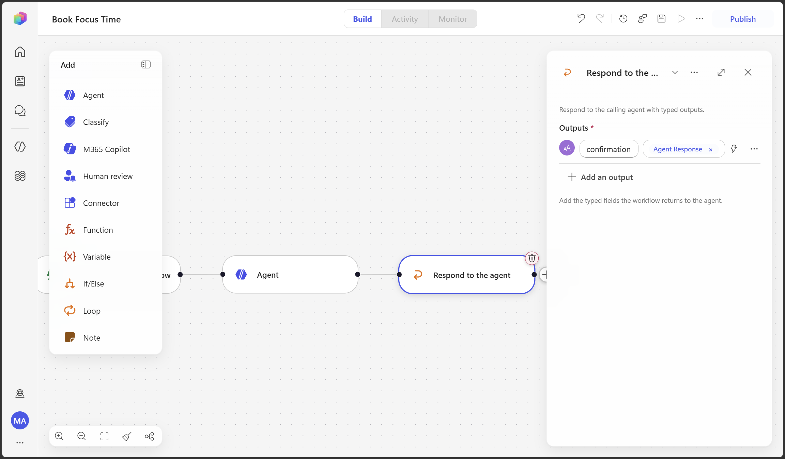

**6. Save and Publish.**
A workflow must be **published** before an agent can call it.

> **✅ Checkpoint A.** You have a published, agent‑callable **Book Focus Time** workflow whose **inline agent finds the slot itself** (via Work IQ Calendar) and returns a `confirmation`.

---

## Part B — Build the agent: **Focus Buddy**

**1. Create the agent.**
Go to **Agents → + New agent** (in the **new experience**). You can skip the conversational setup and go straight to the **Build** tab. Name it **`Focus Buddy`**.

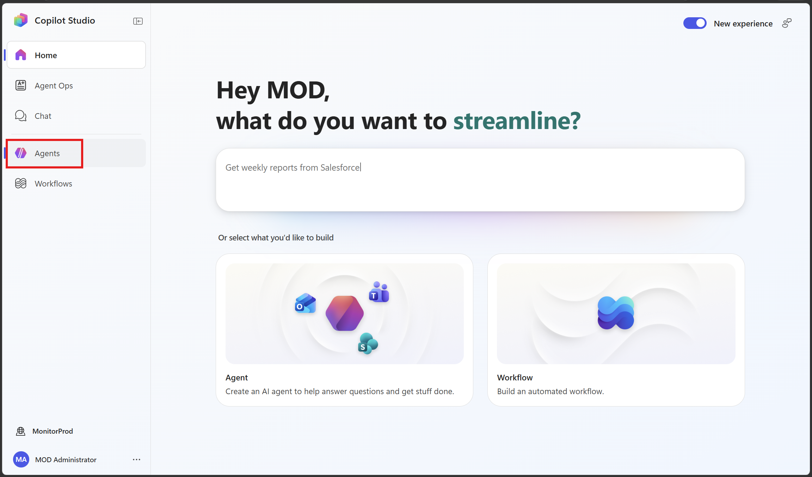


**2. Add the agent's Instructions.**
On the **Build** tab, in **Instructions**, paste:

```
You are Focus Buddy, a friendly assistant that helps people protect time for deep work by booking focus blocks on their Outlook calendar.

- Your only job is to help the user reserve focus time. Politely decline unrelated requests.
- When the user wants to block, schedule, reserve, or protect time to work on something, follow the "book-focus-time" skill.
- Confirm the task (and any timing preference the user mentions) before booking. You don't need to pick the exact time — the workflow finds a free slot inside working hours.
- Be concise and warm. After booking, tell the user the exact time the workflow reserved, in one short line.
```

> **💡 Concept — instructions vs. skill.** The **instructions** define *who the agent is*. The **skill** packages *how to do one specific job* (booking focus time) so it stays reusable and tidy. In the new experience, skills replace the old "topics/prompts" model.

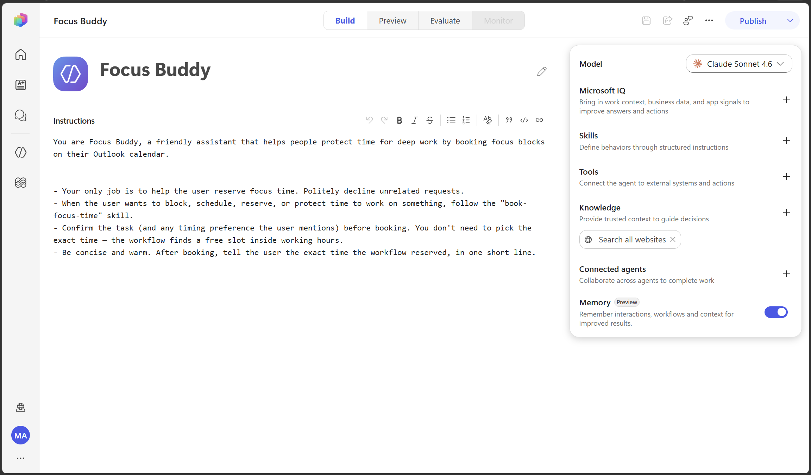

**3. Add the workflow as a Tool.**
On the **Build** tab, open **Tools → + Add tool**, find your published **`Book Focus Time`** workflow, and **Add** it. (Workflows with the "When an agent calls the flow" trigger appear here as tools.)

> **💡 This is the moment the two connect.** Adding the workflow as a tool is the **Agent → Workflow** link from the deck: Focus Buddy can now call `Book Focus Time` and pass it `taskDescription`, `preferredWindow`, and `durationMinutes`.

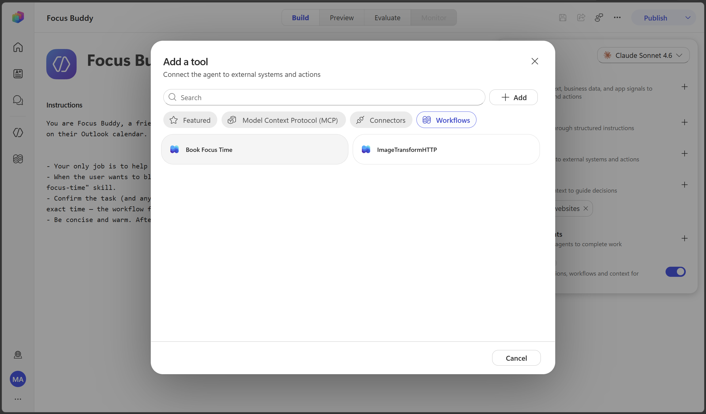

**4. Add the Skill.**
Upload **`book-focus-time-skill.md`**.

> **ℹ️ Note.** Labels for adding skills and return values are still settling as the new experience rolls out. If the upload format differs, just paste the skill's instructions — the content is what matters. The skill refers to the tool by name, **Book Focus Time**, so keep that name consistent.

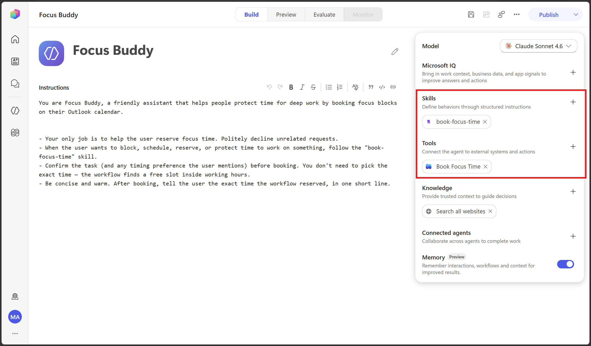

**5. Save (and Publish when ready).**
**Save.** You can test in **Preview** before publishing.

> **✅ Checkpoint B.** Focus Buddy now has: instructions, the **book-focus-time** skill, and the **Book Focus Time** tool.

---

## Part C — Test it

Open **Preview** (the test chat) and try:

> **You:** *Block 90 minutes tomorrow afternoon to prep the board deck.*

What you should see:
1. Focus Buddy recognizes the request and **calls the `Book Focus Time` tool**, passing `taskDescription` ("Prep the board deck"), `preferredWindow` ("tomorrow afternoon"), and `durationMinutes` (90). Expand the agent's activity / chain‑of‑thought in the test view to watch the tool call.
2. Inside the workflow, the **inline agent** checks your calendar (Work IQ Calendar), picks a free slot in working hours, and books it.
3. The workflow returns the `confirmation`, and Focus Buddy relays the **exact time it booked** — e.g., *"Done — I reserved 2:00–3:30 PM tomorrow for the board deck."*
4. In **Outlook → Calendar**, the **Focus: Prep the board deck** event appears at that time.

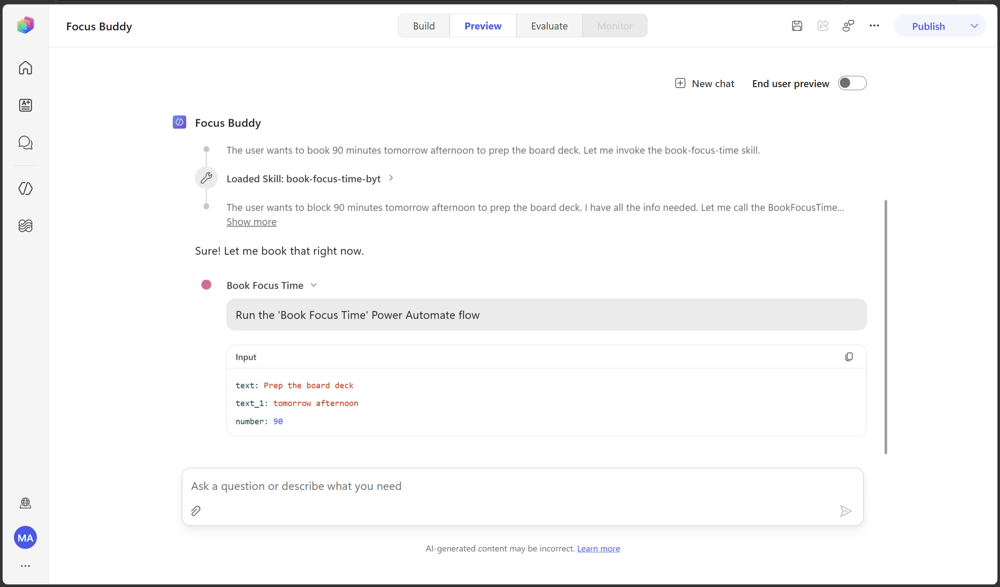
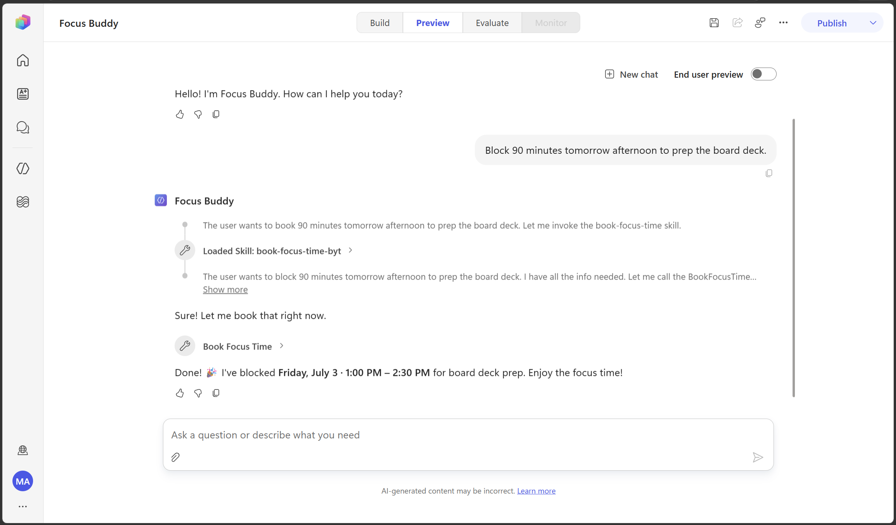

Try a couple of variations:
- *"Reserve some focus time for the budget review."* → no timing given, so it should just book the next suitable slot and report it.
- *"Book me 7–8 AM tomorrow for reading."* → the workflow keeps to **9 AM–6 PM**, so it reports the in‑hours slot it actually booked.

> **💡 Teaching moment.** Expand the reasoning in the test view to show the class the exact instant Focus Buddy hands off to the workflow — and note that the *time itself* was decided by the **inline agent inside the workflow**, not hard‑coded.

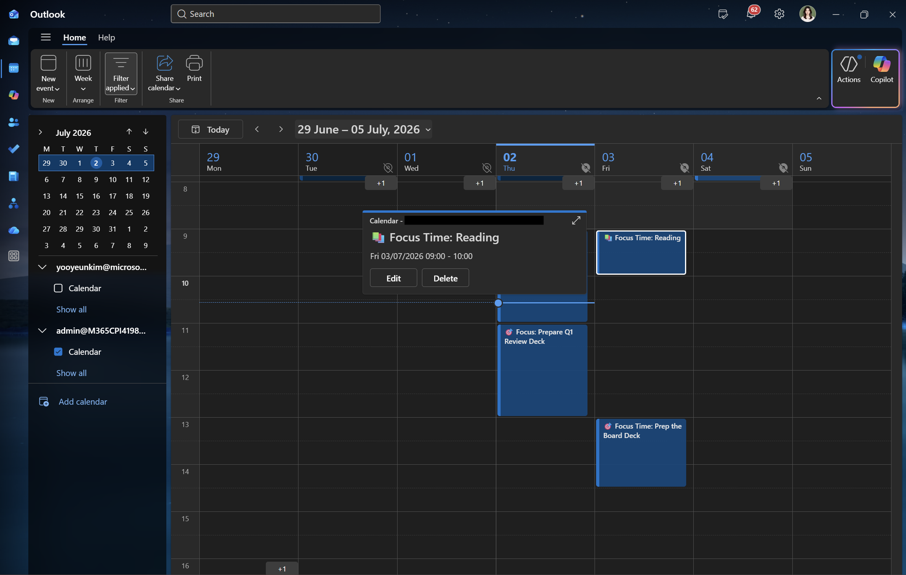

---

## Notes & honest caveats

- **This is the "smart" version.** Because you reused the Exercise 1 inline agent + **Work IQ Calendar**, the workflow finds a genuinely free slot itself — the calling agent doesn't need to pick or confirm an exact clock time. *(Simpler alternative: replace the inline agent with a single deterministic **Outlook → Create event** action and have Focus Buddy pass exact start/end times — smaller build, but it won't check availability.)*
- **Re‑pointing tokens is the #1 gotcha** when converting an email‑triggered flow to agent‑callable. If runs fail or ignore the input, re‑check that every `/` token in the inline agent's instructions comes from the **new** trigger's inputs.
- **Preview UI may differ.** Exact labels for *return values*, *skill upload*, and the *agent‑callable trigger* may vary in your tenant as the new experience rolls out — follow the intent of each step.
- **Same identity everywhere.** Use one work account for Copilot Studio, the Work IQ Calendar / Outlook connection, and testing.

---

## Files in this module

- **`book-focus-time-skill.md`** — the skill to add to Focus Buddy (upload it, or paste its instructions when creating the skill).
