# Hands-On Lab Pack — Building Workflows in the New Copilot Studio

**Audience:** L200–250 · **Format:** pick **2 of 4** scenarios
**Built for a DLP-restricted tenant:** Microsoft 365 connectors only.

---

## 0. Overview

This pack contains **four independent, self-contained scenarios**. There are no dependencies between them.

### 0.1 4 Scenarios

| # | Scenario | What it does for real work | Trigger |
|---|---|---|---|
| **1** | **IT Request Triage Desk** | Every request email that lands in your inbox is classified, prioritised, logged to an Excel tracker, acknowledged to the sender, and escalated to Teams if urgent — automatically. | Email arrives |
| **2** | **Reply Desk with Approval** | Microsoft 365 Copilot drafts a grounded reply to an incoming question, a human approves or asks for changes, an agent applies the feedback, and the workflow sends the reply. | Email arrives |
| **3** | **Daily Brief 8AM** | Every weekday morning, Microsoft 365 Copilot reads your day (calendar, mail, chats), an agent formats it into a fixed brief, and it lands in Teams before you open your laptop. | Schedule |
| **4** | **Friday Project Roll-up** | Reads your project tracker in Excel, has an agent analyse status and risk, asks the team lead to approve the summary, then emails leadership, posts to the team and archives the report. | Schedule |

### 0.2 Node coverage

**Use this to decide which two scenarios to build.** It shows which nodes each scenario exercises.

| | Agent node | M365 Copilot node | Human review | Excel Online | Outlook | Teams |
|---|:---:|:---:|:---:|:---:|:---:|:---:|
| **1 · IT Request Triage Desk** | ✅ | ➕ | ➕ | ✅ | ✅ | ✅ |
| **2 · Reply Desk with Approval** | ✅ | ✅ | ✅ | ➕ | ✅ | ✅ |
| **3 · Daily Brief 8AM** | ✅ | ✅ | ➕ | ➕ | ➕ | ✅ |
| **4 · Friday Project Roll-up** | ✅ | ➕ | ✅ | ✅ | ✅ | ✅ |

✅ **In the core build** — you will definitely use this node if you build this scenario
➕ **Optional extension** — not in the core build, but you can add it if you finish early (each scenario ends with how)

---

## 1. Before you begin

### 1.1 Environment check

1. Open **Copilot Studio** at `copilotstudio.microsoft.com`.
2. Confirm the **environment picker** (bottom left, above your name) shows your lab environment. Every participant must be in the same one.

   > Some environments are served from the preview host `copilotstudio.preview.microsoft.com`. If your lab
   > environment is one of them you may be signed in again when you switch to it, and the URL will differ
   > from the one above. That is normal — what matters is that the picker shows the right environment name.

3. In the left navigation, confirm you can see **Workflows** (below **Agents**). If **Workflows** is missing, the new experience is not enabled for you — resolve this before the session, not during it.

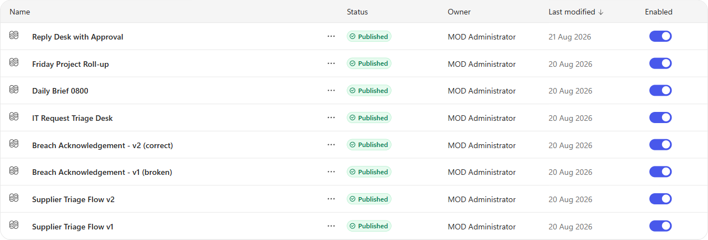

*The Workflows list. Every workflow you build appears here with its publish state and an Enabled toggle.*

4. Open three more browser tabs: **Outlook** (`outlook.office.com`), **Teams**, and **OneDrive**.

### 1.2 One identity for everything ⚠️

> Sign in to Copilot Studio **and every connection you create** with the **same work or school account**.
>
> Triggers, agents, the M365 Copilot node, and every connector tool all act on one identity. If they do not match, the workflow cannot read your mail or write to your files, and you get permission errors at run time that are genuinely hard to diagnose. The M365 Copilot node in particular runs **as the user in its Connection field** — whatever that user can see in Microsoft 365, the workflow can use.

### 1.3 Connections — what to expect the first time

A **connection** is the stored permission that lets a node act as you — read your mail, write your file, post as you in Teams. Each connector needs one, and you create it once per environment.

**What you will see depends on whether that connector has ever been used in your environment:**

| Situation | What the node shows | What you do |
|---|---|---|
| A connection for that connector **already exists** | Your account, with a green **Connected** tick | Nothing — carry on |
| **No connection exists yet** (a fresh lab environment) | **Not connected** | Create one — 20 seconds, procedure below |

> ⚠️ **On a newly provisioned lab environment, expect *every* connector to say "Not connected" the first time you touch it** — Office 365 Outlook and Microsoft Teams included, not just Excel and M365 Copilot. This is normal and is not a sign you have done something wrong. Once created, a connection is reused by every later node that needs the same connector, so you only pay this cost once per connector per environment.

**How to create a connection (identical for every connector):**

1. On the node, find **Connection\*** at the top of the configuration panel. It reads **Not connected**.
2. Click the **Not connected** button itself, or the small **chevron (⌄)** at the right-hand end of that field — *not* any placeholder text in the body of the panel, which does nothing.
3. The menu shows *"No connections available"* and **Create new connection**. Click it.
4. A dialog appears naming the connector (for example **Office 365 Outlook** or **M365 Copilot (V2)**), with an optional display name you can leave blank. Click **Create**.
5. A sign-in tab opens. Pick your lab account. It closes itself.
6. The field now shows your account, and the dependent fields below it load.
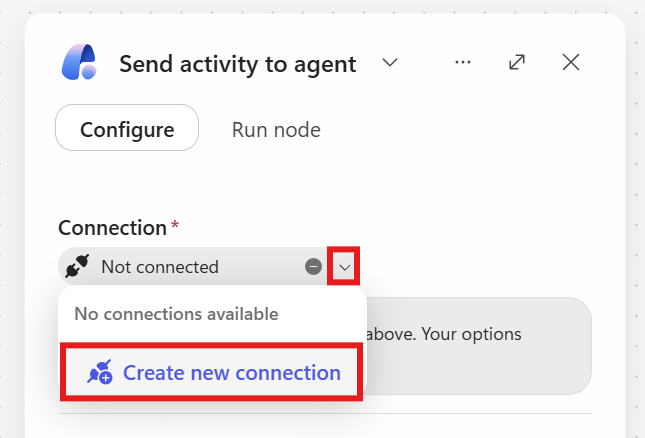

### 1.4 Prepare the Excel workbook (needed for Scenario 1 and Scenario 4)

Excel Online (Business) can only read and write cells that are inside a **formatted Excel Table**. A worksheet with headers typed into row 1 is *not* a table and will not appear in the connector's **Table** dropdown. This is the single most common failure in Excel-based labs.

> ⏭️ **Do this instead — it takes about a minute.** `Workflows-Lab.xlsx` ships **in the same folder as this guide**, with all three tables already created and the sample data already in place.
>
> 1. Download it and upload it to the **root of your own OneDrive for Business** — the connector needs a file the *running identity* owns, so each participant needs their own copy.
> 2. Keep the filename exactly `Workflows-Lab.xlsx`.
> 3. Close it. Then continue to section 1.5.
>
> That is the whole prerequisite. The manual build below is kept only as a reference and a fallback — it is data entry, not learning, and hand-typing a table name slightly wrong produces a failure that only shows up much later, at the Excel node, looking like a connector problem.

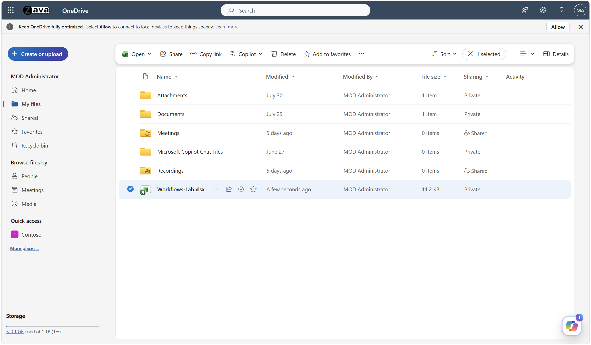

<details>
<summary><b>Build the workbook by hand instead (reference / fallback)</b></summary>

<br>

**Do this once:**

1. Open **OneDrive for Business** in the browser and create a new Excel workbook. Name it exactly:

   ```
   Workflows-Lab.xlsx
   ```

2. Rename the first sheet to `RequestLog`. Type these headers into **A1:I1**:

   | A | B | C | D | E | F | G | H | I |
   |---|---|---|---|---|---|---|---|---|
   | ReceivedAt | FromAddress | Subject | Category | Priority | Summary | OwnerTeam | SLAHours | Status |

3. Select **A1:I1**, then choose **Insert ▸ Table**, tick **My table has headers**, and select **OK**.
4. With the table selected, open **Table Design** and set the **Table Name** to:

   ```
   RequestLog
   ```

5. Add a second sheet named `ProjectTracker`. Type these headers into **A1:F1**:

   | A | B | C | D | E | F |
   |---|---|---|---|---|---|
   | Project | Owner | Status | PercentComplete | Risk | LastUpdate |

   Turn it into a table exactly as in steps 3–4 and name it `ProjectTracker`.

6. Fill `ProjectTracker` with **six sample rows** so Scenario 4 has something to reason about. Copy these:

   | Project | Owner | Status | PercentComplete | Risk | LastUpdate |
   |---|---|---|---|---|---|
   | M365 Copilot rollout — Wave 2 | Jihoon Park | On track | 72 | Low | 2026-08-18 |
   | Intune device compliance baseline | Mina Seo | At risk | 40 | High | 2026-08-14 |
   | Teams Phone migration (Seoul HQ) | Daniel Cho | On track | 88 | Low | 2026-08-19 |
   | Entra ID Conditional Access refresh | Hyewon Lim | Blocked | 25 | High | 2026-08-11 |
   | SharePoint archive cleanup | Jun Kang | On track | 60 | Medium | 2026-08-17 |
   | Purview DLP policy tuning | Sora Yoon | At risk | 35 | Medium | 2026-08-15 |

7. Add a third sheet named `ReportArchive` with headers **A1:D1** — `GeneratedAt`, `Headline`, `AtRiskCount`, `ApprovedBy` — and turn it into a table named `ReportArchive`.

</details>

---

**Whichever route you took, two things apply:**

- **Leave the file closed** when a workflow runs against it. An open browser session holding a lock is a common cause of intermittent Excel write failures.
- **Each participant needs the file in their own OneDrive.** The connector runs as the signed-in identity and can only reach a file that identity owns. A shared link to someone else's copy will not work.

> 📎 **Expect a blank row.** `Insert ▸ Table` on a header-only row creates a table whose range already
> includes one empty data row. So the first row your workflow writes lands in **row 3**, not row 2.
> That is normal — do not read it as a failure.

### 1.5 Prepare a Teams destination (needed for Scenarios 1, 3, 4)

You have two options. Option A is recommended for this lab.

- **Option A — message yourself (fastest, zero setup).** In the Teams post step, set **Post in** to **Chat with Flow bot**, and **Recipient** to your own email address. Nothing to create in advance.
- **Option B — a real channel (more realistic).** Create a Team called `Workflow Lab` with a **standard** channel called `Alerts`.

> ⚠️ **Two Teams constraints to check before the session.** Posting to a **private channel is not supported** — make `Alerts` a standard channel. And the **Flow bot** poster is available in **commercial tenants only**; on a government cloud, set **Post as** to **User** instead. Both actions also require the Workflows (Power Automate) app to be in the **allow** state in the Teams admin center.

---

## 2. Core concepts

Skim this before you start. Refer back whenever a step mentions a term in **bold**.

| Concept | What it means here |
|---|---|
| **Workflow** | The autonomous unit in Copilot Studio. It runs on a **trigger** instead of a chat turn, so work happens in the background with nobody watching. Workflows are **deterministic** by default: the same input follows the same rule-based path. |
| **Trigger** | The event that starts a workflow. The five types are **Manual**, **Recurrence** (a schedule), **Connector** (something happened in a service), **When a HTTP request is received**, and **When an agent calls the workflow**. This pack uses Connector and Recurrence. |
| **Event → Payload → Action** | The mental model for everything you build today. The trigger fires on an **event**, hands the workflow a **payload** (the email's Subject, Body, From), and downstream **actions** operate on that payload. |
| **Node** | One step on the canvas: a trigger, an action, a branch, an agent. |
| **Dynamic content (the `/` token)** | A reference to data produced by an earlier node. Type `/` in almost any text field to open the **Insert dynamic content** panel, then pick the value. This is what makes a workflow act on the *real* item at run time instead of a fixed string. **If you find yourself typing a value that should change per run, you should be inserting a token instead.** |
| **Agent node (inline agent)** | Hands a step to an AI agent that can reason, call tools, and return a result. Leave **Agent** on **New agent for this workflow** to build one inline — its instructions, model and output shape live in this node and travel with the workflow. Use it when a step needs judgement. |
| **Agent node — Output shape** | The **Output** dropdown (at the *bottom* of the panel) controls what downstream steps receive: **Text response** (one string), **Structured output** (predefined fields), or **Custom structured output** (an object matching a JSON schema you define). With a structured output, **each field becomes its own dynamic-content token** — that is what lets you branch on `priority` or write straight into an Excel column. |
| **M365 Copilot node** | Hands a step to Microsoft 365 Copilot itself, **grounded in the running user's mail, files, calendar and chats**. You write a **Message**; the answer comes back as the token **Body / Response**. |
| **Agent node vs. M365 Copilot node** | Use the **M365 Copilot node** to reuse what already exists in Microsoft 365 — grounding is built in and it runs as the connected user. Use the **agent node** when you need automation-specific instructions and a controlled output shape. Scenario 2 and Scenario 3 use both, in that order, and that is the point. |
| **Human review** | Pauses the workflow, sends one or more named people a form, and resumes when someone submits it. Every input you define becomes a dynamic-content token carrying the human's answer. The run sits at **Waiting** in the meantime. |
| **Human-in-the-loop: by design vs. by judgement** | *By design* = you, the maker, place a Human review node at a specific point. *By judgement* = you turn on **Request human assistance** on an agent node and let the agent escalate on its own. Scenarios 2 and 4 use *by design*. |
| **Deterministic step vs. AI step** | Use a deterministic step when the rule is clear — it is cheaper and predictable. Use an AI step when the step needs reasoning you cannot express as a rule. A good workflow is mostly deterministic with AI at the two or three points where judgement is genuinely needed. |
| **Testing one node vs. the whole flow** | The **Run node** tab on a node runs *that step alone*, letting you mock only the upstream values it actually references — fast, and it does not publish. The **Run** button in the top command bar exercises the whole graph. Iterating on a prompt? Run the node. Validating trigger logic? Run the flow. |
| **Publish** | A workflow only listens for its trigger **after you publish it**. You cannot publish a workflow that contains errors — the **Review** button in the command bar shows the count. |
| **Activity** | The run history tab. Select a run to load it onto the canvas with each node's real inputs and outputs. This is where you debug. |

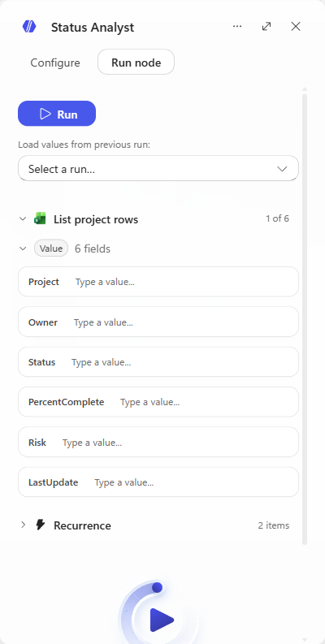

*Every node has its own Run node tab, so you can test one step in isolation before adding the next.*

### 2.1 Five habits that save the most time today

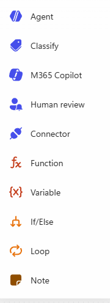

*The node palette on the designer canvas — the building blocks you assemble a workflow from.*

1. **Rename every node as you create it.** In the configuration panel header on the right, **click the node's title once** — the hint below it reads *"Click to rename"* — and the existing text arrives pre-selected, so type straight over it and press **Enter**. (The node's **⋯** menu only offers Settings and Code view — there is no Rename command there.) Default names become unreadable by node five, and they are what you search for in the dynamic-content picker.

2. **Insert Dynamic Content slowly and check the chip.** Type `/`, **pause** for the *Insert dynamic content* panel to open, *then* type two or three letters to filter, then click the entry. Dynamic Content is a rounded **chip** you cannot edit letter by letter, and hovering it shows the underlying expression.

3. **Clear pre-filled boxes before you type.** Several fields arrive with placeholder text already *in* them — Human review input labels (`Text`, `Text 1`) and dropdown option boxes (`First option`). Typing **appends**, producing values like `TextDecision` or `First optionApprove`. Always **Ctrl+A, Delete** first. This one is worth reading twice: a wrong dropdown value causes a branch to silently take the wrong path with **no error at all**.

4. **Test each node the moment you finish it**, before adding the next one. Finding out at node seven that node two returns the wrong shape costs far more than 30 seconds of testing.

5. **Save often.**

---

### 2.2 Background — Cloud flows vs. agent flows vs. workflows

You may already automate things with Power Automate. If so, the obvious question is *"how is this different, and did my existing skills just expire?"* Short answer: they didn't — but this is a genuinely different runtime, not a reskin.

<details>
<summary><b>Expand: the three kinds of automation, and which one you are building today</b></summary>

<br>

**The word that explains everything: *harness*.**

Whatever you build in Copilot Studio runs on a **harness** — a runtime that sits between your design and the model. It decides when to call the model, what to send it, how to interpret what comes back, and which tools to call. Microsoft currently ships three, and the harness determines what you can build and what it can recover from.

| | **Power Automate cloud flow** | **Agent flow** | **Workflow** ← *this lab* |
|---|---|---|---|
| **Harness** | — (not a Copilot Studio harness) | **Standard harness** | **GitHub Copilot harness** |
| **Runs in** | Power Automate | Copilot Studio | Copilot Studio |
| **Designer** | Power Automate designer | Copilot Studio flow designer | Redesigned visual canvas |
| **Distinctive capability** | Broadest connector reach, long-established | Deterministic automation tied to Copilot Studio agents | Native AI action nodes, agent handoffs, **node-level testing** |
| **Example** | A form response arrives — log it to Excel and notify the owner | A chatbot receives an order number and calls this flow to look up delivery status | A request email arrives, an agent triages it, a human approves, the reply goes out |

**Why three, and not one?**

Read the progression left to right — it is *deterministic automation and agents being brought closer together*:

- A **cloud flow** is pure deterministic automation. It connects apps and services. It has no opinion about agents.
- An **agent flow** is that same deterministic automation, moved inside Copilot Studio so it can be attached to an agent and billed through Copilot Studio. Microsoft's docs describe agent flows as part of the **standard harness**, created and managed as *classic* agents.
- A **workflow** is the automation experience of the **GitHub Copilot harness** — the same trigger-and-action shape, but on a canvas where AI actions, agent handoffs and per-node testing are first-class.

**The nuance that matters most, and that people usually get wrong:**

> A workflow is still **deterministic**. Microsoft documents both agent flows and workflows the same way — *"they execute actions or tasks following a rule-based path. The same input always produces the same output."*
>
> What is agentic is not the *workflow* — it is the **individual nodes you place inside it**. The graph you draw still runs top to bottom in the order you drew it. Node 3 does not decide to skip node 4.
>
> This is exactly why the pattern in this pack works: a predictable skeleton, with reasoning injected at the two or three points where judgement is genuinely required. You get auditability *and* intelligence, instead of trading one for the other.

**Practical consequences you will actually hit:**

| Situation | What to know |
|---|---|
| You want to move an existing cloud flow across | It converts to an **agent flow only** — not to a workflow. Rebuild it if you want it as a workflow. The conversion is **one-way** and cannot be reversed. |
| Someone in your org says "agent flow" and someone else says "workflow" | They are **not** synonyms. Different harness, different canvas. If in doubt, ask which button they pressed: **New agent flow** (standard) or **New workflow** (GitHub Copilot). |
| You are on the GitHub Copilot harness and open an agent flow | It opens in a **new browser tab**, because you are crossing into the other experience. |

**Your Power Automate skills transfer directly.** Triggers, actions, connectors, dynamic content, branching, run history — same concepts, same mental model. What is new is the AI node types, the agent handoff, and per-node testing. That is roughly a day of unlearning, not a career's worth.

*Sources: [Choose a harness](https://learn.microsoft.com/en-us/microsoft-copilot-studio/harnesses-overview) · [Workflows overview](https://learn.microsoft.com/en-us/microsoft-copilot-studio/workflows-experience/flows-overview) · [Agent flows overview](https://learn.microsoft.com/en-us/microsoft-copilot-studio/flows-overview)*

</details>

---

### 2.3 Background — Agent node vs. M365 Copilot node

Both nodes put AI into a step. They are not interchangeable, and choosing wrongly is the most common design mistake in this pack. The one-line version: **the M365 Copilot node knows about *your organisation*; the agent node does what *you* tell it.**

<details>
<summary><b>Expand: which AI node to reach for, and why</b></summary>

<br>

**They differ in where the intelligence comes from.**

| | **Agent node** | **M365 Copilot node** |
|---|---|---|
| **Where knowledge comes from** | What *you* put in — instructions, plus anything you pass in as dynamic content | Microsoft 365 itself — the running user's mail, calendar, chats and files |
| **You control** | Instructions, model, tools, **output shape** | The **Message** (the request you send) |
| **Output token** | `Agent Response` for a text response, or **one token per field** with structured output | `Body / Response` — a single block of text |
| **Runs as** | The workflow | The connected user, with that user's permissions |
| **Best at** | Applying *your* rules to data you hand it | Answering *"what does my organisation already know about this?"* |

**The deciding question:** *does this step need information the workflow does not already have?*

- **Yes** → M365 Copilot node. It reaches into Microsoft 365 and finds it. You could never hand-feed that much context through dynamic content.
- **No, I just need judgement applied to what I already have** → Agent node. Cheaper, more predictable, and you control the output shape.

**Why output shape is the real differentiator.** The M365 Copilot node returns prose — one `Body / Response` string. Perfect to post into Teams, useless for branching. An agent node with **structured output** returns *fields*, each its own token — which is what lets Scenario 1 write `Category` into an Excel column and branch on `Priority`. If a downstream step needs to make a *decision* on the result, you need an agent node with structured output.

**Scenario 2 uses both, deliberately, in this order:**

```
M365 Copilot node  →  drafts a reply grounded in real organisational context
        ↓
Human review       →  a person approves or asks for changes
        ↓
Agent node         →  applies the reviewer's feedback under strict instructions
```

Neither could do the other's job. The Copilot node cannot be told *"return the draft completely unchanged if the change request is empty"* — that is automation-specific behaviour. The agent node cannot know what your organisation decided about VPN policy last quarter. **That hand-off is the lesson**, not an implementation detail.

---

**Inline agents vs. published agents — a design choice, not a feature gap**

When you add an agent node, leaving **Agent** on *New agent for this workflow* creates an **inline agent**: its instructions, model and output shape live inside the node and travel with the workflow. You can also point the node at an **already-published agent** instead.

| | **Inline agent** (this pack) | **Published / referenced agent** |
|---|---|---|
| **Lives** | Inside the workflow node | As a standalone asset in your environment |
| **Reusable elsewhere** | No | Yes — many workflows and agents can call it |
| **Conversational** | No — one step, one result | Can also be talked to directly |
| **Versioning** | Moves with the workflow | Managed on its own |
| **Choose when** | The agent serves **one step of one process**, and portability adds nothing | The behaviour is **reused across processes**, or people need to interact with it directly |

The honest trade-off: an inline agent keeps everything in one place, so the workflow is easy to read, hand over and rebuild — which is exactly right for a lab, and often right in production for single-purpose logic. The moment two workflows need the *same* judgement, that logic should be published once and referenced, or you will be maintaining the same instructions in two places and they will drift.

> 💡 **A workflow can also be a tool *for* an agent — the relationship runs both ways.** Give a workflow the **When an agent calls the workflow** trigger and a **Respond to the agent** action, publish it, and an agent can invoke it as a tool. There are real constraints: the response must be synchronous, and the workflow must reply within a **100-second** limit. That is the reverse of what you build today, and it is how these two halves of Copilot Studio compose.

*Sources: [Workflows overview](https://learn.microsoft.com/en-us/microsoft-copilot-studio/workflows-experience/flows-overview) · [Add a workflow as a tool to an agent](https://learn.microsoft.com/en-us/microsoft-copilot-studio/workflows-experience/flow-agent) · [Choose a harness](https://learn.microsoft.com/en-us/microsoft-copilot-studio/harnesses-overview)*

</details>

---

# Scenario 1 — IT Request Triage Desk

> **Triage** comes from emergency medicine, where patients are sorted by how urgent they are. Here it means sorting each incoming request by **what kind it is and how urgent it is**, so the queue can be worked in the right order.

**Core nodes: Agent (custom structured output) · Excel Online (Business) · Outlook · If/Else · Teams**

### The problem this solves

Requests arrive as ordinary email — "I can't sign in", "my laptop won't charge", "how do I share this file". Someone has to read each one, decide what it is, decide how urgent it is, put it in a tracker, tell the sender it was received, and poke the right team if it is on fire. That reading-and-routing is 20–40 minutes of somebody's morning, every morning, and it is the least valuable work in the queue.

This workflow does all of it in about thirty seconds per email — and, importantly, it keeps a human in charge of the *actual* fix.

### What you will build

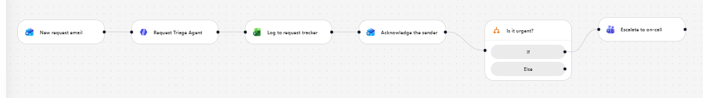

*Scenario 1 finished. Note the acknowledgement sits before the If/Else — branches never rejoin, so shared steps go above them.*

```
[Trigger]  Office 365 Outlook — When a new email arrives
           Folder: Inbox · Subject filter: [REQ]
    │      payload: Subject · Body · From · Received Time · Message Id
    ▼
[Agent]    "Request Triage Agent"  (new inline agent, no tools)
    │      Output: Custom structured output
    │      → category · priority · summary · owner_team · sla_hours · ack_message
    ▼
[Excel]    Add a row into a table  →  RequestLog
    ▼
[Outlook]  Reply to email  →  acknowledgement to the sender   (runs for every request)
    ▼
[If/Else]  Priority  Equals  High
    ├── If ───▶ [Teams]  Post message  →  urgent escalation
    └── Else ─▶ (nothing)
```

> 🔍 **Why the acknowledgement sits *above* the branch.** In this designer an **If/Else** does **not**
> rejoin: each branch simply ends. There is no trunk after it, so there is nowhere to put a step that
> should run for *both* outcomes. Anything universal — like telling every sender you received their
> mail — must go **before** the branch (or be duplicated into both). Getting this wrong is the most
> common structural mistake people make on their first workflow.

---

## Step 1 — Create and name the workflow

1. In the Copilot Studio left navigation, select **Workflows**.
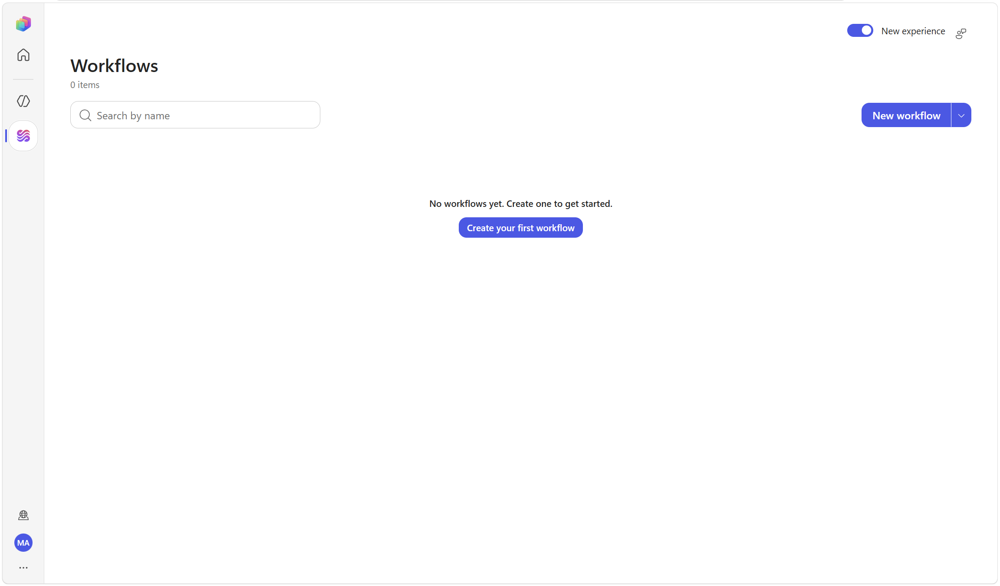
2. Select **New workflow**. The designer ("Agentic Automations") opens with a single **Start** node on the canvas.
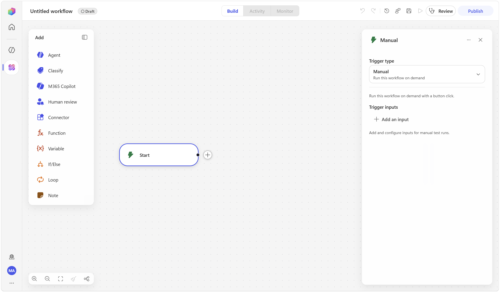
3. Select the title at the top (**Untitled Workflow**) and type over it:

   ```
   IT Request Triage Desk
   ```

4. Select **Save** (or Ctrl+S).

> 🔎 **The Save icon**
> It will frequently look **disabled**, and that is normal: the designer keeps a **Draft** saved for you automatically, so Save greys out whenever there is nothing new to write.
>
> **Run** and **Publish** stay disabled until the workflow has at least one **action** node; hover **Publish** and the tooltip says *"Action node required to publish."*

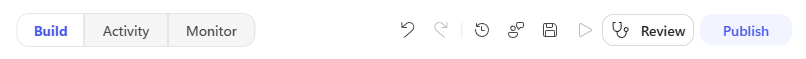

*The right-hand icons are, left to right: Undo, Redo, Version history, Send feedback, Save, Run — then Review and Publish.*

<details>
<summary>💡 <b>Concept</b></summary>

A workflow is the autonomous side of Copilot Studio. It runs on a trigger, not on a chat turn — that is the whole difference from an agent you talk to.

</details>

> 📛 **Naming rule.** A workflow name **must start with a letter**. A name that begins with a digit is
> rejected outright. You will meet this again in Scenario 3.

---

## Step 2 — Configure the email trigger

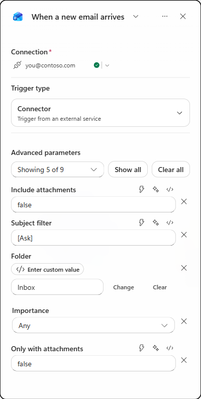

*The email trigger, already configured. Before you click **Show all** the counter reads "Showing 4 of 9" and Subject Filter is hidden.*

1. Select the **Start** node. The configuration panel opens on the right.
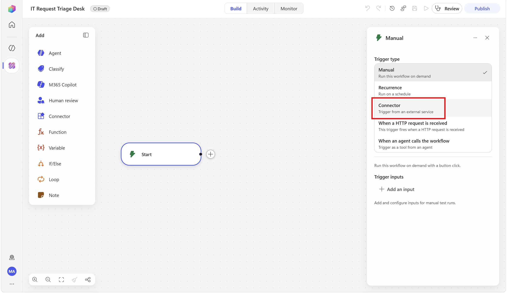

2. Change **Trigger type** from **Manual** to **Connector**.

   Selecting Connector immediately opens the **Select a trigger** dialog — you do not need to click anything else.

3. In that dialog choose the **Office 365 Outlook** tile, then choose **When a new email arrives**.

   > Four triggers have near-identical names — *When a new email arrives*, *…in a shared mailbox*, *…mentioning me arrives*, and an event trigger. Pick the plain **When a new email arrives**.

   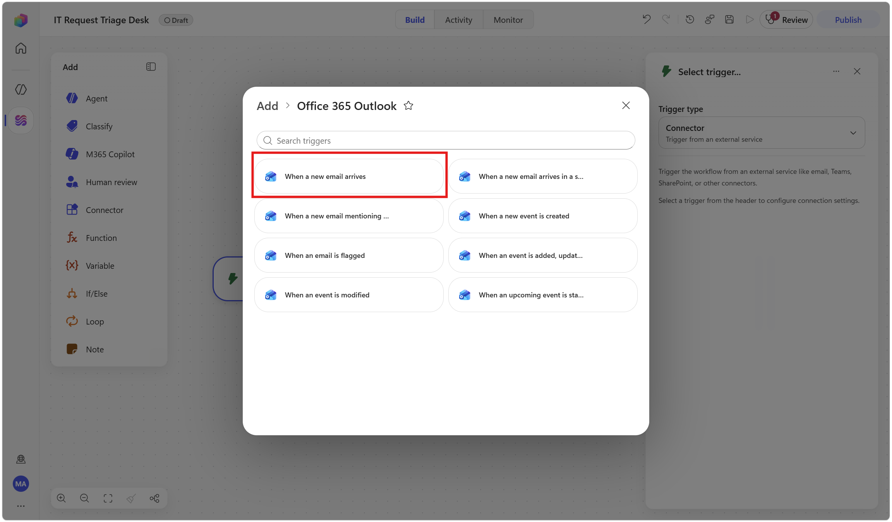

   If a connection for Office 365 Outlook already exists in your environment, it binds automatically and shows a green **Connected** tick. **On a fresh lab environment it will instead say "Not connected"** — create the connection using the six steps in section 1.3, then continue. This is expected, not an error.

4. Set the **Folder**. The field looks like a text box, but you cannot type into it and clicking it does nothing. Click the small **Change** button to the right of the field — that opens the folder picker. Click **Inbox** in the list, then press **Escape** or click elsewhere in the panel to close the picker. The field now reads `Inbox`.

   > The picker is a *tree*, so folders with children can be expanded — but **Inbox** sits at the top level, so a single click on it is all you need here.

5. Now set the subject filter. Under **Advanced parameters** the panel reads **"Showing 4 of 9"** — the filter is one of the five hidden ones. Click **Show all** (the counter changes to *Showing 9 of 9*), then find **Subject Filter** and type:

   ```
   [REQ]
   ```

6. Rename the node. In the configuration panel header, **click the node's title once** — the hint beneath it reads *"Click to rename"*. The existing text arrives already selected, so just type over it:

   ```
   New request email
   ```

   Press **Enter**.
   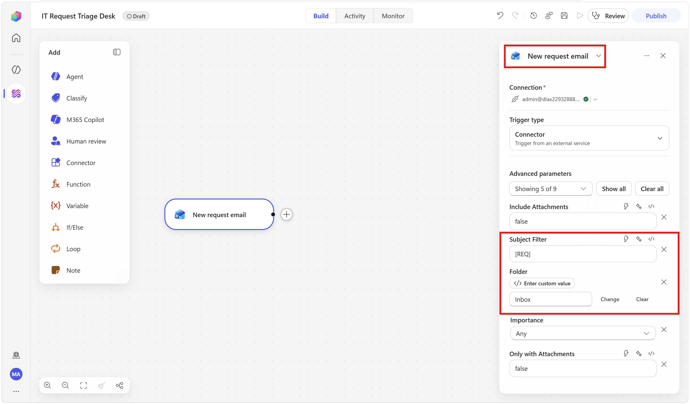

7. Select **Save**.

> ⚠️ **Keep the trigger narrow.** Without the **Subject filter**, this workflow fires on *every* message that reaches your inbox — including the acknowledgement it sends itself, which is an infinite loop. `[REQ]` limits it to your test messages. Do not skip this.

> 🔎 **Where do the tokens come from?** This trigger's payload is what you will use everywhere downstream: **Subject**, **Body**, **From**, **Received Time**, **Message Id**. That is *Event → Payload → Action* in one node.

---

## Step 3 — Add the triage agent

This is the heart of the scenario. Everything before it moves data; this node makes a judgement.

### 3a — Add the node

1. Below the trigger, select the **+** (**Add a step**) button.
2. In the **Add** dialog, select the **Agent** tile.
3. If the node opens showing **Not connected**, create the connection first — see [section 1.3](#13-connections--what-to-expect-the-first-time). On a fresh environment it will. Once connected, the **Agent** dropdown and **Instructions** field appear.
4. Leave the **Agent** dropdown on **New agent for this workflow**.
5. Rename the node to `Request Triage Agent`.
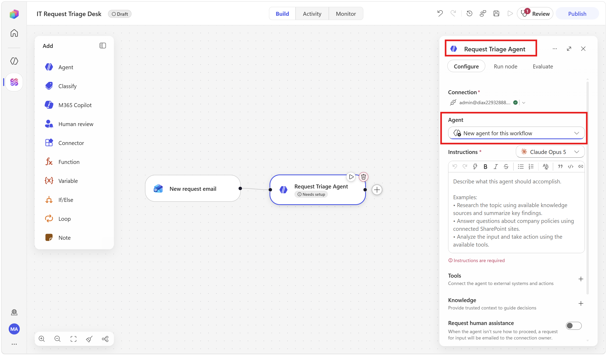

<details>
<summary>💡 <b>Concept</b></summary>

**New agent for this workflow** builds an *inline* agent: its instructions, model and output shape live inside this node and travel with the workflow. It cannot be reused elsewhere — and that is exactly what you want when the agent's job is specific to one automation.

</details>

### 3b — Write the instructions

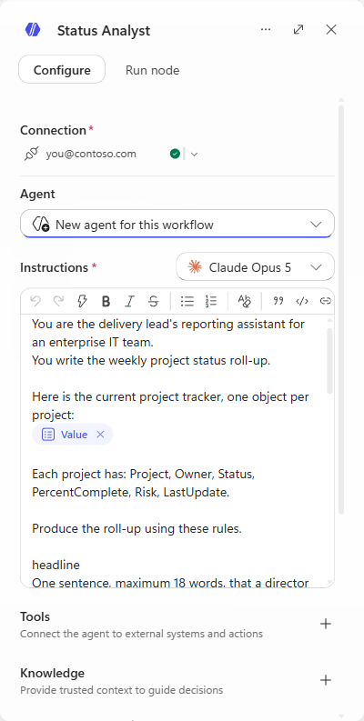

*An inline agent node: Agent set to 'New agent for this workflow', your instructions, and the model picker.*

For an inline agent, the **Instructions** field is *both* the job description and the per-run prompt — there is no separate Message field.

Type the text below into **Instructions**. Where you see **`⟨insert /Subject⟩`**, type `/`, wait for the picker, type a few letters, then select that value — do not type the word.

> 🔤 **Where the trigger's values live in the picker — it changes with the field you are in.** Inside an **agent node's Instructions** box, the trigger's outputs are grouped under a heading called **Input**, *not* the trigger's node name. So here you are looking for **Input** → **Subject**, **From**, **Body**. In an ordinary **connector** field (the Excel and Outlook steps later on) the same values are grouped under the trigger's node name instead — **New request email** — alongside a group for each earlier node. Same tokens either way; only the heading differs.

```
You are the IT service desk triage assistant for an enterprise IT team.
Read the request email below and classify it. Use only what is in the email.
Never invent a fact, a person, a system name, or a date that is not there.

Subject: ⟨insert /Subject⟩
From: ⟨insert /From⟩
Body: ⟨insert /Body⟩

Apply these rules exactly:

category — choose exactly one:
  Access        accounts, passwords, MFA, permissions, group membership, licences
  Hardware      laptops, phones, monitors, docks, batteries, peripherals
  Software      installs, updates, licences for an app, crashes, errors in an app
  HowTo         the sender knows the system works and is asking how to use it
  Other         anything that does not clearly fit above

priority — choose exactly one:
  High     a person or team is blocked right now, or security or data is at risk
  Medium   work is slowed but a workaround exists
  Low      a question, a request for information, or a nice-to-have

summary — one sentence, maximum 25 words, in English, describing what the
sender actually needs. Not what they wrote — what they need.

owner_team — choose exactly one:
  Identity        accounts, passwords, MFA, permissions, groups
  Endpoint        laptops, phones, drivers, operating system, device management
  Collaboration   Teams, Outlook, OneDrive, Excel, Copilot
  ServiceDesk     anything that does not clearly fit the other three

sla_hours — 4 if priority is High, 24 if Medium, 72 if Low.

ack_message — two or three sentences addressed to the sender, written in the
same language as the incoming email. Confirm what you understood, name the
team that will pick it up, and state the response time in hours. Do not
promise a solution, a fix, or a root cause. Do not include a greeting line
and do not include a signature.
```

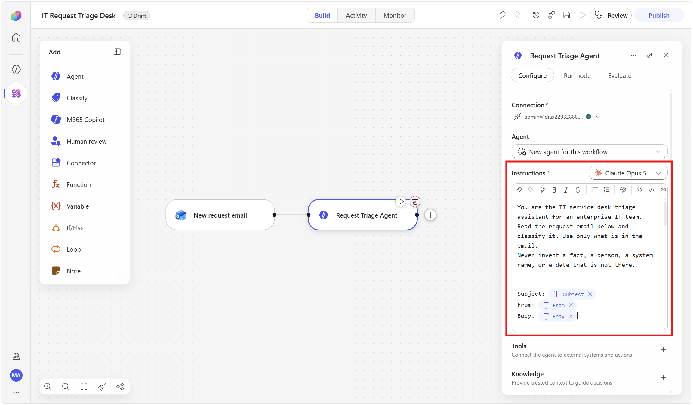
> ✅ **Check the three chips.** Before moving on, confirm the three values appear as coloured **chips**
> — small rounded pills you cannot edit character by character — and not as literal text. A trigger
> chip shows just the field name: **`Subject`**, **`From`**, **`Body`**. Hover one and the tooltip
> shows the underlying expression, e.g. `triggerOutputs()?['body/subject']`; that is how you confirm
> it is a real token. If a token failed to insert, the picker stays open and swallows everything you
> type next, which silently truncates the rest of your instructions.

<details>
<summary>💡 <b>Why the instructions are this specific</b></summary>

An inline agent decides at run time. The way you make a non-deterministic step *reliable* is not to make it shorter — it is to close every gap where it would otherwise have to guess. Notice that every field has an explicit, closed list of allowed values. That is what makes the next steps (writing to a fixed Excel column, branching on `High`) safe.

</details>

### 3c — Choose the model

The model dropdown sits in the **Instructions** header, on the right.

The default is **Claude Opus 5**, a heavy multi-step reasoning model. It works well for this task, so you can leave it as it is.

<details>
<summary>🎯 <b>Worth knowing, though</b></summary>

Classification over a short email is a fast, high-volume job — exactly the case where a chat-tier model (GPT-5 Chat, Claude Sonnet) gives you the same answer for less latency and cost. Right-sizing the model per node is the cheapest optimisation in the product. Try both and compare the run times in **Activity**.

</details>

### 3d — Shape the output — the most important setting in this scenario

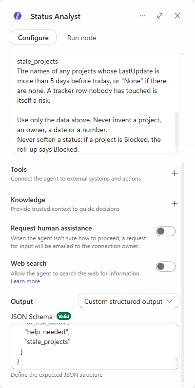

*Output sits at the very bottom of the agent panel. Custom structured output validates the JSON schema you supply.*

1. Scroll to the **bottom** of the configuration panel. **Output** sits below Tools, Knowledge, Request human assistance and Web search.
2. Open the **Output** dropdown and select **Custom structured output**.
3. A **JSON Schema** box appears below it. Paste this:

```json
{
  "type": "object",
  "properties": {
    "category":    { "type": "string",  "description": "Access, Hardware, Software, HowTo, or Other" },
    "priority":    { "type": "string",  "description": "High, Medium, or Low" },
    "summary":     { "type": "string",  "description": "One sentence, maximum 25 words" },
    "owner_team":  { "type": "string",  "description": "Identity, Endpoint, Collaboration, or ServiceDesk" },
    "sla_hours":   { "type": "integer", "description": "4, 24, or 72" },
    "ack_message": { "type": "string",  "description": "Two or three sentences for the requester" }
  },
  "required": ["category", "priority", "summary", "owner_team", "sla_hours", "ack_message"]
}
```
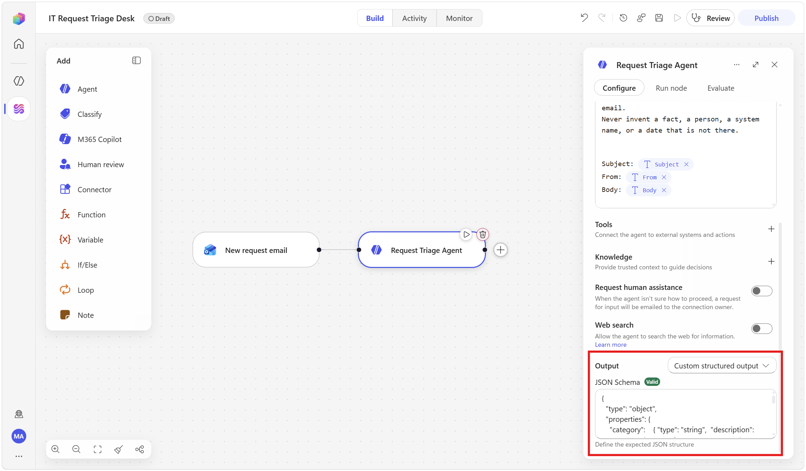

4. Select **Save**.

<details>
<summary>💡 <b>Concept — this is the pivot of the whole scenario</b></summary>

With **Text response** the agent hands you one blob of prose and you can do nothing structural with it. With **Custom structured output**, **each field becomes its own dynamic-content token**. That is what lets Step 4 drop `priority` into an Excel column and Step 6 branch on it. *AI produces structure; deterministic steps consume it.* Remember this pattern — it is the single most reusable idea in the pack.

</details>

> 🔤 **Token names arrive capitalised.** You wrote `category` and `owner_team` in lower case in the JSON schema, but the token picker lists them as **Category, Priority, Summary, Owner_team, Sla_hours, Ack_message**. Same values, different presentation.
> The catch: **the picker's search is case-sensitive**, so typing lower-case `category` returns nothing. Type only the part you are sure of — `Categ` — and pick from the list.

### 3e — Test the node before you go any further

1. With the agent node selected, open the **Run node** tab in its side panel.
2. The panel lists only the upstream fields your instructions actually reference — it will read something like *New request email · 3 of 34* with **From**, **Subject** and **Body**. Fill them by hand:
   - **Subject** → `[REQ] Cannot sign in to Teams - MFA prompt keeps looping`
   - **From** → your own email address
   - **Body** → `Since this morning the MFA prompt on Teams loops forever and I cannot get in. I have a customer call in 40 minutes. Tried restarting and clearing the cache.`
3. Select **Run**.
4. Read the **Output**. You should get six named fields back, with `category` = `Access`, `priority` = `High`, `owner_team` = `Identity`, `sla_hours` = `4`, and an `ack_message` in English.

<details>
<summary>💡 <b>Test the node, not the whole flow</b></summary>

Node-level testing runs this step in isolation — it is fast, it does not publish, and it does not trigger the rest of the workflow. Iterate on the instructions here until the output is right. Fixing a prompt is 20 seconds at this stage and 5 minutes after you have built five more nodes on top of it.

</details>

---

## Step 4 — Log the request to Excel

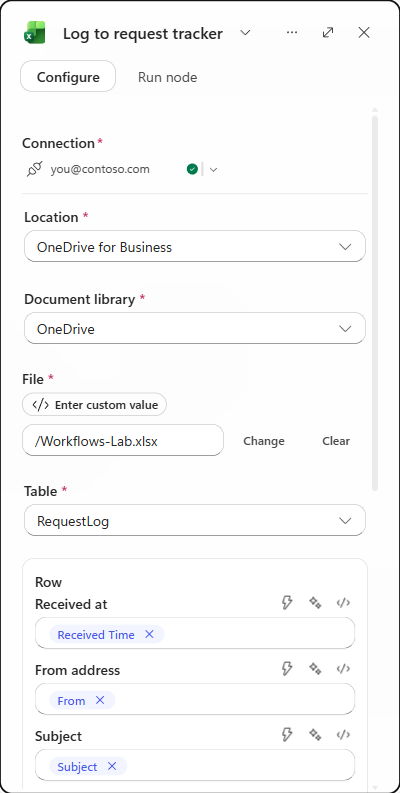

*Add a row into a table. Location, Document library, File and Table must all resolve before the Row fields appear.*

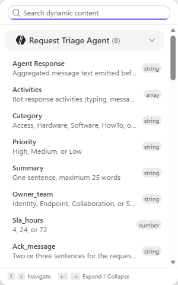

*The dynamic-content picker. Each field of a structured output becomes its own token, with its data type shown on the right.*

1. Below the agent node, select **Add a step**.
2. Search for `Add a row into a table` and choose it under **Excel Online (Business)**.
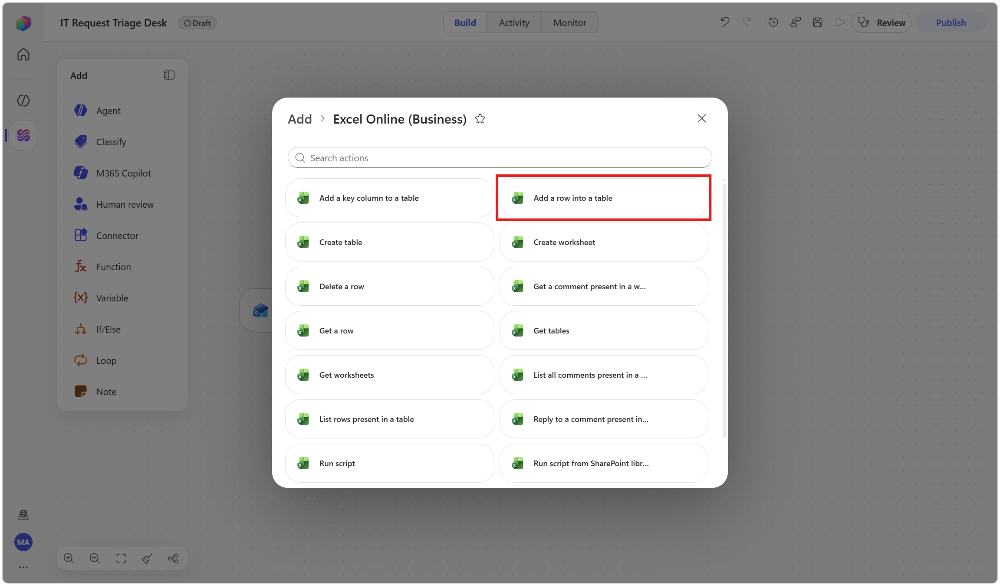
3. **Create the connection** if the node shows **Not connected** — chevron ⌄ → **Create new connection** → **Create** → pick your account in the popup. (See [Section 1.3](#13-connections--what-to-expect-the-first-time).)
4. Set the location parameters in order — each one loads the next:

   | Parameter | Value |
   |---|---|
   | Location | `OneDrive for Business` |
   | Document library | `OneDrive` — note it is **not** first in the list; `PersonalCacheLibrary` usually is |
   | File | click **Change**, then select `Workflows-Lab.xlsx` in the file tree |
   | Table | `RequestLog` |

   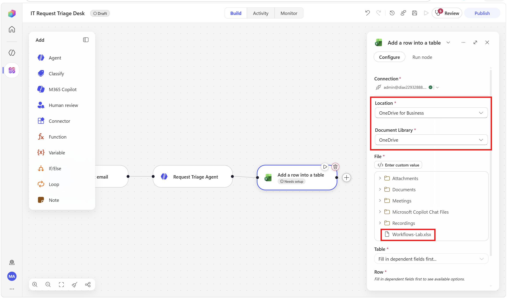

5. The nine table columns now appear as fields. Fill each one — type `/`, pause, filter, select:

   | Field shown | Token to insert | From |
   |---|---|---|
   | Received at | `Received Time` | New request email |
   | From address | `From` | New request email |
   | Subject | `Subject` | New request email |
   | Category | `Category` | Request Triage Agent |
   | Priority | `Priority` | Request Triage Agent |
   | Summary | `Summary` | Request Triage Agent |
   | Owner team | `Owner_team` | Request Triage Agent |
   | SLA hours | `Sla_hours` | Request Triage Agent |
   | Status | *type the literal text* `New` | — |

   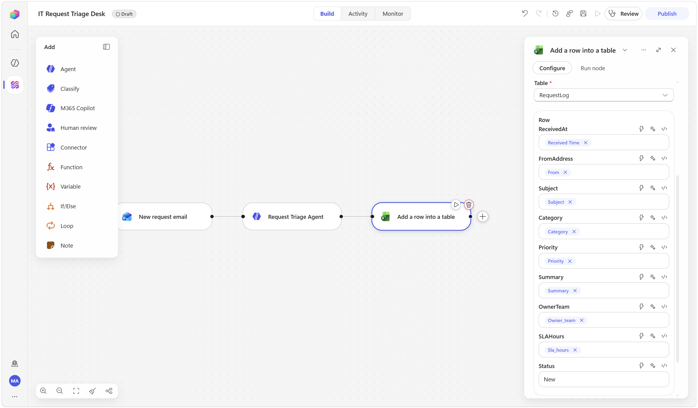

6. Rename the node to `Log to request tracker` and select **Save**.

> 📎 **The field labels are re-rendered.** The connector splits your header names for display, so
> `ReceivedAt` shows as "Received at" and `SLAHours` as "SLA hours". The underlying columns are
> unchanged.

> ⚠️ **If the Table dropdown is empty**, the workbook has headers but no *formatted table*. Go back to [Section 1.4](#14-prepare-the-excel-workbook-needed-for-scenario-1-and-scenario-4), select your header row, and use **Insert ▸ Table**. Also make sure the file is **closed** in your browser.

<details>
<summary>💡 <b>Notice what just happened</b></summary>

Eight of the nine columns were filled from tokens; only `Status` was typed. If you had used **Text response** on the agent, none of the six AI columns would have been possible.

</details>

---

## Step 5 — Acknowledge the sender

This runs for **every** request, urgent or not — which is why it goes here, *before* the branch.

1. Below **Log to request tracker**, select **Add a step**.
2. Search for `Reply to email` and choose it under **Office 365 Outlook**.
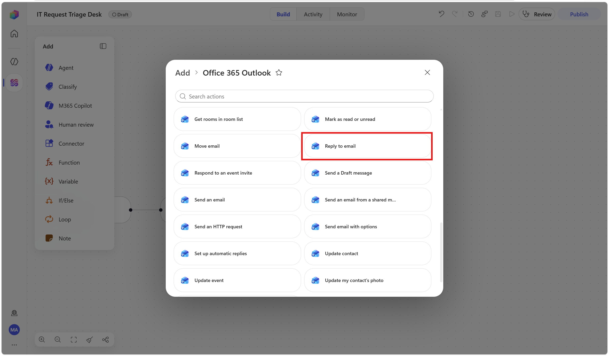
3. Configure:

   | Parameter | Value |
   |---|---|
   | **Message ID** | `Message Id` *(from New request email)* |
   | **Body** | `Ack_message` *(from Request Triage Agent)* |
   | Reply all | leave off |

   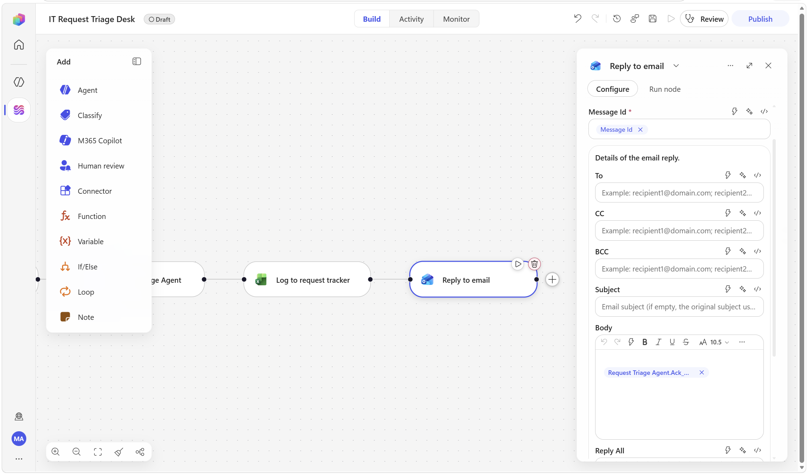

4. Rename the node to `Acknowledge the sender` and select **Save**.

> 📎 **The reply text goes in `Body`.** This connector version exposes **Message ID**, **To**, **CC**,
> **BCC**, **Subject**, **Body**, **Reply all**, **Importance** and **Attachments**. `Body` is a
> rich-text editor — insert the token there.

<details>
<summary>💡 <b>Why the agent wrote the acknowledgement</b></summary>

A canned "we received your request" reply teaches the sender to ignore your automation. The agent's `ack_message` restates *their specific problem* in *their own language* and commits to a real response time — which is the difference between an automation people trust and one they route around.

</details>

---

## Step 6 — Escalate high-priority requests to Teams

### 6a — Add the branch

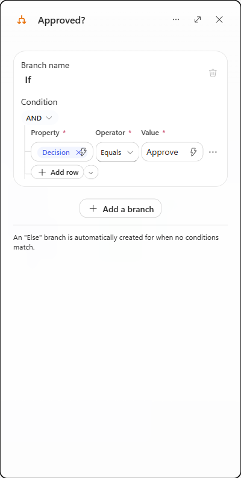

*The If/Else condition builder — Property, Operator, Value. The Else branch is created automatically.*

1. Below **Acknowledge the sender**, select **Add a step** and choose **If/Else**.
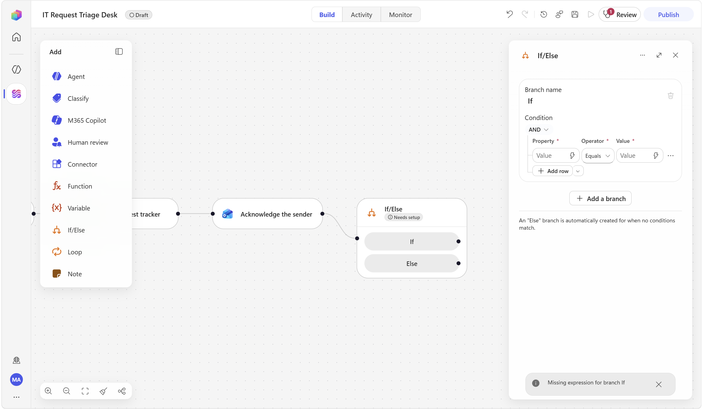
2. Configure the condition row — it is built from three parts, not free text:

   | Part | Value |
   |---|---|
   | **Property** | insert the `Priority` token from **Request Triage Agent** |
   | **Operator** | `Equals` |
   | **Value** | type `High` |

3. Rename the node to `Is it urgent?` and select **Save**.
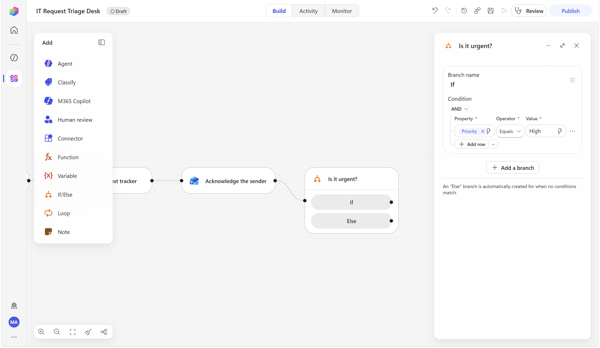
> 📎 **The branches are named If and Else**, and the **Else** branch is created for you automatically —
> the panel says so. Leave **Else** empty: a Medium or Low request is logged and acknowledged, and
> that is all it should be.

### 6b — Post the escalation on the If branch

1. On the **If** branch, select **Add a step**.
2. Search for `Post message in a chat or channel` and choose it under **Microsoft Teams**.
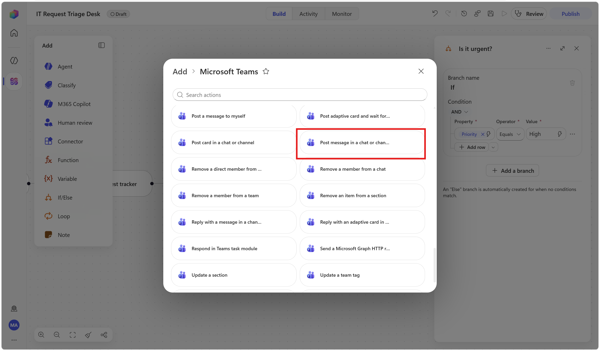
3. Set:

   | Parameter | Value |
   |---|---|
   | Post as | `Flow bot` *(already the default)* |
   | Post in | `Chat with Flow bot` |
   | Recipient | your own email address |

   *(Using a real channel instead? Set **Post in** to `Channel`, then pick `Workflow Lab` and `Alerts`.)*

4. In **Message**, type the following and insert the tokens where shown:

   ```
   HIGH PRIORITY REQUEST

   ⟨insert /Summary⟩

   Team:     ⟨insert /Owner_team⟩
   Category: ⟨insert /Category⟩
   Respond within ⟨insert /Sla_hours⟩ hours.

   From:    ⟨insert /From⟩
   Subject: ⟨insert /Subject⟩
   ```
   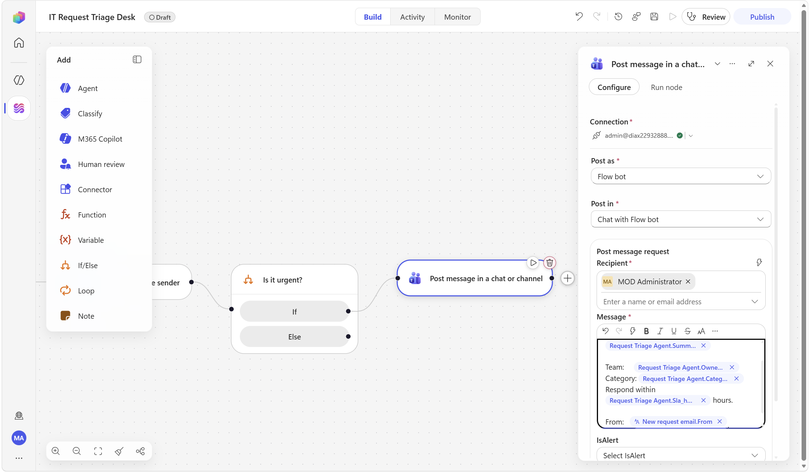
5. Rename the node to `Escalate to on-call` and select **Save**.

> 🚨 **Read the chips carefully in this step.** Now that the Excel node exists, the picker contains
> **two** tokens called `Category`, two called `Subject`, two called `Summary` and so on — because
> *Add a row into a table* returns the row it just created. Picking the first match silently binds you
> to `Log to request tracker.Category` instead of `Request Triage Agent.Category`. Both "work", so
> nothing errors; you just get the wrong data. Confirm every chip reads the node you intended.

<details>
<summary>💡 <b>Concept — deterministic vs. AI</b></summary>

The agent decided *what* the priority is; the If/Else decided *what to do about it*. Never ask an AI step to do something a rule can do reliably: a branch is faster, free, auditable, and it always behaves the same way.

</details>

---

## Step 7 — Publish, run and verify


*The designer command bar: Build / Activity / Monitor tabs on the left, and Save, Run, Review and Publish on the right.*

1. Check the **Review** button in the command bar — it shows a problem count if anything is incomplete. Then select **Publish**.

   The badge beside the title flips **Draft → Published** and the Publish button greys out with *"No changes to publish"*.

   > ⚠️ A workflow only listens for its trigger **after it is published**. If you send the test email first, nothing happens.

2. From Outlook, send yourself a test email. Copy one of these:

   **Test A — should come back High / Identity**
   ```
   Subject: [REQ] Cannot sign in to Teams - MFA prompt keeps looping

   Since this morning the MFA prompt on Teams loops forever and I cannot get in.
   I have a customer call in 40 minutes. I already restarted and cleared the cache.
   ```

   **Test B — should come back Low / Collaboration**
   ```
   Subject: [REQ] How do I share an Excel file with an external partner?

   No rush at all. I would like to send a workbook to a partner outside the
   company and I am not sure which sharing option is allowed. Whenever you have time.
   ```

   **Test C — Korean, should come back Medium or High / Endpoint**
   ```
   Subject: [REQ] 노트북 배터리가 30분 만에 방전됩니다

   지난주부터 완충해도 30분이면 꺼집니다. 외근이 많아 계속 전원을 찾아다니고 있습니다.
   교체가 가능한지 확인 부탁드립니다.
   ```

3. Open the **Activity** tab and wait for the run to appear, then select it to load it onto the canvas.

   > ⏱️ Be patient. The mail trigger polls, so a run typically appears within a minute or two. A complete run takes roughly 30 seconds.

4. Select each node on the loaded run to inspect the real inputs and outputs it received.
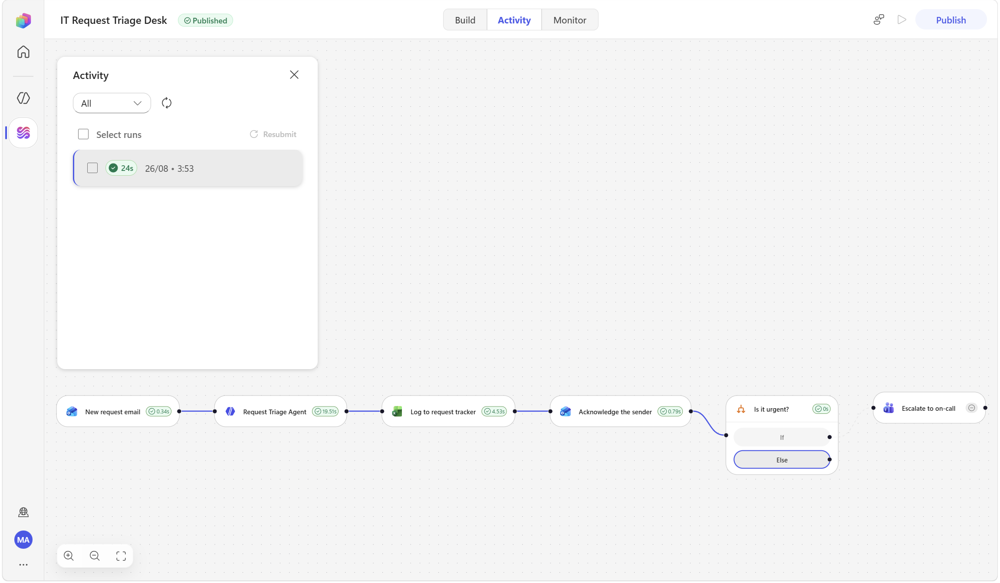
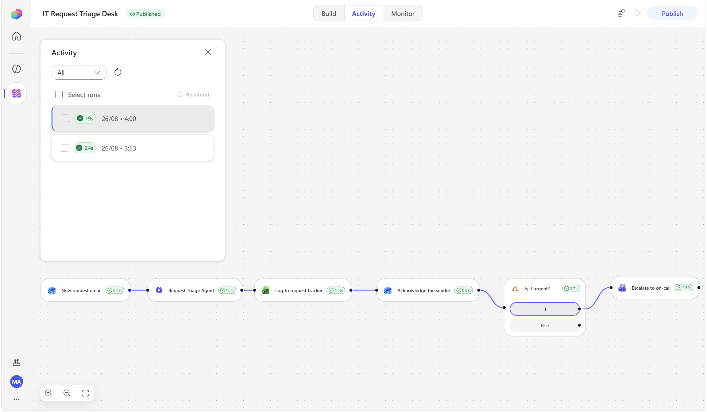
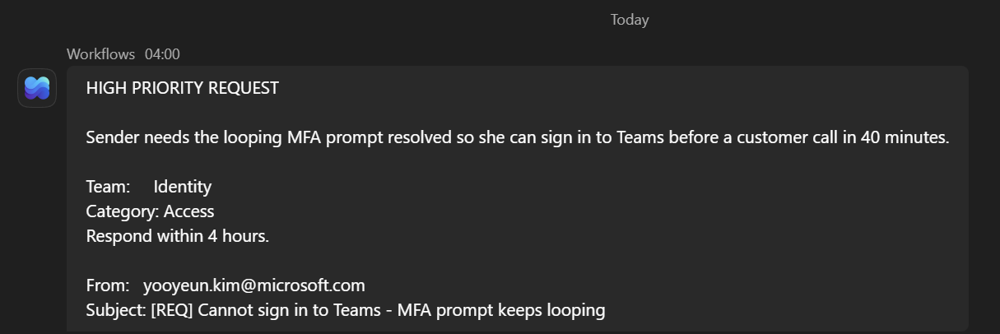

### ✅ Verify all four outcomes

| Where | What you should see |
|---|---|
| **Excel** — `Workflows-Lab.xlsx`, `RequestLog` sheet | A new row with all nine columns filled, `Status` = `New`. It lands in **row 3** (row 2 is the table's blank starter row). |
| **Outlook** — the test thread | A reply that restates *your* problem, in *your* language, with a stated response time |
| **Teams** — your Flow bot chat | An escalation message for Test A and Test C, **and nothing for Test B** |
| **Activity** panel | A **Succeeded** run you can open node by node |

Send Test B specifically to prove the **Else** path works. A workflow that alerts on everything is the same as a workflow that alerts on nothing.

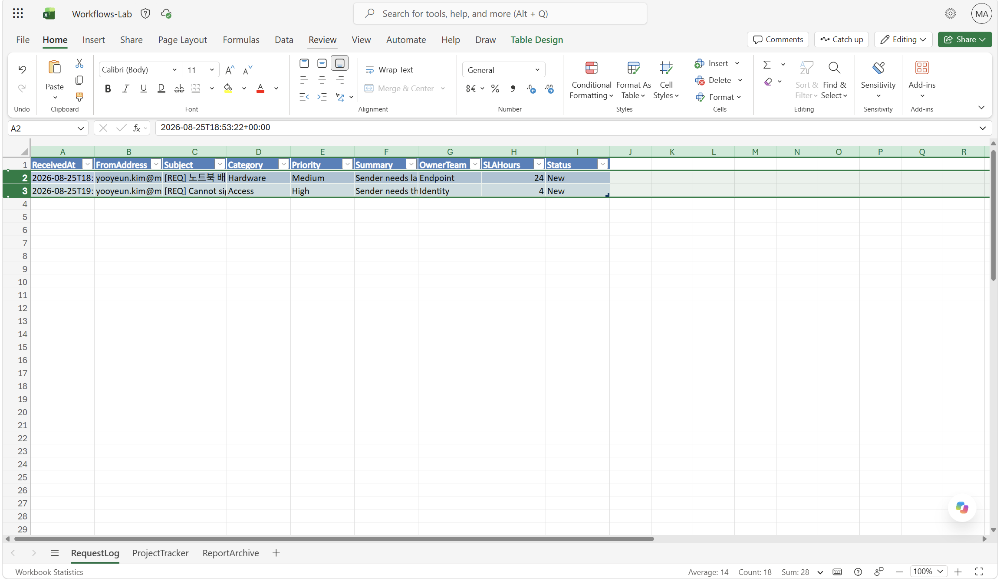

### Optional extensions

| Extension |
|---|
| **Add an M365 Copilot node** between the trigger and the agent. Message: `Have we seen a request like this before? Search my mail and chats for prior cases matching:` + `/Subject`. Feed its **Body / Response** into the agent's instructions as extra context so triage improves with your organisation's history. |
| **Add a human gate for High priority.** On the **If** branch, insert a **Human review** node before the Teams post, with one Yes/No input `PageOnCall`. Only page someone when a human confirms. |
| **Deduplicate.** Add **Excel Online (Business) ▸ List rows present in a table** before the agent and pass recent subjects into the instructions so it can flag `duplicate_of`. |

---

# Scenario 2 — Reply Desk with Approval

**Core nodes: M365 Copilot · Human review · If/Else · Agent · Outlook · Teams**

### The problem this solves

Questions arrive that you *could* answer in three minutes if you could remember where the answer lives — which thread, which meeting, which decision. So they sit in the inbox for two days, and then you write a rushed reply.

Microsoft 365 Copilot already has that context. This workflow puts it to work — but it will not send anything on your behalf without a human saying yes. That is the pattern almost every organisation actually wants: **AI drafts at machine speed, a human commits at human speed.**

### What you will build

```
[Trigger]  Office 365 Outlook — When a new email arrives
           Folder: Inbox · Subject filter: [Ask]
    ▼
[M365 Copilot]  Draft a reply, grounded in my mail, files, meetings and chats
    │           Time zone: Asia/Seoul        → token: Body / Response
    ▼
[Human review]  emailed to the approver — the run sits at Waiting
    │           inputs: Decision (Approve / Reject) · ChangeRequest (optional)
    ▼
[If/Else]  Decision  Equals  Approve
    ├── If ───▶ [Agent]  apply the reviewer's change request to the draft
    │            ▼
    │           [Outlook] Reply to email
    └── Else ─▶ [Teams]  tell me the reply was suppressed
```

---

## Step 1 — Create the workflow and trigger

1. **Workflows ▸ New workflow**. Rename the title to:

   ```
   Reply Desk with Approval
   ```

2. Select the **Start** node, set **Trigger type** to **Connector**, and in the dialog choose **Office 365 Outlook ▸ When a new email arrives**.
3. Configure it exactly as in Scenario 1:
   - **Folder** — click **Change**, then select **Inbox** in the tree.
   - **Advanced parameters ▸ Show all**, then **Subject filter** = `[Ask]`
4. Rename the node to `New question email`. Select **Save**.
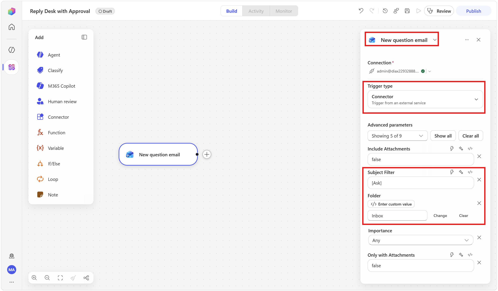

> ⚠️ **If you also built Scenario 1**, the subject filters must differ — `[REQ]` and `[Ask]`. Two workflows watching the same inbox with overlapping filters will both fire on the same message and you will spend the rest of the session wondering why.

---

## Step 2 — Draft the reply with M365 Copilot

1. Below the trigger, select **Add a step** and choose the **M365 Copilot** tile.
2. The node opens showing **Not connected**. Create the connection: click the **chevron ⌄** on the **Connection** field → **Create new connection** → **Create** on the *M365 Copilot (V2)* dialog → pick your lab account in the popup. (Clicking the large *"Connect to M365 Copilot"* placeholder in the body does nothing.)
3. In the **Message** field, type the text below, inserting tokens with `/` where shown:

   ```
   Draft a reply to the email below, written on my behalf.

   Use my Microsoft 365 content - my recent mail, files, meetings and chats - to
   ground the answer in what my team has actually said and decided. Where you use
   something you found, say briefly where it came from, for example "as we agreed
   in Tuesday's review". If you cannot find grounding for a point, say plainly that
   you will follow up with the detail rather than inventing it.

   Subject: ⟨insert /Subject⟩
   From:    ⟨insert /From⟩
   Body:    ⟨insert /Body⟩

   Write the reply as a plain-text email body in the same language as the incoming
   email. Keep it under 150 words. Use short paragraphs. End with one clear next
   step and an owner for it.

   Do not include a subject line, a greeting header block, or a signature.
   Return only the reply text and nothing else.
   ```
   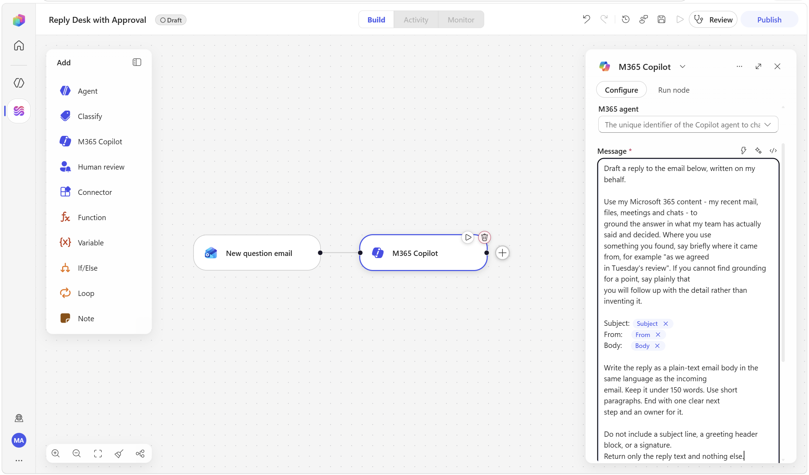

4. Set the **Time zone**. It is already visible under **Advanced parameters** (*Showing 2 of 3*) and it takes an **IANA identifier**:

   ```
   Asia/Seoul
   ```

5. Rename the node to `Draft reply with Copilot`. Select **Save**.
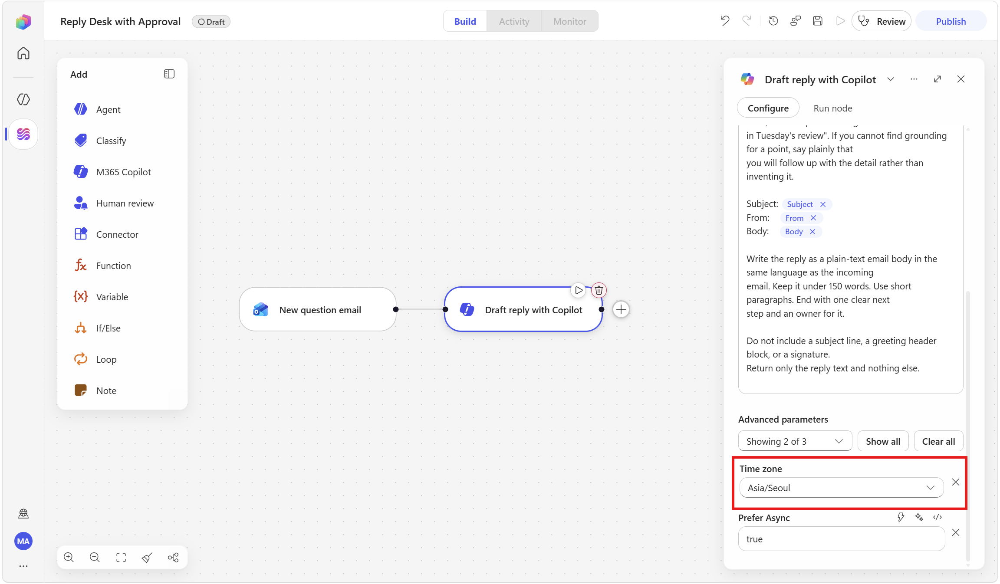

> ⏰ **This field defaults to `America/New_York`.** Not UTC, not your tenant's region. Leave it alone and every relative phrase — "today", "this week", "yesterday's meeting" — resolves in New York time. Set it deliberately.

<details>
<summary>💡 <b>Concept — why this node and not an agent node</b></summary>

The M365 Copilot node runs **as the user in its Connection field** and is grounded in that user's mail, files, calendar and chats out of the box. An agent node would need tools and knowledge wired up to get anywhere near the same context. Rule of thumb: **reuse what Microsoft 365 already knows → M365 Copilot node. Build automation-specific behaviour → agent node.** Step 5 uses the agent node for exactly that reason, so you will see both in one workflow.

</details>

> 🔐 **Say this out loud in the room.** Whatever the connected user can see in Microsoft 365, this node can use. The connection account is a security decision, not a convenience one. Never point this node at a shared or elevated account.

### Test it now

Open the node's **Run node** tab, paste a Subject, From and Body by hand, and select **Run**. Read the draft. If it is too long, too formal, or invents facts, fix the Message here — not later.

> 📤 **The answer comes back as `Body / Response`.** This node returns six tokens — *Body*, *Body / Conversation ID*, *Body / Response*, *Body / Citations*, *See More URL* and *Type*. The drafted text is **Body / Response** (described as "The response from the Copilot agent"). There is no token called simply "Response", so filter for `Response` and pick the entry whose description matches.

---

## Step 3 — Add the human review gate

### 3a — Add the node

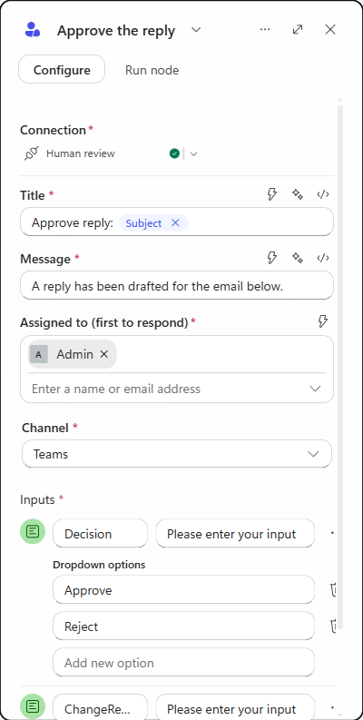

*A Human review node. The two inputs are `Decision` and `ChangeRequest` — the label box is narrow, so the second one displays as `ChangeRe...`; type the full name. Each input becomes a token carrying the reviewer's answer, and a text input can be given dropdown options.*

1. Below the Copilot node, select **Add a step** and choose the **Human review** tile. That single tile adds the node — there is no sub-item to pick.

2. The connection binds automatically.
3. Rename the node to `Approve the reply`.

### 3b — Configure the four fields

| Field | What to enter |
|---|---|
| **Title** | Type `Approve reply: ` then insert the `/Subject` token. *(This becomes the subject line of the email the approver receives.)* |
| **Message** | The block below — insert tokens where shown. |
| **Assigned to (first to respond)** | Your own email address. Pick the resolved entry from the dropdown. |
| **Channel** | `Outlook`, or `Teams` if you want the request to arrive faster — see the note below. |

**Message:**

```
A reply has been drafted for the email below. Review the draft and choose
whether to send it.

--- ORIGINAL MESSAGE ---
From: ⟨insert /From⟩
Subject: ⟨insert /Subject⟩

⟨insert /Body⟩

--- DRAFTED REPLY ---
⟨insert /Body / Response from Draft reply with Copilot⟩

--- HOW TO RESPOND ---
Choose Approve to send it. Leave ChangeRequest empty to send the draft exactly
as it is, or describe in one or two sentences what you want changed and it will
be revised before sending.
```
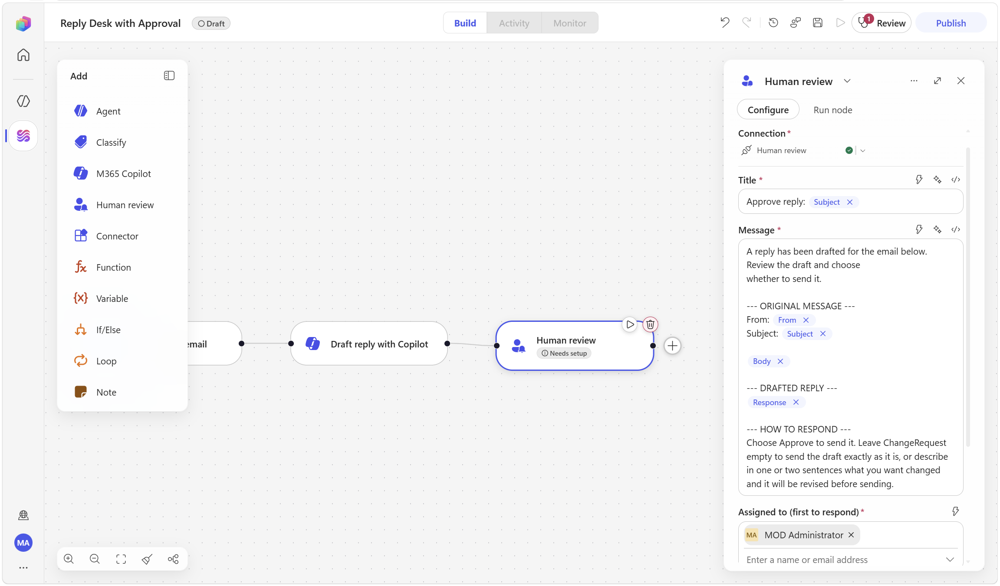

> 📬 **Three things to know about Human review before you build on it:**
> 1. **The field name states the rule** — *Assigned to (first to respond)*. If you assign three people, only the first submission is processed.
> 2. **Requests cannot be sent outside your tenant.** Assign to an internal address.
> 3. **`Channel` supports Outlook or Teams.** This lab uses Outlook because the emailed form carries the full draft, which is easier to review. Teams delivery is available if you prefer a card.

### 3c — Define the inputs

Each input you define becomes a dynamic-content token carrying the human's answer.

1. Select **Add an input** and choose type **Text**.
   - The label box arrives **pre-filled with `Text`**. Click it, press **Ctrl+A**, **Delete**, then type:
     ```
     Decision
     ```
   - Open the input's **⋯** menu (*More options for Decision*) and choose **Add dropdown**.
   - An **Option 1** box appears, **pre-filled with `First option`**. Click it, **Ctrl+A**, **Delete**, then type:
     ```
     Approve
     ```
   - Click **Add new option** and type:
     ```
     Reject
     ```

2. Select **Add an input** again, choose **Text**, clear the pre-filled label and name it:
   ```
   ChangeRequest
   ```
   Open its **⋯** menu and choose **Make optional**.

3. Select **Save**.
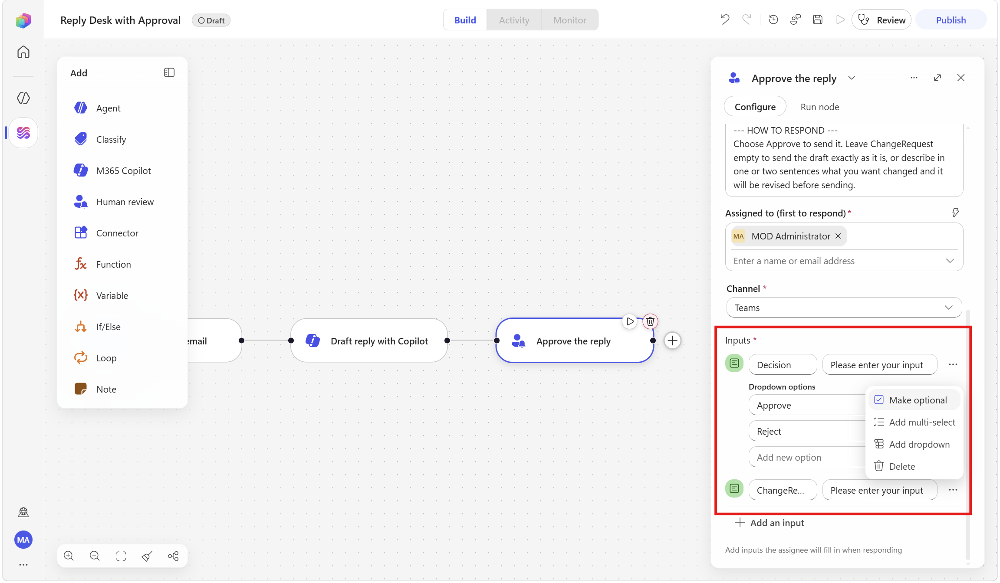

<details>
<summary>💡 <b>Concept — a review gate is not just an approval button</b></summary>

A yes/no gate makes a human a rubber stamp. Adding one optional free-text field turns the same node into a *collaboration* step: the reviewer can steer the outcome without rewriting anything. That single field is the difference between an automation people accept and one they switch off.

</details>

<details>
<summary>💡 <b>By design vs. by judgement</b></summary>

You just placed this gate deliberately — *human-in-the-loop by design*. The alternative is *by judgement*: turning on **Request human assistance** on an agent node so it escalates on its own. Use *by design* when the action is always high-stakes (sending mail as you), and *by judgement* when only the edge cases are.

</details>

---

## Step 4 — Branch on the decision

1. Below the review node, select **Add a step** and choose **If/Else**.
2. Configure the condition:

   | Part | Value |
   |---|---|
   | **Property** | insert the `Decision` token from **Approve the reply** |
   | **Operator** | `Equals` |
   | **Value** | type `Approve` |

3. Rename the node to `Approved?`
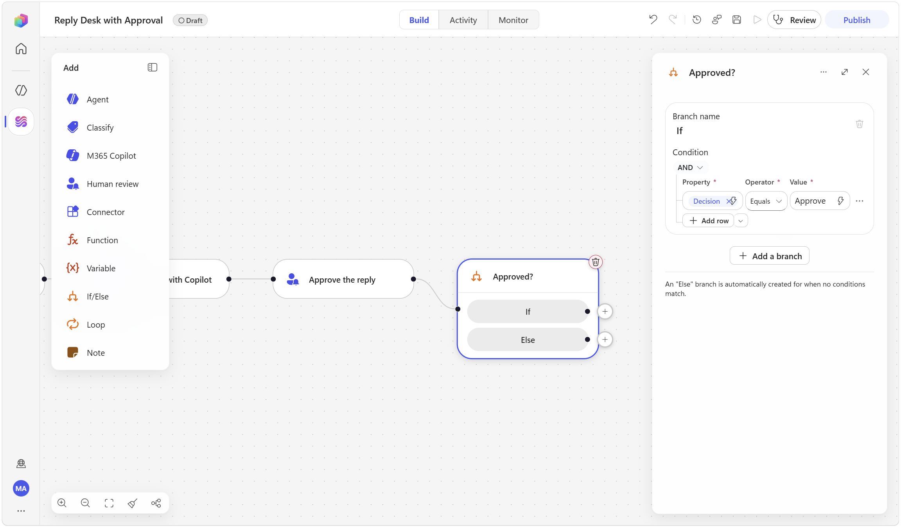
4. On the **Else** branch, select **Add a step ▸ Microsoft Teams ▸ Post message in a chat or channel**:

   | Parameter | Value |
   |---|---|
   | Post as | `Flow bot` |
   | Post in | `Chat with Flow bot` |
   | Recipient | your own email address |
   | Message | `Reply suppressed by reviewer - ` then insert `/Subject` |

5. Rename it to `Tell me it was suppressed`. Select **Save**.
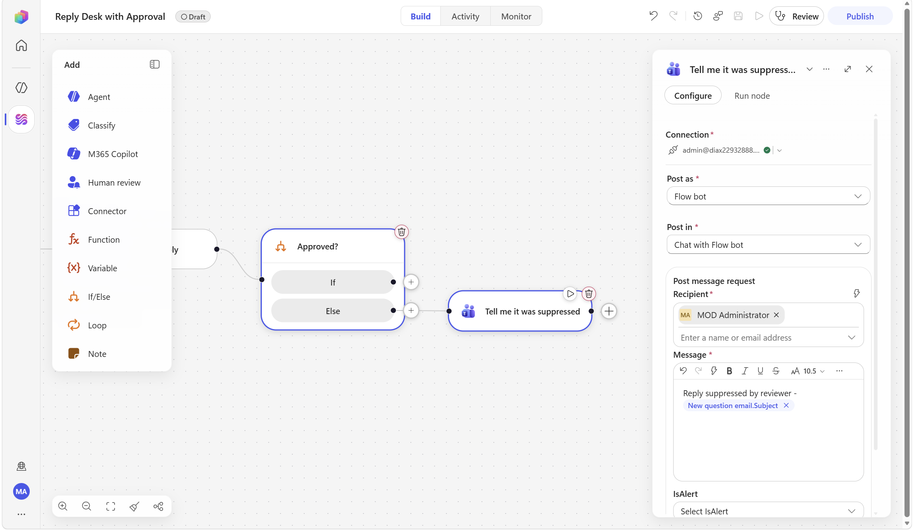

---

## Step 5 — Apply the feedback, then reply

### 5a — The finaliser agent (on the If branch)

1. On the **If** branch, select **Add a step** and choose the **Agent** tile.
2. Leave **Agent** on **New agent for this workflow**. Rename the node to `Apply reviewer feedback`.
3. In **Instructions**, enter:

   ```
   You finalise an email reply just before it is sent.
   Return only the final email body. No preamble, no explanation, no subject line,
   no signature, no quotation marks around the result.

   DRAFTED REPLY:
   ⟨insert /Body / Response from Draft reply with Copilot⟩

   REVIEWER'S CHANGE REQUEST:
   ⟨insert /ChangeRequest from Approve the reply⟩

   Rules:
   - If the change request is empty, return the drafted reply completely unchanged.
   Do not "improve" it. Do not reword it.
   - If the change request has content, apply it faithfully and return the full
   revised reply.
   - Never add a fact that appears in neither the draft nor the change request.
   - Keep the language of the draft.
   ```
   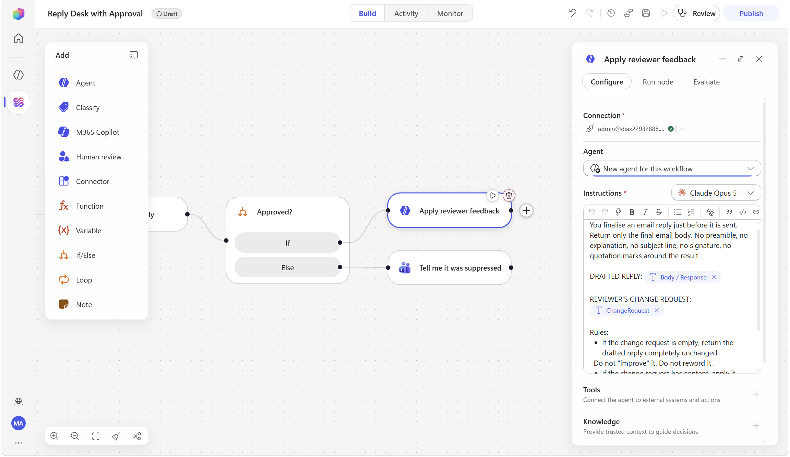

4. Leave **Output** on **Text response**. Add **no tools** — this agent only needs to read and reason.
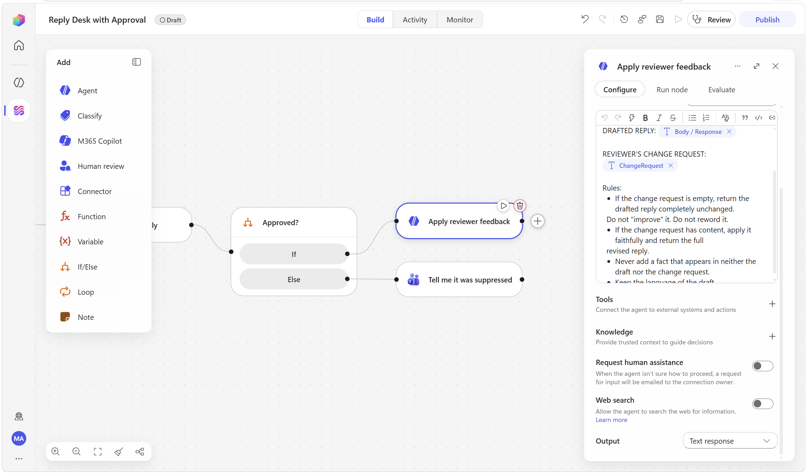
5. Select **Save**.

<details>
<summary>💡 <b>Concept — an agent node with no tools is still an agent node</b></summary>

Tools let an agent *act*; without them it can only read and reason. Here, reasoning is all you want. Notice too that the instruction explicitly forbids unrequested improvement — without that line, the model will helpfully rewrite a reply a human already approved, and your approval gate silently stops meaning anything.

</details>

### 5b — Send the reply

1. Below the agent, on the same **If** branch, select **Add a step ▸ Office 365 Outlook ▸ Reply to email**.
2. Configure:

   | Parameter | Value |
   |---|---|
   | **Message ID** | `Message Id` *(from New question email)* |
   | **To** | `From` *(from New question email)* |
   | **Body** | `Agent Response` *(from Apply reviewer feedback)* |
   | Reply all | False (default) |

   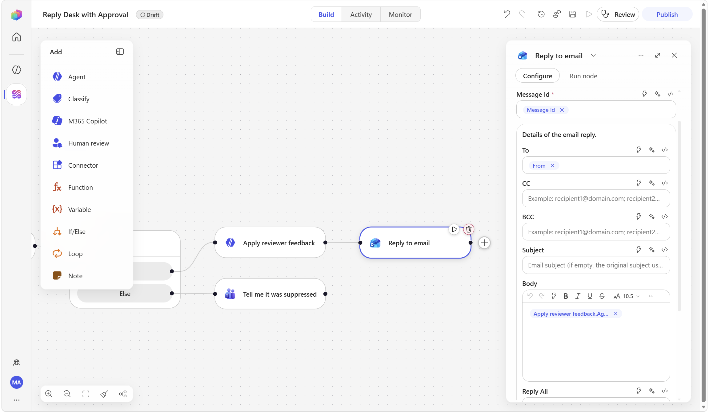

3. Rename the node to `Send the approved reply`. Select **Save**.

> 📤 **An agent set to Text response returns one token: `Agent Response`** (described as "The agent response text"), prefixed by its node name — so the chip reads `Apply reviewer feedback.Agent Response`.

---

## Step 6 — Publish, run, approve, verify

1. Select **Publish**.
2. Send yourself a test email. **Choose a topic that genuinely exists in your mailbox** — that is what makes the Copilot grounding visible rather than generic.

   **Test A — grounded question**
   ```
   Subject: [Ask] Where did we land on the Teams Phone migration timeline?

   Hi - could you confirm the current plan for the Seoul HQ cutover, and whether
   the pilot group feedback changed anything? I need to brief my team on Friday.
   ```

   **Test B — a question with no grounding, to prove it does not bluff**
   ```
   Subject: [Ask] Can you confirm the Q4 budget number for the Busan site?

   I need the approved figure before I submit the forecast.
   ```

3. Watch **Activity**. The run reaches the review node and shows **Waiting**.
4. **Open the channel you chose in Step 4.** You receive a request titled `Approve reply: [Ask] …` containing the original message, the draft, and the form.

   > 🔒 **Outlook only:** if Outlook shows a **"blocked content"** banner, click **Show blocked content** — the interactive form will not render until you do.
   >
   > ⏱️ **If nothing arrives, do not assume you built it wrong.** The node shows **Waiting** and the run reports no error whether the card arrives in ten seconds or not at all — there is no failure to read.

5. Respond on separate test emails to see all three paths. **Write the change request so you can prove it was applied** — ask for something measurable *and* for a specific word that does not appear anywhere in the draft:
   - **Run 1** — `Decision` = `Approve`, `ChangeRequest` = *empty*. Select **Submit**.
   - **Run 2** — `Decision` = `Approve`, `ChangeRequest` = `Make it much shorter - two sentences maximum - and add that I will confirm the approved method by Wednesday.` Select **Submit**.
   - **Run 3** — `Decision` = `Reject`. Leave `ChangeRequest` empty.
6. The workflow resumes within a minute of each submission.
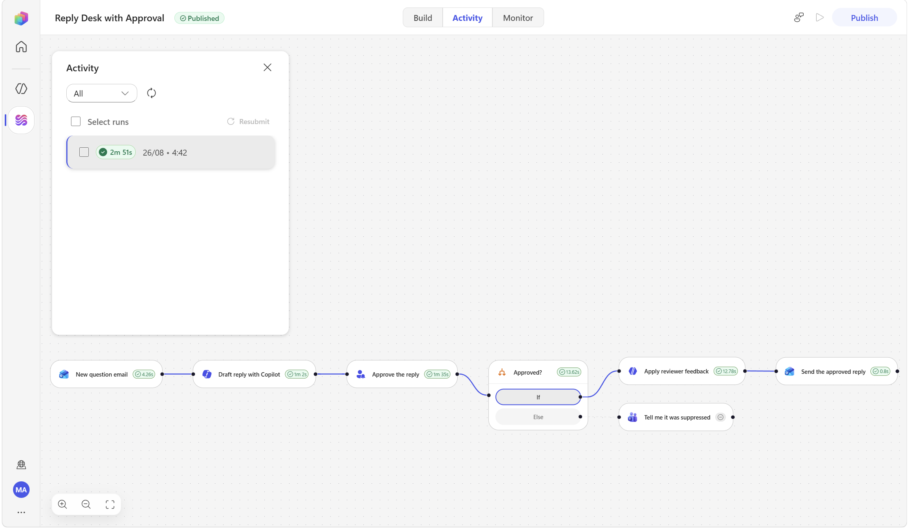
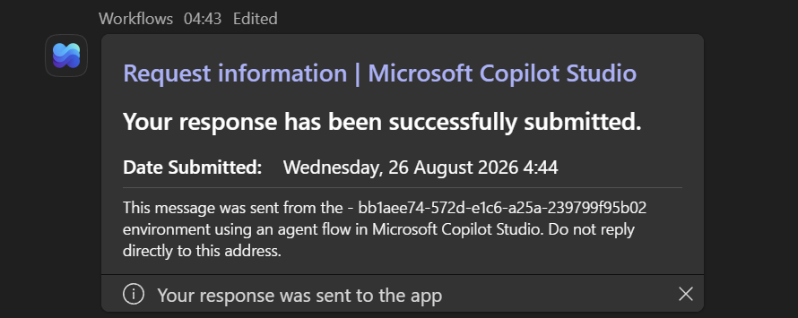
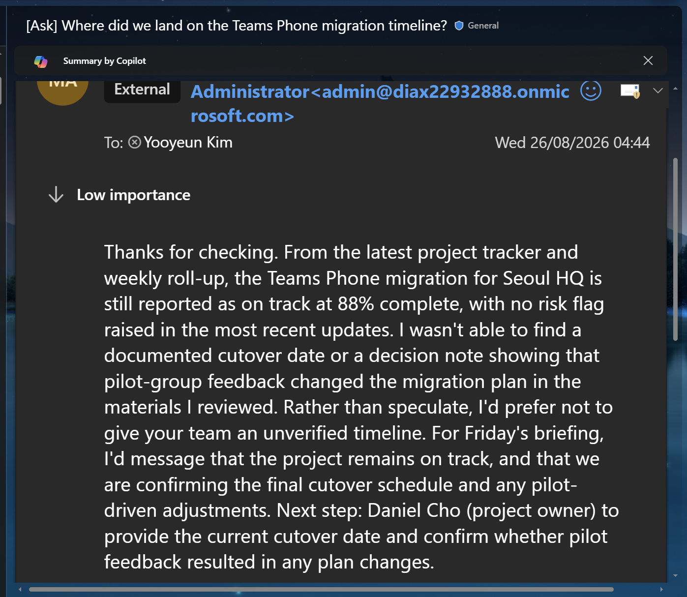
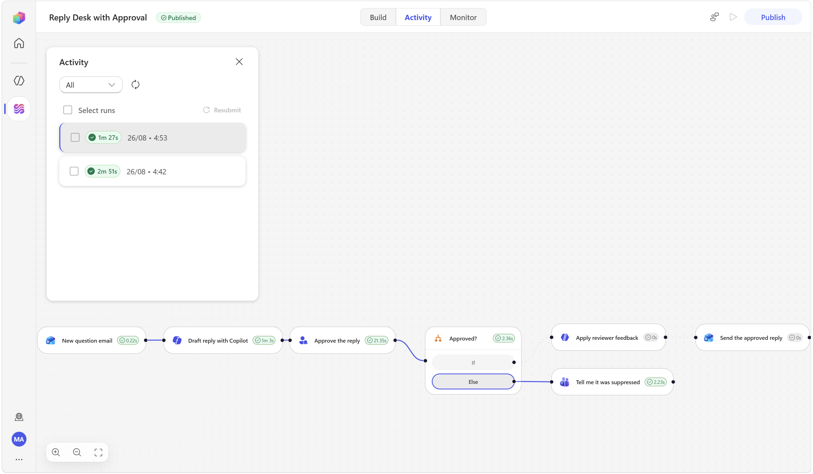

> **Run 3:** a rejected run sends nothing, so nothing re-enters the inbox and no extra run appears.

### ✅ Verify

| Where | What you should see |
|---|---|
| **Review channel** — approval request | A form containing the original message *and* the draft, with your two inputs |
| **Outlook** — Run 1 thread | A reply matching the draft **word for word** |
| **Outlook** — Run 2 thread | A reply cut to the length you demanded **and containing the word you asked for** (`Wednesday`) — proof the agent revised rather than resent |
| **Teams** — Run 3 | `Reply suppressed by reviewer - [Ask] …`, and the Outlook thread still holds **exactly one message** — the original, with no reply |
| **Activity** panel | A run showing **Waiting** while the gate is open, then **Succeeded** |

> 🔍 **How to prove the branch really fired, not just that "something happened".** Open the finished run, select the **Approved?** node, and read its inputs. It states the comparison in plain text — for a rejected run:

### Optional extensions

| Extension |
|---|
| **Audit trail.** After the reply, add **Excel Online (Business) ▸ Add a row into a table** writing `ReceivedAt`, `Subject`, `Decision` and `ChangeRequest` to a log table. In a regulated environment this is usually the step that gets the workflow approved for production. |
| **Target a specialist agent.** On the M365 Copilot node, set the **M365 agent** field to a specialist agent and compare the draft against the default. |
| **Route the approval by topic.** Add an If/Else before the review node and set **Assigned to** differently per topic, so pricing questions go to one approver and technical questions to another. |
| **Switch the gate to Teams.** Change **Channel** to `Teams` and compare the reviewer experience. |

---

# Scenario 3 — Daily Brief 8AM

**Core nodes: Recurrence trigger · M365 Copilot · Agent · Teams**

### The problem this solves

The first 25 minutes of the working day are spent reconstructing the day: what meetings are there, what did I not answer yesterday, what do I need to have read before 10:00. It is real work, it happens every single day, and it produces nothing.

Microsoft 365 Copilot can already answer all of it. What it cannot do on its own is *show up without being asked*. That is what a scheduled workflow adds — and it is the cleanest demonstration in this pack of the difference between a chat assistant and an autonomous workflow.

### What you will build

```
[Trigger]  Recurrence — every weekday at 08:00, (UTC+09:00) Seoul
    ▼
[M365 Copilot]  Read my day: meetings · unanswered mail · prep · free time
    │           Time zone: Asia/Seoul        → token: Body / Response
    ▼
[Agent]    "Format the brief"  (new inline agent, no tools)
    │      Output: Text response  →  a fixed, scannable layout + Top 3
    ▼
[Teams]    Post message  →  lands in chat before you open your laptop
```

---

## Step 1 — Create the workflow and the schedule

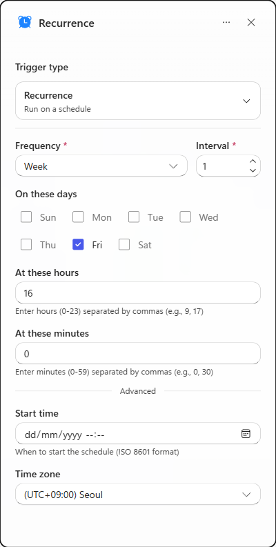

*A Recurrence trigger. Set Frequency first, then the days, hours and minutes. Time zone sits under the Advanced divider.*

1. **Workflows ▸ New workflow**. Rename the title to:

   ```
   Daily Brief 8AM
   ```

2. Select the **Start** node and set **Trigger type** to **Recurrence** (*Run on a schedule*) — the clock option, between Manual and Connector.

3. Configure the recurrence **in this order**, because the fields depend on each other:

   | # | Parameter | Value | Note |
   |---|---|---|---|
   | 1 | **Frequency** | `Week` | Set this **first** |
   | 2 | **Interval** | `1` | Already the default |
   | 3 | **On these days** | tick `Mon` `Tue` `Wed` `Thu` `Fri` | Appears **only** once Frequency = Week |
   | 4 | **At these hours** | `8` | |
   | 5 | **At these minutes** | `0` | |
   | 6 | **Advanced ▸ Time zone** | `(UTC+09:00) Seoul` | |

   > 📎 **What the fields actually look like.** *On these days* is a row of seven **checkboxes** (Sun–Sat) — `Sun` is ticked by default, so untick it. *At these hours* and *At these minutes* are comma-separated **text boxes**; the greyed `9, 17` and `0, 30` you see are placeholder hints, not values. **Time zone** and **Start time** sit below an **Advanced** divider, and Time zone defaults to *(UTC) Coordinated Universal Time*.

4. Select **Save**.
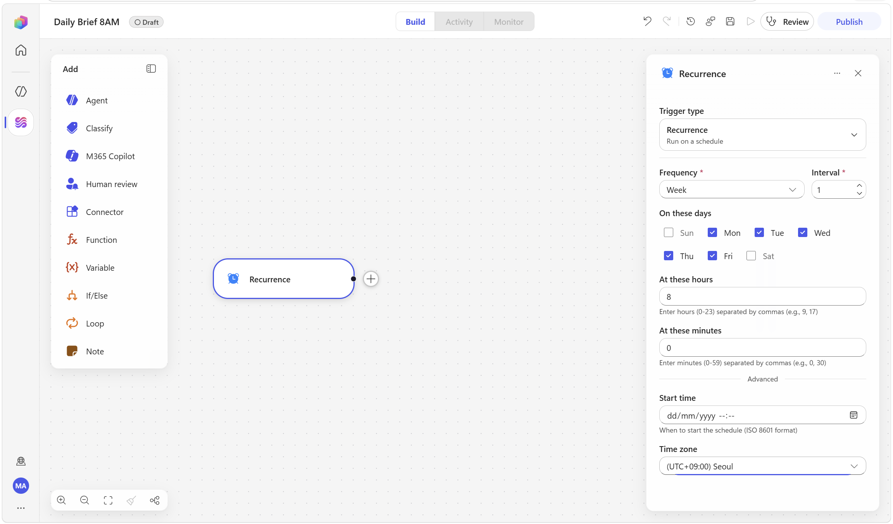

<details>
<summary>💡 <b>Concept — this is the other half of "trigger"</b></summary>

Scenarios 1 and 2 were **event-driven**: something happened, so the workflow ran. This one is **schedule-driven**: nothing happened, and the workflow runs anyway. Most teams reach for event triggers first and then discover that half of their real toil is on a clock — morning briefs, Friday reports, month-end checks, licence reviews.

</details>

> ⏰ **You will set a time zone twice in this scenario, in two different formats.** Here it is a display name (`(UTC+09:00) Seoul`) and it controls **when the workflow runs**. On the next node it is an IANA identifier (`Asia/Seoul`) and it controls **what "today" means to Copilot**. Getting one right and the other wrong produces a brief that looks perfect and is a day out.

---

## Step 2 — Read the day with M365 Copilot

1. Below the trigger, select **Add a step** and choose the **M365 Copilot** tile.
2. If the node shows **Not connected**, create the connection via the **chevron ⌄ ▸ Create new connection ▸ Create** ([Section 1.3](#13-connections--what-to-expect-the-first-time)). If you built Scenario 2 first, it binds silently.
3. In the **Message** field, enter this exactly:

```
Prepare my morning brief for today.

1. MEETINGS
List every meeting on my calendar today. For each one give the start time, the
title, and who organised it. Add one short clause saying what it is actually
about, based on the invitation and any related mail or chat.

2. NEEDS A REPLY
List up to five emails from the last two working days that are waiting on me
and have not been answered. For each, give the sender, the subject, and in one
clause what they are actually asking me for.

3. PREPARE
Name up to three things I should read, decide or bring before my first meeting,
and say in a few words why each one matters.

4. QUIET TIME
Identify the longest uninterrupted gap in my calendar today, with its start and
end time.

Rules:
- If a section has nothing in it, write "Nothing today." and move on.
- Never invent a meeting, a sender, a subject or a time. Use only what you find
  in my Microsoft 365 content.
- Return plain text. No tables.
```

4. Set **Time zone** (under **Advanced parameters**, already visible) to:

   ```
   Asia/Seoul
   ```

5. Rename the node to `Read my day`. Select **Save**.
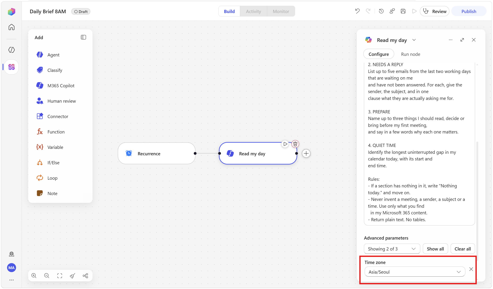

<details>
<summary>💡 <b>Concept — grounding is the whole point</b></summary>

No prompt engineering can make a general model know that your 10:00 is a customer escalation. That information does not live in the model — it lives **inside your Microsoft 365**.

This node runs **as the user named in the Connection field** and reads that user's mail, files, calendar and chats directly. Think back to what you just built: you added **no connector actions at all** to fetch a calendar or a mailbox. Assembling the same result from Outlook actions would mean wiring up event lookups, mail lookups, sorting and merging by hand. That gap is the reason to reach for the M365 Copilot node.

</details>

### Test it now

Open the node's **Run node** tab and select **Run**. A Recurrence trigger has no inputs to mock, so this runs immediately. Expect it to take up to a minute.

Read the output critically:

| Symptom | Fix |
|---|---|
| It reported the wrong day | **Time zone** is wrong — it must be `Asia/Seoul`, not `(UTC+09:00) Seoul` and not the default `America/New_York` |
| It returned a meeting you do not have | Strengthen the "never invent" rule; check the connection account is yours |
| Sections are missing | Number your sections in the Message (already done) and re-run |
| It is enormous | Add `Keep each section to at most 5 lines.` |
| *"I found no calendar events today…"* | **This is correct behaviour, not a bug** — the mailbox genuinely has nothing. Test with a day that has meetings, or accept the empty brief and move on. |

> ✅ **Check the date in the response.** A correct run opens with today's real date in your time zone. That one line proves the whole grounding chain is working.

---

## Step 3 — Format the brief with an agent

Copilot's answer is accurate but its shape changes from day to day. A brief you read at 08:00 every morning has to be *the same shape every morning* — otherwise you read it instead of scanning it.

1. Below the Copilot node, select **Add a step** and choose the **Agent** tile.
2. Leave **Agent** on **New agent for this workflow**. Rename the node to `Format the brief`.
3. In **Instructions**, enter:

```
You turn a raw morning brief into a short Teams message that a busy person
scans in fifteen seconds. Return only the message text.

RAW BRIEF:
⟨insert /Body / Response from Read my day⟩

Produce exactly this layout and nothing else:

TODAY
(one line per meeting: time - title - one clause on what it is about.
Maximum 6 lines. If there are more, keep the 6 that matter most and add a
final line "+N more".)

WAITING ON ME
(one line per email: sender - what they are asking. Maximum 4 lines.)

BEFORE YOUR FIRST MEETING
(up to 3 lines, each a single action starting with a verb.)

QUIET BLOCK
(one line: the start and end time of the longest free gap.)

TOP 3 FOR TODAY
(exactly three lines, most consequential first. Derive these yourself from
everything above - this is your judgement, not a copy of the lists.)

Rules:
- Never add a meeting, a sender, a time or a fact that is not in the raw brief.
- If the raw brief says "Nothing today." for a section, keep the heading and
  write "Nothing today." on one line beneath it.
- No markdown tables, no bold, no headings beyond the five above.
- Total length under 180 words. Shorter is better.
- Write in the same language as the raw brief.
```

4. Leave **Output** on **Text response** — the whole point of this node is one clean block of text.
5. Add **no tools**. Select **Save**.
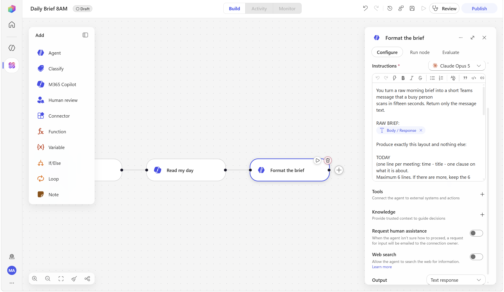

> ✅ **Verify the chip before you type the rest.** After inserting the token you should see a chip reading `Read my day.Body / Response`. If it did not insert, the picker stays open and swallows every character you type next — you will end up with instructions that stop at "RAW BRIEF:" and an agent that invents a brief from nothing.

<details>
<summary>💡 <b>Concept — two AI nodes, two different jobs, and the order matters</b></summary>

The M365 Copilot node was chosen for *what it knows*. This agent node is chosen for *how it behaves*: a fixed layout, a length limit, and one genuinely additive instruction — the **Top 3**, which is the only line in the brief the raw data does not already contain.

This is worth pausing on. Retrieval alone produces a longer to-do list. **Prioritisation** is what makes a brief worth reading, and it is the one thing you should ask an AI step to actually decide.

</details>

### Test it

Open the **Run node** tab on this node and select **Run**. Compare its output with the raw output from Step 2, side by side. Same facts, completely different usefulness — that contrast is the best teaching moment in this scenario.

---

## Step 4 — Deliver it to Teams

1. Below the agent, select **Add a step ▸ Microsoft Teams ▸ Post message in a chat or channel**.
2. Configure:

   | Parameter | Value |
   |---|---|
   | Post as | `Flow bot` |
   | Post in | `Chat with Flow bot` |
   | Recipient | your own email address |

3. In **Message**, type the header line, press Enter twice, then insert the token:

   ```
   Good morning - here is your day.

   ⟨insert /Agent Response from Format the brief⟩
   ```

4. Rename the node to `Send the brief` and select **Save**.
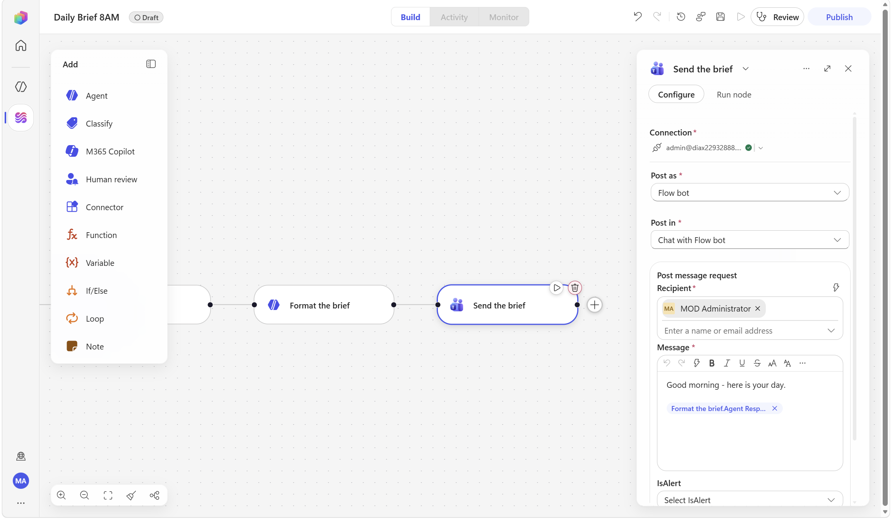

<details>
<summary>💡 <b>Why Teams and not email</b></summary>

The brief competes with the inbox it is summarising. Putting it anywhere other than the inbox is a design decision, not a technical one.

</details>

---

## Step 5 — Publish, run the test, verify

1. Select **Publish** and wait for the badge to read **Published**.
2. Select the **Run** button in the top command bar.

   > ⏱️ **What happens with a scheduled trigger.** You do not wait until tomorrow morning. Pressing **Run** starts a run immediately — there is no menu or dialog to confirm. This is how you demo a scheduled workflow in a 30-minute session.

3. Open the **Activity** tab. The run appears and moves to **Succeeded**. Expect roughly 1–1½ minutes end to end — the Copilot node is the slow part (about a minute), the agent about 12 seconds, the Teams post about 2 seconds.
4. Select the run to load it onto the canvas and inspect each node's real inputs and outputs.

### ✅ Verify

| Where | What you should see |
|---|---|
| **Teams** — your Flow bot chat | A brief under 180 words with all five sections, in the exact layout you specified |
| **Its content** | Meetings that are genuinely on your calendar today, at the right times, and today's real date |
| **TOP 3** | Three items that are *prioritised*, not just the first three things from the lists above |
| **Activity** panel | A **Succeeded** run — open **Read my day** and **Format the brief** and compare the two outputs |

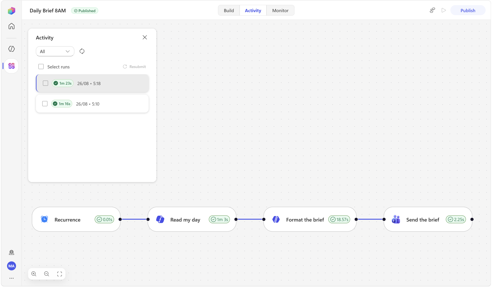
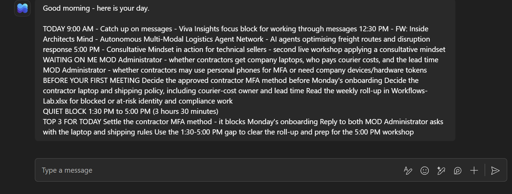

### Optional extensions

| Extension |
|---|
| **Add a human gate before sharing.** Insert a **Human review** node after the agent with one Yes/No input `ShareWithTeam` and one optional Text input `AddNote`, then an If/Else that emails the brief to your team only when you say yes. Turns a personal brief into a team stand-up note without losing control of it. |
| **Archive every brief.** Add **Excel Online (Business) ▸ Add a row into a table** writing the date and the brief text. Three months later you have a searchable record of what mattered each day. |
| **Add external context.** Add a second M365 Copilot node asking for recent news on the customer you are meeting today, and append its **Body / Response** to the brief. |
| **End-of-day version.** Duplicate the workflow, change the schedule to 17:30, and rewrite the Message to ask what moved, what slipped and what to carry to tomorrow. |

---

# Scenario 4 — Friday Project Roll-up

**Core nodes: Recurrence trigger · Excel Online (Business) · Agent (custom structured output) · Human review · If/Else · Outlook · Teams · Excel**

### The problem this solves

The project tracker is already up to date. What takes 45 minutes every Friday is the *translation*: reading twelve rows, working out which two actually matter, and writing three paragraphs a director will read in twenty seconds. Then the same content gets rewritten again for the team channel.

This workflow reads the tracker, does the translation, and asks a human to approve it before it goes anywhere near leadership. It is the most complete pattern in the pack — deterministic data in, AI judgement in the middle, a human gate before it commits, and structured distribution out.

### What you will build

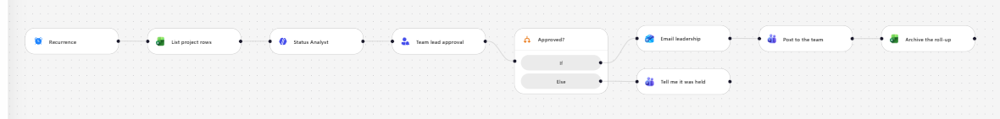

*Scenario 4 finished: a scheduled trigger, an Excel read, an agent, a human gate, then three parallel outputs on the approved branch.*

```
[Trigger]  Recurrence — every Friday at 16:00, (UTC+09:00) Seoul
    ▼
[Excel]    List rows present in a table  →  ProjectTracker      → token: Value
    ▼
[Agent]    "Status Analyst"  (new inline agent, no tools)
    │      Output: Custom structured output
    │      → headline · exec_summary · at_risk_count · at_risk_detail
    │        · help_needed · stale_projects
    ▼
[Human review]  team lead approves or holds — the run sits at Waiting
    │           inputs: Decision · LeadNote · ReportDate · ApproverEmail
    ▼
[If/Else]  Decision  Equals  Approve
    ├── If ───▶ [Outlook] Send an email  →  leadership
    │           [Teams]   Post message   →  the team
    │           [Excel]   Add a row      →  ReportArchive
    └── Else ─▶ [Teams]  tell me it was held
```

> ✅ **Prerequisite.** [Section 1.4](#14-prepare-the-excel-workbook-needed-for-scenario-1-and-scenario-4) must be complete: `Workflows-Lab.xlsx` in your OneDrive, with the `ProjectTracker` table filled with the six sample rows and an empty `ReportArchive` table. The file must be **closed**.

---

## Step 1 — Create the workflow and the Friday schedule

1. **Workflows ▸ New workflow**. Rename the title to:

   ```
   Friday Project Roll-up
   ```

2. Select the **Start** node, set **Trigger type** to **Recurrence**, and configure in this order:

   | # | Parameter | Value |
   |---|---|---|
   | 1 | **Frequency** | `Week` |
   | 2 | **Interval** | `1` |
   | 3 | **On these days** | tick `Fri` only |
   | 4 | **At these hours** | `16` |
   | 5 | **At these minutes** | `0` |
   | 6 | **Advanced ▸ Time zone** | `(UTC+09:00) Seoul` |

3. Select **Save**.
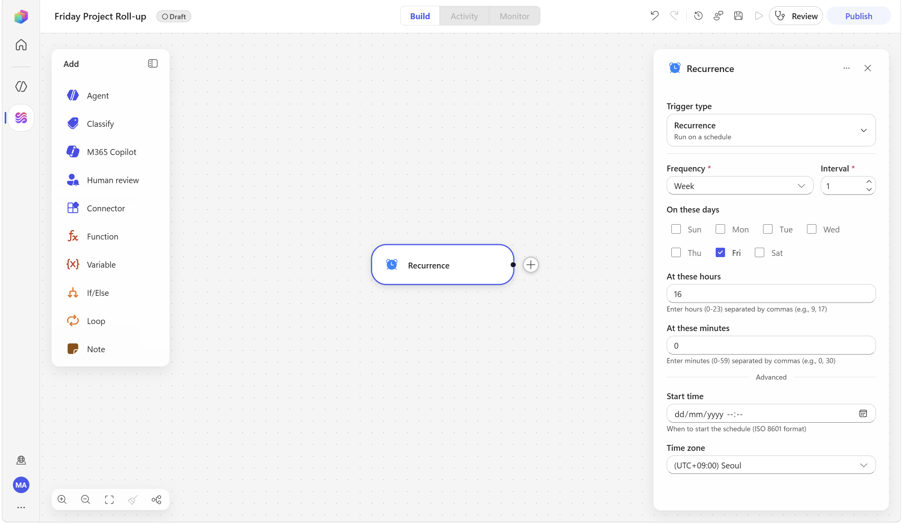

---

## Step 2 — Read the tracker from Excel

1. Below the trigger, select **Add a step**, search for `List rows present in a table`, and choose it under **Excel Online (Business)**.
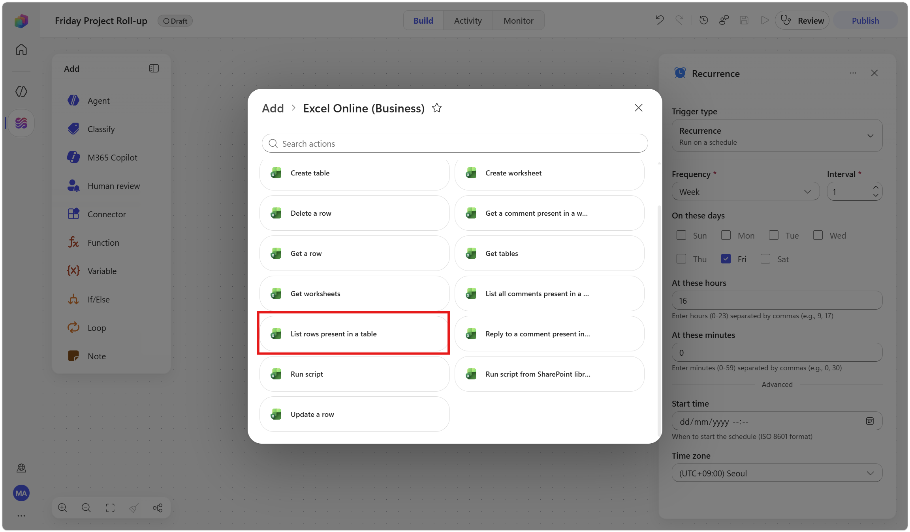
2. Create the connection if prompted ([Section 1.3](#13-connections--what-to-expect-the-first-time)).
3. Configure — each field loads the next:

   | Parameter | Value |
   |---|---|
   | Location | `OneDrive for Business` |
   | Document library | `OneDrive` |
   | File | click **Change**, then select `Workflows-Lab.xlsx` in the tree |
   | Table | `ProjectTracker` |

4. Rename the node to `List project rows`. Select **Save**.
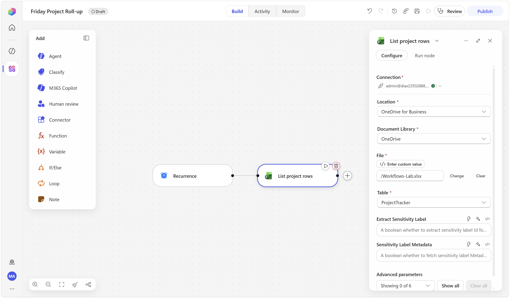
5. Open the node's **Run node** tab and select **Run**. You should see six project objects come back.

> ⚠️ **Do run this test.** It takes ten seconds and it is what makes the next node's test meaningful — the agent test can then reuse real rows instead of running against nothing.

<details>
<summary>💡 <b>Concept — this step is completely deterministic and that is deliberate</b></summary>

Reading rows is a rule, not a judgement. Do it with a connector: it is faster, it is free, and it always returns exactly the same thing. Save the AI for the next node, which is where the judgement actually lives.

</details>

> 📐 **Scaling note for the real version.** **List rows present in a table** returns a bounded page of rows by default; beyond that you must turn on pagination. Six sample rows are fine today, but a real portfolio tracker will hit this — and an agent reasoning over a silently truncated list produces a confident, wrong report.

---

## Step 3 — Analyse the portfolio with an agent

### 3a — Add the node and write the instructions

1. Below the Excel node, select **Add a step** and choose the **Agent** tile.
2. Leave **Agent** on **New agent for this workflow**. Rename the node to `Status Analyst`.
3. In **Instructions**, enter the following. Where you see the token marker, type `/`, filter for `Value`, and select **Value** from **List project rows** — this hands the agent the whole set of rows at once.

```
You are the delivery lead's reporting assistant for an enterprise IT team.
You write the weekly project status roll-up.

Here is the current project tracker, one object per project:
⟨insert /Value from List project rows⟩

Each project has: Project, Owner, Status, PercentComplete, Risk, LastUpdate.

Produce the roll-up using these rules.

headline
One sentence, maximum 18 words, that a director can read and immediately know
whether this week was fine or not. Lead with the exception, never the average.
"Two of six projects are blocked on access approvals" - not "progress continues".

exec_summary
Three to five short lines as a single string, each line starting with "- ".
Line 1: overall portfolio progress with a number.
Then one line for every project whose Status is "Blocked" or "At risk", naming
the project and its owner. Give numbers, not adjectives.

at_risk_count
The number of projects whose Status is "At risk" or "Blocked".

at_risk_detail
For each "At risk" or "Blocked" project: the project name, the owner, the
percent complete, and the single most likely reason it is stuck given its
Status, Risk and PercentComplete. Anything you infer must end with "(inferred)".

help_needed
One sentence naming the single decision, approval or resource that would unblock
the most work across the portfolio. If nothing is blocked, write
"No escalation needed."

stale_projects
The names of any projects whose LastUpdate is more than 5 days before today,
or "None" if there are none. A tracker row nobody has touched is itself a risk.

Use only the data above. Never invent a project, an owner, a date or a number.
Never soften a status: if a project is Blocked, the roll-up says Blocked.
```
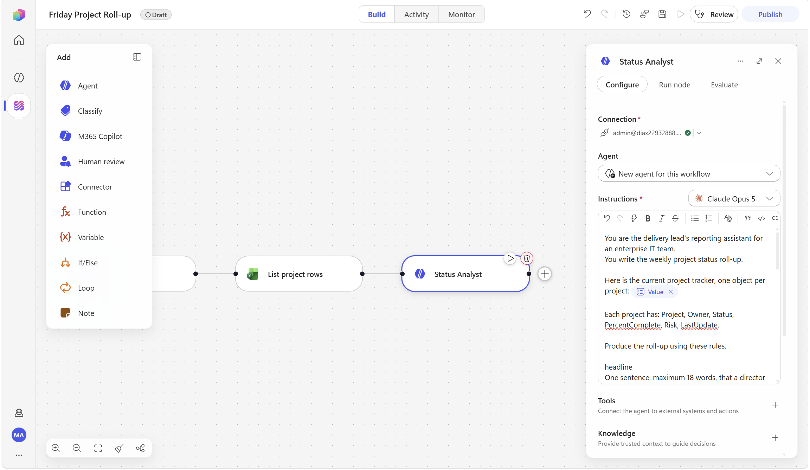
> 📤 **The rows arrive as one token called `Value`** (an array), under the **List project rows** group. There is no `/value` in lower case and no per-column tokens at this point — the agent receives the whole collection and reads the columns itself.

### 3b — Shape the output

1. Scroll to the **bottom** of the panel, open **Output** and select **Custom structured output**.
2. Paste this schema into the **JSON Schema** box:

   ```json
   {
   "type": "object",
   "properties": {
      "headline":       { "type": "string",  "description": "One sentence, maximum 18 words, leading with the exception" },
      "exec_summary":   { "type": "string",  "description": "3 to 5 lines, each starting with '- '" },
      "at_risk_count":  { "type": "integer", "description": "Count of projects that are At risk or Blocked" },
      "at_risk_detail": { "type": "string",  "description": "Project, owner, percent complete and likely reason for each at-risk project" },
      "help_needed":    { "type": "string",  "description": "One sentence naming the single most valuable unblock" },
      "stale_projects": { "type": "string",  "description": "Names of rows not updated in over 5 days, or 'None'" }
   },
   "required": ["headline", "exec_summary", "at_risk_count", "at_risk_detail", "help_needed", "stale_projects"]
   }
   ```
   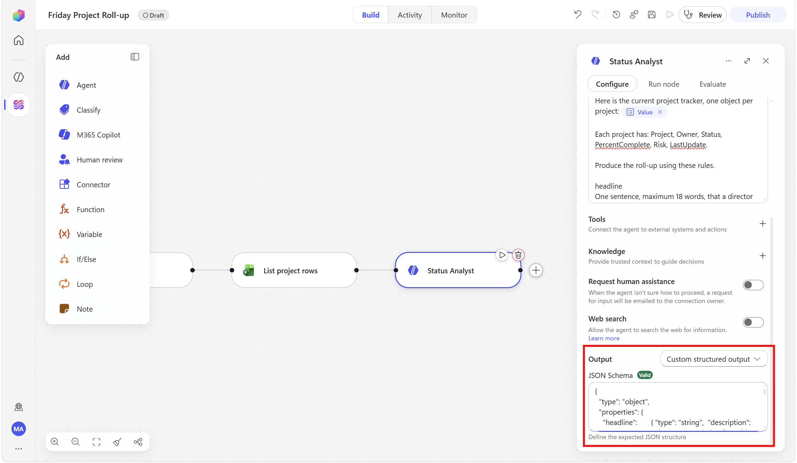

3. Leave **Tools** empty — every fact this agent needs was handed to it in the instructions.
4. Select **Save**.

### 3c — Test it

Open the **Run node** tab and select **Run**.

Against the six sample rows you should get:

- `at_risk_count` = **3** — *Intune device compliance baseline* (At risk), *Entra ID Conditional Access refresh* (Blocked), *Purview DLP policy tuning* (At risk)
- `headline` leading with the blocked or at-risk work, not with the projects that are fine
- `stale_projects` naming **Entra ID Conditional Access refresh** — the oldest `LastUpdate` in the sample data
- every inference ending in `(inferred)`

> 🧪 **If you get `at_risk_count = 0` and a headline saying the tracker was empty**, the node ran with no
> upstream data — go back and run the **List project rows** node test first, then re-run this one. Note
> that the agent *correctly refused to invent projects*, which is your "never invent" rule working.

<details>
<summary>💡 <b>Concept — you are grading the agent, not admiring it</b></summary>

You know the right answer for this dataset, so you can tell instantly whether the instructions are working. Building a small, known test set *before* you write the prompt is the single most useful habit in AI automation.

</details>

---

## Step 4 — Send it to the team lead for approval

1. Below the agent, select **Add a step** and choose the **Human review** tile. Rename it to `Team lead approval`.
2. Fill the fields:

   | Field | What to enter |
   |---|---|
   | **Title** | `Approve the weekly project roll-up` |
   | **Message** | The block below — insert tokens where shown |
   | **Assigned to (first to respond)** | Your own email address (in the real version, the team lead's) |
   | **Channel** | Leave on `Outlook` |

   **Message:**

   ```
   The weekly project roll-up is ready for your approval.

   HEADLINE
   ⟨insert /Headline⟩

   SUMMARY
   ⟨insert /Exec_summary⟩

   AT RISK - ⟨insert /At_risk_count⟩ project(s)
   ⟨insert /At_risk_detail⟩

   BIGGEST UNBLOCK
   ⟨insert /Help_needed⟩

   NOT UPDATED RECENTLY
   ⟨insert /Stale_projects⟩

   Approve to send this to leadership and post it to the team channel.
   Hold to stop it here - nothing is sent.
   ```
   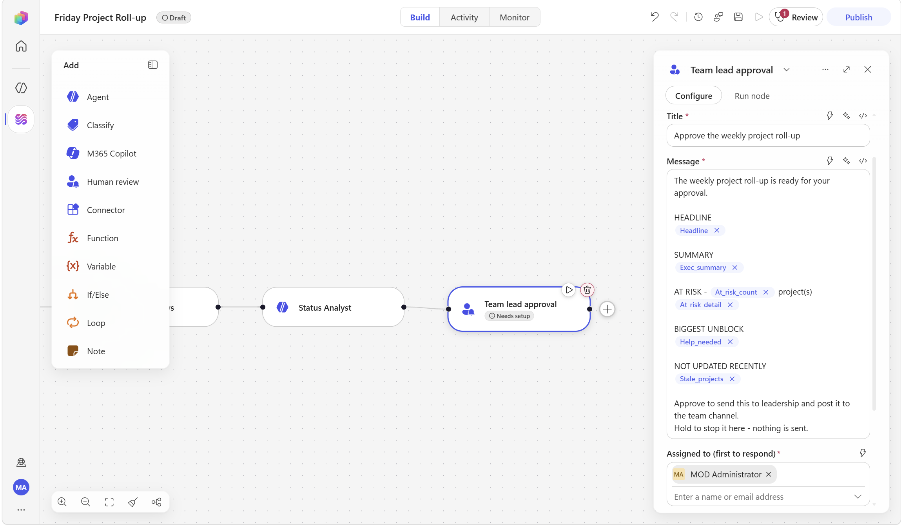
   > 🔤 **Filter by the capitalised token names** — `Headline`, `Exec_summary`, `At_risk_count`, `At_risk_detail`, `Help_needed`, `Stale_projects`. Note `At_risk_count` and `At_risk_detail` share a prefix, so type enough letters (`At_risk_c` / `At_risk_d`) to separate them, and check each chip.

3. Add the four inputs. Select **Add an input** once per row, **clearing the pre-filled label each time**:

   | # | Type | Name (no spaces) | Configuration |
   |---|---|---|---|
   | 1 | **Text** | `Decision` | **⋯ ▸ Add dropdown**. Clear `First option` from the **Option 1** box, type `Approve`. In **Add new option**, type `Hold`. |
   | 2 | **Text** | `LeadNote` | **⋯ ▸ Make optional** |
   | 3 | **Date** | `ReportDate` | — |
   | 4 | **Email** | `ApproverEmail` | — |

   
4. Select **Save**.

<details>
<summary>💡 <b>Concept — you just used four of the five supported input types</b></summary>

Human review supports **Text**, **Yes/No**, **Email**, **Number** and **Date**, and text inputs can become single-select or multi-select dropdowns. A review gate is a *form*, not a button — which means the human can contribute structured data the workflow then uses, rather than only permitting or blocking it.

</details>

---

## Step 5 — Branch, distribute, archive

### 5a — The condition

1. Below the review node, **Add a step ▸ If/Else**:

   | Part | Value |
   |---|---|
   | **Property** | `Decision` from **Team lead approval** |
   | **Operator** | `Equals` |
   | **Value** | `Approve` |

2. Rename it to `Approved?`
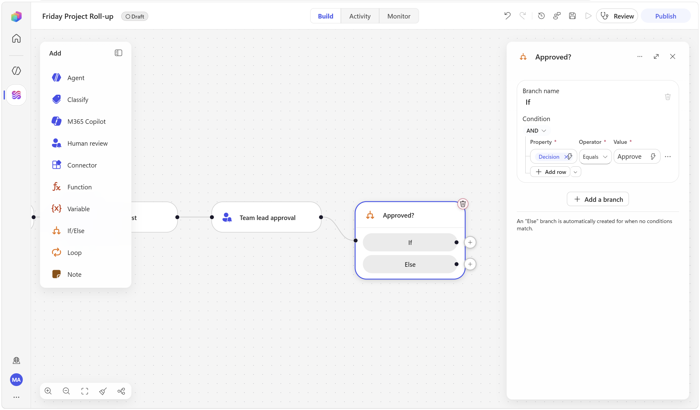

### 5b — On the If branch: email leadership

1. **Add a step**, search `Send an email`, and choose the one under the **Office 365 Outlook** heading.

   > ⚠️ **Two actions look identical here.** The search also returns **"Send an email notification"** from the **Mail** connector. Picking it demands a separate *Connect to Mail* connection and does not use your Outlook identity. Check the group heading before you click.

2. Configure:

   | Parameter | Value |
   |---|---|
   | To | your own address (in the real version, your manager's) |
   | Subject | `Weekly project roll-up - ` then insert `/Headline` |
   | Body | the block below |

   ```
   ⟨insert /LeadNote⟩

   ⟨insert /Exec_summary⟩

   AT RISK - ⟨insert /At_risk_count⟩ project(s)
   ⟨insert /At_risk_detail⟩

   BIGGEST UNBLOCK
   ⟨insert /Help_needed⟩

   Questions to ⟨insert /ApproverEmail⟩.
   Report date: ⟨insert /ReportDate⟩
   ```

3. Rename it to `Email leadership`.
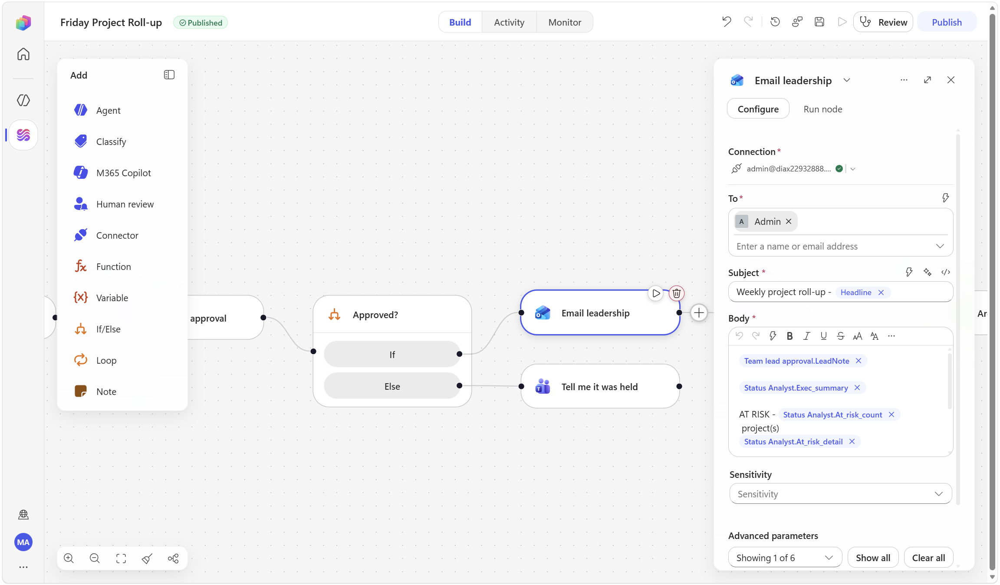

### 5c — On the If branch: post to the team

1. **Add a step ▸ Microsoft Teams ▸ Post message in a chat or channel**:

   | Parameter | Value |
   |---|---|
   | Post as | `Flow bot` |
   | Post in | `Chat with Flow bot` *(or `Channel` ▸ `Workflow Lab` ▸ `Alerts`)* |
   | Recipient | your own email address |

2. In **Message**:

   ```
   Weekly roll-up

   ⟨insert /Headline⟩

   ⟨insert /Exec_summary⟩

   Needs a decision: ⟨insert /Help_needed⟩
   ```

3. Rename it to `Post to the team`.
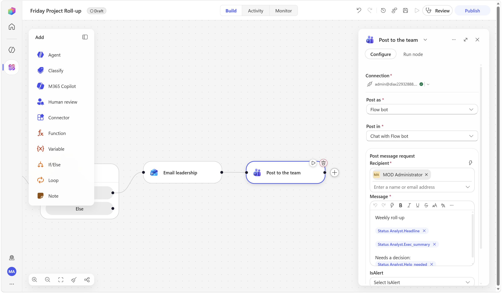

### 5d — On the If branch: archive the report

1. **Add a step ▸ Excel Online (Business) ▸ Add a row into a table**:

   | Parameter | Value |
   |---|---|
   | Location | `OneDrive for Business` |
   | Document library | `OneDrive` — note it is **not** first in the list; `PersonalCacheLibrary` usually is |
   | File | click **Change**, then select `Workflows-Lab.xlsx` |
   | Table | `ReportArchive` |
   | GeneratedAt | `ReportDate` *(from Team lead approval)* |
   | Headline | `Headline` *(from Status Analyst)* |
   | AtRiskCount | `At_risk_count` *(from Status Analyst)* |
   | ApprovedBy | `ApproverEmail` *(from Team lead approval)* |

2. Rename it to `Archive the roll-up`.
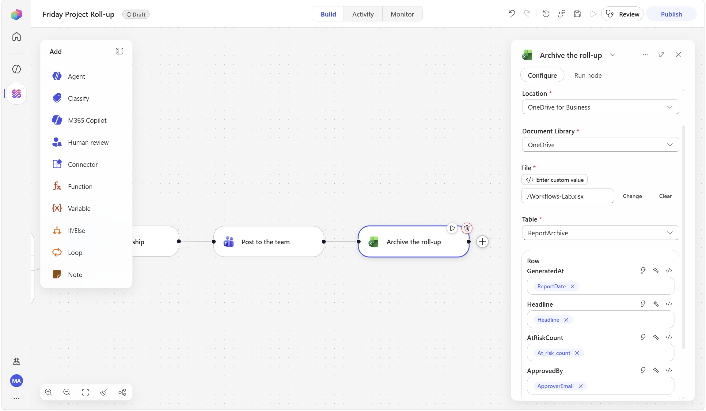

### 5e — On the Else branch

1. **Add a step ▸ Microsoft Teams ▸ Post message in a chat or channel**, posting to yourself, with the message:

   ```
   Weekly roll-up held by the team lead. Nothing was sent.
   ```

2. Rename it to `Tell me it was held`. Select **Save**.
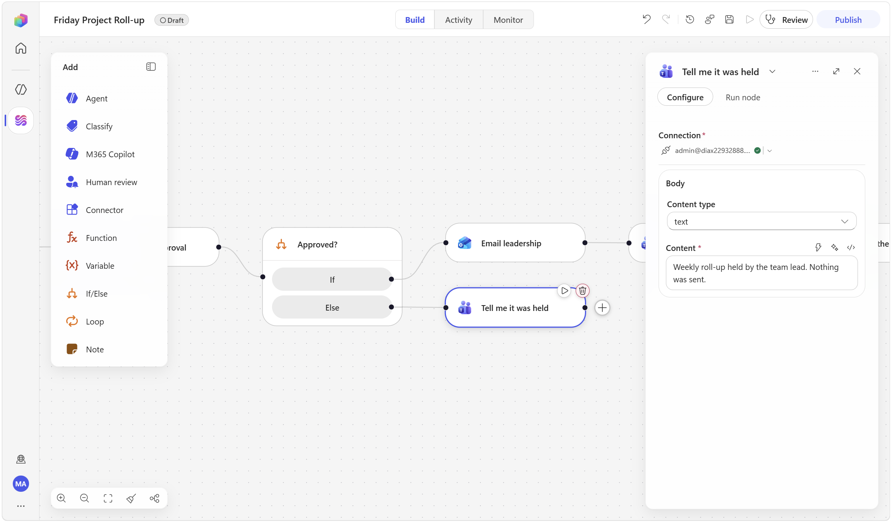

<details>
<summary>💡 <b>Notice which nodes are on which branch</b></summary>

The email, the Teams post *and* the archive row all sit behind the approval. An archive entry for a report that was never sent is worse than no archive at all — the audit trail has to record what actually happened, not what was drafted.

</details>

---

## Step 6 — Publish, run the test, verify

1. Check **Review** for problems, then select **Publish**.
2. Select the **Run** button in the top command bar. A Recurrence trigger runs once, immediately.
3. Watch **Activity**: `List project rows` (~3s) → `Status Analyst` (~20–30s) → the run then sits at **Waiting** on `Team lead approval`.
4. **Check Outlook.** Open `Approve the weekly project roll-up`. Click **Show blocked content** if Outlook has suppressed the form, then fill it:
   - `Decision` = `Approve`
   - `LeadNote` = `Two items need a decision from the security board this week.`
   - `ReportDate` = today (use the calendar picker)
   - `ApproverEmail` = your address
   - Select **Submit**.
5. The workflow resumes within a minute. The Activity duration includes your thinking time — a 20-minute wait shows as a 20-minute run.
6. **Run it a second time** and choose `Hold` to prove the Else branch.
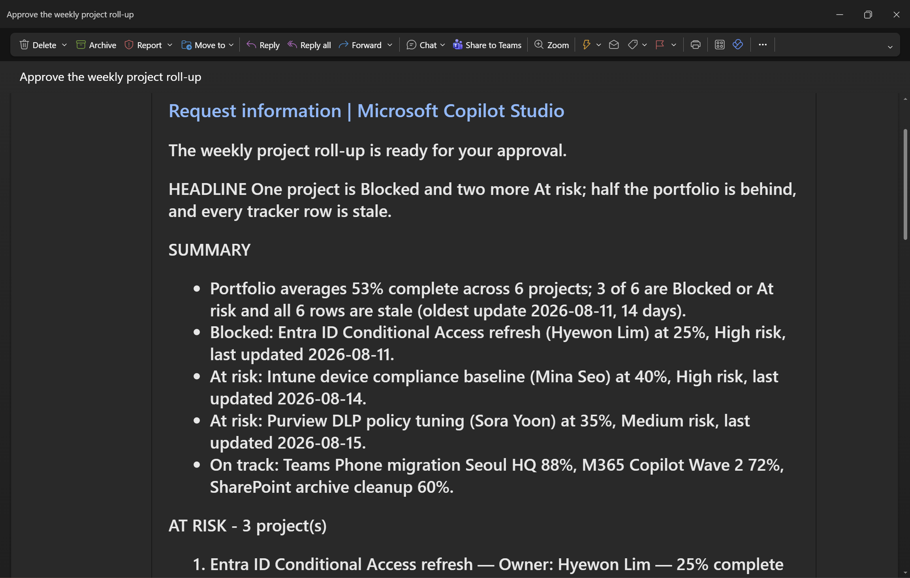
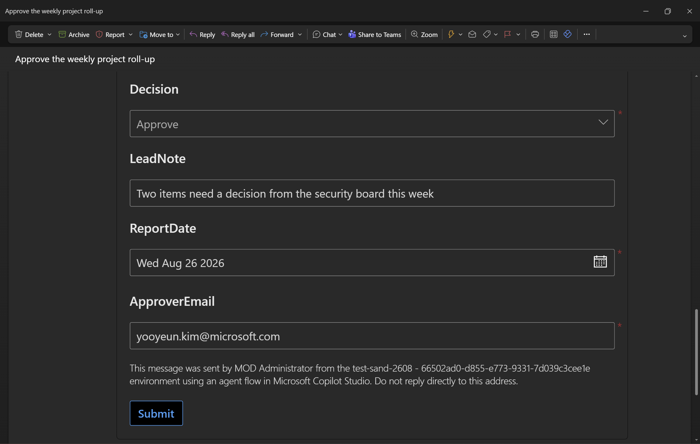
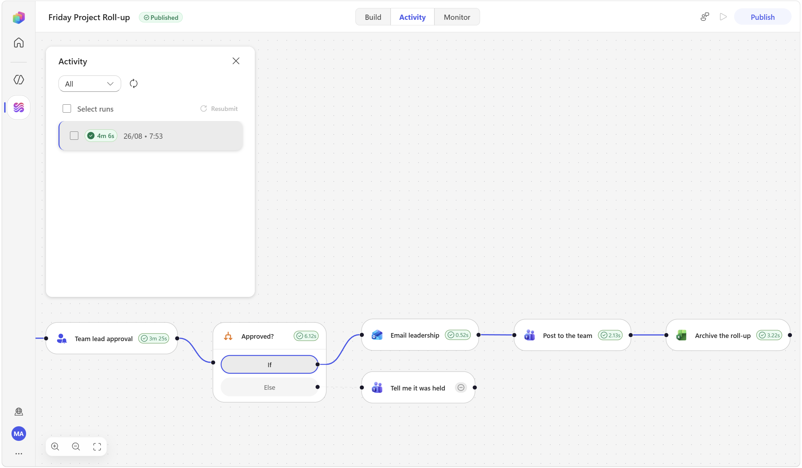
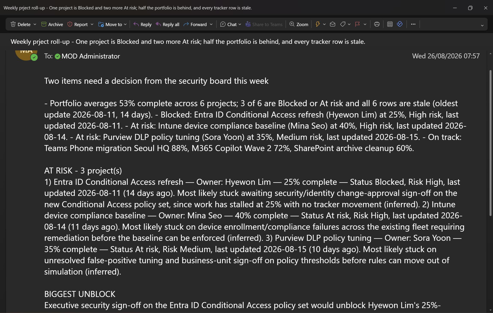
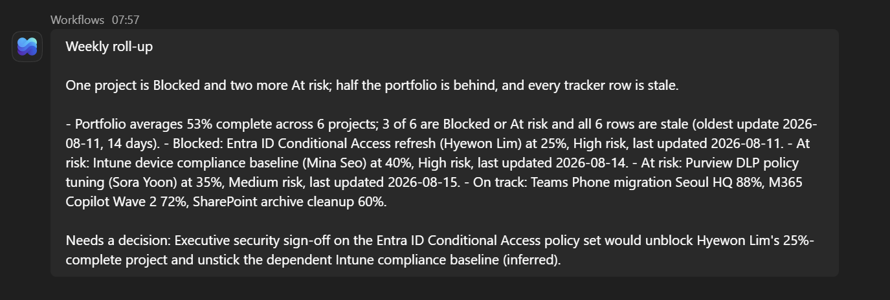
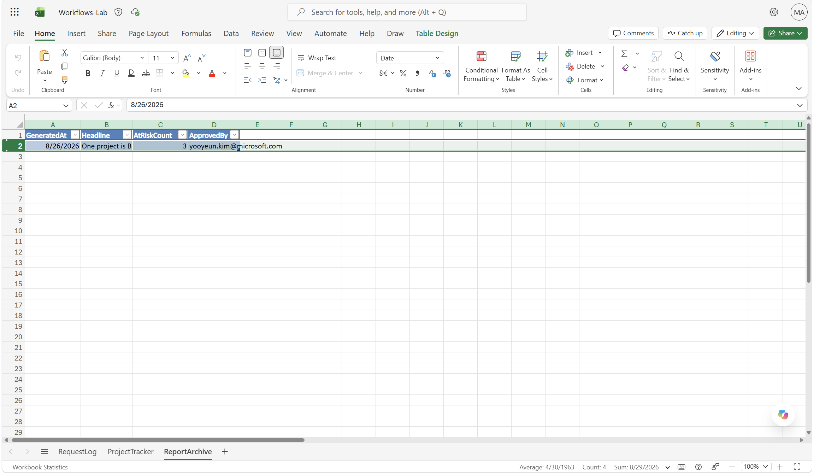

> 📬 **The emailed card is the only way to respond.** Human review requests do **not** appear in the Power Automate Approvals portal, so do not go looking for them there.

### ✅ Verify

| Where | What you should see |
|---|---|
| **Outlook** — approval mail | The full roll-up, with a dropdown, an optional note box, a date picker and an email field |
| **Outlook** — inbox | The leadership email, your `LeadNote` at the top, subject line carrying the headline |
| **Teams** | The short version — headline, summary, and the one decision needed |
| **Excel** — `ReportArchive` | One new row per approved run, and **no row** for the held run |
| **Activity** panel | A run that sat at **Waiting** until you submitted, then **Succeeded** |

> 🔎 **If the run says Succeeded but nothing was sent and `ReportArchive` is empty**, it took the **Else**
> branch. Open the **Team lead approval** node in the loaded run and read the `Decision` value that came back.

> Then change a row in `ProjectTracker` — set *Teams Phone migration* to `Blocked` — and run it again. The headline, the count and the escalation all change. **You changed data, not the workflow.**

### Optional extensions

| Extension |
|---|
| **Add trend context.** Add an **M365 Copilot** node after the Excel step asking it to compare this week's percentages against recent mail and documents, and feed its **Body / Response** into the Status Analyst's instructions as extra context. |
| **Nudge the owners.** After the approval, add a **Loop** over the at-risk projects and an **Office 365 Outlook ▸ Send an email** to each `Owner` asking for a one-line update. The roll-up stops being a report and starts being a process. |
| **Escalate by count.** Add a second If/Else on `At_risk_count` with operator `is greater than` and value `2`, and route those weeks to a different recipient. |
| **Chase stale rows.** Add an If/Else on `Stale_projects` `Does not equal` `None` and post a separate Teams nudge. |

---

# Troubleshooting

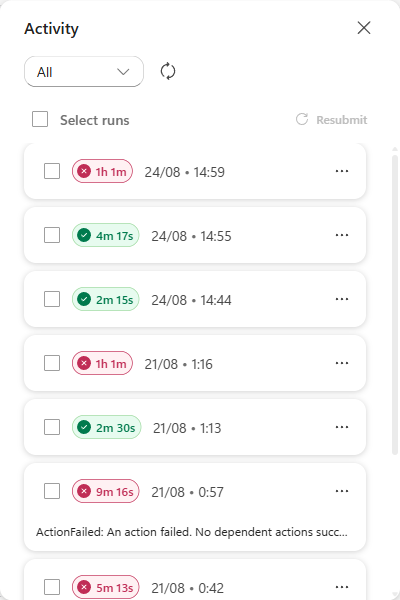

*The Activity panel lists every run with its status and duration. Select a run to load it onto the canvas with real inputs and outputs.*

When you get stuck, check these eight first — they cover most of what goes wrong in this lab. If none of them fit, find your symptom in the tables below.

### The eight that catch most people

| # | Where people get stuck | What to check |
|---|---|---|
| 1 | Typing `/Subject` as text instead of inserting the token | Type the slash, **wait**, then pick from the list. If it is not a coloured chip, it is not a token. |
| 2 | Typing over pre-filled labels and option boxes | Those boxes already contain text. **Ctrl+A → Delete**, then type — otherwise the dropdown breaks silently. |
| 3 | Picking a duplicate token after the Excel node | Read the chip: it names the node the value came from. |
| 4 | The **Folder** and **File** pickers need a double-click | A single click only highlights. **Double-click** the item. |
| 5 | The Excel sheet was never formatted as a **Table** | A sheet with headers is not a Table. Convert it with **Insert ▸ Table**. |
| 6 | Forgetting to publish before testing | **Publish** is not a deployment — it is what switches the trigger on. |
| 7 | Looking for a step after **If/Else** | Branches never rejoin. Shared steps go **above** the branch. |
| 8 | Not waiting for the trigger to poll | It polls. Give it two minutes. It is not broken. |

### Connections

| Symptom | Most likely cause | Fix |
|---|---|---|
| **A node says "Not connected"** | No connection for that connector exists in this environment yet. On a freshly provisioned lab environment this happens for **every** connector on first use, Outlook and Teams included. | Create it: click **Not connected** ▸ **Create new connection** ▸ **Create** ▸ pick your account. [Section 1.3](#13-connections--what-to-expect-the-first-time) has the full procedure. You only do this once per connector. |
| **"Could not load options. You can enter a value manually."** on Location / Document Library / File | The node has no connection yet, so it cannot query your OneDrive. It is not a permissions error. | Create the connection ([section 1.3](#13-connections--what-to-expect-the-first-time)). The message disappears and the dropdowns populate. |
| **The Excel node says "Not connected"** | Excel Online (Business) and M365 Copilot do not auto-bind. | Click the **chevron ⌄** on the Connection field ▸ **Create new connection** ▸ **Create** ▸ pick your account in the popup. Clicking the placeholder text in the panel body does nothing. |

### Tokens and dynamic content

| Symptom | Most likely cause | Fix |
|---|---|---|
| **A step "worked" but used the wrong data** | You inserted a token from the wrong node. After an Excel *Add a row* step exists, the picker contains **duplicate names** (`Category`, `Subject`, `Summary`…) because that action returns the row it created. | Click the chip and read it: it says **`NodeName.FieldName`**. Re-insert from the correct group. |
| **My instructions are truncated after a token** | The token failed to insert. The picker stayed open and swallowed every character you typed afterwards. | Clear the field and rebuild it. Type `/`, **pause**, filter, click, **confirm the chip appeared**, then continue. |
| **A token came out as literal text like `/Frmo`** | You typed the filter too fast and the characters scrambled, so nothing matched. | Delete the text. Type `/`, wait for *Insert dynamic content*, then type slowly. |
| **My token isn't in the picker** | The upstream node has not been saved, or you are on a branch the data does not reach. | **Save** the upstream node, then reopen the picker. |

### Cannot find it, or cannot type into it

| Symptom | Most likely cause | Fix |
|---|---|---|
| **A field looks like a text box but will not accept typing** (Folder, File, Table) | These are pickers, not text fields. Clicking the box itself does nothing. | Click the small **Change** button to the right of the field to open the picker, choose the item, then press **Escape** to close it. |
| **I can't select the Folder or the File** | Both are **tree** pickers, not dropdowns. | **Double-click** the item. A single click only highlights it. |
| **I can't find the Subject filter** | It is one of the hidden advanced parameters. | Under **Advanced parameters** (*Showing 4 of 9*) click **Show all**. |
| **I can't find the Output / JSON schema on an agent node** | It is at the **bottom** of the panel. | Scroll past Tools, Knowledge, Request human assistance and Web search. |
| **There's no Rename in the node's ⋯ menu** | Rename is not on that menu (it has only Settings and Code view). | **Double-click the node title in the configuration panel header** and type over it. |
| **I can't find a "Condition" node** | It is called **If/Else**. | Search `If/Else`, or pick the tile directly in the **Add** dialog. |
| **I can't put a step after the branch** | An **If/Else** does not rejoin — each branch simply ends. | Put shared steps **before** the branch, or duplicate them into both. |
| **All the node fields are greyed out** | You have a historical run loaded on the canvas — that view is read-only. | Switch back to the **Build** tab. |
| **I refreshed and my canvas is empty** | The designer keeps the URL `.../flows/new` until you navigate away; reloading it opens a new blank workflow. | Your work is saved. Reopen it from the **Workflows** list. |

### Excel

| Symptom | Most likely cause | Fix |
|---|---|---|
| **A field says "Fill in dependent fields first…"** | Excel's four location fields cascade: **Location → Document Library → File → Table**. Each one only loads once the one above it is set. | Set them strictly top to bottom. If one stays empty, the field above it is not really set. |
| **The Table dropdown in the Excel step is empty** | The sheet has headers but no **formatted Excel Table**. | Select the header row ▸ **Insert ▸ Table** ▸ tick *My table has headers*, then set the **Table Name** under **Table Design**. Also close the file in your browser. |
| **The run succeeded but the Excel row is not there** | Write latency, or you are looking at row 2. | Refresh the workbook after ~30 seconds. Remember the first written row lands in **row 3** — row 2 is the table's blank starter row. |

### Human review and approvals

| Symptom | Most likely cause | Fix |
|---|---|---|
| **The approval request never arrives, but nothing shows an error** | The node sits in **Waiting** whether or not the card was delivered; there is no failure to read. Outlook delivery can lag many minutes on trial tenants. | Switch the node's **Channel** to **Teams** and republish. Do not check the Power Automate **Approvals** portal — pending human-review requests never appear there. |
| **The approval email never arrives** | Assigned to an external address, or it is in Junk. | Human review requests **cannot be sent outside your tenant**. Use an internal address and check Junk. |
| **The approval email arrives but has no form** | Outlook has suppressed the active content. | Click **Show blocked content** in the message banner. |
| **I can't find my approval in Power Automate** | Human review does not use the Approvals portal. | Respond from the emailed card. It is the only route. |
| **Several people were assigned and only one answer was used** | Working as designed — the field is literally named *Assigned to (first to respond)*. | Assign to one person, or accept first-wins. |

### Sending mail

| Symptom | Most likely cause | Fix |
|---|---|---|
| **The run fails on the last step with *"A message needs to have at least one recipient"*** | **Reply to email** was left with an empty **To**. It does not reliably auto-address the reply — and never does when you are testing by emailing yourself. | Bind **To** to the trigger's `From` token, publish, and send a **new** test email (the spent approval cannot be reused). |
| **The run fails with *"…is required to be of type 'String/email'. The runtime value `"a@b.com\n"`…"*** | A stray line break is stored in the **To** box alongside the token. Token fields are rich editors, and a leftover empty line becomes part of the value. | Click into **To**, **Ctrl+A**, **Delete** repeatedly until the box is truly empty, then re-insert the token using the **Insert dynamic content** button and save without typing anything else. |
| **An extra run appears about a minute after a successful reply** | The reply keeps `[Ask]` in its subject and lands back in the inbox the trigger watches, so the workflow triggers on its own output. | Expected in a self-test. Cancel the stray **Waiting** runs, or set a **From** filter on the trigger so your own address is ignored. |

### AI node output

| Symptom | Most likely cause | Fix |
|---|---|---|
| **M365 Copilot returns the wrong day** | **Time zone** is still the default `America/New_York`. | Set it to `Asia/Seoul` (IANA format) on the **node**. Remember the *Recurrence trigger* uses a different format, `(UTC+09:00) Seoul`. |
| **M365 Copilot returns "I could not find…"** | There genuinely is nothing in that mailbox on that topic. | This is correct behaviour, not a bug. Test with a topic that really exists in your mail. |
| **The agent invents projects, meetings or people** | The real data was never passed in, or the "never invent" rule is missing. | Confirm the `/` token is actually a chip — a token that was *typed* as text is just text. Then add an explicit `Use only the data above. Never invent…` rule. |

### Publishing, running and schedules

| Symptom | Most likely cause | Fix |
|---|---|---|
| **A branch took the wrong path, but the run says Succeeded** | A dropdown option or input label kept its pre-filled placeholder, e.g. `First optionApprove` or `TextDecision`. The comparison never matches and the flow falls through to **Else** with no error. | Open the finished run, select the If/Else node, and read its inputs — it prints the comparison, e.g. `Reject is equal to Approve → False`. Then fix the option/label box on the **Build** tab (**Ctrl+A + Delete**, retype), publish, re-run. |
| **The workflow never runs when I send the test email** | It was never published. A workflow only listens for its trigger **after** you publish. | **Save**, then **Publish**. Then send a *new* test email — the one you sent before publishing is gone. |
| **Publish is greyed out or fails** | The workflow contains errors. | The **Review** button in the command bar shows the count; open it and clear each one. |
| **The workflow name won't save** | It starts with a digit. | Workflow names **must start with a letter**. |
| **The scheduled workflow won't run on demand** | You are waiting for the clock. | Press **Run** in the top command bar. A Recurrence trigger runs once, immediately. |
| **Nothing appears in Activity** | Connector triggers poll. | Wait 1–2 minutes and refresh. Outlook triggers usually fire quickly, but the connector documents a rare worst case of up to an hour. |

---

### Verifying a schedule actually fired

A Recurrence trigger cannot be proven by testing — a manual **Run** ignores the schedule entirely and tells you nothing about frequency, day, hour or time zone. Those only reveal themselves on the next real occurrence, which is usually after everyone has gone home.

If you own the lab tenant, check the run history the following working day. **Activity ▸ run list** shows a scheduled run's real start time:

| Check | What correct looks like |
|---|---|
| Start time | Exactly `08:00` for Scenario 3, `16:00` for Scenario 4 — in **your** local zone, not UTC |
| Days present | Mon–Fri for Scenario 3; Fridays only for Scenario 4 |
| Days absent | **No Saturday or Sunday runs** |

That last row is the one worth checking. In the recurrence editor, **Sunday is ticked by default**, and an unnoticed Sunday tick produces a workflow that behaves perfectly all week and then fires once over the weekend. A weekend run in the history is the only symptom.

### Cleanup after the session

If the lab environment is shared or long-lived, have participants do this before they leave:

1. Open each workflow and **turn it off** or delete it — the email-triggered ones will keep firing on real mail otherwise, and the scheduled ones will keep running every morning.
2. Delete the test emails and the approval requests.
3. Keep `Workflows-Lab.xlsx` — it is the fastest way to rebuild any of this later.

### Costs and capacity — the one slide people ask about

- Workflows consume **Copilot Studio capacity for each action they execute**, and features on this harness are billed as **usage-based Copilot Credits**.
- **Testing from the designer does not consume flow capacity** — which is exactly why this pack tells you to test each node as you build it.
- Once an environment's prepaid capacity is fully consumed, **new flow runs are blocked** until capacity is available; runs already in flight complete normally.

---

# Appendix A — Node reference for this environment

### The Add palette

The left rail and the **Add** dialog expose: **Agent · Classify · M365 Copilot · Human review · Connector · Function · Variable · If/Else · Loop · Note**. The **Add** dialog additionally offers **Switch · Scope · End · Respond to the agent**, plus every connector action via search.

### AI capability nodes

| Node | Use it when | Key settings |
|---|---|---|
| **Agent** (inline) | The step needs judgement, multi-step reasoning, or a controlled output shape that travels with the workflow | **Agent**: `New agent for this workflow` · **Instructions** (doubles as the per-run prompt) · model dropdown *in the Instructions header* · **Tools** · **Knowledge** · **Request human assistance** · **Web search** · **Output** *(at the bottom)*: Text response / Structured output / Custom structured output |
| **Agent** (existing) | The same agent is shared across several workflows or owned by another team | **Agent**: pick a published agent · a **Message** field for the per-run prompt |
| **M365 Copilot** | The step needs the running user's own Microsoft 365 context — mail, files, calendar, chats | **M365 agent** *(optional — the specific Copilot agent to chat with)* · **Message** · **Advanced parameters ▸ Time zone** *(IANA, defaults to `America/New_York`)* · **Prefer async** |
| **Classify** | Simple routing only — sort one piece of text into categories you define | The text to classify · your category list |

**Output tokens at a glance**

| Node | Output setting | Token(s) you consume downstream |
|---|---|---|
| Agent | Text response | `Agent Response` |
| Agent | Custom structured output | one token per schema field, **capitalised**: `Category`, `Owner_team`, `At_risk_count`… |
| M365 Copilot | — | `Body / Response` *(plus Body, Body / Conversation ID, Body / Citations, See More URL, Type)* |
| Excel · List rows | — | `Value` *(an array of row objects)* |
| Human review | — | one token per input you defined: `Decision`, `ChangeRequest`, `ReportDate`… |

> **Choosing between the two AI nodes:** the M365 Copilot node **reuses what Microsoft 365 already knows** — grounding is built in and it runs as the connected user. The agent node **builds automation-specific behaviour** — instructions and output shape configured in the node. Scenarios 2 and 3 use both in sequence, and that is the recommended pattern when you need context *and* control.

### Human review

- **Required fields:** **Title** (the subject of the message sent), **Message** (the accompanying note), **Assigned to (first to respond)**, **Channel**, and at least one **Input**.
- **Channel:** `Outlook` (default) or `Teams` — exactly two options. Outlook delivery is **inconsistent**: observed at one minute in one case and never delivered in two others, with no error surfaced anywhere. Teams delivered reliably in every observed case. Prefer **Teams** for time-boxed sessions.
- **Longevity:** a pending request was still actionable **71 hours** after it was raised, so requests do not expire over a weekend. The trade-off is that the run stays in **Running** the whole time.
- **Input types:** Text, Yes/No, Email, Number, Date. Text inputs additionally support **Add dropdown** and **Add multi-select**.
- **Per-input options** via the **⋯** menu: **Make optional · Add multi-select · Add dropdown · Delete**.
- **Every input becomes a dynamic-content token** carrying the human's answer.
- **Constraints:** the **first response wins**; requests **cannot go to users outside your tenant**; input names must not contain spaces; responses come back through the delivered card, **not** the Power Automate Approvals portal — that page reports *"You don't have any pending approvals"* even while requests are genuinely open.
- **Pre-filled boxes:** input labels arrive as `Text` / `Date` / `Email`, and the first dropdown option arrives as `First option`. Clear them before typing.

### Control nodes used in this pack

| Node | Used in | Notes |
|---|---|---|
| **If/Else** | Scenarios 1, 2, 4 | Condition rows are **Property / Operator / Value** with an AND/OR group selector; the operator for equality is **Equals**. Branches are named **If** and **Else**; **Else** is created automatically. **Branches do not rejoin.** |
| **Loop** | Scenario 4 extension | Iterate over an array such as the Excel `Value` collection |

### Connectors used in this pack

| Connector | Actions used | Connection behaviour |
|---|---|---|
| **Office 365 Outlook** | *When a new email arrives* (trigger) · *Send an email* · *Reply to email* | Binds silently |
| **Microsoft Teams** | *Post message in a chat or channel* | Binds silently |
| **Excel Online (Business)** | *List rows present in a table* · *Add a row into a table* | **Must be created** |
| **M365 Copilot** | the M365 Copilot node | **Must be created** |
| **Human review** | the Human review node | Binds silently |
| **Agents** | the Agent node | Binds silently |

> Searching for a connector action can return same-named actions from other connectors — notably **Send an email** (Office 365 Outlook) versus **Send an email notification** (Mail). Always check the group heading above the action before you click.

---

# Appendix B — Copy-paste reference

### Excel workbook — `Workflows-Lab.xlsx` (OneDrive for Business)

| Sheet | Table name | Columns |
|---|---|---|
| `RequestLog` | `RequestLog` | ReceivedAt · FromAddress · Subject · Category · Priority · Summary · OwnerTeam · SLAHours · Status |
| `ProjectTracker` | `ProjectTracker` | Project · Owner · Status · PercentComplete · Risk · LastUpdate |
| `ReportArchive` | `ReportArchive` | GeneratedAt · Headline · AtRiskCount · ApprovedBy |

### Sample tracker rows (Scenario 4)

```
Project                              | Owner       | Status   | PercentComplete | Risk   | LastUpdate
M365 Copilot rollout — Wave 2        | Jihoon Park | On track | 72              | Low    | 2026-08-18
Intune device compliance baseline    | Mina Seo    | At risk  | 40              | High   | 2026-08-14
Teams Phone migration (Seoul HQ)     | Daniel Cho  | On track | 88              | Low    | 2026-08-19
Entra ID Conditional Access refresh  | Hyewon Lim  | Blocked  | 25              | High   | 2026-08-11
SharePoint archive cleanup           | Jun Kang    | On track | 60              | Medium | 2026-08-17
Purview DLP policy tuning            | Sora Yoon   | At risk  | 35              | Medium | 2026-08-15
```

Expected analysis against these rows: `at_risk_count` = **3**; `stale_projects` names **Entra ID Conditional Access refresh**.

### Workflow names and triggers

| Scenario | Workflow name | Trigger | Filter / schedule |
|---|---|---|---|
| 1 | `IT Request Triage Desk` | Connector ▸ Outlook ▸ When a new email arrives | Inbox · Subject filter `[REQ]` |
| 2 | `Reply Desk with Approval` | Connector ▸ Outlook ▸ When a new email arrives | Inbox · Subject filter `[Ask]` |
| 3 | `Daily Brief 8AM` | Recurrence | Week / Mon–Fri / 08 / 00 / `(UTC+09:00) Seoul` |
| 4 | `Friday Project Roll-up` | Recurrence | Week / Fri / 16 / 00 / `(UTC+09:00) Seoul` |

### Test emails

| Scenario | Subject | Expected result |
|---|---|---|
| 1 | `[REQ] Cannot sign in to Teams - MFA prompt keeps looping` | Access · High · Identity · SLA 4 · Teams escalation fires |
| 1 | `[REQ] How do I share an Excel file with an external partner?` | Low · Collaboration · **no** escalation |
| 1 | `[REQ] 노트북 배터리가 30분 만에 방전됩니다` | Endpoint · acknowledgement written in Korean |
| 2 | `[Ask] Where did we land on the Teams Phone migration timeline?` | A draft grounded in your real mail |
| 2 | `[Ask] Can you confirm the Q4 budget number for the Busan site?` | A draft that says it will follow up rather than inventing a number |

### Time-zone fields — do not mix these up

| Where | Format | Value used in this pack |
|---|---|---|
| **Recurrence trigger ▸ Advanced ▸ Time zone** | display name | `(UTC+09:00) Seoul` |
| **M365 Copilot node ▸ Advanced ▸ Time zone** | IANA identifier | `Asia/Seoul` |

---

# Appendix C — Where to take this next

Each of these is a small variation on a pattern you already built. They make good stretch goals, and better follow-up sessions.

| Idea | Pattern it reuses | Nodes |
|---|---|---|
| **Meeting-request triage** — an invitation arrives, an agent judges whether it needs you, and drafts a decline with a suggested delegate | Scenario 1 | Outlook trigger · Agent · Human review · Outlook |
| **Onboarding checklist** — a new-joiner row is added to Excel, an agent generates a role-specific 30-day plan, a manager approves it, it is emailed and posted to Teams | Scenarios 1 + 4 | Excel · Agent · Human review · Outlook · Teams |
| **Weekly licence review** — read licence assignments, have an agent name the ones that look unused, ask an admin to confirm before anything is reclaimed | Scenario 4 | Recurrence · Excel/Dataverse · Agent · Human review |
| **Customer escalation digest** — every escalation email is classified and appended to a running Excel log; on Friday an agent writes the trend summary | Scenarios 1 + 4 | Outlook trigger · Agent · Excel · Recurrence |
| **Change-request intake** — a change request arrives by mail, an agent extracts the structured fields, a CAB member approves, it is written to Dataverse | Scenarios 1 + 2 | Outlook · Agent (custom structured output) · Human review · Dataverse |
| **Expose a workflow as an agent tool** — rebuild any of the four with the *When an agent calls the workflow* trigger, then add it as a tool so people can invoke it by asking | All | Agent-call trigger · Respond to the agent |

---

## Sources

- [Workflows overview — Microsoft Copilot Studio](https://learn.microsoft.com/en-us/microsoft-copilot-studio/workflows-experience/flows-overview)
- [Add an agent node to a workflow](https://learn.microsoft.com/en-us/microsoft-copilot-studio/workflows-experience/agent-node-workflow)
- [Add a Microsoft 365 Copilot node to a workflow](https://learn.microsoft.com/en-us/microsoft-copilot-studio/workflows-experience/microsoft-365-copilot-node-workflow)
- [Request information from human review in workflows](https://learn.microsoft.com/en-us/microsoft-copilot-studio/workflows-experience/flows-request-for-information)
- [Edit and manage your workflow in the designer](https://learn.microsoft.com/en-us/microsoft-copilot-studio/workflows-experience/flow-designer)
