# Hands‑On Lab — Building Workflows in the New Copilot Studio

**Level:** 200 (intermediate)  ·  **Persona:** Maker  ·  **Duration:** ~2 hours  ·  **Format:** Instructor‑led or self‑paced

A practical, build‑from‑scratch lab on the **new Workflows experience** in Microsoft Copilot Studio. You'll create two autonomous workflows: one that hands real work to a reasoning **inline agent**, and one that **classifies and routes** email, drafts a reply with **Microsoft 365 Copilot**, and pauses for **human approval** before it acts.

> This lab is the hands‑on companion to the *"Introducing the New Copilot Studio & Workflows"* presentation. It puts the deck's core ideas into practice: **Event → Payload → Action**, **agents vs. workflows**, **agent nodes**, **human‑in‑the‑loop**, and **test‑as‑you‑build**.

---

## 1. About this lab

### What you'll build

| Exercise | You'll build | Key skills |
|---|---|---|
| **1 — Focus‑Time Assistant** | An email‑triggered workflow whose **inline agent** reads a request, finds a free slot on your calendar, books a focus block, and emails you a confirmation. | Triggers, inline (agent) node, dynamic content, tools, publish, monitor |
| **2 — Order‑Management Router** | An email‑triggered workflow that **classifies** incoming order emails, **routes** them, drafts a customer reply with **Microsoft 365 Copilot**, and waits for your **approval** before replying. | Classify action, branching, Microsoft 365 Copilot node, human‑in‑the‑loop, conditional reply |


### Learning objectives

By the end of this lab you will be able to:

1. Create a **workflow** and configure an **event‑driven (connector) trigger**.
2. Add an **inline agent** node, give it **goal‑oriented instructions**, and feed it live data with the **dynamic‑content (`/`) token**.
3. Equip an agent with **tools** (Outlook calendar + mail) so it can take action, not just answer.
4. Use the **Classify** intelligent action and **branch** a workflow on the result.
5. Draft content with the **Microsoft 365 Copilot** node and gate it with a **human‑in‑the‑loop approval** before the workflow acts.
6. **Test as you build**, then **publish, run, and monitor** a workflow end‑to‑end.

---

## 2. Prerequisites & setup

| Requirement | Details |
|---|---|
| **Copilot Studio access** | Access to Microsoft Copilot Studio with appropriate licensing, in an environment where the **new experience** and **Workflows** are enabled (turn on the new experience with **Try now** on the Copilot Studio home page). |
| **Work / school M365 account** | With **Outlook mail + calendar** provisioned. The workflows read and write **this account's** mailbox and calendar. |
| **Microsoft 365 Copilot** | A Microsoft 365 Copilot license is needed for the **Microsoft 365 Copilot node** in Exercise 2. *No Copilot license?* See the **inline‑agent alternative** noted in Exercise 2, Step 5. |
| **Permission to create connections** | For **Office 365 Outlook**, **Microsoft 365 Copilot**, and **Approvals / Human review**. |
| **Familiarity** | Basic comfort with the Copilot Studio interface. |

> **⚠️ One identity for everything.** Sign in to Copilot Studio **and every connection** in this lab with the **same** work/school account. Triggers, agents, and tools all act on one identity — if they don't match, a workflow can't read your mail or write to your calendar, and you'll get hard‑to‑diagnose permission errors at run time.

### Timing at a glance

| Segment | Time |
|---|---|
| Intro, environment check, concepts | 10 min |
| **Exercise 1 — Focus‑Time Assistant** | ~45 min |
| Break / buffer | 5 min |
| **Exercise 2 — Order‑Management Router** | ~55 min |
| Wrap‑up, stretch goals, cleanup, Q&A | 5–15 min |
| **Total** | **~2 hours** |

---

## 3. Core concepts (quick reference)

Skim this before you start; refer back as you go.

| Concept | What it means here |
|---|---|
| **Workflow** | The autonomous unit in Copilot Studio. It runs on a **trigger** instead of a chat turn, so work happens in the background with no one watching. |
| **Trigger** | What starts a workflow. Can be **manual**, **scheduled** (recurrence), or **connector‑based** (an event in a service — e.g., *a new email arrives*). |
| **Event → Payload → Action** | A trigger fires on an **event**, hands the workflow a **payload** (the event's data, e.g., the email's subject/body), and downstream **actions** operate on that data. |
| **Node** | A single step in a workflow (a trigger, an action, a condition, an agent, etc.). |
| **Inline agent (agent node)** | A **non‑deterministic** agent embedded in a workflow step. Instead of a fixed action, it **reasons** over the input and decides how to reach the goal — calling tools as needed. |
| **Dynamic content (`/` token)** | A reference to data produced earlier in the workflow (e.g., the trigger's **Subject**), inserted into instructions so the step acts on the **real** item at run time. |
| **Tools** | Capabilities you grant an agent so it can *act* — here, Outlook calendar and mail actions. |
| **Deterministic vs. AI step** | Use a **deterministic** step when the logic is a clear rule (cheap, predictable). Use an **AI step** (agent / Classify / Copilot) when a step needs reasoning that can't be written as a rule. |
| **Classify (intelligent action)** | A built‑in AI action that sorts input text into categories you define — used to route the workflow. |
| **Microsoft 365 Copilot node** | Prompts Microsoft 365 Copilot inside a workflow — e.g., to draft a reply grounded in the email content. |
| **Human‑in‑the‑loop (HITL)** | A gate where a person approves or edits an AI‑drafted action before the workflow continues. *By design* = the maker places the gate; *by judgment* = the agent asks when unsure. |
| **Publish / Activity / Monitor** | A workflow only listens for its trigger **after you publish**. **Activity** shows individual runs; **Monitor** shows run trends and error rates. |

---

## 4. Before you begin

1. Open **Microsoft Copilot Studio** and confirm you're in the **correct environment** (top‑right environment picker).
2. If you see a **Try now / New experience** toggle, make sure the **new experience** is on.
3. In the left navigation, find **Workflows** (next to **Agents**). This is where both exercises live.
4. Have **Outlook** (mail + calendar) open in another tab — you'll send test emails and check results there.

> **💡 Tip — connections.** The first time you use a connector (Office 365 Outlook, Microsoft 365 Copilot, Approvals), you'll be prompted to **Create new connection**. Always pick your **lab account**. Once created, later steps reuse the same connection automatically.

---

## 5. Exercise 1 — Focus‑Time Assistant  *(≈ 45 min)*

### Scenario
You capture work in email but never actually reserve time to do it. You want an assistant that, the moment a request lands, finds an open slot in your workday, **blocks a focus block on your calendar**, and **emails you a confirmation** — all on its own.

### Objective
Build and publish the **Focus‑Time Assistant** workflow: an **email trigger** feeds a request to an **inline agent** that reads your calendar, books a focus block inside your working hours, and sends a confirmation — then run it end‑to‑end and verify the calendar event and the email.

### What you'll build

```
[Trigger] When a new email arrives  (subject contains "Focus:")
        │  payload: Subject, Body, From
        ▼
[Agent node] Inline agent  (reasons + acts)
        ├─ Tool: Outlook — Get calendar view of events   (read free/busy)
        ├─ Tool: Outlook — Create event                  (book the focus block)
        └─ Tool: Outlook — Send an email                 (confirm to you)
```

### Step‑by‑step

**1. Create the workflow.**
In the left nav, select **Workflows → + New workflow** (or **Create → Workflow**). When the designer opens, select the title at the top (**Untitled workflow**) and rename it to **`Focus Time Assistant Flow`**.

> **💡 Concept.** A workflow is the *autonomous* side of Copilot Studio — it runs on a trigger, not a chat. That's the difference from an agent you talk to.

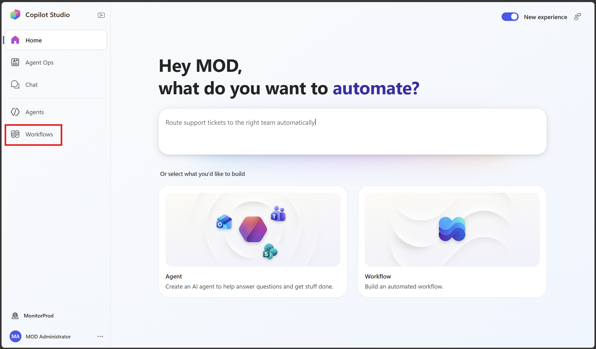
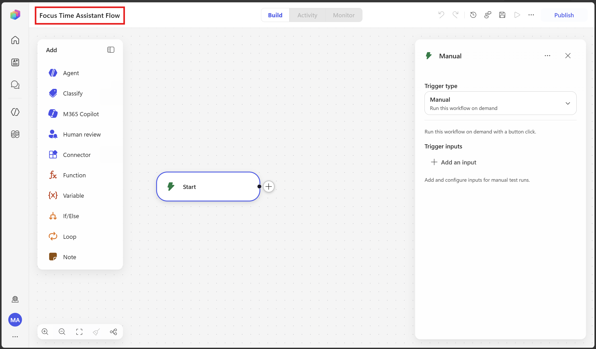

**2. Configure the trigger.**
Select the **Start / trigger** node. Change **Trigger type** to **Connector**, choose **Select a trigger…**, search **Outlook**, and under **Office 365 Outlook** choose **When a new email arrives**.
- When prompted, **Create new connection** with your lab account.
- In the trigger's settings, set **Subject Filter** to `Focus:` so only your test emails fire it (this keeps normal mail from triggering the workflow).

> **⚠️ Keep the trigger narrow.** A broad email trigger will fire on *every* message. The `Subject Filter` (and, if you like, a specific **Folder**) keeps runs limited to your test emails during the lab.

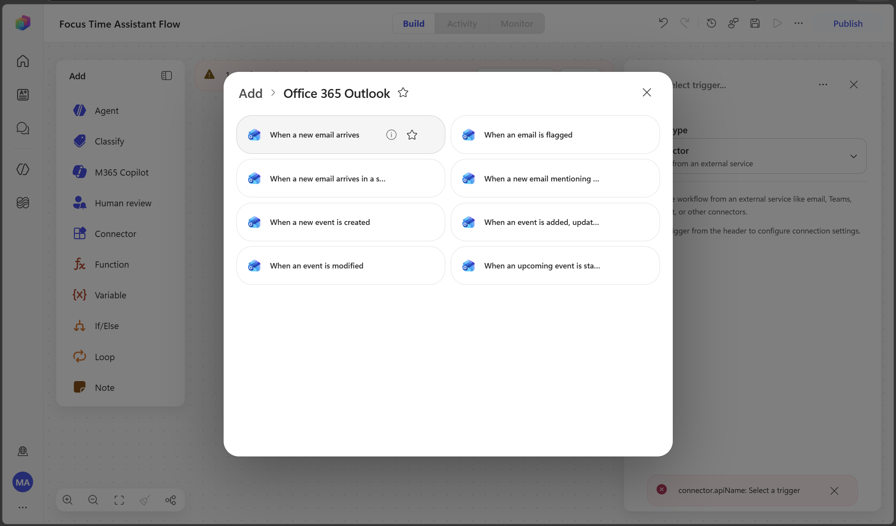
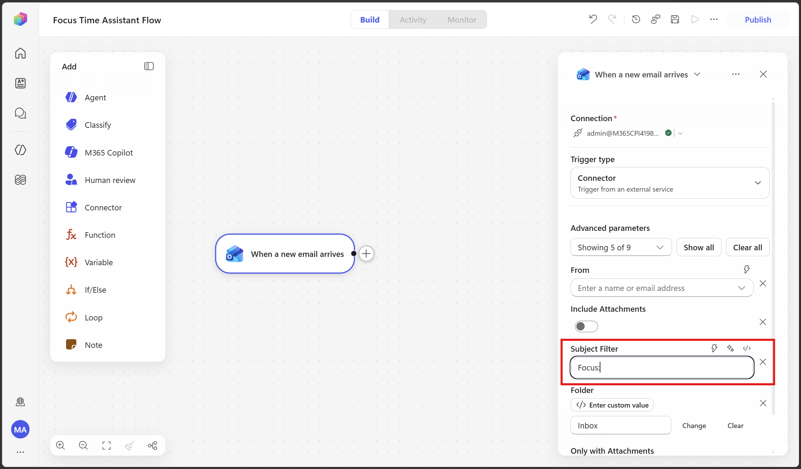

**3. Add the inline agent node.**
Select the **+** after the trigger and choose **Agent**. Leave the agent set to **New agent for this workflow** — this creates a brand‑new, non‑deterministic agent dedicated to this workflow (rather than reusing an existing one). Create the connection with your lab account if prompted.

> **💡 Concept — this is the heart of the exercise.** Instead of hard‑coding "create event at 9 a.m.," you hand the task to an agent that *reasons* about when to schedule it. Copilot Studio may wrap the agent in an **Apply to each** so it runs once per matching email — that's expected.

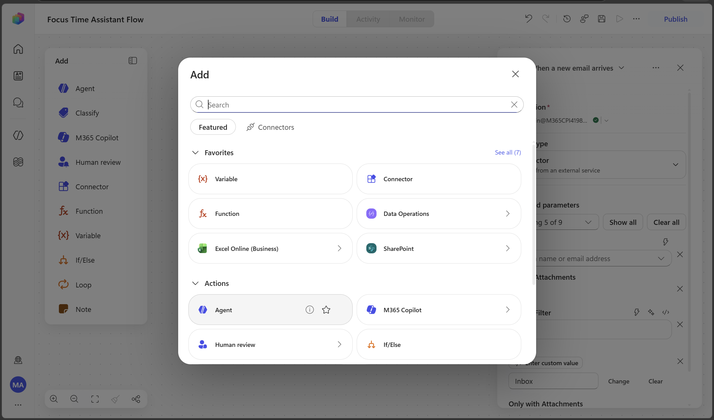
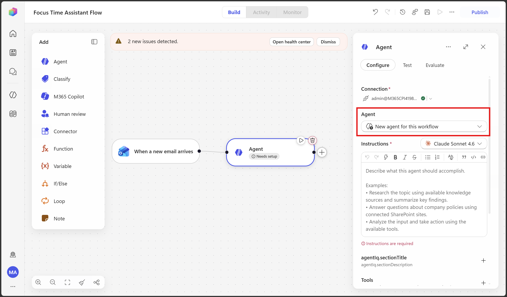

**4. Give the agent its goal (with a dynamic‑content token).**
In the agent's **Instructions**, enter the text in parts so the agent receives the **actual** email at run time:

- Type this first:
  ```
  Read this focus-time request and plan time for it. The request is:
  ```
- Then type **/** to open the dynamic‑content picker and insert **Subject** (under *When a new email arrives*). Add a space and insert **Body** as well if you'd like more context.
- Continue typing right after the token(s):
  ```
  Find an open slot on my calendar within the next two business days, only within my working hours of 9:00 AM to 6:00 PM. Create a calendar event to block that time to work on this request. Give the event a clear title and a short, well-formatted body that summarizes the task and lists 2–3 things I should prepare. Then send me a confirmation email that states the day and time you booked and briefly why. Keep everything concise and easy to read.
  ```

> **💡 Concept — dynamic content.** The `/Subject` token is what makes this dynamic: the agent receives each email's **real** subject, so its decision is grounded in the actual request, not a fixed string. The "8:00 AM–5:00 PM" sentence constrains *when* it books — without it, the agent may grab the first technically‑free slot (even 6 a.m.).

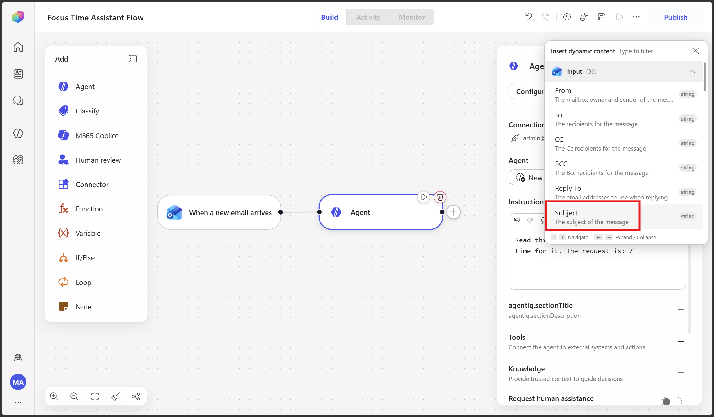
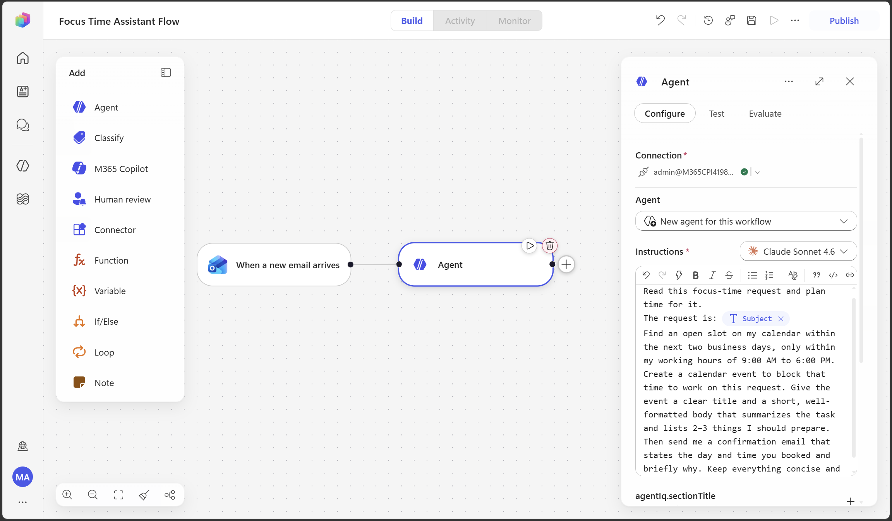

**5. Give the agent its tools.**
In the agent panel, under **Tools**, select **+ (Add tool)** and add **Work IQ Calendar** — the MCP server for Outlook calendar operations. (search by name, choose it, create Outlook connection, **Add**)

Optionally, turn on the **Web search** toggle so the agent can look up context referenced in the request (e.g., a venue).

> **💡 Alternative.** Use three **Office 365 Outlook** actions tool for calendar operations.

| Tool | Why the agent needs it |
|---|---|
| **Get calendar view of events (V3)** | Read existing events so it can find a genuinely free slot. |
| **Create event (V4)** | Book the focus block. |
| **Send an email (V2)** | Send you the confirmation. |

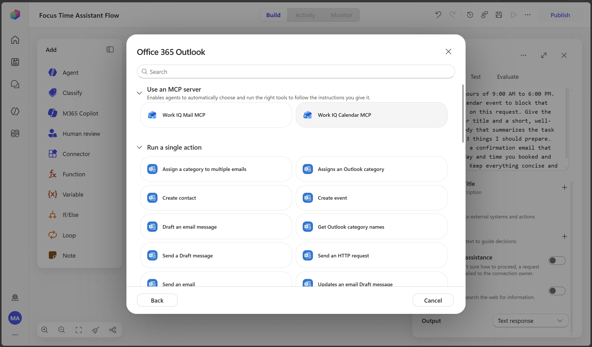
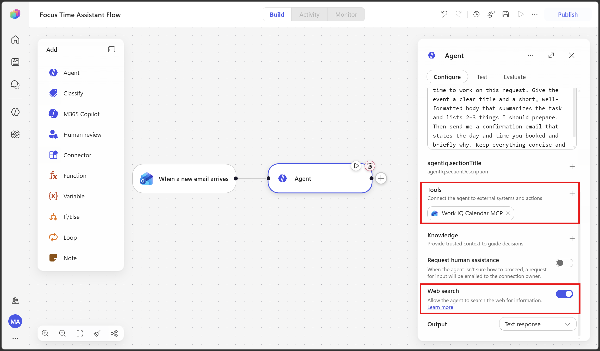

**6. Test as you build (before publishing).**
Use the designer's **Test** option to run the workflow with sample input, or run a **node‑level test** on the agent. Watch it read the calendar, pick a slot, and call the tools. Fix the instructions and re‑test if the slot or formatting isn't what you want.

> **💡 Concept — test‑as‑you‑build.** Node‑level and in‑designer testing let you validate behavior *before* going live, instead of running the whole thing and hunting for the broken step.

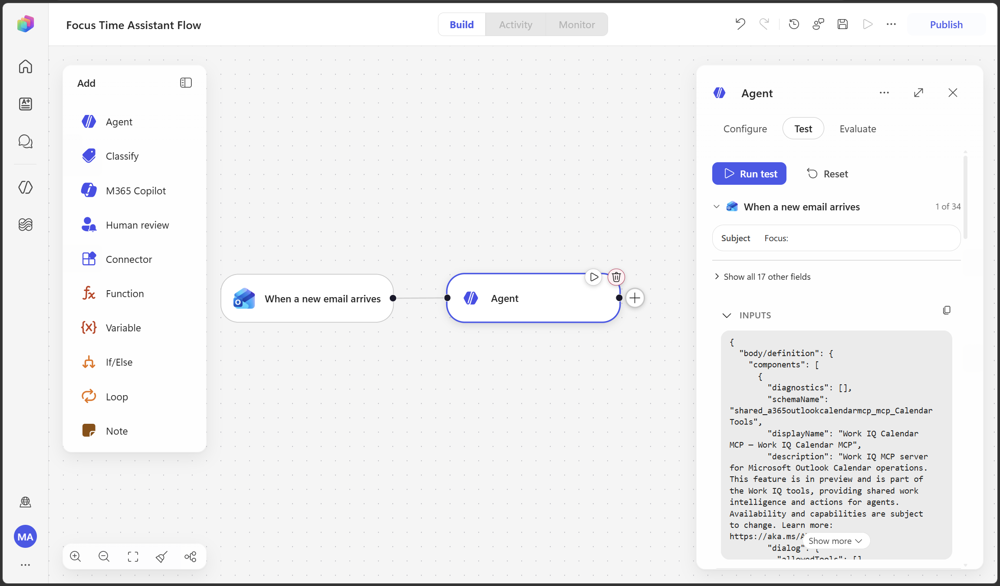
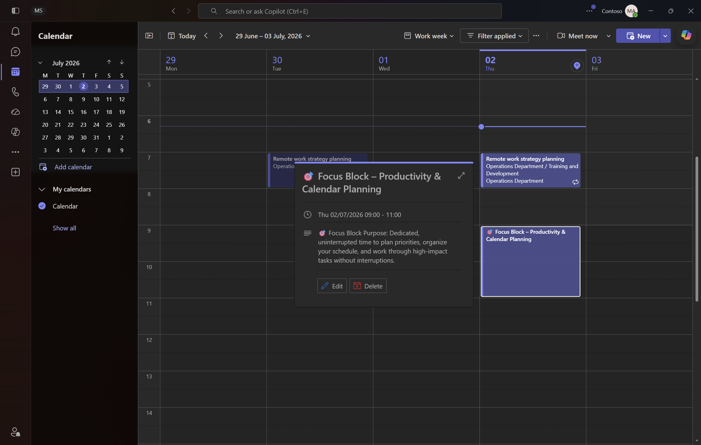

**7. Publish.**
Select **Save**, then **Publish**.

> **⚠️ Publishing is required.** A workflow only listens for its trigger **after** it's published. If you send the test email before publishing, nothing happens. Publishing also unlocks the **Activity** and **Monitor** tabs.

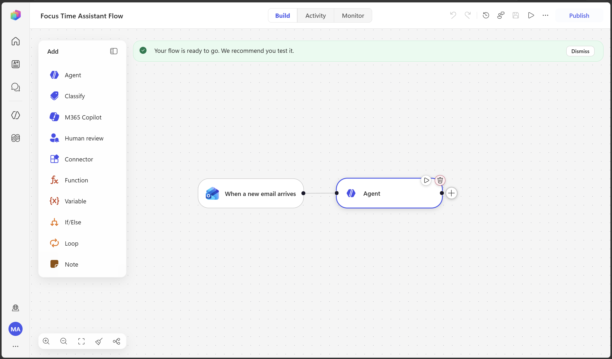

**8. Trigger it live.**
In Outlook, send yourself an email:
- **To:** *(your lab account)*
- **Subject:** `Focus: Prepare the Q3 review deck by Friday`
- **Body:** `Need ~90 minutes of focus time to draft the Q3 business review slides. Priorities: revenue recap, top 3 risks, next-quarter plan.`

> **💡 Tip.** Use a subject that implies a real commitment with a time cue — it gives the agent something concrete to reason about.

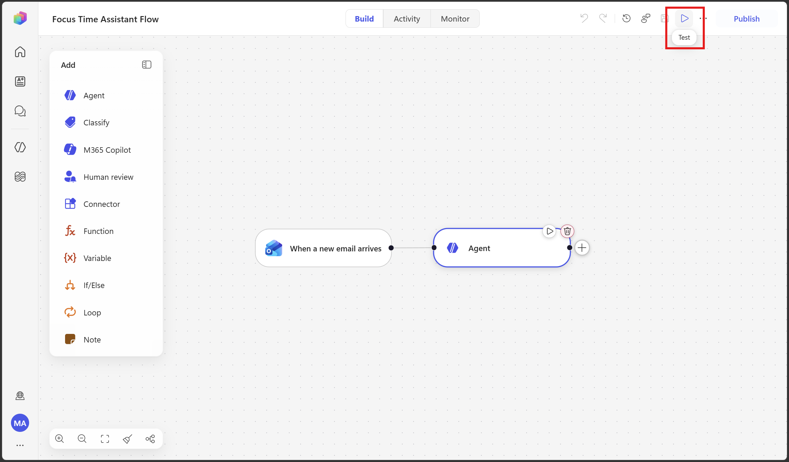

**9. Watch it run.**
Back in the workflow, open the **Activity** tab and select **Refresh** until the new run appears. Open it to watch execution node‑by‑node (trigger → *Apply to each* → **Agent**). Select the **Agent** node to expand its **response** and read the agent's own narration — checking free/busy, choosing a slot inside working hours, creating the event, and sending the confirmation.

> **⚠️ Be patient.** The email trigger polls on a schedule, so a run can take a couple of minutes to appear. Press **Refresh** a few times.

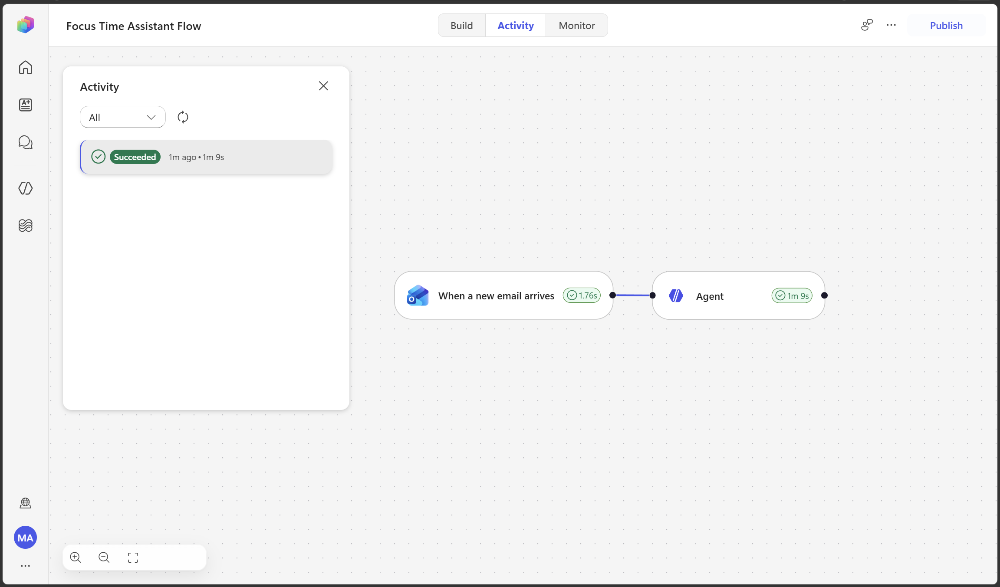
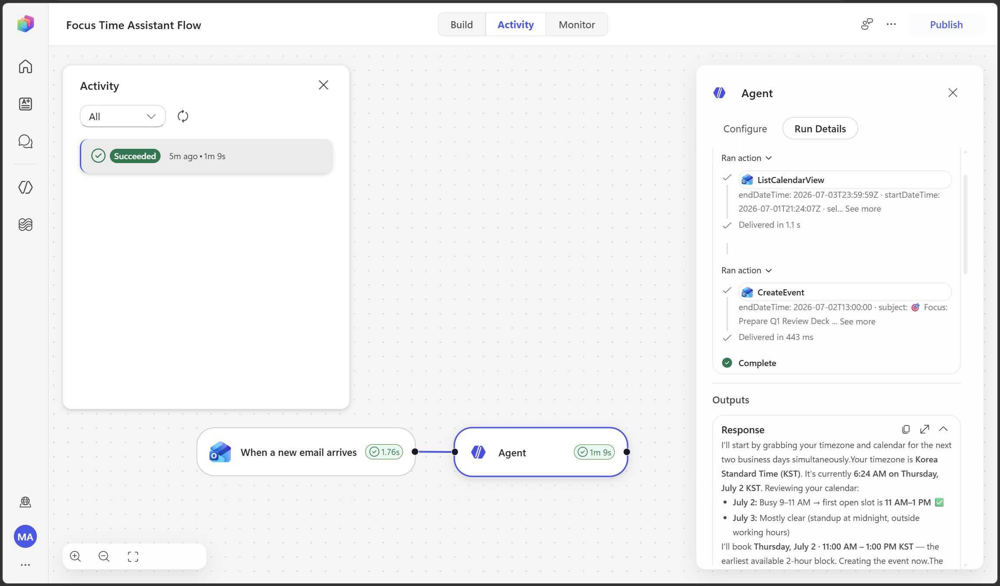

**10. Verify the results.**
- **Outlook → Calendar:** a focus‑block event on the next free business day within 8 a.m.–5 p.m., titled and summarized by the agent.
- **Outlook → Inbox:** a confirmation email stating the day/time it booked and why.

> **✅ Checkpoint.** You now have a published, autonomous workflow whose **inline agent reasons over live email and acts across your calendar and mailbox** — the trigger + inline agent + tools foundation the rest of the platform builds on.

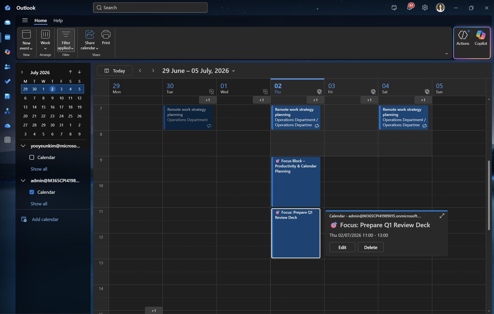
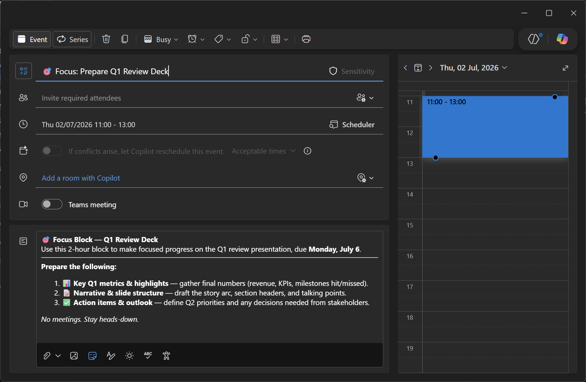

**Troubleshooting**

| Symptom | Fix |
|---|---|
| No run appears | Did you **publish**? Does the subject contain `Focus:`? Wait and **Refresh** (polling delay). |
| Permission / 403 errors | All connections must use **your lab account** — recreate any that don't. |
| Event booked at an odd hour | Re‑read the instruction — keep the "8:00 AM to 5:00 PM working hours" sentence; re‑test. |
| Agent didn't send the email | Confirm **Send an email (V2)** is added as a tool and the instruction asks for a confirmation. |

---

## 6. Exercise 2 — Order‑Management Router  *(≈ 55 min)*

### Scenario
Your team gets order‑related email that falls into a few categories. You want a workflow that **reads and classifies** each message, and for **customer inquiries**, drafts a helpful reply with **Microsoft 365 Copilot** — but a person must **approve** the draft before it's sent. Everything else gets a quick automated acknowledgment.

### Objective
Build and publish the **Order‑Management Router**: an **email trigger** feeds each message to a **Classify** step, a **switch** routes on the result, the **Customer Inquiry** path uses the **Microsoft 365 Copilot node** to draft a reply and a **human approval** gate before replying, and the **Other** path sends an acknowledgment. Then verify each path and review runs in **Monitor**.

### What you'll build

```
[Trigger] When a new email arrives  (subject contains "Order Management")
        ▼
[Classify]  → category: Quote Request | Supplier Delay | Customer Inquiry | Other
        ▼
[Switch] on category
   ├─ Customer Inquiry ─► [M365 Copilot] draft reply ─► [Human approval]
   │                                                     ├─ Approved ─► [Outlook] Reply to email
   │                                                     └─ Rejected ─► [Outlook] notify internally
   ├─ Other ───────────► [Outlook] Reply with acknowledgment
   ├─ Quote Request ───► (optional stretch — see §7)
   └─ Supplier Delay ──► (optional stretch — e.g., notify a Teams channel)
```

### Step‑by‑step

**1. Create the workflow.**
**Workflows → + New workflow**, rename it **`Order Management Router Flow`**.

**2. Configure the trigger.**
Trigger type **Connector** → **Office 365 Outlook → When a new email arrives**. Set **Subject Filter** to `Order Management` so only test emails fire it. Reuse your Outlook connection.

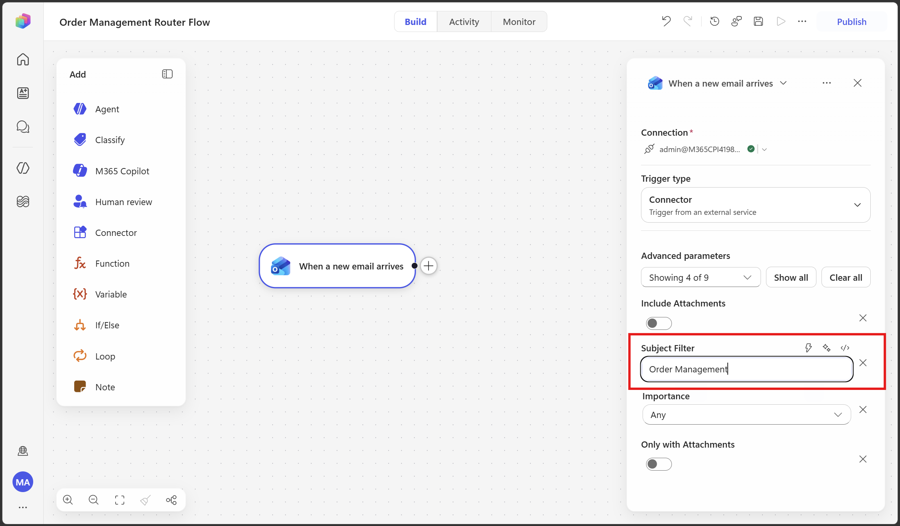

**3. Add the Classify step.**
Select **+** after the trigger → **Add an action** → the **AI** group → **Classify** (an intelligent action).
- **Input / text to classify:** insert the email **Body** using the **/** dynamic‑content picker (add **Subject** too for more signal).
- **Categories:** define four —
  ```
  Quote Request
  Supplier Delay
  Customer Inquiry
  Other
  ```
- Optionally add a one‑line description per category to improve accuracy (e.g., *Customer Inquiry = a customer asking a question about an existing or potential order*).
  - Quote Request: `emails requesting pricing or quotes for products/services`
  - Supplier Delay: `notifications about delays from suppliers`
  - Customer Inquiry: `general questions from customers about orders, shipping, etc.`
  - Other: anything that doesn’t fit the above categories (spam, promotions, irrelevant)

> **💡 Concept — intelligent actions.** Classify is an **AI step**: sorting messy, free‑text email into categories is exactly the kind of judgment you *shouldn't* try to hard‑code with keywords. The rest of the routing is **deterministic**.

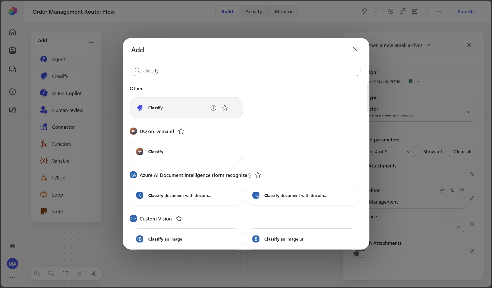
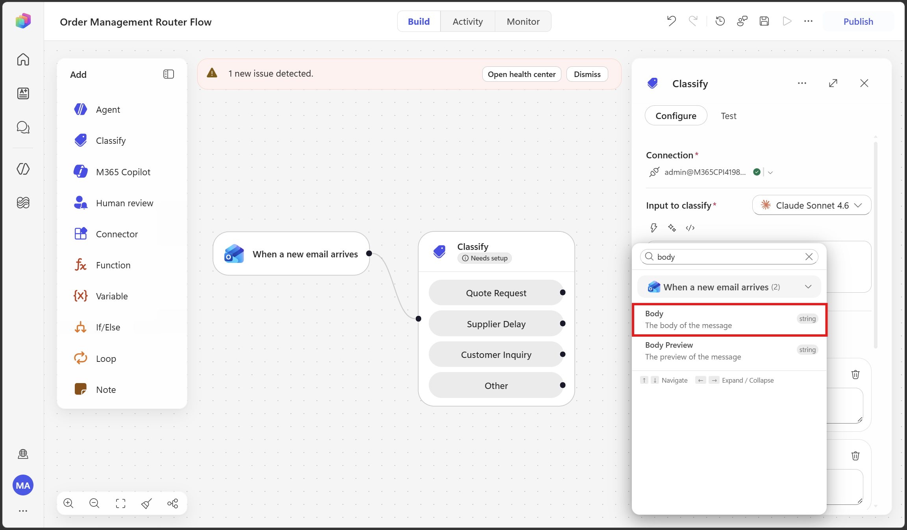
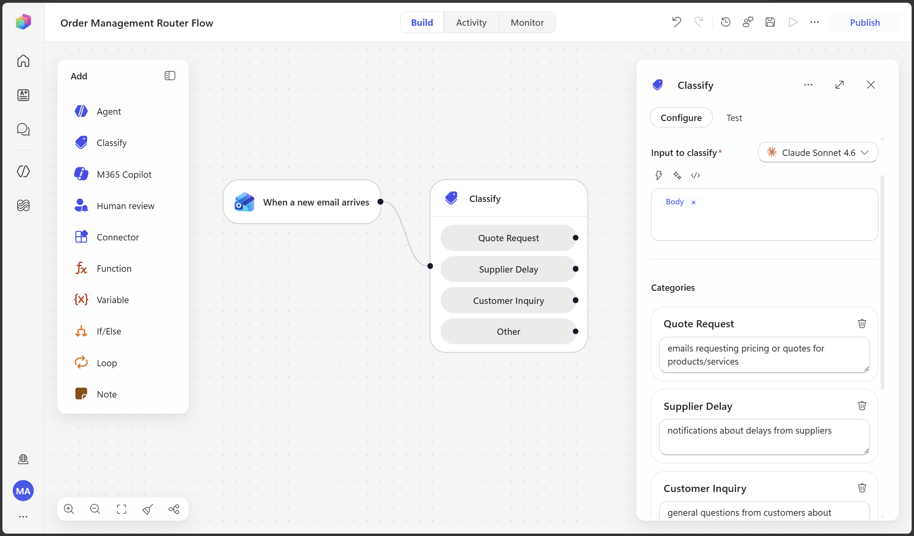

**4. Customer Inquiry branch — draft with Microsoft 365 Copilot.**
Inside the **Customer Inquiry** case, select **+** → **Add an action** → **Microsoft 365 Copilot** node. Create its connection with your lab account if prompted. Configure the prompt:
```
You are a helpful customer-service assistant for our orders team. Draft a professional, friendly reply to the customer inquiry below. Use only the information in the email; if something isn't known, say a team member will follow up with details. Keep it to a short, well-structured paragraph and a courteous closing.

Customer email:
```
…then insert the email **Body** with the **/** token at the end of the prompt. The node returns a **draft** you'll use downstream.

> **💡 No Microsoft 365 Copilot license?** Swap this node for an **inline Agent node** (as in Exercise 1) with the same prompt and no tools — it will produce the draft text using the workflow's model. The rest of the branch is identical.

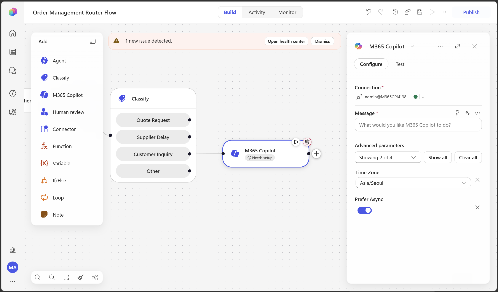
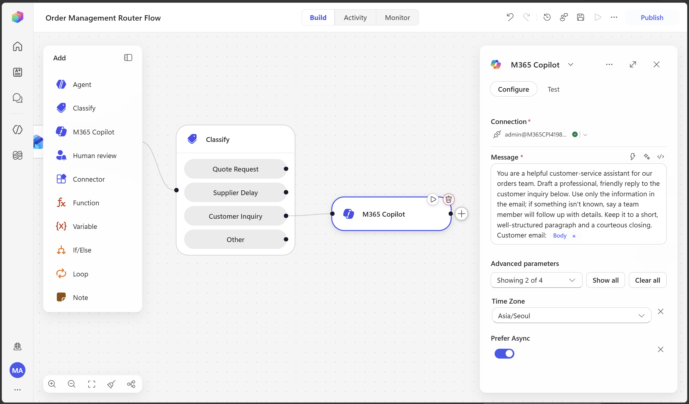

**5. Add the human‑in‑the‑loop approval.**
After the draft, select **+** → **Add human input** → **Approvals** (or **Human review request**). Configure it to send **you** an approval:
- **Title:** `Action Needed: Approve customer reply`
- **Details / message:** 
  ```
  Dear Reviewer,
  
  A customer inquiry has come in. If you are happy with the proposed reply below, choose 'Yes' and we will send it to the customer. If not, choose 'No' and we will flag the email for you to review later.

  Proposed reply:
  ```
insert the **Response** from the Microsoft 365 Copilot node (via the **/** picker) so the approver can read exactly what will be sent.
- **Options:** **Yes** / **No**.

The workflow **pauses here** until you respond (in Teams, Outlook, or the Approvals hub).

> **💡 Concept — HITL "by design."** You, the maker, deliberately placed this gate because sending a customer reply is outward‑facing and worth a human check. (Contrast with HITL "by judgment," where an agent asks for help only when it's unsure.)

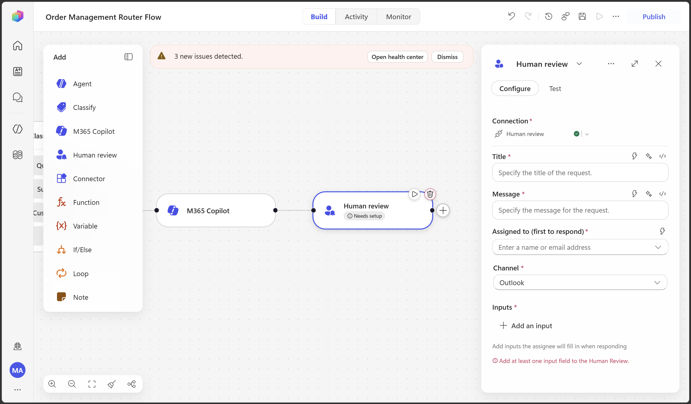
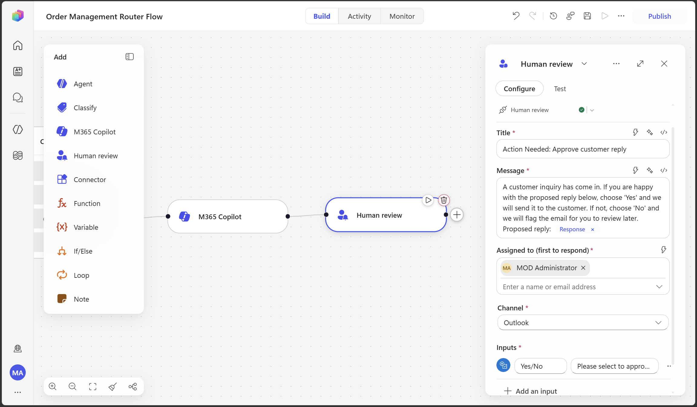

**6. Act on the approval outcome.**
After the approval, add a **Condition** on the approval **outcome / response**:
- **If Approved →** **Office 365 Outlook → Reply to email**. Set **Message Id** to the trigger's email (via the **/** picker), **To** to the **From** of the trigger's email and the **Body** to the approved **Response**.
- **If Rejected →** a light action — e.g., **Send an email** to your team saying the draft was rejected and needs a manual reply. (Keeping a "rejected" path is good practice so nothing silently disappears.)
  ```
  Hello Team,

  Copilot drafted answer was rejected, therefore it needs a manual reply.

  Inquiry ID: 
  ```

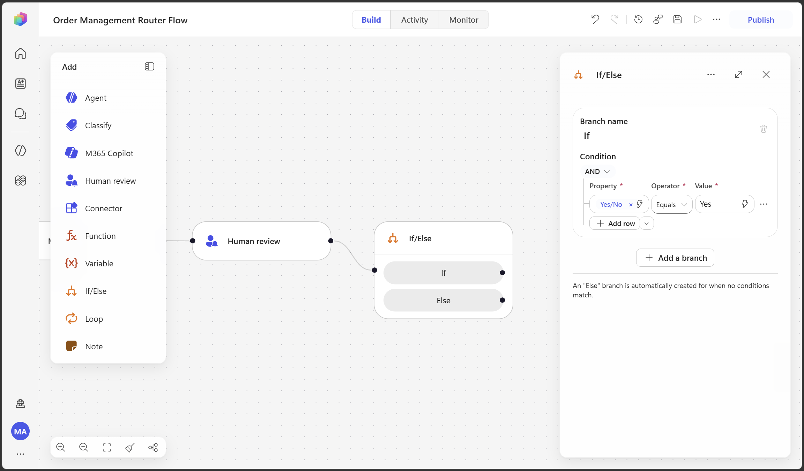
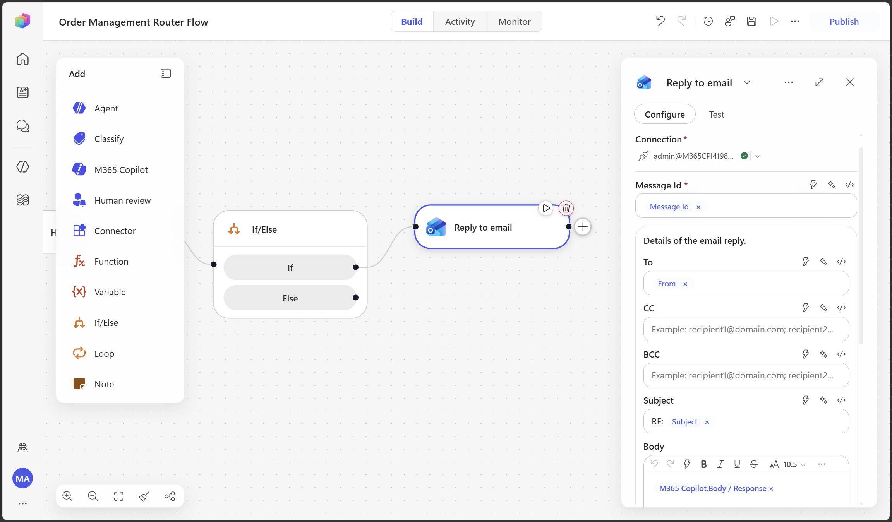
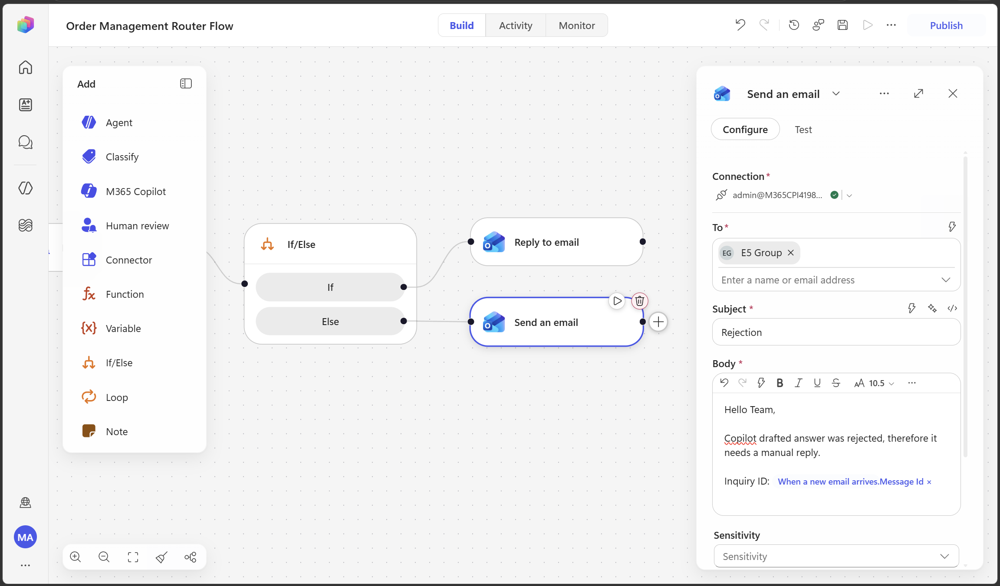

**7. Other branch — automated acknowledgment.**
Inside the **Other** case, add **Office 365 Outlook → Reply to email** with a canned body:
```
Thanks for your message — we've received it and routed it to the right team. Someone will follow up shortly.
```

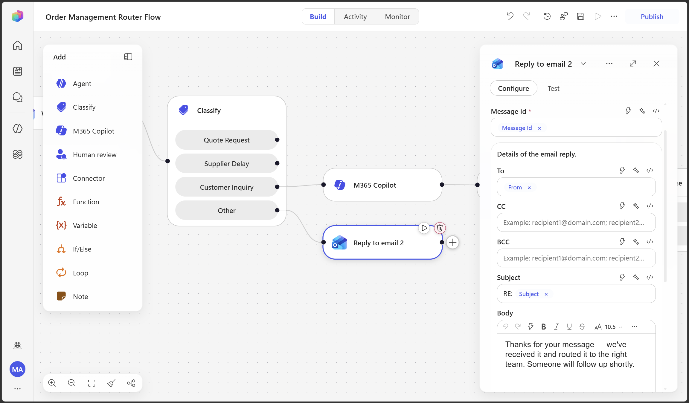

**8. Test node‑by‑node, then publish.**
- **Test the Classify node** with a couple of sample email bodies (one that reads like a customer question, one generic) and confirm the categories.
- Run an in‑designer **Test** of the whole workflow if available.
- **Save → Publish.**

> **💡 Concept — version history.** As you iterate, the new experience keeps **version history** so you can track changes and publish with confidence. Save meaningful versions before big edits.

**9. Verify each path live.**

*Customer Inquiry:* Send yourself:
- **Subject:** `Order Management — question about my order`
- **Body:** `Hi, can you tell me the expected ship date for order #4471 and whether I can still change the delivery address?`
Then: watch the run reach the approval → **approve** it → confirm a reply is sent to the original email.

*Other:* Send yourself:
- **Subject:** `Order Management — general note`
- **Body:** `Just saying hello, no action needed.`
Then confirm the automated acknowledgment reply.

*Customer Inquiry:* Send yourself:
- **Subject:** `Order Management - Question about iPad Air warranty and MDM`
- **Body:** 
  ```
  Hi team,
  
  Quick question before we expand our last order. What is the standard warranty period on the iPad Air (M2), and can the devices be enrolled in our mobile device management (MDM)? I think we asked something similar a few months back but I can't find the reply.

  Thanks,
  Jordan Kim
  IT, Alpine Ski House
  ```
Then: watch the run reach the approval → **reject** it → confirm a mail is sent to the designated team.

*Monitor:* Open the **Monitor** tab to see run trends and any errors across both test messages.

> **✅ Checkpoint.** You've built a workflow that **classifies**, **routes**, **drafts with Microsoft 365 Copilot**, and **waits for human approval** before acting — deterministic structure with AI (and a person) exactly where they add value.

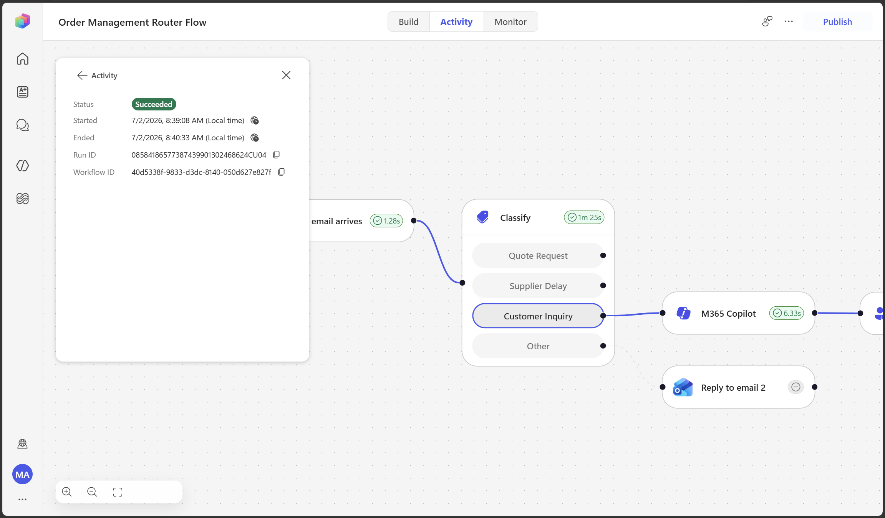
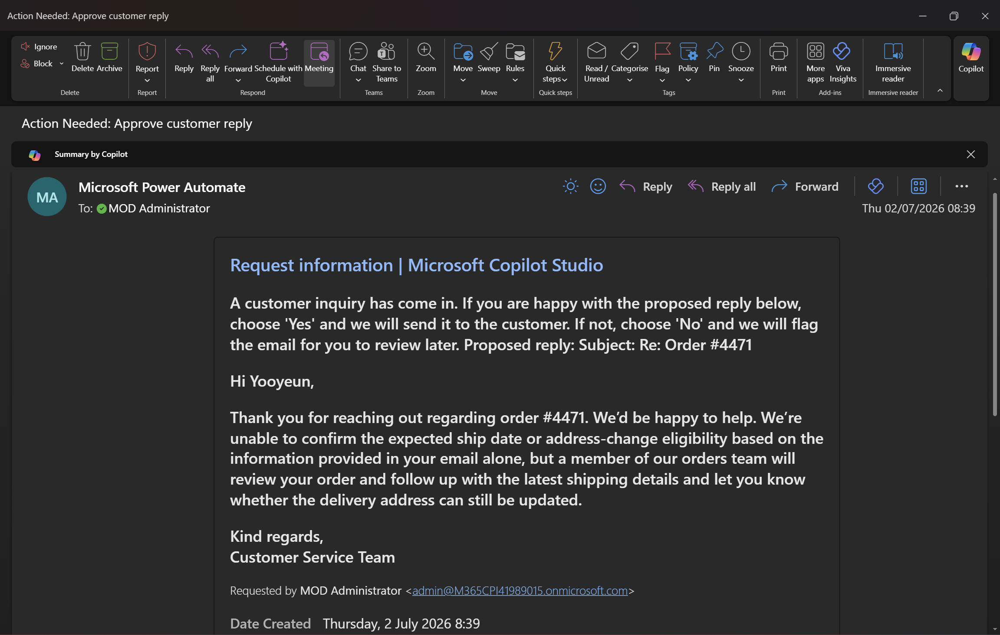
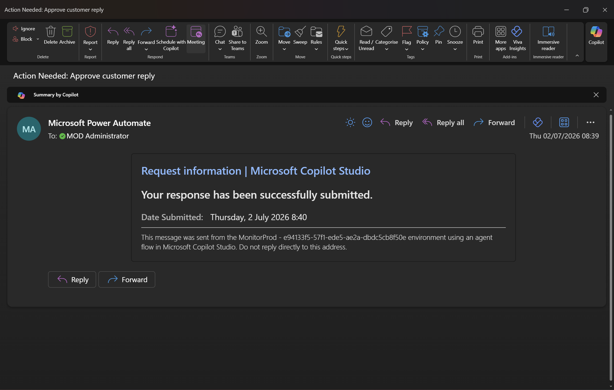
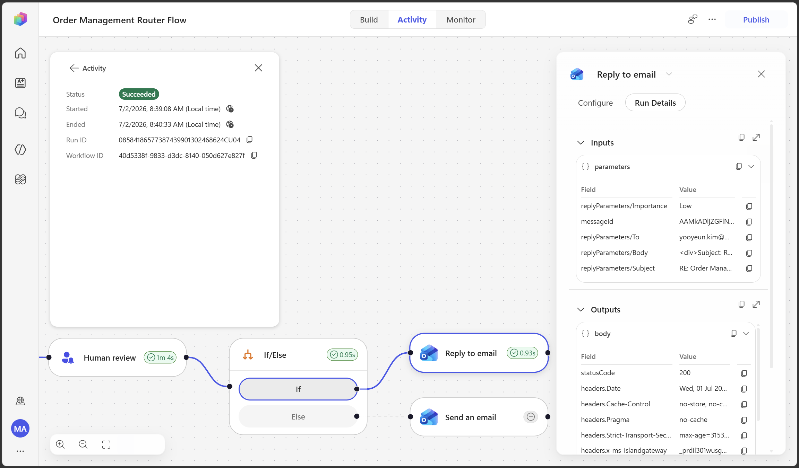
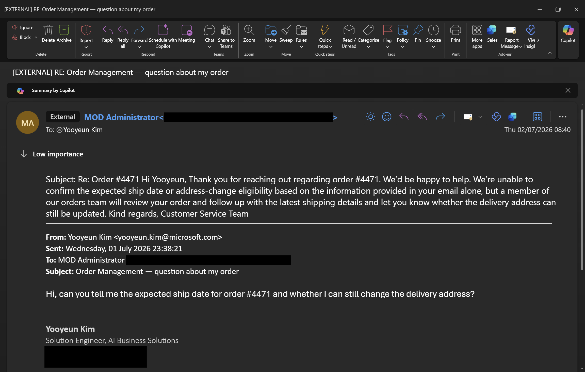

**Troubleshooting**

| Symptom | Fix |
|---|---|
| Everything routes to **Other** | Add short **descriptions** to each category; make the test email clearly match one category; re‑test the Classify node in isolation. |
| Approval never arrives | Check the **Approvals/Human review** connection identity; look in Teams **Approvals** and your Outlook. |
| Reply doesn't send | Ensure **Reply to email** uses the **trigger email's Message Id** and the **approved draft** as the body; confirm the Approved condition path. |
| Copilot node error / no license | Use the **inline Agent node** alternative from Step 5. |
| Nothing runs | **Publish**, confirm `Order Management` subject filter, allow for polling delay. |

---

## 7. Optional stretch goals  *(if time allows)*

Pick any that interest you — each is ~10–20 minutes.

- **Fill in the remaining branches (echoes official UC2).** Give **Supplier Delay** a **notify a Teams channel** action, and **Quote Request** a drafted acknowledgment. Now the switch handles all four categories.
- **Call a published specialist agent.** Build and **publish** a small "Quote Assistant" agent, then in the **Quote Request** branch add an **Agent node** set to that **published** agent instead of a new inline one. This shows the difference between an **inline agent** (lives in the flow, one step) and a **referenced/published agent** (its own reusable object) — the "inline vs. referenced" idea from the presentation.
- **Add a scheduled trigger.** Duplicate Exercise 1 and change its trigger to **Recurrence** (e.g., every weekday at 8 a.m.) to see the third trigger type — manual, scheduled, connector.
- **Review analytics & versions.** Explore the **Monitor**/analytics view and **version history** on the Workflows page.

---

## 8. Wrap‑up

You built two autonomous workflows and, along the way, practiced the whole new‑experience toolkit:

- An **event‑driven trigger** turned an incoming email into work — no chat required.
- An **inline agent** *reasoned* over live data and *acted* through tools, instead of replaying a fixed script.
- The **dynamic‑content token** grounded each run in the real message.
- **Classify** routed messy input; **Microsoft 365 Copilot** drafted a reply; a **human approval** gate kept a person in control of the outward‑facing action.
- You **tested as you built**, then **published** and watched runs in **Activity/Monitor**.

That's the core pattern of the new Workflows experience: **deterministic structure where you want predictability, AI (and people) exactly where they add value.**

### Cleanup
So test emails don't keep firing the workflows after the lab:
1. Open each workflow and **Unpublish** (or **turn off**) it, **or**
2. Delete the two workflows you created, **and**
3. Remove the **`Focus:`** and **`Order Management`** test emails from your inbox if you like.


---

## References
